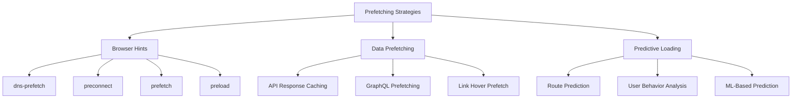

# How to Implement Prefetching Strategies

Author: [nawazdhandala](https://www.github.com/nawazdhandala)

Tags: Performance, Frontend, Caching, Optimization, Web Development

Description: Master prefetching strategies to load resources before users need them. Learn browser prefetch hints, predictive data loading, and smart caching patterns that eliminate perceived latency.

---

Users hate waiting. Every millisecond of latency erodes engagement and conversions. Prefetching solves this by loading resources before users request them, turning slow loads into instant transitions. But prefetch the wrong things and you waste bandwidth, slow down critical paths, and drain mobile batteries.

This guide covers practical prefetching strategies from browser hints to predictive data loading.

## Understanding Prefetching Types



| Strategy | When to Use | Browser Support |
|----------|-------------|-----------------|
| dns-prefetch | Third-party domains | All modern browsers |
| preconnect | Critical third-party resources | All modern browsers |
| prefetch | Next-page resources | All modern browsers |
| preload | Current-page critical resources | All modern browsers |

## Browser Resource Hints

### DNS Prefetch and Preconnect

DNS resolution and TCP handshakes add latency. Prefetch these for external domains:

```html
<!DOCTYPE html>
<html>
<head>
  <!-- DNS prefetch for analytics (low priority) -->
  <link rel="dns-prefetch" href="https://analytics.example.com">

  <!-- Preconnect for critical resources (includes DNS + TCP + TLS) -->
  <link rel="preconnect" href="https://cdn.example.com" crossorigin>
  <link rel="preconnect" href="https://api.example.com" crossorigin>

  <!-- Preconnect to fonts (Google Fonts example) -->
  <link rel="preconnect" href="https://fonts.googleapis.com">
  <link rel="preconnect" href="https://fonts.gstatic.com" crossorigin>
</head>
</html>
```

### Preload Critical Resources

Preload resources needed for the current page that the browser might discover late:

```html
<head>
  <!-- Preload critical CSS -->
  <link rel="preload" href="/styles/critical.css" as="style">

  <!-- Preload fonts (prevents FOUT - Flash of Unstyled Text) -->
  <link rel="preload" href="/fonts/main.woff2" as="font" type="font/woff2" crossorigin>

  <!-- Preload hero image -->
  <link rel="preload" href="/images/hero.webp" as="image">

  <!-- Preload critical JavaScript module -->
  <link rel="modulepreload" href="/js/app.js">

  <!-- Conditional preload based on media query -->
  <link rel="preload" href="/images/hero-mobile.webp" as="image"
        media="(max-width: 768px)">
</head>
```

### Prefetch Next-Page Resources

Prefetch resources for pages users are likely to visit next:

```html
<head>
  <!-- Prefetch likely next page -->
  <link rel="prefetch" href="/dashboard">

  <!-- Prefetch next page's JavaScript bundle -->
  <link rel="prefetch" href="/js/dashboard.js" as="script">

  <!-- Prefetch next page's data -->
  <link rel="prefetch" href="/api/dashboard-data" as="fetch" crossorigin>
</head>
```

## Dynamic Prefetching with JavaScript

### Link Hover Prefetching

Prefetch pages when users hover over links:

```javascript
class HoverPrefetcher {
  constructor(options = {}) {
    this.prefetchedUrls = new Set();
    this.hoverDelay = options.delay || 65; // ms before prefetching
    this.maxPrefetches = options.max || 10;
    this.timeouts = new Map();

    this.init();
  }

  init() {
    // Use event delegation on document
    document.addEventListener('mouseenter', this.handleMouseEnter.bind(this), true);
    document.addEventListener('mouseleave', this.handleMouseLeave.bind(this), true);

    // Also handle touch devices
    document.addEventListener('touchstart', this.handleTouchStart.bind(this), true);
  }

  handleMouseEnter(event) {
    const link = event.target.closest('a');
    if (!link || !this.shouldPrefetch(link)) return;

    const url = link.href;

    // Set timeout to avoid prefetching on quick mouse passes
    const timeout = setTimeout(() => {
      this.prefetch(url);
    }, this.hoverDelay);

    this.timeouts.set(link, timeout);
  }

  handleMouseLeave(event) {
    const link = event.target.closest('a');
    if (!link) return;

    // Cancel pending prefetch if user leaves quickly
    const timeout = this.timeouts.get(link);
    if (timeout) {
      clearTimeout(timeout);
      this.timeouts.delete(link);
    }
  }

  handleTouchStart(event) {
    const link = event.target.closest('a');
    if (!link || !this.shouldPrefetch(link)) return;

    // Prefetch immediately on touch
    this.prefetch(link.href);
  }

  shouldPrefetch(link) {
    const url = link.href;

    // Skip if already prefetched
    if (this.prefetchedUrls.has(url)) return false;

    // Skip if max prefetches reached
    if (this.prefetchedUrls.size >= this.maxPrefetches) return false;

    // Skip external links
    if (link.origin !== window.location.origin) return false;

    // Skip non-HTTP links
    if (!url.startsWith('http')) return false;

    // Skip links with download attribute
    if (link.hasAttribute('download')) return false;

    // Skip links that open in new tab
    if (link.target === '_blank') return false;

    // Respect user's data saver preference
    if (navigator.connection && navigator.connection.saveData) return false;

    return true;
  }

  prefetch(url) {
    if (this.prefetchedUrls.has(url)) return;

    const link = document.createElement('link');
    link.rel = 'prefetch';
    link.href = url;
    link.as = 'document';

    document.head.appendChild(link);
    this.prefetchedUrls.add(url);

    console.log(`Prefetched: ${url}`);
  }
}

// Initialize hover prefetcher
const prefetcher = new HoverPrefetcher({
  delay: 65,
  max: 10
});
```

### Viewport-Based Prefetching

Prefetch links when they become visible:

```javascript
class ViewportPrefetcher {
  constructor(options = {}) {
    this.prefetchedUrls = new Set();
    this.threshold = options.threshold || 0.1;
    this.rootMargin = options.rootMargin || '100px';

    this.observer = new IntersectionObserver(
      this.handleIntersection.bind(this),
      {
        threshold: this.threshold,
        rootMargin: this.rootMargin
      }
    );

    this.observeLinks();
  }

  observeLinks() {
    // Observe all internal links
    document.querySelectorAll('a[href^="/"], a[href^="' + window.location.origin + '"]')
      .forEach(link => {
        if (this.shouldObserve(link)) {
          this.observer.observe(link);
        }
      });
  }

  shouldObserve(link) {
    const url = link.href;
    return !this.prefetchedUrls.has(url) &&
           url !== window.location.href;
  }

  handleIntersection(entries) {
    entries.forEach(entry => {
      if (entry.isIntersecting) {
        const link = entry.target;
        this.prefetch(link.href);
        this.observer.unobserve(link);
      }
    });
  }

  prefetch(url) {
    if (this.prefetchedUrls.has(url)) return;

    // Use fetch with low priority
    fetch(url, {
      priority: 'low',
      credentials: 'same-origin'
    }).catch(() => {
      // Ignore prefetch errors
    });

    this.prefetchedUrls.add(url);
  }
}

// Initialize viewport prefetcher
new ViewportPrefetcher();
```

## Data Prefetching Patterns

### React Query Prefetching

```javascript
import { useQueryClient, useQuery } from '@tanstack/react-query';
import { useEffect } from 'react';

// Prefetch data on mount
function Dashboard() {
  const queryClient = useQueryClient();

  // Prefetch data for tabs user might click
  useEffect(() => {
    // Prefetch analytics data
    queryClient.prefetchQuery({
      queryKey: ['analytics'],
      queryFn: fetchAnalytics,
      staleTime: 60000 // Consider fresh for 1 minute
    });

    // Prefetch user settings
    queryClient.prefetchQuery({
      queryKey: ['settings'],
      queryFn: fetchSettings,
      staleTime: 300000 // Consider fresh for 5 minutes
    });
  }, [queryClient]);

  return <DashboardContent />;
}

// Prefetch on hover
function NavigationItem({ href, children }) {
  const queryClient = useQueryClient();

  const handleMouseEnter = () => {
    // Prefetch page data based on route
    if (href === '/analytics') {
      queryClient.prefetchQuery({
        queryKey: ['analytics', 'detailed'],
        queryFn: fetchDetailedAnalytics
      });
    }
  };

  return (
    <Link href={href} onMouseEnter={handleMouseEnter}>
      {children}
    </Link>
  );
}

// Prefetch paginated data
function UserList() {
  const [page, setPage] = useState(1);
  const queryClient = useQueryClient();

  const { data } = useQuery({
    queryKey: ['users', page],
    queryFn: () => fetchUsers(page)
  });

  // Prefetch next page when current page loads
  useEffect(() => {
    if (data?.hasNextPage) {
      queryClient.prefetchQuery({
        queryKey: ['users', page + 1],
        queryFn: () => fetchUsers(page + 1)
      });
    }
  }, [data, page, queryClient]);

  return <UserListContent data={data} onPageChange={setPage} />;
}
```

### SWR Prefetching

```javascript
import useSWR, { preload } from 'swr';

const fetcher = (url) => fetch(url).then(res => res.json());

// Preload data before component mounts
preload('/api/user', fetcher);
preload('/api/projects', fetcher);

function App() {
  // Data will be available immediately if preloaded
  const { data: user } = useSWR('/api/user', fetcher);
  const { data: projects } = useSWR('/api/projects', fetcher);

  return <Dashboard user={user} projects={projects} />;
}

// Prefetch on link hover
function ProjectLink({ projectId }) {
  const handleMouseEnter = () => {
    // Prefetch project details
    preload(`/api/projects/${projectId}`, fetcher);
    preload(`/api/projects/${projectId}/tasks`, fetcher);
  };

  return (
    <Link
      href={`/projects/${projectId}`}
      onMouseEnter={handleMouseEnter}
    >
      View Project
    </Link>
  );
}
```

## Server-Side Prefetching

### Node.js API Response Caching

```javascript
const express = require('express');
const NodeCache = require('node-cache');

const app = express();
const cache = new NodeCache({ stdTTL: 300 }); // 5 minute TTL

// Background prefetch function
async function prefetchPopularData() {
  console.log('Prefetching popular data...');

  const popularEndpoints = [
    { key: 'dashboard', fn: fetchDashboardData },
    { key: 'trending', fn: fetchTrendingItems },
    { key: 'featured', fn: fetchFeaturedContent }
  ];

  for (const endpoint of popularEndpoints) {
    try {
      const data = await endpoint.fn();
      cache.set(endpoint.key, data);
      console.log(`Prefetched: ${endpoint.key}`);
    } catch (error) {
      console.error(`Failed to prefetch ${endpoint.key}:`, error);
    }
  }
}

// Run prefetch on startup
prefetchPopularData();

// Refresh prefetched data periodically
setInterval(prefetchPopularData, 4 * 60 * 1000); // Every 4 minutes

// Middleware to serve cached data
function serveCached(cacheKey) {
  return (req, res, next) => {
    const cached = cache.get(cacheKey);
    if (cached) {
      return res.json(cached);
    }
    next();
  };
}

// Routes with cache-first approach
app.get('/api/dashboard', serveCached('dashboard'), async (req, res) => {
  const data = await fetchDashboardData();
  cache.set('dashboard', data);
  res.json(data);
});
```

## Prefetch Budget Management

Prevent excessive prefetching from hurting performance:

```javascript
class PrefetchBudget {
  constructor(options = {}) {
    this.maxConcurrent = options.maxConcurrent || 2;
    this.maxTotal = options.maxTotal || 20;
    this.maxBytesPerSession = options.maxBytes || 10 * 1024 * 1024; // 10 MB

    this.activeRequests = 0;
    this.totalRequests = 0;
    this.bytesUsed = 0;
    this.queue = [];
  }

  canPrefetch() {
    // Check connection quality
    if (navigator.connection) {
      const { effectiveType, saveData } = navigator.connection;

      // Skip on slow connections or data saver mode
      if (saveData || effectiveType === 'slow-2g' || effectiveType === '2g') {
        return false;
      }
    }

    // Check budget limits
    if (this.totalRequests >= this.maxTotal) return false;
    if (this.bytesUsed >= this.maxBytesPerSession) return false;

    return true;
  }

  async prefetch(url, options = {}) {
    if (!this.canPrefetch()) {
      return null;
    }

    // Queue if too many concurrent requests
    if (this.activeRequests >= this.maxConcurrent) {
      return new Promise((resolve) => {
        this.queue.push({ url, options, resolve });
      });
    }

    return this.executePrefetch(url, options);
  }

  async executePrefetch(url, options) {
    this.activeRequests++;
    this.totalRequests++;

    try {
      const response = await fetch(url, {
        priority: 'low',
        ...options
      });

      // Track bytes used
      const contentLength = response.headers.get('content-length');
      if (contentLength) {
        this.bytesUsed += parseInt(contentLength, 10);
      }

      return response;
    } finally {
      this.activeRequests--;
      this.processQueue();
    }
  }

  processQueue() {
    if (this.queue.length > 0 && this.activeRequests < this.maxConcurrent) {
      const { url, options, resolve } = this.queue.shift();
      resolve(this.executePrefetch(url, options));
    }
  }
}

const budget = new PrefetchBudget({
  maxConcurrent: 2,
  maxTotal: 20,
  maxBytes: 10 * 1024 * 1024
});
```

## Summary

Effective prefetching balances user experience against resource consumption. Start with low-risk browser hints, add dynamic prefetching for high-value interactions, and always respect user preferences and connection quality.

| Strategy | Risk Level | Best For |
|----------|------------|----------|
| dns-prefetch | Very Low | Third-party domains |
| preconnect | Low | Critical external resources |
| preload | Low | Current page critical assets |
| prefetch | Medium | Predictable navigation |
| Hover prefetch | Medium | Links with high click probability |
| Data prefetch | Medium | Predictable data needs |

Monitor your prefetch hit rate. If less than 50% of prefetched resources are actually used, you are wasting bandwidth and should tighten your prediction criteria.
