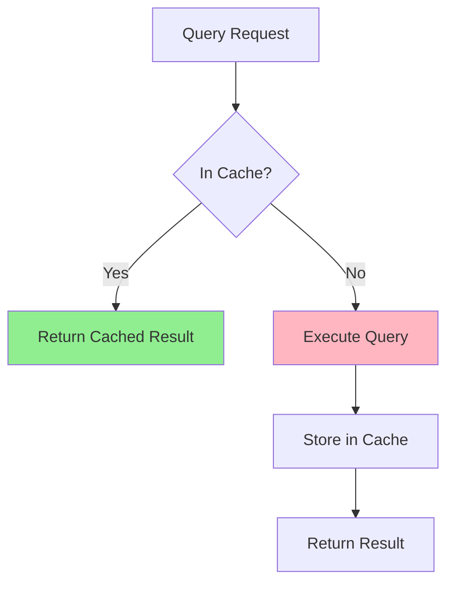

# How to Implement Query Result Caching

Author: [nawazdhandala](https://www.github.com/nawazdhandala)

Tags: Database, Caching, Performance, Redis, Backend

Description: Learn how to implement query result caching to reduce database load and improve response times. This guide covers caching patterns, invalidation strategies, and practical implementations with Redis.

---

Database queries are often the slowest part of your application. The same query runs thousands of times per hour, returning identical results. Query result caching stores these results in memory, serving subsequent requests instantly without touching the database.

This guide covers practical query result caching patterns from basic implementations to advanced invalidation strategies.

## When to Cache Query Results



| Cache | Do Not Cache |
|-------|--------------|
| Frequently accessed data | Real-time data |
| Slow queries | User-specific sensitive data |
| Stable data (low change rate) | Highly dynamic data |
| Expensive aggregations | Transactional queries |

## Basic Query Caching with Redis

### Node.js Implementation

```javascript
const Redis = require('ioredis');
const crypto = require('crypto');

const redis = new Redis({
  host: 'localhost',
  port: 6379,
  maxRetriesPerRequest: 3
});

class QueryCache {
  constructor(options = {}) {
    this.defaultTTL = options.ttl || 300; // 5 minutes
    this.prefix = options.prefix || 'query:';
  }

  // Generate cache key from query and parameters
  generateKey(query, params = []) {
    const normalized = JSON.stringify({ query, params });
    const hash = crypto.createHash('md5').update(normalized).digest('hex');
    return `${this.prefix}${hash}`;
  }

  async get(key) {
    const cached = await redis.get(key);
    if (cached) {
      return JSON.parse(cached);
    }
    return null;
  }

  async set(key, value, ttl = this.defaultTTL) {
    await redis.setex(key, ttl, JSON.stringify(value));
  }

  async delete(key) {
    await redis.del(key);
  }

  async deletePattern(pattern) {
    const keys = await redis.keys(`${this.prefix}${pattern}`);
    if (keys.length > 0) {
      await redis.del(...keys);
    }
  }
}

const queryCache = new QueryCache({ ttl: 300 });

// Wrapper function for cached queries
async function cachedQuery(pool, query, params, options = {}) {
  const cacheKey = queryCache.generateKey(query, params);
  const ttl = options.ttl || 300;
  const skipCache = options.skipCache || false;

  // Check cache first (unless explicitly skipped)
  if (!skipCache) {
    const cached = await queryCache.get(cacheKey);
    if (cached) {
      return { rows: cached, fromCache: true };
    }
  }

  // Execute query
  const result = await pool.query(query, params);

  // Cache result
  await queryCache.set(cacheKey, result.rows, ttl);

  return { rows: result.rows, fromCache: false };
}

// Usage examples
async function getProducts(category) {
  const { rows, fromCache } = await cachedQuery(
    pool,
    'SELECT * FROM products WHERE category = $1 AND active = true',
    [category],
    { ttl: 600 } // Cache for 10 minutes
  );

  console.log(`Products fetched (from cache: ${fromCache})`);
  return rows;
}

async function getProductStats() {
  const { rows } = await cachedQuery(
    pool,
    `SELECT
      category,
      COUNT(*) as count,
      AVG(price) as avg_price
     FROM products
     GROUP BY category`,
    [],
    { ttl: 3600 } // Cache expensive aggregation for 1 hour
  );

  return rows;
}
```

### Python Implementation

```python
import redis
import hashlib
import json
from functools import wraps
from typing import Optional, Any
import psycopg2

redis_client = redis.Redis(host='localhost', port=6379, db=0)

class QueryCache:
    def __init__(self, prefix: str = 'query:', default_ttl: int = 300):
        self.prefix = prefix
        self.default_ttl = default_ttl

    def generate_key(self, query: str, params: tuple = ()) -> str:
        """Generate cache key from query and parameters."""
        normalized = json.dumps({'query': query, 'params': params}, sort_keys=True)
        hash_value = hashlib.md5(normalized.encode()).hexdigest()
        return f'{self.prefix}{hash_value}'

    def get(self, key: str) -> Optional[Any]:
        """Get cached result."""
        cached = redis_client.get(key)
        if cached:
            return json.loads(cached)
        return None

    def set(self, key: str, value: Any, ttl: int = None) -> None:
        """Cache result with TTL."""
        ttl = ttl or self.default_ttl
        redis_client.setex(key, ttl, json.dumps(value))

    def delete(self, key: str) -> None:
        """Delete cached result."""
        redis_client.delete(key)

    def delete_pattern(self, pattern: str) -> int:
        """Delete all keys matching pattern."""
        keys = redis_client.keys(f'{self.prefix}{pattern}')
        if keys:
            return redis_client.delete(*keys)
        return 0


query_cache = QueryCache()


def cached_query(ttl: int = 300, key_prefix: str = None):
    """Decorator for caching query results."""
    def decorator(func):
        @wraps(func)
        def wrapper(*args, **kwargs):
            # Generate cache key
            key_parts = [key_prefix or func.__name__]
            key_parts.extend(str(arg) for arg in args)
            key_parts.extend(f'{k}={v}' for k, v in sorted(kwargs.items()))
            cache_key = query_cache.generate_key(':'.join(key_parts))

            # Check cache
            cached = query_cache.get(cache_key)
            if cached is not None:
                return cached

            # Execute function
            result = func(*args, **kwargs)

            # Cache result
            query_cache.set(cache_key, result, ttl)

            return result
        return wrapper
    return decorator


# Usage with decorator
@cached_query(ttl=600)
def get_products_by_category(category: str):
    conn = get_db_connection()
    with conn.cursor() as cur:
        cur.execute(
            'SELECT * FROM products WHERE category = %s AND active = true',
            (category,)
        )
        columns = [desc[0] for desc in cur.description]
        return [dict(zip(columns, row)) for row in cur.fetchall()]


@cached_query(ttl=3600, key_prefix='product_stats')
def get_product_statistics():
    conn = get_db_connection()
    with conn.cursor() as cur:
        cur.execute('''
            SELECT
                category,
                COUNT(*) as count,
                AVG(price) as avg_price
            FROM products
            GROUP BY category
        ''')
        columns = [desc[0] for desc in cur.description]
        return [dict(zip(columns, row)) for row in cur.fetchall()]
```

## Cache Invalidation Strategies

### Tag-Based Invalidation

```javascript
class TaggedQueryCache {
  constructor() {
    this.prefix = 'query:';
    this.tagPrefix = 'tag:';
  }

  async set(key, value, ttl, tags = []) {
    const pipeline = redis.pipeline();

    // Store the value
    pipeline.setex(key, ttl, JSON.stringify(value));

    // Associate key with tags
    for (const tag of tags) {
      pipeline.sadd(`${this.tagPrefix}${tag}`, key);
      pipeline.expire(`${this.tagPrefix}${tag}`, ttl + 60);
    }

    await pipeline.exec();
  }

  async invalidateByTag(tag) {
    const keys = await redis.smembers(`${this.tagPrefix}${tag}`);

    if (keys.length > 0) {
      const pipeline = redis.pipeline();
      keys.forEach(key => pipeline.del(key));
      pipeline.del(`${this.tagPrefix}${tag}`);
      await pipeline.exec();
    }

    console.log(`Invalidated ${keys.length} keys with tag: ${tag}`);
  }

  async invalidateByTags(tags) {
    for (const tag of tags) {
      await this.invalidateByTag(tag);
    }
  }
}

const taggedCache = new TaggedQueryCache();

// Cache query with tags
async function getProductsWithCache(category) {
  const cacheKey = `products:category:${category}`;

  const cached = await redis.get(cacheKey);
  if (cached) {
    return JSON.parse(cached);
  }

  const result = await pool.query(
    'SELECT * FROM products WHERE category = $1',
    [category]
  );

  // Cache with tags for easy invalidation
  await taggedCache.set(
    cacheKey,
    result.rows,
    600,
    ['products', `category:${category}`]
  );

  return result.rows;
}

// Invalidate when product is updated
async function updateProduct(productId, data) {
  const product = await pool.query(
    'UPDATE products SET name = $1, price = $2 WHERE id = $3 RETURNING *',
    [data.name, data.price, productId]
  );

  // Invalidate related caches
  await taggedCache.invalidateByTags([
    'products',
    `category:${product.rows[0].category}`
  ]);

  return product.rows[0];
}
```

### Version-Based Invalidation

```python
class VersionedCache:
    def __init__(self):
        self.version_prefix = 'version:'

    def get_version(self, entity: str) -> int:
        """Get current version for an entity."""
        version = redis_client.get(f'{self.version_prefix}{entity}')
        return int(version) if version else 1

    def increment_version(self, entity: str) -> int:
        """Increment version when entity changes."""
        return redis_client.incr(f'{self.version_prefix}{entity}')

    def generate_versioned_key(self, entity: str, query_id: str) -> str:
        """Generate cache key that includes version."""
        version = self.get_version(entity)
        return f'{entity}:{query_id}:v{version}'


versioned_cache = VersionedCache()


def get_products_versioned(category: str):
    # Key includes version - automatically invalidated when version changes
    cache_key = versioned_cache.generate_versioned_key(
        'products',
        f'category:{category}'
    )

    cached = redis_client.get(cache_key)
    if cached:
        return json.loads(cached)

    # Execute query
    products = fetch_products_from_db(category)

    # Cache with versioned key
    redis_client.setex(cache_key, 600, json.dumps(products))

    return products


def create_product(data):
    product = insert_product_to_db(data)

    # Increment version - all cached queries become stale
    versioned_cache.increment_version('products')

    return product
```

### Write-Through Pattern

```javascript
class WriteThroughCache {
  async getProduct(productId) {
    const cacheKey = `product:${productId}`;

    // Try cache first
    const cached = await redis.get(cacheKey);
    if (cached) {
      return JSON.parse(cached);
    }

    // Fetch from database
    const result = await pool.query(
      'SELECT * FROM products WHERE id = $1',
      [productId]
    );

    if (result.rows.length > 0) {
      // Populate cache
      await redis.setex(cacheKey, 3600, JSON.stringify(result.rows[0]));
      return result.rows[0];
    }

    return null;
  }

  async updateProduct(productId, data) {
    // Update database first
    const result = await pool.query(
      'UPDATE products SET name = $1, price = $2, updated_at = NOW() WHERE id = $3 RETURNING *',
      [data.name, data.price, productId]
    );

    if (result.rows.length > 0) {
      // Update cache immediately (write-through)
      const cacheKey = `product:${productId}`;
      await redis.setex(cacheKey, 3600, JSON.stringify(result.rows[0]));

      // Invalidate related caches
      await this.invalidateRelatedCaches(result.rows[0]);

      return result.rows[0];
    }

    return null;
  }

  async deleteProduct(productId) {
    // Get product for cache invalidation
    const product = await this.getProduct(productId);

    // Delete from database
    await pool.query('DELETE FROM products WHERE id = $1', [productId]);

    // Delete from cache
    await redis.del(`product:${productId}`);

    // Invalidate related caches
    if (product) {
      await this.invalidateRelatedCaches(product);
    }
  }

  async invalidateRelatedCaches(product) {
    // Invalidate listing caches
    await redis.del(`products:category:${product.category}`);
    await redis.del('products:all');
    await redis.del('products:stats');
  }
}
```

## Multi-Level Caching

```javascript
class MultiLevelCache {
  constructor() {
    // L1: In-memory cache (fast, limited size)
    this.l1 = new Map();
    this.l1MaxSize = 1000;
    this.l1TTL = 60000; // 1 minute

    // L2: Redis (slower, larger capacity)
    this.l2 = redis;
    this.l2TTL = 300; // 5 minutes
  }

  async get(key) {
    // Check L1 first
    const l1Entry = this.l1.get(key);
    if (l1Entry && Date.now() < l1Entry.expires) {
      return l1Entry.value;
    }

    // Check L2
    const l2Value = await this.l2.get(key);
    if (l2Value) {
      const parsed = JSON.parse(l2Value);

      // Populate L1
      this.setL1(key, parsed);

      return parsed;
    }

    return null;
  }

  async set(key, value, options = {}) {
    const l1TTL = options.l1TTL || this.l1TTL;
    const l2TTL = options.l2TTL || this.l2TTL;

    // Set in L1
    this.setL1(key, value, l1TTL);

    // Set in L2
    await this.l2.setex(key, l2TTL, JSON.stringify(value));
  }

  setL1(key, value, ttl = this.l1TTL) {
    // Evict oldest entries if at capacity
    if (this.l1.size >= this.l1MaxSize) {
      const oldestKey = this.l1.keys().next().value;
      this.l1.delete(oldestKey);
    }

    this.l1.set(key, {
      value,
      expires: Date.now() + ttl
    });
  }

  async invalidate(key) {
    this.l1.delete(key);
    await this.l2.del(key);
  }
}

const multiCache = new MultiLevelCache();

async function getProductFast(productId) {
  const cacheKey = `product:${productId}`;

  // Try multi-level cache
  const cached = await multiCache.get(cacheKey);
  if (cached) {
    return cached;
  }

  // Fetch from database
  const result = await pool.query(
    'SELECT * FROM products WHERE id = $1',
    [productId]
  );

  if (result.rows.length > 0) {
    await multiCache.set(cacheKey, result.rows[0], {
      l1TTL: 30000,  // 30 seconds in memory
      l2TTL: 600     // 10 minutes in Redis
    });
    return result.rows[0];
  }

  return null;
}
```

## Monitoring Cache Effectiveness

```javascript
class CacheMetrics {
  constructor() {
    this.hits = 0;
    this.misses = 0;
    this.errors = 0;
  }

  recordHit() {
    this.hits++;
  }

  recordMiss() {
    this.misses++;
  }

  recordError() {
    this.errors++;
  }

  getStats() {
    const total = this.hits + this.misses;
    const hitRate = total > 0 ? (this.hits / total * 100).toFixed(2) : 0;

    return {
      hits: this.hits,
      misses: this.misses,
      errors: this.errors,
      total,
      hitRate: `${hitRate}%`
    };
  }

  reset() {
    this.hits = 0;
    this.misses = 0;
    this.errors = 0;
  }
}

const metrics = new CacheMetrics();

// Expose metrics endpoint
app.get('/metrics/cache', (req, res) => {
  res.json(metrics.getStats());
});

// Log metrics periodically
setInterval(() => {
  const stats = metrics.getStats();
  console.log('Cache stats:', stats);
  metrics.reset();
}, 60000);
```

## Summary

Query result caching dramatically reduces database load and improves response times when implemented correctly.

| Strategy | Complexity | Best For |
|----------|------------|----------|
| Simple TTL | Low | Read-heavy, tolerant of staleness |
| Tag-based invalidation | Medium | Related data, clear entity boundaries |
| Version-based invalidation | Medium | Entity-level updates |
| Write-through | High | Consistency requirements |
| Multi-level caching | High | High-traffic, latency-sensitive |

Start with simple TTL-based caching for read-heavy queries. Add tag-based invalidation when you need precise cache control. Monitor your hit rate and adjust TTLs based on data volatility and access patterns. A cache hit rate below 80% suggests either too-short TTLs or poorly chosen cache keys.
