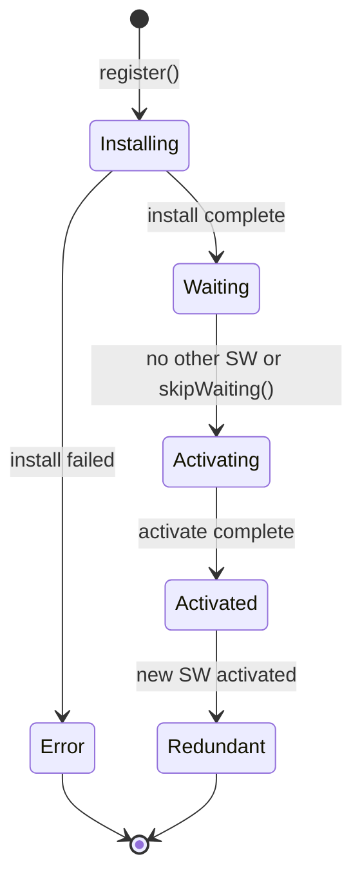

# How to Implement Service Worker Caching

Author: [nawazdhandala](https://www.github.com/nawazdhandala)

Tags: Performance, Frontend, PWA, Caching, JavaScript

Description: Learn how to implement service worker caching for offline support and faster page loads. This guide covers caching strategies, cache management, and practical patterns for web applications.

---

Service workers sit between your web application and the network. They intercept requests and can serve cached responses instantly, even when the user is offline. A well-implemented service worker makes your app feel native, loading instantly and working without connectivity.

This guide covers practical service worker caching patterns from basic setup to advanced strategies.

## Service Worker Lifecycle



| Phase | What Happens | Typical Actions |
|-------|--------------|-----------------|
| Installing | SW is being installed | Pre-cache critical assets |
| Waiting | Old SW still controls pages | Wait for pages to close |
| Activating | SW taking control | Clean up old caches |
| Activated | SW controls all pages | Handle fetch events |

## Basic Service Worker Setup

### Registration (main.js)

```javascript
// Register service worker
if ('serviceWorker' in navigator) {
  window.addEventListener('load', async () => {
    try {
      const registration = await navigator.serviceWorker.register('/sw.js', {
        scope: '/'
      });

      console.log('SW registered:', registration.scope);

      // Check for updates periodically
      setInterval(() => {
        registration.update();
      }, 60 * 60 * 1000); // Every hour

      // Handle updates
      registration.addEventListener('updatefound', () => {
        const newWorker = registration.installing;

        newWorker.addEventListener('statechange', () => {
          if (newWorker.state === 'installed' && navigator.serviceWorker.controller) {
            // New version available
            showUpdateNotification();
          }
        });
      });

    } catch (error) {
      console.error('SW registration failed:', error);
    }
  });

  // Handle controller change (new SW activated)
  navigator.serviceWorker.addEventListener('controllerchange', () => {
    // Optionally reload to get new version
    // window.location.reload();
  });
}

function showUpdateNotification() {
  // Show UI to inform user of update
  const banner = document.createElement('div');
  banner.innerHTML = `
    <p>New version available!</p>
    <button onclick="window.location.reload()">Refresh</button>
  `;
  banner.className = 'update-banner';
  document.body.appendChild(banner);
}
```

### Service Worker (sw.js)

```javascript
const CACHE_NAME = 'app-cache-v1';
const STATIC_CACHE = 'static-v1';
const DYNAMIC_CACHE = 'dynamic-v1';

// Assets to pre-cache during install
const PRECACHE_ASSETS = [
  '/',
  '/index.html',
  '/styles/main.css',
  '/scripts/app.js',
  '/images/logo.svg',
  '/offline.html'
];

// Install event - pre-cache critical assets
self.addEventListener('install', (event) => {
  console.log('Service Worker installing');

  event.waitUntil(
    caches.open(STATIC_CACHE)
      .then((cache) => {
        console.log('Pre-caching assets');
        return cache.addAll(PRECACHE_ASSETS);
      })
      .then(() => {
        // Skip waiting to activate immediately
        return self.skipWaiting();
      })
  );
});

// Activate event - clean up old caches
self.addEventListener('activate', (event) => {
  console.log('Service Worker activating');

  const currentCaches = [STATIC_CACHE, DYNAMIC_CACHE];

  event.waitUntil(
    caches.keys()
      .then((cacheNames) => {
        return Promise.all(
          cacheNames
            .filter((name) => !currentCaches.includes(name))
            .map((name) => {
              console.log('Deleting old cache:', name);
              return caches.delete(name);
            })
        );
      })
      .then(() => {
        // Take control of all pages immediately
        return self.clients.claim();
      })
  );
});

// Fetch event - serve from cache or network
self.addEventListener('fetch', (event) => {
  const { request } = event;
  const url = new URL(request.url);

  // Skip non-GET requests
  if (request.method !== 'GET') {
    return;
  }

  // Skip cross-origin requests
  if (url.origin !== location.origin) {
    return;
  }

  // Choose caching strategy based on request type
  if (request.destination === 'document') {
    event.respondWith(networkFirst(request));
  } else if (isStaticAsset(request)) {
    event.respondWith(cacheFirst(request));
  } else if (isApiRequest(request)) {
    event.respondWith(staleWhileRevalidate(request));
  } else {
    event.respondWith(cacheFirst(request));
  }
});

function isStaticAsset(request) {
  return /\.(js|css|png|jpg|jpeg|gif|svg|woff2?)$/.test(request.url);
}

function isApiRequest(request) {
  return request.url.includes('/api/');
}
```

## Caching Strategies

### Cache First (Static Assets)

```javascript
async function cacheFirst(request) {
  const cached = await caches.match(request);

  if (cached) {
    return cached;
  }

  try {
    const response = await fetch(request);

    // Cache successful responses
    if (response.ok) {
      const cache = await caches.open(STATIC_CACHE);
      cache.put(request, response.clone());
    }

    return response;
  } catch (error) {
    // Return offline fallback for navigation requests
    if (request.destination === 'document') {
      return caches.match('/offline.html');
    }

    throw error;
  }
}
```

### Network First (HTML Pages)

```javascript
async function networkFirst(request) {
  try {
    const response = await fetch(request);

    // Cache successful responses
    if (response.ok) {
      const cache = await caches.open(DYNAMIC_CACHE);
      cache.put(request, response.clone());
    }

    return response;
  } catch (error) {
    // Fall back to cache
    const cached = await caches.match(request);

    if (cached) {
      return cached;
    }

    // Return offline page for navigation
    return caches.match('/offline.html');
  }
}
```

### Stale While Revalidate (API Responses)

```javascript
async function staleWhileRevalidate(request) {
  const cache = await caches.open(DYNAMIC_CACHE);
  const cached = await cache.match(request);

  // Fetch in background regardless of cache status
  const fetchPromise = fetch(request).then((response) => {
    if (response.ok) {
      cache.put(request, response.clone());
    }
    return response;
  });

  // Return cached immediately if available, otherwise wait for network
  return cached || fetchPromise;
}
```

### Network Only with Timeout

```javascript
async function networkWithTimeout(request, timeout = 5000) {
  const controller = new AbortController();
  const timeoutId = setTimeout(() => controller.abort(), timeout);

  try {
    const response = await fetch(request, { signal: controller.signal });
    clearTimeout(timeoutId);
    return response;
  } catch (error) {
    clearTimeout(timeoutId);

    if (error.name === 'AbortError') {
      // Timeout - try cache
      const cached = await caches.match(request);
      if (cached) {
        return cached;
      }
    }

    throw error;
  }
}
```

## Advanced Patterns

### Cache with Version Checking

```javascript
const API_CACHE = 'api-v1';
const CACHE_DURATION = 5 * 60 * 1000; // 5 minutes

async function cachedApiRequest(request) {
  const cache = await caches.open(API_CACHE);
  const cached = await cache.match(request);

  if (cached) {
    // Check if cache is still fresh
    const cachedTime = cached.headers.get('sw-cached-time');
    if (cachedTime && Date.now() - parseInt(cachedTime) < CACHE_DURATION) {
      return cached;
    }
  }

  // Fetch fresh data
  const response = await fetch(request);

  if (response.ok) {
    // Add timestamp header to track cache age
    const headers = new Headers(response.headers);
    headers.set('sw-cached-time', Date.now().toString());

    const timestampedResponse = new Response(await response.clone().blob(), {
      status: response.status,
      statusText: response.statusText,
      headers
    });

    cache.put(request, timestampedResponse);
  }

  return response;
}
```

### Background Sync for Offline Actions

```javascript
// In service worker
self.addEventListener('sync', (event) => {
  if (event.tag === 'sync-pending-requests') {
    event.waitUntil(syncPendingRequests());
  }
});

async function syncPendingRequests() {
  const db = await openIndexedDB();
  const pendingRequests = await db.getAll('pending-requests');

  for (const request of pendingRequests) {
    try {
      const response = await fetch(request.url, {
        method: request.method,
        headers: request.headers,
        body: request.body
      });

      if (response.ok) {
        await db.delete('pending-requests', request.id);
      }
    } catch (error) {
      console.error('Sync failed for request:', request.id);
    }
  }
}

// Queue failed requests for later sync
async function queueForSync(request, body) {
  const db = await openIndexedDB();
  await db.add('pending-requests', {
    id: Date.now(),
    url: request.url,
    method: request.method,
    headers: Object.fromEntries(request.headers),
    body
  });

  // Request background sync
  const registration = await navigator.serviceWorker.ready;
  await registration.sync.register('sync-pending-requests');
}
```

### Cache Size Management

```javascript
const MAX_CACHE_SIZE = 50; // Maximum items per cache

async function limitCacheSize(cacheName, maxItems) {
  const cache = await caches.open(cacheName);
  const keys = await cache.keys();

  if (keys.length > maxItems) {
    // Delete oldest entries (FIFO)
    const deleteCount = keys.length - maxItems;
    for (let i = 0; i < deleteCount; i++) {
      await cache.delete(keys[i]);
    }
  }
}

// Call after adding to cache
async function addToCache(cacheName, request, response) {
  const cache = await caches.open(cacheName);
  await cache.put(request, response);
  await limitCacheSize(cacheName, MAX_CACHE_SIZE);
}
```

### Selective Caching Based on Headers

```javascript
self.addEventListener('fetch', (event) => {
  const request = event.request;

  // Respect Cache-Control headers
  const cacheControl = request.headers.get('Cache-Control');

  if (cacheControl && cacheControl.includes('no-store')) {
    // Never cache this request
    event.respondWith(fetch(request));
    return;
  }

  // Check for custom caching header
  const customCache = request.headers.get('X-SW-Cache');

  if (customCache === 'skip') {
    event.respondWith(fetch(request));
    return;
  }

  // Apply default caching strategy
  event.respondWith(defaultStrategy(request));
});
```

## Workbox Integration

For complex applications, use Workbox to simplify service worker development:

```javascript
// sw.js with Workbox
importScripts('https://storage.googleapis.com/workbox-cdn/releases/6.5.4/workbox-sw.js');

const { registerRoute } = workbox.routing;
const { CacheFirst, NetworkFirst, StaleWhileRevalidate } = workbox.strategies;
const { ExpirationPlugin } = workbox.expiration;
const { CacheableResponsePlugin } = workbox.cacheableResponse;
const { precacheAndRoute } = workbox.precaching;

// Pre-cache critical assets
precacheAndRoute([
  { url: '/', revision: '1' },
  { url: '/index.html', revision: '1' },
  { url: '/styles/main.css', revision: '1' },
  { url: '/scripts/app.js', revision: '1' }
]);

// Cache static assets
registerRoute(
  ({ request }) => request.destination === 'image' ||
                   request.destination === 'script' ||
                   request.destination === 'style',
  new CacheFirst({
    cacheName: 'static-assets',
    plugins: [
      new CacheableResponsePlugin({ statuses: [0, 200] }),
      new ExpirationPlugin({
        maxEntries: 100,
        maxAgeSeconds: 30 * 24 * 60 * 60 // 30 days
      })
    ]
  })
);

// Cache API responses
registerRoute(
  ({ url }) => url.pathname.startsWith('/api/'),
  new StaleWhileRevalidate({
    cacheName: 'api-cache',
    plugins: [
      new CacheableResponsePlugin({ statuses: [0, 200] }),
      new ExpirationPlugin({
        maxEntries: 50,
        maxAgeSeconds: 5 * 60 // 5 minutes
      })
    ]
  })
);

// Cache pages
registerRoute(
  ({ request }) => request.destination === 'document',
  new NetworkFirst({
    cacheName: 'pages',
    plugins: [
      new CacheableResponsePlugin({ statuses: [0, 200] }),
      new ExpirationPlugin({
        maxEntries: 20,
        maxAgeSeconds: 7 * 24 * 60 * 60 // 7 days
      })
    ]
  })
);
```

## Summary

Service worker caching dramatically improves web application performance and enables offline functionality.

| Strategy | Use Case | Tradeoff |
|----------|----------|----------|
| Cache First | Static assets, fonts | May serve stale content |
| Network First | HTML pages, user data | Slower when online |
| Stale While Revalidate | API data, feeds | Brief stale window |
| Network Only | Real-time data, auth | No offline support |

Start with pre-caching critical assets and a cache-first strategy for static files. Add stale-while-revalidate for API responses, and implement background sync for offline actions. Always provide offline fallbacks for a complete offline experience.
