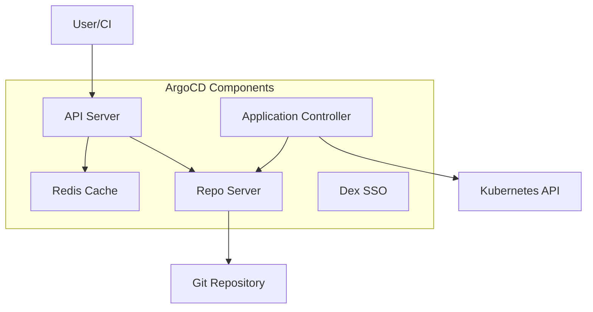

# How to Install ArgoCD on Kubernetes

Author: [nawazdhandala](https://www.github.com/nawazdhandala)

Tags: ArgoCD, Kubernetes, GitOps, DevOps, CI/CD, Installation

Description: A comprehensive guide to installing ArgoCD on Kubernetes clusters, covering multiple installation methods, initial configuration, and production-ready setup with high availability.

---

ArgoCD is the de facto standard for GitOps in Kubernetes. It watches your Git repositories and automatically syncs your cluster state to match what you have declared in your manifests. This guide walks you through installing ArgoCD from scratch, whether you want a quick development setup or a production-ready deployment.

## Prerequisites

Before you start, make sure you have:

- A running Kubernetes cluster (v1.22 or later)
- kubectl installed and configured
- Helm v3 (for Helm-based installation)
- At least 2GB of available memory in your cluster

## Understanding ArgoCD Components

ArgoCD consists of several components that work together:



- **API Server**: Exposes the REST API and handles authentication
- **Repository Server**: Clones repos and generates Kubernetes manifests
- **Application Controller**: Monitors applications and syncs state
- **Redis**: Caches repository data for performance
- **Dex**: Handles SSO authentication (optional)

## Method 1: Quick Install with kubectl

The simplest way to get ArgoCD running is using the official manifests.

```bash
# Create the argocd namespace
kubectl create namespace argocd

# Apply the installation manifests
kubectl apply -n argocd -f https://raw.githubusercontent.com/argoproj/argo-cd/stable/manifests/install.yaml
```

Wait for all pods to become ready:

```bash
# Check pod status
kubectl get pods -n argocd -w

# Wait for readiness (timeout after 5 minutes)
kubectl wait --for=condition=Ready pods --all -n argocd --timeout=300s
```

## Method 2: Install with Helm (Recommended)

Helm gives you more control over the configuration and makes upgrades easier.

```bash
# Add the Argo Helm repository
helm repo add argo https://argoproj.github.io/argo-helm
helm repo update

# Install ArgoCD with default settings
helm install argocd argo/argo-cd \
  --namespace argocd \
  --create-namespace
```

For production, you will want to customize the values:

```yaml
# argocd-values.yaml
global:
  # Set the domain for your ArgoCD installation
  domain: argocd.example.com

server:
  # Number of replicas for high availability
  replicas: 2

  # Ingress configuration
  ingress:
    enabled: true
    ingressClassName: nginx
    hosts:
      - argocd.example.com
    tls:
      - secretName: argocd-tls
        hosts:
          - argocd.example.com

  # Resource limits
  resources:
    requests:
      cpu: 100m
      memory: 256Mi
    limits:
      cpu: 500m
      memory: 512Mi

controller:
  # HA mode for the application controller
  replicas: 1
  resources:
    requests:
      cpu: 250m
      memory: 512Mi
    limits:
      cpu: 1000m
      memory: 1Gi

repoServer:
  replicas: 2
  resources:
    requests:
      cpu: 100m
      memory: 256Mi
    limits:
      cpu: 500m
      memory: 512Mi

redis:
  resources:
    requests:
      cpu: 100m
      memory: 128Mi
    limits:
      cpu: 200m
      memory: 256Mi

# Enable metrics for monitoring
metrics:
  enabled: true
  serviceMonitor:
    enabled: true
```

Install with custom values:

```bash
helm install argocd argo/argo-cd \
  --namespace argocd \
  --create-namespace \
  -f argocd-values.yaml
```

## Method 3: High Availability Installation

For production environments, use the HA manifests that include multiple replicas:

```bash
kubectl create namespace argocd

# Install HA version
kubectl apply -n argocd -f https://raw.githubusercontent.com/argoproj/argo-cd/stable/manifests/ha/install.yaml
```

The HA installation includes:
- 3 replicas of the API server
- 3 replicas of the repo server
- 3 replicas of Redis (using Redis HA)
- Application controller with leader election

## Accessing the ArgoCD UI

### Option 1: Port Forward (Development)

```bash
# Forward the API server port
kubectl port-forward svc/argocd-server -n argocd 8080:443

# Access at https://localhost:8080
```

### Option 2: LoadBalancer Service

```bash
# Patch the service to use LoadBalancer
kubectl patch svc argocd-server -n argocd -p '{"spec": {"type": "LoadBalancer"}}'

# Get the external IP
kubectl get svc argocd-server -n argocd
```

### Option 3: Ingress

Create an Ingress resource for external access:

```yaml
# argocd-ingress.yaml
apiVersion: networking.k8s.io/v1
kind: Ingress
metadata:
  name: argocd-server-ingress
  namespace: argocd
  annotations:
    nginx.ingress.kubernetes.io/ssl-passthrough: "true"
    nginx.ingress.kubernetes.io/backend-protocol: "HTTPS"
spec:
  ingressClassName: nginx
  rules:
    - host: argocd.example.com
      http:
        paths:
          - path: /
            pathType: Prefix
            backend:
              service:
                name: argocd-server
                port:
                  number: 443
  tls:
    - hosts:
        - argocd.example.com
      secretName: argocd-tls
```

```bash
kubectl apply -f argocd-ingress.yaml
```

## Getting the Admin Password

The initial admin password is auto-generated and stored in a secret:

```bash
# Get the password
kubectl -n argocd get secret argocd-initial-admin-secret \
  -o jsonpath="{.data.password}" | base64 -d

# Login with username: admin and the password from above
```

Change the password immediately after first login:

```bash
# Using the CLI
argocd login localhost:8080 --insecure
argocd account update-password
```

## Installing the ArgoCD CLI

The CLI is useful for automation and scripting.

```bash
# macOS with Homebrew
brew install argocd

# Linux
VERSION=$(curl -L -s https://raw.githubusercontent.com/argoproj/argo-cd/stable/VERSION)
curl -sSL -o argocd https://github.com/argoproj/argo-cd/releases/download/v${VERSION}/argocd-linux-amd64
chmod +x argocd
sudo mv argocd /usr/local/bin/

# Windows with Chocolatey
choco install argocd-cli
```

Login to your ArgoCD instance:

```bash
# Login (use --insecure for self-signed certs)
argocd login argocd.example.com --insecure

# Verify connection
argocd cluster list
```

## Verifying the Installation

Run these commands to ensure everything is working:

```bash
# Check all ArgoCD pods are running
kubectl get pods -n argocd

# Expected output (simplified):
# NAME                                  READY   STATUS
# argocd-application-controller-xxx    1/1     Running
# argocd-dex-server-xxx                1/1     Running
# argocd-redis-xxx                     1/1     Running
# argocd-repo-server-xxx               1/1     Running
# argocd-server-xxx                    1/1     Running

# Check ArgoCD version
argocd version

# List registered clusters
argocd cluster list
```

## Creating Your First Application

Test your installation by deploying a sample application:

```yaml
# sample-app.yaml
apiVersion: argoproj.io/v1alpha1
kind: Application
metadata:
  name: guestbook
  namespace: argocd
spec:
  project: default
  source:
    repoURL: https://github.com/argoproj/argocd-example-apps.git
    targetRevision: HEAD
    path: guestbook
  destination:
    server: https://kubernetes.default.svc
    namespace: guestbook
  syncPolicy:
    automated:
      prune: true
      selfHeal: true
    syncOptions:
      - CreateNamespace=true
```

```bash
kubectl apply -f sample-app.yaml

# Check application status
argocd app get guestbook

# Watch the sync progress
argocd app sync guestbook --watch
```

## Upgrading ArgoCD

### Helm Upgrade

```bash
# Update repository
helm repo update

# Upgrade to latest version
helm upgrade argocd argo/argo-cd \
  --namespace argocd \
  -f argocd-values.yaml

# Or upgrade to specific version
helm upgrade argocd argo/argo-cd \
  --namespace argocd \
  --version 5.51.0 \
  -f argocd-values.yaml
```

### kubectl Upgrade

```bash
# Apply the new version manifests
kubectl apply -n argocd -f https://raw.githubusercontent.com/argoproj/argo-cd/v2.9.0/manifests/install.yaml
```

## Uninstalling ArgoCD

If you need to remove ArgoCD:

```bash
# Helm uninstall
helm uninstall argocd -n argocd

# Or kubectl delete
kubectl delete -n argocd -f https://raw.githubusercontent.com/argoproj/argo-cd/stable/manifests/install.yaml

# Delete the namespace
kubectl delete namespace argocd
```

## Troubleshooting Common Issues

### Pods Stuck in Pending State

Check if you have enough resources:

```bash
kubectl describe pod -n argocd <pod-name>
kubectl get events -n argocd --sort-by='.lastTimestamp'
```

### Cannot Access the UI

Verify the service is running:

```bash
kubectl get svc -n argocd
kubectl logs -n argocd deployment/argocd-server
```

### Repository Connection Issues

Check the repo server logs:

```bash
kubectl logs -n argocd deployment/argocd-repo-server
```

---

With ArgoCD installed, you now have a powerful GitOps platform ready to manage your Kubernetes deployments. The next steps would be to configure your Git repositories, set up SSO, and create your first applications. Start with a single application to get comfortable with the workflow before scaling to more complex setups.
