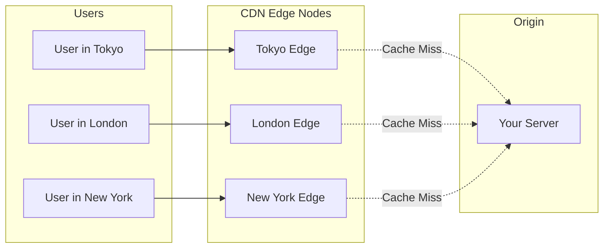

# How to Integrate CDN for Better Performance

Author: [nawazdhandala](https://www.github.com/nawazdhandala)

Tags: CDN, Performance, Caching, CloudFlare, AWS CloudFront, Web Performance, Frontend, Infrastructure

Description: Learn how to integrate a Content Delivery Network (CDN) to improve your application's performance. This guide covers CDN configuration, cache headers, cache invalidation, and best practices for static and dynamic content.

---

> A Content Delivery Network (CDN) can reduce your page load times by 50% or more by serving content from edge locations close to your users. Instead of every request traveling to your origin server, users get content from the nearest CDN node. This guide shows you how to set up and configure a CDN effectively.

CDNs are not just for static files. Modern CDNs can cache API responses, optimize images on the fly, and provide security features like DDoS protection.

---

## How CDNs Work



First request (cache miss): User -> CDN Edge -> Origin -> CDN Edge -> User
Subsequent requests (cache hit): User -> CDN Edge -> User

---

## Setting Up CloudFlare

CloudFlare is one of the most popular CDNs due to its generous free tier and easy setup.

### Basic Configuration

```bash
# DNS Configuration
# Point your domain to CloudFlare nameservers
# CloudFlare will proxy traffic through their network

# Verify setup
curl -I https://yourdomain.com
# Look for: cf-ray header (indicates CloudFlare is active)
```

### Page Rules for Caching

```yaml
# CloudFlare Page Rules (via dashboard or API)

# Cache everything for static assets
rule_1:
  url: "*yourdomain.com/static/*"
  actions:
    cache_level: "cache_everything"
    edge_cache_ttl: 2592000  # 30 days
    browser_cache_ttl: 604800  # 7 days

# Cache API responses for public data
rule_2:
  url: "*yourdomain.com/api/public/*"
  actions:
    cache_level: "cache_everything"
    edge_cache_ttl: 300  # 5 minutes

# Bypass cache for authenticated routes
rule_3:
  url: "*yourdomain.com/api/user/*"
  actions:
    cache_level: "bypass"
```

### CloudFlare API for Cache Invalidation

```python
# cloudflare_cache.py
import requests
from typing import List

class CloudFlareCache:
    """CloudFlare cache management"""

    def __init__(self, api_token: str, zone_id: str):
        self.api_token = api_token
        self.zone_id = zone_id
        self.base_url = f"https://api.cloudflare.com/client/v4/zones/{zone_id}"
        self.headers = {
            "Authorization": f"Bearer {api_token}",
            "Content-Type": "application/json"
        }

    def purge_urls(self, urls: List[str]) -> dict:
        """Purge specific URLs from cache"""
        response = requests.post(
            f"{self.base_url}/purge_cache",
            headers=self.headers,
            json={"files": urls}
        )
        return response.json()

    def purge_by_prefix(self, prefixes: List[str]) -> dict:
        """Purge URLs matching prefixes (Enterprise only)"""
        response = requests.post(
            f"{self.base_url}/purge_cache",
            headers=self.headers,
            json={"prefixes": prefixes}
        )
        return response.json()

    def purge_by_tags(self, tags: List[str]) -> dict:
        """Purge by cache tags (Enterprise only)"""
        response = requests.post(
            f"{self.base_url}/purge_cache",
            headers=self.headers,
            json={"tags": tags}
        )
        return response.json()

    def purge_all(self) -> dict:
        """Purge entire cache (use sparingly!)"""
        response = requests.post(
            f"{self.base_url}/purge_cache",
            headers=self.headers,
            json={"purge_everything": True}
        )
        return response.json()


# Usage
cf = CloudFlareCache(
    api_token="your-api-token",
    zone_id="your-zone-id"
)

# Purge specific files after deployment
cf.purge_urls([
    "https://yourdomain.com/static/app.js",
    "https://yourdomain.com/static/styles.css"
])
```

---

## Setting Up AWS CloudFront

### CloudFront Distribution with Terraform

```hcl
# cloudfront.tf
resource "aws_cloudfront_distribution" "main" {
  enabled             = true
  is_ipv6_enabled     = true
  default_root_object = "index.html"
  price_class         = "PriceClass_100"  # US, Canada, Europe only

  # Origin: Your application server or S3 bucket
  origin {
    domain_name = "origin.yourdomain.com"
    origin_id   = "main-origin"

    custom_origin_config {
      http_port              = 80
      https_port             = 443
      origin_protocol_policy = "https-only"
      origin_ssl_protocols   = ["TLSv1.2"]
    }

    # Custom headers to verify requests come from CloudFront
    custom_header {
      name  = "X-Origin-Verify"
      value = var.origin_verify_secret
    }
  }

  # Default cache behavior
  default_cache_behavior {
    allowed_methods  = ["GET", "HEAD", "OPTIONS"]
    cached_methods   = ["GET", "HEAD"]
    target_origin_id = "main-origin"

    # Use origin cache headers
    cache_policy_id          = aws_cloudfront_cache_policy.default.id
    origin_request_policy_id = aws_cloudfront_origin_request_policy.default.id

    viewer_protocol_policy = "redirect-to-https"
    compress               = true
  }

  # Static assets - aggressive caching
  ordered_cache_behavior {
    path_pattern     = "/static/*"
    allowed_methods  = ["GET", "HEAD"]
    cached_methods   = ["GET", "HEAD"]
    target_origin_id = "main-origin"

    cache_policy_id = aws_cloudfront_cache_policy.static.id

    viewer_protocol_policy = "redirect-to-https"
    compress               = true
  }

  # API routes - no caching or short TTL
  ordered_cache_behavior {
    path_pattern     = "/api/*"
    allowed_methods  = ["DELETE", "GET", "HEAD", "OPTIONS", "PATCH", "POST", "PUT"]
    cached_methods   = ["GET", "HEAD"]
    target_origin_id = "main-origin"

    cache_policy_id          = aws_cloudfront_cache_policy.api.id
    origin_request_policy_id = aws_cloudfront_origin_request_policy.api.id

    viewer_protocol_policy = "redirect-to-https"
    compress               = true
  }

  restrictions {
    geo_restriction {
      restriction_type = "none"
    }
  }

  viewer_certificate {
    acm_certificate_arn      = aws_acm_certificate.main.arn
    ssl_support_method       = "sni-only"
    minimum_protocol_version = "TLSv1.2_2021"
  }
}

# Cache policy for static assets
resource "aws_cloudfront_cache_policy" "static" {
  name        = "static-assets"
  min_ttl     = 86400      # 1 day minimum
  default_ttl = 2592000    # 30 days default
  max_ttl     = 31536000   # 1 year maximum

  parameters_in_cache_key_and_forwarded_to_origin {
    cookies_config {
      cookie_behavior = "none"
    }
    headers_config {
      header_behavior = "none"
    }
    query_strings_config {
      query_string_behavior = "none"
    }
  }
}

# Cache policy for API (respect origin headers)
resource "aws_cloudfront_cache_policy" "api" {
  name        = "api-cache"
  min_ttl     = 0
  default_ttl = 0
  max_ttl     = 300  # 5 minutes max

  parameters_in_cache_key_and_forwarded_to_origin {
    cookies_config {
      cookie_behavior = "none"
    }
    headers_config {
      header_behavior = "whitelist"
      headers {
        items = ["Authorization"]
      }
    }
    query_strings_config {
      query_string_behavior = "all"
    }
  }
}
```

### CloudFront Cache Invalidation

```python
# cloudfront_invalidation.py
import boto3
import time
from typing import List

class CloudFrontCache:
    """AWS CloudFront cache management"""

    def __init__(self, distribution_id: str):
        self.client = boto3.client('cloudfront')
        self.distribution_id = distribution_id

    def invalidate(self, paths: List[str]) -> str:
        """
        Invalidate specific paths from cache.
        Use /* to invalidate everything under a path.
        """
        response = self.client.create_invalidation(
            DistributionId=self.distribution_id,
            InvalidationBatch={
                'Paths': {
                    'Quantity': len(paths),
                    'Items': paths
                },
                'CallerReference': str(time.time())
            }
        )
        return response['Invalidation']['Id']

    def get_invalidation_status(self, invalidation_id: str) -> str:
        """Check invalidation status"""
        response = self.client.get_invalidation(
            DistributionId=self.distribution_id,
            Id=invalidation_id
        )
        return response['Invalidation']['Status']

    def wait_for_invalidation(self, invalidation_id: str,
                               timeout: int = 300) -> bool:
        """Wait for invalidation to complete"""
        waiter = self.client.get_waiter('invalidation_completed')
        try:
            waiter.wait(
                DistributionId=self.distribution_id,
                Id=invalidation_id,
                WaiterConfig={'Delay': 10, 'MaxAttempts': timeout // 10}
            )
            return True
        except Exception:
            return False


# Usage
cf = CloudFrontCache(distribution_id="E1234567890ABC")

# Invalidate specific files
inv_id = cf.invalidate([
    "/static/app.js",
    "/static/styles.css",
    "/index.html"
])

# Invalidate all files under a path
inv_id = cf.invalidate(["/static/*"])

# Wait for completion (optional)
cf.wait_for_invalidation(inv_id)
```

---

## Setting Cache Headers on Your Origin

The CDN respects cache headers from your origin server. Set them correctly:

```python
# cache_headers.py
from flask import Flask, send_from_directory, make_response
from datetime import datetime, timedelta

app = Flask(__name__)

@app.route('/static/<path:filename>')
def static_files(filename):
    """Serve static files with aggressive caching"""
    response = send_from_directory('static', filename)

    # Cache for 1 year (use versioned filenames for cache busting)
    response.headers['Cache-Control'] = 'public, max-age=31536000, immutable'

    return response

@app.route('/api/public/products')
def public_products():
    """Public API that can be cached"""
    products = get_products()
    response = make_response(jsonify(products))

    # Cache for 5 minutes, allow stale while revalidating
    response.headers['Cache-Control'] = 'public, max-age=300, stale-while-revalidate=60'

    # Add ETag for conditional requests
    response.headers['ETag'] = generate_etag(products)

    return response

@app.route('/api/user/profile')
def user_profile():
    """Private API - no caching"""
    profile = get_user_profile()
    response = make_response(jsonify(profile))

    # Prevent caching of private data
    response.headers['Cache-Control'] = 'private, no-store, no-cache, must-revalidate'

    return response

@app.route('/api/public/config')
def app_config():
    """Config that changes occasionally"""
    config = get_app_config()
    response = make_response(jsonify(config))

    # Short cache with revalidation
    response.headers['Cache-Control'] = 'public, max-age=60'
    response.headers['ETag'] = f'"{hash_config(config)}"'

    return response
```

### Express.js Example

```javascript
// cache-middleware.js
const express = require('express');
const app = express();

// Static files with immutable caching
app.use('/static', express.static('public', {
  maxAge: '1y',
  immutable: true,
  etag: true
}));

// API caching middleware
const cacheControl = (options) => {
  return (req, res, next) => {
    if (options.public) {
      res.set('Cache-Control', `public, max-age=${options.maxAge || 300}`);
    } else {
      res.set('Cache-Control', 'private, no-store');
    }
    next();
  };
};

// Public API endpoint
app.get('/api/public/products',
  cacheControl({ public: true, maxAge: 300 }),
  async (req, res) => {
    const products = await getProducts();
    res.json(products);
  }
);

// Private API endpoint
app.get('/api/user/profile',
  cacheControl({ public: false }),
  authenticateUser,
  async (req, res) => {
    const profile = await getUserProfile(req.user.id);
    res.json(profile);
  }
);
```

---

## Cache Busting Strategies

### Filename Versioning (Recommended)

```javascript
// webpack.config.js
module.exports = {
  output: {
    // Include content hash in filename
    filename: '[name].[contenthash].js',
    chunkFilename: '[name].[contenthash].js'
  },
  plugins: [
    new MiniCssExtractPlugin({
      filename: '[name].[contenthash].css'
    })
  ]
};
```

```html
<!-- Output -->
<script src="/static/app.a1b2c3d4.js"></script>
<link rel="stylesheet" href="/static/styles.e5f6g7h8.css">
```

### Query String Versioning

```python
# For dynamic asset URLs
import hashlib
import os

def versioned_url(path: str) -> str:
    """Add version hash to static file URL"""
    file_path = os.path.join('static', path)

    if os.path.exists(file_path):
        with open(file_path, 'rb') as f:
            file_hash = hashlib.md5(f.read()).hexdigest()[:8]
        return f"/static/{path}?v={file_hash}"

    return f"/static/{path}"

# Usage in templates
# {{ versioned_url('app.js') }}  ->  /static/app.js?v=a1b2c3d4
```

---

## CDN for Dynamic Content

### API Response Caching

```python
# api_caching.py
from functools import wraps
import hashlib
import json

def cdn_cacheable(max_age: int = 300, vary_on: list = None):
    """Decorator to make API responses CDN-cacheable"""
    def decorator(f):
        @wraps(f)
        def wrapper(*args, **kwargs):
            response = f(*args, **kwargs)

            # Generate ETag from response content
            content = response.get_data(as_text=True)
            etag = hashlib.md5(content.encode()).hexdigest()

            # Set cache headers
            response.headers['Cache-Control'] = f'public, max-age={max_age}'
            response.headers['ETag'] = f'"{etag}"'

            # Vary header for cache key differentiation
            if vary_on:
                response.headers['Vary'] = ', '.join(vary_on)

            # Surrogate key for targeted invalidation
            response.headers['Surrogate-Key'] = f.cache_tags if hasattr(f, 'cache_tags') else f.__name__

            return response
        return wrapper
    return decorator

# Usage
@app.route('/api/products/<int:product_id>')
@cdn_cacheable(max_age=300, vary_on=['Accept-Language'])
def get_product(product_id):
    product = db.get_product(product_id)
    return jsonify(product)

get_product.cache_tags = 'products'
```

---

## Monitoring CDN Performance

```python
# cdn_metrics.py
import requests
from datetime import datetime, timedelta

class CDNMonitor:
    """Monitor CDN cache performance"""

    def __init__(self, urls: list):
        self.urls = urls

    def check_cache_status(self):
        """Check cache hit/miss for each URL"""
        results = []

        for url in self.urls:
            response = requests.head(url)

            # CloudFlare
            cf_status = response.headers.get('CF-Cache-Status', 'N/A')

            # CloudFront
            cf_front = response.headers.get('X-Cache', 'N/A')

            results.append({
                'url': url,
                'cloudflare_status': cf_status,
                'cloudfront_status': cf_front,
                'age': response.headers.get('Age', '0'),
                'cache_control': response.headers.get('Cache-Control', 'N/A')
            })

        return results

    def get_cache_hit_rate(self, results: list) -> float:
        """Calculate cache hit rate"""
        hits = sum(1 for r in results
                   if r['cloudflare_status'] == 'HIT'
                   or 'Hit' in r['cloudfront_status'])
        return hits / len(results) * 100 if results else 0


# Usage
monitor = CDNMonitor([
    'https://yourdomain.com/static/app.js',
    'https://yourdomain.com/api/public/config',
    'https://yourdomain.com/images/logo.png'
])

results = monitor.check_cache_status()
for r in results:
    print(f"{r['url']}: {r['cloudflare_status']} (age: {r['age']}s)")

hit_rate = monitor.get_cache_hit_rate(results)
print(f"Cache hit rate: {hit_rate:.1f}%")
```

---

## Best Practices Summary

| Content Type | Cache Duration | Cache-Control |
|-------------|----------------|---------------|
| Versioned static assets | 1 year | `public, max-age=31536000, immutable` |
| Unversioned static assets | 1 day | `public, max-age=86400` |
| Public API responses | 1-5 minutes | `public, max-age=300, stale-while-revalidate=60` |
| User-specific data | Never | `private, no-store` |
| HTML pages | Short/None | `public, max-age=60` or `no-cache` |

---

## Conclusion

Effective CDN integration requires:

1. **Proper cache headers**: Set Cache-Control, ETag, and Vary headers on your origin
2. **Smart cache policies**: Different rules for static assets, APIs, and private content
3. **Cache invalidation strategy**: Filename versioning for assets, API invalidation for dynamic content
4. **Monitoring**: Track cache hit rates and optimize for 90%+ hits on static content

A well-configured CDN delivers your content faster, reduces origin load, and improves user experience globally.

---

*Need to monitor your CDN and origin performance? [OneUptime](https://oneuptime.com) provides global latency monitoring, cache hit rate tracking, and performance alerts.*
