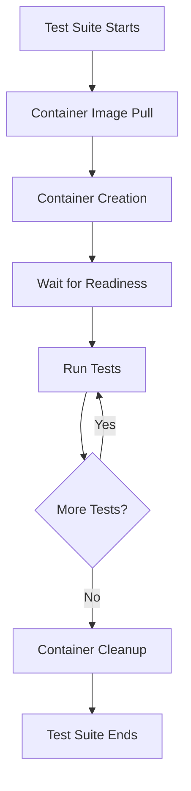

# How to Configure Integration Testing with Testcontainers

Author: [nawazdhandala](https://github.com/nawazdhandala)

Tags: Testing, Testcontainers, Integration Testing, Docker, DevOps

Description: Learn how to set up Testcontainers for reliable integration tests that spin up real databases, message queues, and services in Docker containers during your test runs.

---

Integration tests that rely on mocked dependencies often miss real-world bugs. Testcontainers solves this by spinning up actual services in Docker containers during test execution. Your tests run against real PostgreSQL, Redis, Kafka, or any other containerized service, then clean up automatically when done.

## Why Testcontainers?

Traditional integration testing approaches have significant drawbacks:

| Approach | Problem |
|----------|---------|
| **Shared test database** | Tests interfere with each other |
| **In-memory databases (H2)** | Behavior differs from production |
| **Manual Docker setup** | Developers forget to start containers |
| **Mocked services** | Mocks drift from real implementations |

Testcontainers gives you isolated, reproducible test environments that match production behavior.

## Basic Setup

First, add Testcontainers to your project. Here is a Maven configuration for Java:

```xml
<!-- pom.xml -->
<dependencies>
    <!-- Core Testcontainers library -->
    <dependency>
        <groupId>org.testcontainers</groupId>
        <artifactId>testcontainers</artifactId>
        <version>1.19.3</version>
        <scope>test</scope>
    </dependency>

    <!-- PostgreSQL module for database testing -->
    <dependency>
        <groupId>org.testcontainers</groupId>
        <artifactId>postgresql</artifactId>
        <version>1.19.3</version>
        <scope>test</scope>
    </dependency>

    <!-- JUnit 5 integration -->
    <dependency>
        <groupId>org.testcontainers</groupId>
        <artifactId>junit-jupiter</artifactId>
        <version>1.19.3</version>
        <scope>test</scope>
    </dependency>
</dependencies>
```

For Node.js projects:

```bash
npm install --save-dev testcontainers
```

## PostgreSQL Integration Test

This example shows a complete integration test with PostgreSQL. The container starts before tests, provides connection details, and stops after all tests complete.

```java
import org.junit.jupiter.api.BeforeAll;
import org.junit.jupiter.api.Test;
import org.testcontainers.containers.PostgreSQLContainer;
import org.testcontainers.junit.jupiter.Container;
import org.testcontainers.junit.jupiter.Testcontainers;

import java.sql.Connection;
import java.sql.DriverManager;
import java.sql.ResultSet;

import static org.junit.jupiter.api.Assertions.*;

// This annotation enables Testcontainers JUnit 5 extension
@Testcontainers
class UserRepositoryIntegrationTest {

    // Static container shared across all test methods
    // The container starts once before all tests and stops after
    @Container
    static PostgreSQLContainer<?> postgres = new PostgreSQLContainer<>("postgres:15-alpine")
            .withDatabaseName("testdb")
            .withUsername("test")
            .withPassword("test")
            // Initialize schema using SQL script
            .withInitScript("schema.sql");

    private static Connection connection;

    @BeforeAll
    static void setUp() throws Exception {
        // Testcontainers assigns a random port to avoid conflicts
        // Use getJdbcUrl() to get the actual connection string
        connection = DriverManager.getConnection(
                postgres.getJdbcUrl(),
                postgres.getUsername(),
                postgres.getPassword()
        );
    }

    @Test
    void shouldInsertAndRetrieveUser() throws Exception {
        // Insert a test user
        var stmt = connection.prepareStatement(
                "INSERT INTO users (name, email) VALUES (?, ?) RETURNING id"
        );
        stmt.setString(1, "Alice");
        stmt.setString(2, "alice@example.com");

        ResultSet rs = stmt.executeQuery();
        assertTrue(rs.next());
        long userId = rs.getLong("id");
        assertTrue(userId > 0);

        // Verify retrieval
        var selectStmt = connection.prepareStatement(
                "SELECT name, email FROM users WHERE id = ?"
        );
        selectStmt.setLong(1, userId);

        ResultSet result = selectStmt.executeQuery();
        assertTrue(result.next());
        assertEquals("Alice", result.getString("name"));
        assertEquals("alice@example.com", result.getString("email"));
    }

    @Test
    void shouldEnforceUniqueEmailConstraint() throws Exception {
        // Insert first user
        var stmt = connection.prepareStatement(
                "INSERT INTO users (name, email) VALUES (?, ?)"
        );
        stmt.setString(1, "Bob");
        stmt.setString(2, "unique@example.com");
        stmt.executeUpdate();

        // Attempt duplicate email should fail
        stmt.setString(1, "Charlie");
        stmt.setString(2, "unique@example.com");

        assertThrows(Exception.class, stmt::executeUpdate);
    }
}
```

## Node.js with Testcontainers

Testcontainers works great with JavaScript and TypeScript projects:

```typescript
// user.repository.test.ts
import { PostgreSqlContainer, StartedPostgreSqlContainer } from '@testcontainers/postgresql';
import { Pool } from 'pg';

describe('UserRepository Integration Tests', () => {
    let container: StartedPostgreSqlContainer;
    let pool: Pool;

    // Start PostgreSQL container before all tests
    // This takes a few seconds on first run while image downloads
    beforeAll(async () => {
        container = await new PostgreSqlContainer('postgres:15-alpine')
            .withDatabase('testdb')
            .withUsername('test')
            .withPassword('test')
            .start();

        // Create connection pool using container's connection string
        pool = new Pool({
            connectionString: container.getConnectionUri(),
        });

        // Initialize schema
        await pool.query(`
            CREATE TABLE IF NOT EXISTS users (
                id SERIAL PRIMARY KEY,
                name VARCHAR(100) NOT NULL,
                email VARCHAR(255) UNIQUE NOT NULL,
                created_at TIMESTAMP DEFAULT CURRENT_TIMESTAMP
            )
        `);
    }, 60000); // Allow 60 seconds for container startup

    // Stop container after all tests complete
    afterAll(async () => {
        await pool.end();
        await container.stop();
    });

    // Clean up data between tests for isolation
    afterEach(async () => {
        await pool.query('DELETE FROM users');
    });

    test('should create and retrieve user', async () => {
        // Insert user
        const insertResult = await pool.query(
            'INSERT INTO users (name, email) VALUES ($1, $2) RETURNING id',
            ['Alice', 'alice@test.com']
        );
        const userId = insertResult.rows[0].id;

        // Retrieve and verify
        const selectResult = await pool.query(
            'SELECT name, email FROM users WHERE id = $1',
            [userId]
        );

        expect(selectResult.rows[0]).toEqual({
            name: 'Alice',
            email: 'alice@test.com',
        });
    });
});
```

## Testing with Multiple Services

Real applications often need multiple services. Here is an example testing a service that uses both PostgreSQL and Redis:

```java
@Testcontainers
class OrderServiceIntegrationTest {

    // PostgreSQL for persistent storage
    @Container
    static PostgreSQLContainer<?> postgres = new PostgreSQLContainer<>("postgres:15-alpine")
            .withDatabaseName("orders");

    // Redis for caching
    @Container
    static GenericContainer<?> redis = new GenericContainer<>("redis:7-alpine")
            .withExposedPorts(6379);

    private OrderService orderService;

    @BeforeAll
    static void setupInfrastructure() {
        // Configure application to use container endpoints
        System.setProperty("db.url", postgres.getJdbcUrl());
        System.setProperty("db.username", postgres.getUsername());
        System.setProperty("db.password", postgres.getPassword());

        // Redis uses dynamic port mapping
        System.setProperty("redis.host", redis.getHost());
        System.setProperty("redis.port", String.valueOf(redis.getMappedPort(6379)));
    }

    @BeforeEach
    void setUp() {
        orderService = new OrderService();
    }

    @Test
    void shouldCacheOrderAfterFirstRetrieval() {
        // Create order in database
        Order order = orderService.createOrder(new CreateOrderRequest("item-123", 2));

        // First retrieval hits database
        Order retrieved1 = orderService.getOrder(order.getId());

        // Second retrieval should come from cache
        Order retrieved2 = orderService.getOrder(order.getId());

        assertEquals(order.getId(), retrieved1.getId());
        assertEquals(order.getId(), retrieved2.getId());

        // Verify cache was populated (check Redis directly)
        assertTrue(orderService.isOrderCached(order.getId()));
    }
}
```

## Docker Compose Module

For complex setups with multiple interdependent services, use Docker Compose:

```java
import org.testcontainers.containers.DockerComposeContainer;
import org.testcontainers.containers.wait.strategy.Wait;

class FullStackIntegrationTest {

    // Load entire stack from docker-compose file
    @Container
    static DockerComposeContainer<?> environment =
            new DockerComposeContainer<>(new File("src/test/resources/docker-compose-test.yml"))
                    .withExposedService("postgres", 5432,
                            Wait.forListeningPort())
                    .withExposedService("redis", 6379,
                            Wait.forListeningPort())
                    .withExposedService("kafka", 9092,
                            Wait.forListeningPort());

    @Test
    void shouldProcessOrderEndToEnd() {
        // Get service hosts and ports
        String postgresHost = environment.getServiceHost("postgres", 5432);
        int postgresPort = environment.getServicePort("postgres", 5432);

        // Run full end-to-end test
        // ...
    }
}
```

## Test Container Lifecycle

Understanding container lifecycle helps optimize test performance:



## Performance Optimization

Container startup adds overhead. Here are strategies to minimize it:

```java
// Singleton pattern: reuse containers across test classes
public abstract class BaseIntegrationTest {

    // Single container instance shared by all test classes
    protected static final PostgreSQLContainer<?> POSTGRES;

    static {
        POSTGRES = new PostgreSQLContainer<>("postgres:15-alpine")
                .withDatabaseName("testdb")
                .withReuse(true); // Enable container reuse
        POSTGRES.start();
    }

    // Clean database between tests instead of recreating container
    @BeforeEach
    void cleanDatabase() throws Exception {
        try (var conn = DriverManager.getConnection(
                POSTGRES.getJdbcUrl(),
                POSTGRES.getUsername(),
                POSTGRES.getPassword())) {
            conn.createStatement().execute(
                    "TRUNCATE users, orders, products RESTART IDENTITY CASCADE"
            );
        }
    }
}
```

Enable reuse in your `~/.testcontainers.properties`:

```properties
# Keep containers running between test runs for faster iteration
testcontainers.reuse.enable=true
```

## CI/CD Integration

Testcontainers works in CI environments where Docker is available:

```yaml
# GitHub Actions example
name: Integration Tests
on: [push, pull_request]

jobs:
  test:
    runs-on: ubuntu-latest
    steps:
      - uses: actions/checkout@v4

      - name: Set up JDK
        uses: actions/setup-java@v4
        with:
          java-version: '21'
          distribution: 'temurin'

      # Docker is pre-installed on GitHub runners
      - name: Run Integration Tests
        run: mvn verify -Pintegration-tests
        env:
          # Testcontainers automatically detects CI environment
          TESTCONTAINERS_RYUK_DISABLED: false
```

## Summary

Testcontainers transforms integration testing by providing real services instead of mocks:

| Feature | Benefit |
|---------|---------|
| **Real services** | Tests match production behavior |
| **Automatic cleanup** | No manual container management |
| **Port randomization** | Parallel test execution |
| **Language support** | Java, Node.js, Python, Go, and more |
| **CI friendly** | Works anywhere Docker runs |

Start with single-service tests, then expand to multi-service scenarios as your test suite matures. The initial setup investment pays off quickly in bug detection and deployment confidence.
