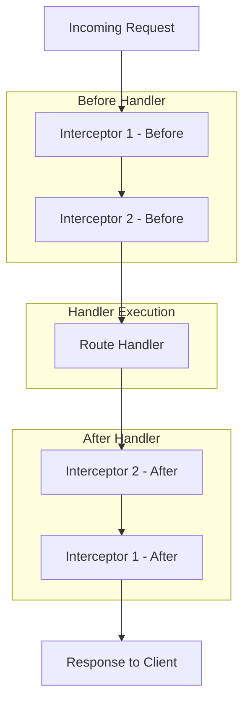

# How to Build Interceptors in NestJS

Author: [nawazdhandala](https://www.github.com/nawazdhandala)

Tags: NestJS, TypeScript, NodeJS, API, Middleware

Description: Learn how to build powerful interceptors in NestJS for logging, caching, response transformation, and performance monitoring with practical examples and best practices.

---

Interceptors are one of the most powerful features in NestJS. They let you add extra logic before and after method execution, transform results, handle errors, and extend behavior across your application. This guide covers practical interceptor patterns you will use in production.

## What Interceptors Can Do

Interceptors bind extra logic around method execution using the Aspect Oriented Programming (AOP) technique. They can:

- Transform the result returned from a function
- Transform the exception thrown from a function
- Extend basic function behavior
- Override a function depending on specific conditions

| Use Case | Interceptor Approach |
|----------|---------------------|
| Logging | Capture request/response timing |
| Caching | Return cached responses |
| Transformation | Modify response structure |
| Error handling | Catch and transform errors |
| Timeout | Cancel slow requests |

## Basic Interceptor Structure

Every interceptor implements the `NestInterceptor` interface with an `intercept` method. The `CallHandler` provides access to the route handler via its `handle()` method.

```typescript
// logging.interceptor.ts
import {
  Injectable,
  NestInterceptor,
  ExecutionContext,
  CallHandler,
} from '@nestjs/common';
import { Observable } from 'rxjs';
import { tap } from 'rxjs/operators';

@Injectable()
export class LoggingInterceptor implements NestInterceptor {
  intercept(context: ExecutionContext, next: CallHandler): Observable<any> {
    const request = context.switchToHttp().getRequest();
    const method = request.method;
    const url = request.url;
    const now = Date.now();

    console.log(`[${method}] ${url} - Request started`);

    // next.handle() returns an Observable of the response
    // tap() lets us observe the value without modifying it
    return next.handle().pipe(
      tap((data) => {
        const duration = Date.now() - now;
        console.log(`[${method}] ${url} - ${duration}ms`);
      }),
    );
  }
}
```

## Apply Interceptors

You can apply interceptors at three levels: globally, controller, or method.

```typescript
// main.ts - Global interceptor
import { NestFactory } from '@nestjs/core';
import { AppModule } from './app.module';
import { LoggingInterceptor } from './interceptors/logging.interceptor';

async function bootstrap() {
  const app = await NestFactory.create(AppModule);
  app.useGlobalInterceptors(new LoggingInterceptor());
  await app.listen(3000);
}
bootstrap();

// Or register in module for dependency injection support
// app.module.ts
import { Module } from '@nestjs/common';
import { APP_INTERCEPTOR } from '@nestjs/core';
import { LoggingInterceptor } from './interceptors/logging.interceptor';

@Module({
  providers: [
    {
      provide: APP_INTERCEPTOR,
      useClass: LoggingInterceptor,
    },
  ],
})
export class AppModule {}
```

```typescript
// Controller and method level
import { Controller, Get, UseInterceptors } from '@nestjs/common';
import { LoggingInterceptor } from './interceptors/logging.interceptor';
import { CacheInterceptor } from './interceptors/cache.interceptor';

// Apply to all routes in controller
@Controller('users')
@UseInterceptors(LoggingInterceptor)
export class UsersController {
  @Get()
  findAll() {
    return [];
  }

  // Apply to specific route only
  @Get(':id')
  @UseInterceptors(CacheInterceptor)
  findOne() {
    return {};
  }
}
```

## Response Transformation Interceptor

Transform all responses to a consistent format. This is useful for API standardization.

```typescript
// transform.interceptor.ts
import {
  Injectable,
  NestInterceptor,
  ExecutionContext,
  CallHandler,
} from '@nestjs/common';
import { Observable } from 'rxjs';
import { map } from 'rxjs/operators';

// Standard API response format
export interface ApiResponse<T> {
  success: boolean;
  data: T;
  timestamp: string;
  path: string;
}

@Injectable()
export class TransformInterceptor<T>
  implements NestInterceptor<T, ApiResponse<T>>
{
  intercept(
    context: ExecutionContext,
    next: CallHandler,
  ): Observable<ApiResponse<T>> {
    const request = context.switchToHttp().getRequest();

    return next.handle().pipe(
      map((data) => ({
        success: true,
        data,
        timestamp: new Date().toISOString(),
        path: request.url,
      })),
    );
  }
}
```

## Caching Interceptor

Cache responses to reduce database load. This example uses an in-memory cache, but you can swap in Redis for production.

```typescript
// cache.interceptor.ts
import {
  Injectable,
  NestInterceptor,
  ExecutionContext,
  CallHandler,
} from '@nestjs/common';
import { Observable, of } from 'rxjs';
import { tap } from 'rxjs/operators';

interface CacheEntry {
  data: any;
  expiry: number;
}

@Injectable()
export class CacheInterceptor implements NestInterceptor {
  private cache: Map<string, CacheEntry> = new Map();
  private defaultTtl: number = 60000; // 60 seconds

  intercept(context: ExecutionContext, next: CallHandler): Observable<any> {
    const request = context.switchToHttp().getRequest();

    // Only cache GET requests
    if (request.method !== 'GET') {
      return next.handle();
    }

    const cacheKey = this.generateCacheKey(request);
    const cached = this.cache.get(cacheKey);

    // Return cached data if valid
    if (cached && cached.expiry > Date.now()) {
      console.log(`Cache hit: ${cacheKey}`);
      return of(cached.data);
    }

    // Execute handler and cache result
    return next.handle().pipe(
      tap((data) => {
        console.log(`Cache miss: ${cacheKey}`);
        this.cache.set(cacheKey, {
          data,
          expiry: Date.now() + this.defaultTtl,
        });
      }),
    );
  }

  private generateCacheKey(request: any): string {
    const { url, query } = request;
    const queryString = JSON.stringify(query);
    return `${url}:${queryString}`;
  }

  // Method to clear cache programmatically
  clearCache(pattern?: string): void {
    if (!pattern) {
      this.cache.clear();
      return;
    }

    for (const key of this.cache.keys()) {
      if (key.includes(pattern)) {
        this.cache.delete(key);
      }
    }
  }
}
```

## Interceptor Flow Diagram



## Timeout Interceptor

Prevent slow requests from hanging indefinitely. This interceptor cancels requests that exceed a time limit.

```typescript
// timeout.interceptor.ts
import {
  Injectable,
  NestInterceptor,
  ExecutionContext,
  CallHandler,
  RequestTimeoutException,
} from '@nestjs/common';
import { Observable, throwError, TimeoutError } from 'rxjs';
import { catchError, timeout } from 'rxjs/operators';

@Injectable()
export class TimeoutInterceptor implements NestInterceptor {
  constructor(private readonly timeoutMs: number = 5000) {}

  intercept(context: ExecutionContext, next: CallHandler): Observable<any> {
    return next.handle().pipe(
      timeout(this.timeoutMs),
      catchError((err) => {
        if (err instanceof TimeoutError) {
          return throwError(
            () => new RequestTimeoutException('Request timed out'),
          );
        }
        return throwError(() => err);
      }),
    );
  }
}

// Custom decorator for configurable timeout
import { SetMetadata } from '@nestjs/common';

export const TIMEOUT_KEY = 'timeout';
export const Timeout = (ms: number) => SetMetadata(TIMEOUT_KEY, ms);
```

```typescript
// configurable-timeout.interceptor.ts
import {
  Injectable,
  NestInterceptor,
  ExecutionContext,
  CallHandler,
  RequestTimeoutException,
} from '@nestjs/common';
import { Reflector } from '@nestjs/core';
import { Observable, throwError, TimeoutError } from 'rxjs';
import { catchError, timeout } from 'rxjs/operators';
import { TIMEOUT_KEY } from './timeout.decorator';

@Injectable()
export class ConfigurableTimeoutInterceptor implements NestInterceptor {
  constructor(private reflector: Reflector) {}

  intercept(context: ExecutionContext, next: CallHandler): Observable<any> {
    // Check for custom timeout on method or controller
    const timeoutMs =
      this.reflector.getAllAndOverride<number>(TIMEOUT_KEY, [
        context.getHandler(),
        context.getClass(),
      ]) || 5000;

    return next.handle().pipe(
      timeout(timeoutMs),
      catchError((err) => {
        if (err instanceof TimeoutError) {
          return throwError(
            () => new RequestTimeoutException(`Request timed out after ${timeoutMs}ms`),
          );
        }
        return throwError(() => err);
      }),
    );
  }
}
```

## Performance Monitoring Interceptor

Track request metrics for observability. This interceptor records timing, status codes, and can export to Prometheus or other monitoring systems.

```typescript
// metrics.interceptor.ts
import {
  Injectable,
  NestInterceptor,
  ExecutionContext,
  CallHandler,
} from '@nestjs/common';
import { Observable } from 'rxjs';
import { tap, catchError } from 'rxjs/operators';

interface RequestMetric {
  method: string;
  path: string;
  statusCode: number;
  duration: number;
  timestamp: Date;
}

@Injectable()
export class MetricsInterceptor implements NestInterceptor {
  private metrics: RequestMetric[] = [];
  private maxMetrics: number = 10000;

  intercept(context: ExecutionContext, next: CallHandler): Observable<any> {
    const request = context.switchToHttp().getRequest();
    const response = context.switchToHttp().getResponse();
    const startTime = process.hrtime.bigint();

    return next.handle().pipe(
      tap(() => {
        this.recordMetric(request, response, startTime);
      }),
      catchError((error) => {
        // Record failed requests too
        response.statusCode = error.status || 500;
        this.recordMetric(request, response, startTime);
        throw error;
      }),
    );
  }

  private recordMetric(request: any, response: any, startTime: bigint): void {
    const duration = Number(process.hrtime.bigint() - startTime) / 1e6; // Convert to ms

    const metric: RequestMetric = {
      method: request.method,
      path: this.normalizePath(request.route?.path || request.url),
      statusCode: response.statusCode,
      duration,
      timestamp: new Date(),
    };

    this.metrics.push(metric);

    // Keep metrics buffer bounded
    if (this.metrics.length > this.maxMetrics) {
      this.metrics.shift();
    }
  }

  // Normalize paths to group similar routes
  private normalizePath(path: string): string {
    // Replace UUIDs and IDs with placeholders
    return path
      .replace(/[0-9a-f]{8}-[0-9a-f]{4}-[0-9a-f]{4}-[0-9a-f]{4}-[0-9a-f]{12}/gi, ':uuid')
      .replace(/\/\d+/g, '/:id');
  }

  // Get aggregated metrics
  getStats(): {
    totalRequests: number;
    avgDuration: number;
    statusCodes: Record<number, number>;
    slowestEndpoints: Array<{ path: string; avgDuration: number }>;
  } {
    const statusCodes: Record<number, number> = {};
    const pathDurations: Record<string, number[]> = {};
    let totalDuration = 0;

    for (const metric of this.metrics) {
      // Count status codes
      statusCodes[metric.statusCode] = (statusCodes[metric.statusCode] || 0) + 1;

      // Track durations by path
      const key = `${metric.method} ${metric.path}`;
      if (!pathDurations[key]) {
        pathDurations[key] = [];
      }
      pathDurations[key].push(metric.duration);
      totalDuration += metric.duration;
    }

    // Calculate slowest endpoints
    const slowestEndpoints = Object.entries(pathDurations)
      .map(([path, durations]) => ({
        path,
        avgDuration: durations.reduce((a, b) => a + b, 0) / durations.length,
      }))
      .sort((a, b) => b.avgDuration - a.avgDuration)
      .slice(0, 10);

    return {
      totalRequests: this.metrics.length,
      avgDuration: this.metrics.length > 0 ? totalDuration / this.metrics.length : 0,
      statusCodes,
      slowestEndpoints,
    };
  }
}
```

## Error Formatting Interceptor

Standardize error responses across your API. This interceptor catches exceptions and formats them consistently.

```typescript
// error-format.interceptor.ts
import {
  Injectable,
  NestInterceptor,
  ExecutionContext,
  CallHandler,
  HttpException,
  HttpStatus,
} from '@nestjs/common';
import { Observable, throwError } from 'rxjs';
import { catchError } from 'rxjs/operators';

interface ErrorResponse {
  success: false;
  error: {
    code: string;
    message: string;
    details?: any;
  };
  timestamp: string;
  path: string;
}

@Injectable()
export class ErrorFormatInterceptor implements NestInterceptor {
  intercept(context: ExecutionContext, next: CallHandler): Observable<any> {
    const request = context.switchToHttp().getRequest();

    return next.handle().pipe(
      catchError((error) => {
        const response: ErrorResponse = {
          success: false,
          error: {
            code: this.getErrorCode(error),
            message: this.getErrorMessage(error),
            details: this.getErrorDetails(error),
          },
          timestamp: new Date().toISOString(),
          path: request.url,
        };

        // Preserve the original status code
        const status = error instanceof HttpException
          ? error.getStatus()
          : HttpStatus.INTERNAL_SERVER_ERROR;

        return throwError(() => new HttpException(response, status));
      }),
    );
  }

  private getErrorCode(error: any): string {
    if (error instanceof HttpException) {
      const response = error.getResponse();
      if (typeof response === 'object' && 'error' in response) {
        return (response as any).error.replace(/\s+/g, '_').toUpperCase();
      }
    }
    return 'INTERNAL_ERROR';
  }

  private getErrorMessage(error: any): string {
    if (error instanceof HttpException) {
      const response = error.getResponse();
      if (typeof response === 'string') {
        return response;
      }
      if (typeof response === 'object' && 'message' in response) {
        const message = (response as any).message;
        return Array.isArray(message) ? message.join(', ') : message;
      }
    }
    return error.message || 'An unexpected error occurred';
  }

  private getErrorDetails(error: any): any {
    if (process.env.NODE_ENV === 'development') {
      return {
        stack: error.stack,
        originalError: error.message,
      };
    }
    return undefined;
  }
}
```

## Conditional Interceptor with Decorator

Create interceptors that only apply based on custom metadata.

```typescript
// exclude-interceptor.decorator.ts
import { SetMetadata } from '@nestjs/common';

export const EXCLUDE_INTERCEPTOR_KEY = 'excludeInterceptor';
export const ExcludeInterceptor = (interceptorName: string) =>
  SetMetadata(EXCLUDE_INTERCEPTOR_KEY, interceptorName);
```

```typescript
// conditional.interceptor.ts
import {
  Injectable,
  NestInterceptor,
  ExecutionContext,
  CallHandler,
} from '@nestjs/common';
import { Reflector } from '@nestjs/core';
import { Observable } from 'rxjs';
import { EXCLUDE_INTERCEPTOR_KEY } from './exclude-interceptor.decorator';

@Injectable()
export abstract class ConditionalInterceptor implements NestInterceptor {
  abstract readonly name: string;

  constructor(protected reflector: Reflector) {}

  intercept(context: ExecutionContext, next: CallHandler): Observable<any> {
    const excluded = this.reflector.getAllAndOverride<string>(
      EXCLUDE_INTERCEPTOR_KEY,
      [context.getHandler(), context.getClass()],
    );

    // Skip this interceptor if excluded
    if (excluded === this.name) {
      return next.handle();
    }

    return this.execute(context, next);
  }

  // Subclasses implement the actual interceptor logic
  abstract execute(
    context: ExecutionContext,
    next: CallHandler,
  ): Observable<any>;
}
```

```typescript
// Usage in controller
import { Controller, Get } from '@nestjs/common';
import { ExcludeInterceptor } from './exclude-interceptor.decorator';

@Controller('users')
export class UsersController {
  @Get()
  findAll() {
    return [];
  }

  // Skip the logging interceptor for this route
  @Get('health')
  @ExcludeInterceptor('LoggingInterceptor')
  healthCheck() {
    return { status: 'ok' };
  }
}
```

## Combining Multiple Interceptors

Order matters when using multiple interceptors. They execute in the order they are applied, with the response flowing back in reverse order.

```typescript
// app.module.ts
import { Module } from '@nestjs/common';
import { APP_INTERCEPTOR } from '@nestjs/core';

@Module({
  providers: [
    // Executes first on request, last on response
    { provide: APP_INTERCEPTOR, useClass: MetricsInterceptor },
    // Executes second on request, second-to-last on response
    { provide: APP_INTERCEPTOR, useClass: LoggingInterceptor },
    // Executes third on request, third-to-last on response
    { provide: APP_INTERCEPTOR, useClass: TransformInterceptor },
    // Executes last on request, first on response
    { provide: APP_INTERCEPTOR, useClass: ErrorFormatInterceptor },
  ],
})
export class AppModule {}
```

## Summary

| Interceptor | Purpose | When to Use |
|-------------|---------|-------------|
| Logging | Record request/response | Debugging, audit trails |
| Transform | Standardize responses | API consistency |
| Cache | Store responses | Reduce database load |
| Timeout | Cancel slow requests | Prevent hanging |
| Metrics | Track performance | Monitoring, alerting |
| Error Format | Standardize errors | API consistency |

Interceptors give you a clean way to add cross-cutting concerns to your NestJS application. By combining them strategically, you can build robust, observable APIs without cluttering your business logic.
