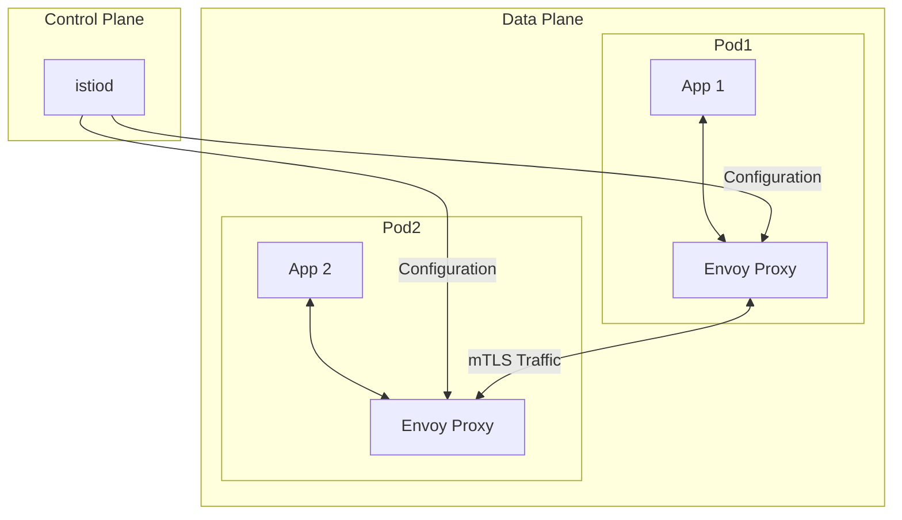

# How to Set Up Istio Service Mesh on Kubernetes

Author: [nawazdhandala](https://www.github.com/nawazdhandala)

Tags: Kubernetes, Istio, Service Mesh, Microservices, Traffic Management

Description: Learn how to install and configure Istio service mesh on Kubernetes, including sidecar injection, traffic management, and observability features for your microservices architecture.

---

Istio is a service mesh that provides traffic management, security, and observability for microservices running on Kubernetes. It works by injecting sidecar proxies (Envoy) into your Pods, which intercept all network traffic and apply policies. This guide walks through installing Istio and configuring its core features.

## Understanding Istio Architecture

Istio consists of a control plane and data plane:



- **istiod**: The control plane component that configures Envoy proxies
- **Envoy sidecar**: The data plane proxy injected into each Pod

## Installing Istio with istioctl

Download and install the Istio CLI:

```bash
# Download the latest Istio release
curl -L https://istio.io/downloadIstio | sh -

# Move to the Istio directory
cd istio-1.20.0

# Add istioctl to your PATH
export PATH=$PWD/bin:$PATH

# Verify the installation
istioctl version
```

Install Istio on your cluster using a profile:

```bash
# Install with the default profile (production-ready)
istioctl install --set profile=default -y

# Or use the demo profile for testing (includes more features)
istioctl install --set profile=demo -y

# Verify the installation
kubectl get pods -n istio-system

# Check all components are healthy
istioctl verify-install
```

## Enabling Sidecar Injection

Istio can automatically inject Envoy sidecars into Pods. Enable it per namespace:

```bash
# Enable automatic sidecar injection for a namespace
kubectl label namespace production istio-injection=enabled

# Verify the label
kubectl get namespace production --show-labels

# Restart existing deployments to inject sidecars
kubectl rollout restart deployment -n production
```

To inject sidecars manually or for specific deployments:

```yaml
# deployment-with-sidecar.yaml
apiVersion: apps/v1
kind: Deployment
metadata:
  name: api-server
  namespace: production
spec:
  replicas: 3
  selector:
    matchLabels:
      app: api-server
  template:
    metadata:
      labels:
        app: api-server
      annotations:
        # Explicitly enable sidecar injection for this pod
        sidecar.istio.io/inject: "true"
    spec:
      containers:
        - name: api
          image: myapi:1.5.0
          ports:
            - containerPort: 8080
```

## Configuring Traffic Management

Istio uses VirtualService and DestinationRule to manage traffic routing.

### Virtual Services

Virtual services define how requests are routed:

```yaml
# virtualservice.yaml
apiVersion: networking.istio.io/v1beta1
kind: VirtualService
metadata:
  name: api-server
  namespace: production
spec:
  hosts:
    - api-server  # Kubernetes service name
  http:
    # Route 90% to v1, 10% to v2 (canary)
    - match:
        - uri:
            prefix: /api
      route:
        - destination:
            host: api-server
            subset: v1
          weight: 90
        - destination:
            host: api-server
            subset: v2
          weight: 10

    # Route based on headers
    - match:
        - headers:
            x-canary:
              exact: "true"
      route:
        - destination:
            host: api-server
            subset: v2

    # Default route
    - route:
        - destination:
            host: api-server
            subset: v1
```

### Destination Rules

Destination rules define policies for traffic to a service:

```yaml
# destinationrule.yaml
apiVersion: networking.istio.io/v1beta1
kind: DestinationRule
metadata:
  name: api-server
  namespace: production
spec:
  host: api-server
  trafficPolicy:
    # Connection pool settings
    connectionPool:
      tcp:
        maxConnections: 100
      http:
        h2UpgradePolicy: UPGRADE
        http1MaxPendingRequests: 100
        http2MaxRequests: 1000

    # Load balancing configuration
    loadBalancer:
      simple: ROUND_ROBIN

    # Outlier detection (circuit breaker)
    outlierDetection:
      consecutive5xxErrors: 5
      interval: 30s
      baseEjectionTime: 30s
      maxEjectionPercent: 50

  # Define subsets for different versions
  subsets:
    - name: v1
      labels:
        version: v1
    - name: v2
      labels:
        version: v2
```

## Setting Up an Istio Gateway

Gateways expose services to external traffic:

```yaml
# gateway.yaml
apiVersion: networking.istio.io/v1beta1
kind: Gateway
metadata:
  name: api-gateway
  namespace: production
spec:
  selector:
    # Use the default Istio ingress gateway
    istio: ingressgateway
  servers:
    - port:
        number: 80
        name: http
        protocol: HTTP
      hosts:
        - "api.example.com"
    - port:
        number: 443
        name: https
        protocol: HTTPS
      hosts:
        - "api.example.com"
      tls:
        mode: SIMPLE
        credentialName: api-tls-cert  # Kubernetes secret with TLS cert
---
# virtualservice-gateway.yaml
apiVersion: networking.istio.io/v1beta1
kind: VirtualService
metadata:
  name: api-external
  namespace: production
spec:
  hosts:
    - "api.example.com"
  gateways:
    - api-gateway
  http:
    - match:
        - uri:
            prefix: /api
      route:
        - destination:
            host: api-server
            port:
              number: 8080
```

## Enabling mTLS Between Services

Istio can automatically encrypt traffic between services:

```yaml
# peerauthentication.yaml
apiVersion: security.istio.io/v1beta1
kind: PeerAuthentication
metadata:
  name: default
  namespace: production
spec:
  mtls:
    # STRICT: Only accept mTLS connections
    # PERMISSIVE: Accept both mTLS and plain text (migration mode)
    mode: STRICT
---
# Apply mTLS cluster-wide
apiVersion: security.istio.io/v1beta1
kind: PeerAuthentication
metadata:
  name: default
  namespace: istio-system  # Applies to all namespaces
spec:
  mtls:
    mode: STRICT
```

## Configuring Retries and Timeouts

Add resilience with automatic retries:

```yaml
# virtualservice-resilience.yaml
apiVersion: networking.istio.io/v1beta1
kind: VirtualService
metadata:
  name: api-server
  namespace: production
spec:
  hosts:
    - api-server
  http:
    - route:
        - destination:
            host: api-server

      # Timeout for the entire request
      timeout: 30s

      # Retry configuration
      retries:
        attempts: 3
        perTryTimeout: 10s
        retryOn: connect-failure,refused-stream,unavailable,cancelled,retriable-4xx
```

## Observability with Istio

Istio automatically collects telemetry. Install the observability stack:

```bash
# Install Kiali (service mesh dashboard)
kubectl apply -f https://raw.githubusercontent.com/istio/istio/release-1.20/samples/addons/kiali.yaml

# Install Prometheus for metrics
kubectl apply -f https://raw.githubusercontent.com/istio/istio/release-1.20/samples/addons/prometheus.yaml

# Install Grafana for dashboards
kubectl apply -f https://raw.githubusercontent.com/istio/istio/release-1.20/samples/addons/grafana.yaml

# Install Jaeger for distributed tracing
kubectl apply -f https://raw.githubusercontent.com/istio/istio/release-1.20/samples/addons/jaeger.yaml

# Access Kiali dashboard
istioctl dashboard kiali
```

## Traffic Mirroring for Testing

Mirror production traffic to a test service:

```yaml
# virtualservice-mirror.yaml
apiVersion: networking.istio.io/v1beta1
kind: VirtualService
metadata:
  name: api-server
  namespace: production
spec:
  hosts:
    - api-server
  http:
    - route:
        - destination:
            host: api-server
            subset: v1

      # Mirror 100% of traffic to v2 for testing
      # Mirrored traffic is fire-and-forget (responses are discarded)
      mirror:
        host: api-server
        subset: v2
      mirrorPercentage:
        value: 100.0
```

## Debugging Istio Issues

When traffic is not routing as expected:

```bash
# Check proxy status for all pods
istioctl proxy-status

# Analyze configuration for issues
istioctl analyze -n production

# Get detailed proxy configuration
istioctl proxy-config routes <pod-name> -n production

# Check if sidecar is injected
kubectl describe pod <pod-name> -n production | grep istio-proxy

# View Envoy access logs
kubectl logs <pod-name> -c istio-proxy -n production

# Debug connectivity between services
istioctl x describe pod <source-pod> -n production
```

## Best Practices

1. **Start with permissive mTLS**: Use `PERMISSIVE` mode during migration, then switch to `STRICT`

2. **Set resource limits for sidecars**:
```yaml
annotations:
  sidecar.istio.io/proxyCPU: "100m"
  sidecar.istio.io/proxyMemory: "128Mi"
```

3. **Exclude services that do not need mesh**: Use annotations to skip injection for databases or legacy services

4. **Monitor sidecar resource usage**: Sidecars consume CPU and memory that you need to account for

5. **Test traffic policies in staging first**: Virtual services and destination rules can break traffic if misconfigured

---

Istio transforms your Kubernetes cluster into a powerful service mesh with built-in traffic management, security, and observability. Start with the basics like mTLS and traffic routing, then gradually adopt advanced features like circuit breaking and traffic mirroring. The sidecar architecture means you get these capabilities without modifying your application code.
