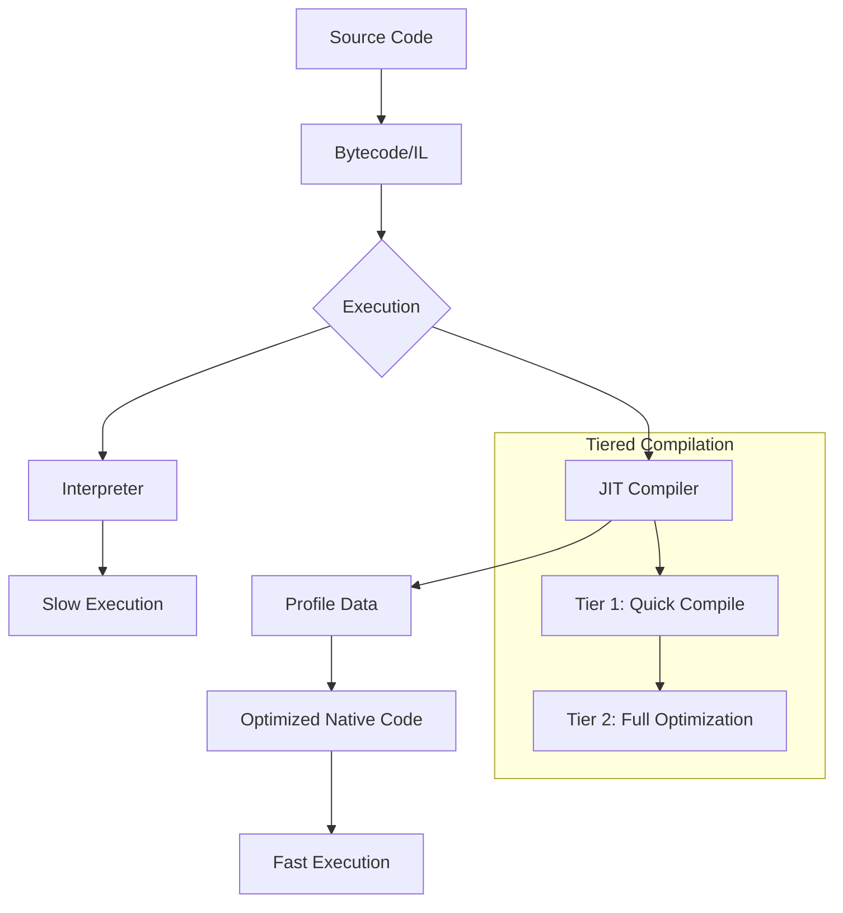

# How to Configure JIT Compilation Optimization

Author: [nawazdhandala](https://www.github.com/nawazdhandala)

Tags: JIT Compilation, Performance, Java, JVM, .NET, Optimization, Backend

Description: Learn how to configure Just-In-Time (JIT) compilation for optimal performance. This guide covers JIT basics, warmup strategies, tiered compilation, and monitoring across JVM and .NET platforms.

---

> Just-In-Time (JIT) compilation transforms bytecode into native machine code at runtime, enabling performance that can match or exceed ahead-of-time compiled languages. However, JIT compilers need time to analyze and optimize your code. Understanding and configuring JIT behavior is crucial for production performance.

This guide explains how JIT compilation works and how to configure it for optimal performance in production environments.

---

## How JIT Compilation Works



JIT compilation trades startup time for runtime performance:
- **Cold code**: Interpreted or lightly compiled
- **Warm code**: Compiled with basic optimizations
- **Hot code**: Aggressively optimized based on profiling data

---

## JVM JIT Configuration

### Tiered Compilation (Default in Modern JVMs)

```bash
# Default tiered compilation (recommended for most applications)
java -XX:+TieredCompilation -jar app.jar

# Tiered compilation levels:
# Level 0: Interpreter
# Level 1: C1 with full optimization (no profiling)
# Level 2: C1 with invocation & backedge counters
# Level 3: C1 with full profiling
# Level 4: C2 with full optimization

# View compilation activity
java -XX:+PrintCompilation -jar app.jar
```

### Compilation Thresholds

```bash
# Adjust when methods get compiled
# Default: 10000 invocations or loops for C2 compilation

# Lower threshold for faster warmup (at cost of less optimization data)
java -XX:CompileThreshold=5000 -jar app.jar

# For tiered compilation, control tier thresholds
java \
  -XX:Tier3InvocationThreshold=200 \
  -XX:Tier4InvocationThreshold=5000 \
  -jar app.jar
```

### Code Cache Configuration

```bash
# Code cache stores compiled native code
# Too small = methods get deoptimized and recompiled

# Check default code cache size
java -XX:+PrintFlagsFinal -version | grep CodeCache

# Increase code cache for large applications
java \
  -XX:InitialCodeCacheSize=64m \
  -XX:ReservedCodeCacheSize=256m \
  -XX:CodeCacheExpansionSize=64k \
  -jar app.jar

# Monitor code cache usage
java -XX:+PrintCodeCache -jar app.jar
```

### Inlining Configuration

```bash
# Inlining replaces method calls with method body
# Critical for performance but increases code size

# Default max inline size: 35 bytes
# Default max frequency inline size: 325 bytes

# Increase for more aggressive inlining
java \
  -XX:MaxInlineSize=50 \
  -XX:FreqInlineSize=400 \
  -XX:MaxInlineLevel=15 \
  -jar app.jar

# See what gets inlined
java -XX:+PrintInlining -jar app.jar
```

### GraalVM JIT Configuration

```bash
# GraalVM provides an advanced JIT compiler
# Enable Graal compiler on HotSpot
java \
  -XX:+UnlockExperimentalVMOptions \
  -XX:+UseJVMCICompiler \
  -jar app.jar

# GraalVM specific optimizations
java \
  -XX:+UnlockExperimentalVMOptions \
  -XX:+EnableJVMCI \
  -XX:+UseJVMCICompiler \
  -Dgraal.CompilerConfiguration=enterprise \
  -jar app.jar
```

---

## JVM Warmup Strategies

### Application-Level Warmup

```java
// WarmupService.java
import java.util.concurrent.ExecutorService;
import java.util.concurrent.Executors;
import java.util.concurrent.TimeUnit;
import java.util.List;
import java.util.ArrayList;

public class WarmupService {

    private final List<Runnable> warmupTasks = new ArrayList<>();

    public void registerWarmupTask(Runnable task) {
        warmupTasks.add(task);
    }

    public void warmup(int iterations) {
        System.out.println("Starting JIT warmup with " + iterations + " iterations...");
        long start = System.currentTimeMillis();

        for (int i = 0; i < iterations; i++) {
            for (Runnable task : warmupTasks) {
                try {
                    task.run();
                } catch (Exception e) {
                    // Ignore warmup errors
                }
            }

            if ((i + 1) % 1000 == 0) {
                System.out.println("Warmup progress: " + (i + 1) + "/" + iterations);
            }
        }

        long duration = System.currentTimeMillis() - start;
        System.out.println("Warmup completed in " + duration + "ms");
    }

    // Force JIT compilation by calling methods repeatedly
    public static void forceCompilation(Runnable task, int iterations) {
        for (int i = 0; i < iterations; i++) {
            task.run();
        }
    }
}

// Usage in Spring Boot
@Component
public class ApplicationWarmup implements ApplicationRunner {

    @Autowired
    private UserService userService;

    @Autowired
    private ProductService productService;

    @Override
    public void run(ApplicationArguments args) {
        WarmupService warmup = new WarmupService();

        // Register critical paths for warmup
        warmup.registerWarmupTask(() -> userService.findById(1L));
        warmup.registerWarmupTask(() -> productService.search("test"));
        warmup.registerWarmupTask(() -> productService.getTopProducts(10));

        // Run warmup iterations
        warmup.warmup(10000);
    }
}
```

### Kubernetes Warmup with Startup Probes

```yaml
# deployment.yaml
apiVersion: apps/v1
kind: Deployment
metadata:
  name: api-server
spec:
  template:
    spec:
      containers:
      - name: api
        image: api-server:latest
        ports:
        - containerPort: 8080
        # Startup probe allows time for JIT warmup
        startupProbe:
          httpGet:
            path: /health/startup
            port: 8080
          # Allow up to 5 minutes for warmup
          failureThreshold: 30
          periodSeconds: 10
        # Readiness probe - only ready after warmup
        readinessProbe:
          httpGet:
            path: /health/ready
            port: 8080
          initialDelaySeconds: 5
          periodSeconds: 5
        livenessProbe:
          httpGet:
            path: /health/live
            port: 8080
          initialDelaySeconds: 60
          periodSeconds: 10
```

```java
// HealthController.java
@RestController
@RequestMapping("/health")
public class HealthController {

    private volatile boolean warmupComplete = false;

    @GetMapping("/startup")
    public ResponseEntity<String> startup() {
        // Always return OK for startup probe
        return ResponseEntity.ok("starting");
    }

    @GetMapping("/ready")
    public ResponseEntity<String> ready() {
        if (warmupComplete) {
            return ResponseEntity.ok("ready");
        }
        return ResponseEntity.status(503).body("warming up");
    }

    @GetMapping("/live")
    public ResponseEntity<String> live() {
        return ResponseEntity.ok("alive");
    }

    public void setWarmupComplete() {
        this.warmupComplete = true;
    }
}
```

---

## .NET JIT Configuration

### Tiered Compilation in .NET

```xml
<!-- app.csproj -->
<PropertyGroup>
  <!-- Enable tiered compilation (default in .NET Core 3.0+) -->
  <TieredCompilation>true</TieredCompilation>

  <!-- Quick JIT for faster startup -->
  <TieredCompilationQuickJit>true</TieredCompilationQuickJit>

  <!-- Quick JIT for loops (trade startup for throughput) -->
  <TieredCompilationQuickJitForLoops>false</TieredCompilationQuickJitForLoops>
</PropertyGroup>
```

```bash
# Environment variables for runtime configuration
export DOTNET_TieredCompilation=1
export DOTNET_TC_QuickJit=1
export DOTNET_TC_QuickJitForLoops=0

dotnet run
```

### ReadyToRun (R2R) Compilation

```xml
<!-- app.csproj -->
<PropertyGroup>
  <!-- Pre-compile to native code for faster startup -->
  <PublishReadyToRun>true</PublishReadyToRun>

  <!-- Generate R2R images during build -->
  <PublishReadyToRunShowWarnings>true</PublishReadyToRunShowWarnings>
</PropertyGroup>
```

```bash
# Publish with ReadyToRun
dotnet publish -c Release -r linux-x64 --self-contained true /p:PublishReadyToRun=true
```

### Profile-Guided Optimization (PGO)

```xml
<!-- app.csproj -->
<PropertyGroup>
  <!-- Enable dynamic PGO -->
  <TieredPGO>true</TieredPGO>
</PropertyGroup>
```

```bash
# Environment variable
export DOTNET_TieredPGO=1
dotnet run
```

---

## Python JIT with PyPy

```bash
# PyPy is an alternative Python implementation with JIT
# Install PyPy
brew install pypy3  # macOS
apt install pypy3   # Ubuntu

# Run with PyPy instead of CPython
pypy3 app.py

# PyPy JIT settings via environment variables
export PYPYLOG=jit-log-opt:jit.log  # Log JIT optimizations
pypy3 app.py
```

### Numba JIT for Numeric Code

```python
# numba_jit.py
from numba import jit, njit, prange
import numpy as np
import time

# Basic JIT compilation
@jit(nopython=True)
def sum_array(arr):
    """JIT-compiled array sum"""
    total = 0.0
    for i in range(len(arr)):
        total += arr[i]
    return total

# Parallel JIT compilation
@njit(parallel=True)
def parallel_sum(arr):
    """Parallel JIT-compiled array sum"""
    total = 0.0
    for i in prange(len(arr)):
        total += arr[i]
    return total

# Warmup function (first call triggers compilation)
def warmup():
    """Warmup JIT-compiled functions"""
    test_arr = np.random.random(1000)

    # First call triggers compilation
    _ = sum_array(test_arr)
    _ = parallel_sum(test_arr)

    print("JIT warmup complete")

# Benchmark
def benchmark():
    arr = np.random.random(10_000_000)

    # Pure Python
    start = time.perf_counter()
    _ = sum(arr)
    python_time = time.perf_counter() - start

    # Numba JIT
    start = time.perf_counter()
    _ = sum_array(arr)
    jit_time = time.perf_counter() - start

    # Numba parallel
    start = time.perf_counter()
    _ = parallel_sum(arr)
    parallel_time = time.perf_counter() - start

    print(f"Python:   {python_time*1000:.2f}ms")
    print(f"Numba:    {jit_time*1000:.2f}ms ({python_time/jit_time:.1f}x faster)")
    print(f"Parallel: {parallel_time*1000:.2f}ms ({python_time/parallel_time:.1f}x faster)")

if __name__ == "__main__":
    warmup()
    benchmark()
```

---

## Monitoring JIT Compilation

### JVM JIT Metrics

```java
// JitMetrics.java
import java.lang.management.ManagementFactory;
import java.lang.management.CompilationMXBean;
import javax.management.MBeanServer;
import javax.management.ObjectName;

public class JitMetrics {

    public static void printCompilationStats() {
        CompilationMXBean compilationBean = ManagementFactory.getCompilationMXBean();

        if (compilationBean != null) {
            System.out.println("JIT Compiler: " + compilationBean.getName());
            System.out.println("Total compilation time: " +
                compilationBean.getTotalCompilationTime() + "ms");
        }
    }

    public static void printCodeCacheStats() {
        try {
            MBeanServer mbs = ManagementFactory.getPlatformMBeanServer();
            ObjectName name = new ObjectName("java.lang:type=MemoryPool,name=*CodeCache*");

            // Get code cache memory pools
            for (ObjectName poolName : mbs.queryNames(name, null)) {
                Object usage = mbs.getAttribute(poolName, "Usage");
                System.out.println("Code Cache: " + poolName.getKeyProperty("name"));
                System.out.println("  Usage: " + usage);
            }
        } catch (Exception e) {
            e.printStackTrace();
        }
    }
}
```

### Prometheus Metrics for JIT

```java
// JitPrometheusMetrics.java
import io.micrometer.core.instrument.MeterRegistry;
import io.micrometer.core.instrument.Gauge;
import java.lang.management.ManagementFactory;
import java.lang.management.CompilationMXBean;
import java.lang.management.MemoryPoolMXBean;
import org.springframework.stereotype.Component;

@Component
public class JitPrometheusMetrics {

    public JitPrometheusMetrics(MeterRegistry registry) {
        CompilationMXBean compilationBean = ManagementFactory.getCompilationMXBean();

        // Total JIT compilation time
        if (compilationBean != null && compilationBean.isCompilationTimeMonitoringSupported()) {
            Gauge.builder("jvm.jit.compilation.time.ms", compilationBean,
                    CompilationMXBean::getTotalCompilationTime)
                .description("Total JIT compilation time in milliseconds")
                .register(registry);
        }

        // Code cache usage
        for (MemoryPoolMXBean pool : ManagementFactory.getMemoryPoolMXBeans()) {
            if (pool.getName().contains("CodeCache") || pool.getName().contains("CodeHeap")) {
                String safeName = pool.getName().toLowerCase().replace(" ", "_");

                Gauge.builder("jvm.codecache." + safeName + ".used.bytes", pool,
                        p -> p.getUsage().getUsed())
                    .description("Code cache used bytes")
                    .register(registry);

                Gauge.builder("jvm.codecache." + safeName + ".max.bytes", pool,
                        p -> p.getUsage().getMax())
                    .description("Code cache max bytes")
                    .register(registry);
            }
        }
    }
}
```

---

## AOT Compilation Alternatives

### GraalVM Native Image

```bash
# Build native executable (no JIT needed, instant startup)
native-image -jar app.jar

# With build-time initialization
native-image \
  --initialize-at-build-time=com.myapp \
  --no-fallback \
  -H:+ReportExceptionStackTraces \
  -jar app.jar

# Spring Boot native
./mvnw -Pnative spring-boot:build-image
```

### Trade-offs: JIT vs AOT

| Aspect | JIT | AOT (Native Image) |
|--------|-----|-------------------|
| Startup time | Slow (seconds) | Fast (milliseconds) |
| Peak performance | Higher | Lower |
| Memory usage | Higher | Lower |
| Warmup needed | Yes | No |
| Reflection support | Full | Limited |
| Build time | Fast | Slow |

---

## Best Practices Summary

1. **Use tiered compilation**: Default in modern JVMs, provides good balance
2. **Size code cache**: Increase for large applications to prevent deoptimization
3. **Implement warmup**: Call critical paths before accepting traffic
4. **Use startup probes**: Give JIT time to optimize in Kubernetes
5. **Monitor metrics**: Track compilation time, code cache usage
6. **Consider AOT**: For serverless or fast startup requirements

---

## Conclusion

JIT compilation is powerful but requires understanding:

1. **Warmup is essential**: JIT needs time and data to optimize
2. **Configuration matters**: Default settings may not be optimal for your workload
3. **Monitor compilation**: Track code cache usage and compilation time
4. **Consider alternatives**: AOT compilation for specific use cases

For most applications, using default tiered compilation with proper warmup provides the best results. Tune only when you have specific performance requirements and monitoring data to guide decisions.

---

*Need to monitor your application's JIT performance? [OneUptime](https://oneuptime.com) provides JVM monitoring with compilation metrics, code cache tracking, and warmup status alerts.*
