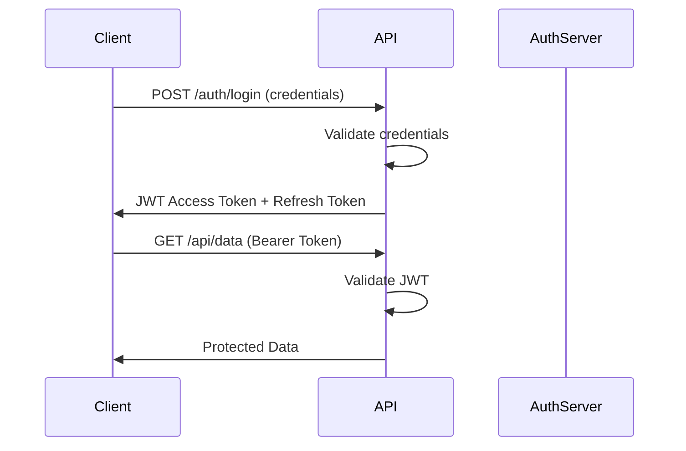

# How to Implement JWT and OAuth2 in ASP.NET Core

Author: [nawazdhandala](https://www.github.com/nawazdhandala)

Tags: ASP.NET Core, JWT, OAuth2, Authentication, Authorization, Security, .NET, C#

Description: Learn how to implement JWT authentication and OAuth2 in ASP.NET Core. This guide covers token generation, validation, refresh tokens, and integration with external OAuth2 providers like Google and GitHub.

---

Authentication and authorization are fundamental to any web application. JSON Web Tokens (JWT) provide a stateless way to authenticate users, while OAuth2 enables secure authorization with external identity providers. This guide covers how to implement both in ASP.NET Core applications.

## Understanding JWT Authentication

JWTs are self-contained tokens that carry claims about the user. The flow looks like this:



## Setting Up JWT Authentication

Install the required package:

```bash
dotnet add package Microsoft.AspNetCore.Authentication.JwtBearer
```

Configure JWT authentication in your application:

```csharp
// Program.cs
using Microsoft.AspNetCore.Authentication.JwtBearer;
using Microsoft.IdentityModel.Tokens;
using System.Text;

var builder = WebApplication.CreateBuilder(args);

// Get JWT settings from configuration
var jwtSettings = builder.Configuration.GetSection("Jwt");
var secretKey = jwtSettings["SecretKey"]!;

builder.Services.AddAuthentication(options =>
{
    options.DefaultAuthenticateScheme = JwtBearerDefaults.AuthenticationScheme;
    options.DefaultChallengeScheme = JwtBearerDefaults.AuthenticationScheme;
})
.AddJwtBearer(options =>
{
    options.TokenValidationParameters = new TokenValidationParameters
    {
        // Validate the issuer
        ValidateIssuer = true,
        ValidIssuer = jwtSettings["Issuer"],

        // Validate the audience
        ValidateAudience = true,
        ValidAudience = jwtSettings["Audience"],

        // Validate the signing key
        ValidateIssuerSigningKey = true,
        IssuerSigningKey = new SymmetricSecurityKey(Encoding.UTF8.GetBytes(secretKey)),

        // Validate token expiration
        ValidateLifetime = true,
        ClockSkew = TimeSpan.Zero  // Remove default 5-minute tolerance
    };

    // Handle authentication events
    options.Events = new JwtBearerEvents
    {
        OnAuthenticationFailed = context =>
        {
            if (context.Exception is SecurityTokenExpiredException)
            {
                context.Response.Headers["Token-Expired"] = "true";
            }
            return Task.CompletedTask;
        }
    };
});

builder.Services.AddAuthorization();
builder.Services.AddControllers();

var app = builder.Build();

app.UseAuthentication();
app.UseAuthorization();
app.MapControllers();
app.Run();
```

Add JWT settings to `appsettings.json`:

```json
{
  "Jwt": {
    "SecretKey": "your-secret-key-at-least-32-characters-long",
    "Issuer": "https://your-api.com",
    "Audience": "https://your-api.com",
    "AccessTokenExpirationMinutes": 15,
    "RefreshTokenExpirationDays": 7
  }
}
```

## Token Generation Service

Create a service to generate JWT tokens:

```csharp
public interface ITokenService
{
    string GenerateAccessToken(User user);
    RefreshToken GenerateRefreshToken();
    ClaimsPrincipal? GetPrincipalFromExpiredToken(string token);
}

public class TokenService : ITokenService
{
    private readonly IConfiguration _configuration;
    private readonly SymmetricSecurityKey _signingKey;

    public TokenService(IConfiguration configuration)
    {
        _configuration = configuration;
        var secretKey = _configuration["Jwt:SecretKey"]!;
        _signingKey = new SymmetricSecurityKey(Encoding.UTF8.GetBytes(secretKey));
    }

    public string GenerateAccessToken(User user)
    {
        var claims = new List<Claim>
        {
            new(ClaimTypes.NameIdentifier, user.Id.ToString()),
            new(ClaimTypes.Email, user.Email),
            new(ClaimTypes.Name, user.Username),
            new("tenant_id", user.TenantId?.ToString() ?? ""),
            new(JwtRegisteredClaimNames.Jti, Guid.NewGuid().ToString())
        };

        // Add user roles as claims
        foreach (var role in user.Roles)
        {
            claims.Add(new Claim(ClaimTypes.Role, role));
        }

        var credentials = new SigningCredentials(_signingKey, SecurityAlgorithms.HmacSha256);

        var expirationMinutes = int.Parse(_configuration["Jwt:AccessTokenExpirationMinutes"] ?? "15");

        var token = new JwtSecurityToken(
            issuer: _configuration["Jwt:Issuer"],
            audience: _configuration["Jwt:Audience"],
            claims: claims,
            expires: DateTime.UtcNow.AddMinutes(expirationMinutes),
            signingCredentials: credentials
        );

        return new JwtSecurityTokenHandler().WriteToken(token);
    }

    public RefreshToken GenerateRefreshToken()
    {
        var randomNumber = new byte[64];
        using var rng = RandomNumberGenerator.Create();
        rng.GetBytes(randomNumber);

        var expirationDays = int.Parse(_configuration["Jwt:RefreshTokenExpirationDays"] ?? "7");

        return new RefreshToken
        {
            Token = Convert.ToBase64String(randomNumber),
            ExpiresAt = DateTime.UtcNow.AddDays(expirationDays),
            CreatedAt = DateTime.UtcNow
        };
    }

    public ClaimsPrincipal? GetPrincipalFromExpiredToken(string token)
    {
        var tokenValidationParameters = new TokenValidationParameters
        {
            ValidateIssuer = true,
            ValidIssuer = _configuration["Jwt:Issuer"],
            ValidateAudience = true,
            ValidAudience = _configuration["Jwt:Audience"],
            ValidateIssuerSigningKey = true,
            IssuerSigningKey = _signingKey,
            ValidateLifetime = false  // Allow expired tokens for refresh
        };

        var tokenHandler = new JwtSecurityTokenHandler();

        try
        {
            var principal = tokenHandler.ValidateToken(token, tokenValidationParameters, out var securityToken);

            if (securityToken is not JwtSecurityToken jwtToken ||
                !jwtToken.Header.Alg.Equals(SecurityAlgorithms.HmacSha256, StringComparison.InvariantCultureIgnoreCase))
            {
                return null;
            }

            return principal;
        }
        catch
        {
            return null;
        }
    }
}

public class RefreshToken
{
    public string Token { get; set; } = string.Empty;
    public DateTime ExpiresAt { get; set; }
    public DateTime CreatedAt { get; set; }
    public bool IsExpired => DateTime.UtcNow >= ExpiresAt;
}
```

## Authentication Controller

Create endpoints for login and token refresh:

```csharp
[ApiController]
[Route("api/[controller]")]
public class AuthController : ControllerBase
{
    private readonly IUserService _userService;
    private readonly ITokenService _tokenService;
    private readonly IRefreshTokenRepository _refreshTokenRepository;

    public AuthController(
        IUserService userService,
        ITokenService tokenService,
        IRefreshTokenRepository refreshTokenRepository)
    {
        _userService = userService;
        _tokenService = tokenService;
        _refreshTokenRepository = refreshTokenRepository;
    }

    [HttpPost("login")]
    public async Task<ActionResult<AuthResponse>> Login(LoginRequest request)
    {
        // Validate credentials
        var user = await _userService.ValidateCredentialsAsync(request.Email, request.Password);

        if (user == null)
        {
            return Unauthorized(new { message = "Invalid email or password" });
        }

        // Generate tokens
        var accessToken = _tokenService.GenerateAccessToken(user);
        var refreshToken = _tokenService.GenerateRefreshToken();

        // Store refresh token
        await _refreshTokenRepository.SaveAsync(user.Id, refreshToken);

        return Ok(new AuthResponse
        {
            AccessToken = accessToken,
            RefreshToken = refreshToken.Token,
            ExpiresAt = DateTime.UtcNow.AddMinutes(15)
        });
    }

    [HttpPost("refresh")]
    public async Task<ActionResult<AuthResponse>> Refresh(RefreshRequest request)
    {
        // Validate the expired access token
        var principal = _tokenService.GetPrincipalFromExpiredToken(request.AccessToken);

        if (principal == null)
        {
            return Unauthorized(new { message = "Invalid access token" });
        }

        var userId = principal.FindFirst(ClaimTypes.NameIdentifier)?.Value;

        if (string.IsNullOrEmpty(userId))
        {
            return Unauthorized(new { message = "Invalid token claims" });
        }

        // Validate refresh token
        var storedRefreshToken = await _refreshTokenRepository.GetAsync(int.Parse(userId), request.RefreshToken);

        if (storedRefreshToken == null || storedRefreshToken.IsExpired)
        {
            return Unauthorized(new { message = "Invalid or expired refresh token" });
        }

        // Get user and generate new tokens
        var user = await _userService.GetByIdAsync(int.Parse(userId));

        if (user == null)
        {
            return Unauthorized(new { message = "User not found" });
        }

        var newAccessToken = _tokenService.GenerateAccessToken(user);
        var newRefreshToken = _tokenService.GenerateRefreshToken();

        // Revoke old refresh token and save new one
        await _refreshTokenRepository.RevokeAsync(int.Parse(userId), request.RefreshToken);
        await _refreshTokenRepository.SaveAsync(user.Id, newRefreshToken);

        return Ok(new AuthResponse
        {
            AccessToken = newAccessToken,
            RefreshToken = newRefreshToken.Token,
            ExpiresAt = DateTime.UtcNow.AddMinutes(15)
        });
    }

    [HttpPost("logout")]
    [Authorize]
    public async Task<IActionResult> Logout()
    {
        var userId = User.FindFirst(ClaimTypes.NameIdentifier)?.Value;

        if (!string.IsNullOrEmpty(userId))
        {
            await _refreshTokenRepository.RevokeAllAsync(int.Parse(userId));
        }

        return Ok(new { message = "Logged out successfully" });
    }
}

public record LoginRequest(string Email, string Password);
public record RefreshRequest(string AccessToken, string RefreshToken);
public record AuthResponse
{
    public string AccessToken { get; init; } = string.Empty;
    public string RefreshToken { get; init; } = string.Empty;
    public DateTime ExpiresAt { get; init; }
}
```

## Protected Endpoints

Use the `[Authorize]` attribute to protect endpoints:

```csharp
[ApiController]
[Route("api/[controller]")]
public class UsersController : ControllerBase
{
    private readonly IUserService _userService;

    public UsersController(IUserService userService)
    {
        _userService = userService;
    }

    // Requires authentication
    [HttpGet("me")]
    [Authorize]
    public async Task<ActionResult<UserDto>> GetCurrentUser()
    {
        var userId = User.FindFirst(ClaimTypes.NameIdentifier)?.Value;
        var user = await _userService.GetByIdAsync(int.Parse(userId!));

        return Ok(new UserDto(user!.Id, user.Username, user.Email));
    }

    // Requires specific role
    [HttpGet]
    [Authorize(Roles = "Admin")]
    public async Task<ActionResult<IEnumerable<UserDto>>> GetAllUsers()
    {
        var users = await _userService.GetAllAsync();
        return Ok(users.Select(u => new UserDto(u.Id, u.Username, u.Email)));
    }

    // Requires custom policy
    [HttpDelete("{id}")]
    [Authorize(Policy = "CanDeleteUsers")]
    public async Task<IActionResult> DeleteUser(int id)
    {
        await _userService.DeleteAsync(id);
        return NoContent();
    }
}
```

## Authorization Policies

Configure custom authorization policies:

```csharp
// Program.cs
builder.Services.AddAuthorization(options =>
{
    // Role-based policy
    options.AddPolicy("AdminOnly", policy =>
        policy.RequireRole("Admin"));

    // Claim-based policy
    options.AddPolicy("CanDeleteUsers", policy =>
        policy.RequireClaim("permission", "users:delete"));

    // Custom requirement policy
    options.AddPolicy("TenantAccess", policy =>
        policy.Requirements.Add(new TenantAccessRequirement()));
});

// Register authorization handler
builder.Services.AddScoped<IAuthorizationHandler, TenantAccessHandler>();
```

Create custom authorization requirements:

```csharp
public class TenantAccessRequirement : IAuthorizationRequirement { }

public class TenantAccessHandler : AuthorizationHandler<TenantAccessRequirement>
{
    private readonly IHttpContextAccessor _httpContextAccessor;

    public TenantAccessHandler(IHttpContextAccessor httpContextAccessor)
    {
        _httpContextAccessor = httpContextAccessor;
    }

    protected override Task HandleRequirementAsync(
        AuthorizationHandlerContext context,
        TenantAccessRequirement requirement)
    {
        var userTenantId = context.User.FindFirst("tenant_id")?.Value;

        // Get requested tenant from route
        var httpContext = _httpContextAccessor.HttpContext;
        var requestedTenantId = httpContext?.Request.RouteValues["tenantId"]?.ToString();

        if (!string.IsNullOrEmpty(userTenantId) && userTenantId == requestedTenantId)
        {
            context.Succeed(requirement);
        }

        return Task.CompletedTask;
    }
}
```

## OAuth2 with External Providers

Add OAuth2 authentication with providers like Google and GitHub:

```bash
dotnet add package Microsoft.AspNetCore.Authentication.Google
dotnet add package AspNet.Security.OAuth.GitHub
```

Configure external authentication:

```csharp
// Program.cs
builder.Services.AddAuthentication(options =>
{
    options.DefaultAuthenticateScheme = JwtBearerDefaults.AuthenticationScheme;
    options.DefaultChallengeScheme = JwtBearerDefaults.AuthenticationScheme;
})
.AddJwtBearer(options => { /* JWT configuration */ })
.AddGoogle(options =>
{
    options.ClientId = builder.Configuration["OAuth:Google:ClientId"]!;
    options.ClientSecret = builder.Configuration["OAuth:Google:ClientSecret"]!;
    options.Scope.Add("profile");
    options.Scope.Add("email");
})
.AddGitHub(options =>
{
    options.ClientId = builder.Configuration["OAuth:GitHub:ClientId"]!;
    options.ClientSecret = builder.Configuration["OAuth:GitHub:ClientSecret"]!;
    options.Scope.Add("user:email");
});
```

Handle OAuth2 callbacks:

```csharp
[ApiController]
[Route("api/[controller]")]
public class OAuthController : ControllerBase
{
    private readonly IUserService _userService;
    private readonly ITokenService _tokenService;
    private readonly IRefreshTokenRepository _refreshTokenRepository;

    public OAuthController(
        IUserService userService,
        ITokenService tokenService,
        IRefreshTokenRepository refreshTokenRepository)
    {
        _userService = userService;
        _tokenService = tokenService;
        _refreshTokenRepository = refreshTokenRepository;
    }

    [HttpGet("google")]
    public IActionResult GoogleLogin([FromQuery] string returnUrl = "/")
    {
        var properties = new AuthenticationProperties
        {
            RedirectUri = Url.Action(nameof(GoogleCallback), new { returnUrl }),
            Items = { { "scheme", "Google" } }
        };

        return Challenge(properties, "Google");
    }

    [HttpGet("google/callback")]
    public async Task<IActionResult> GoogleCallback([FromQuery] string returnUrl = "/")
    {
        var result = await HttpContext.AuthenticateAsync("Google");

        if (!result.Succeeded)
        {
            return Unauthorized(new { message = "Google authentication failed" });
        }

        // Extract user info from claims
        var email = result.Principal.FindFirst(ClaimTypes.Email)?.Value;
        var name = result.Principal.FindFirst(ClaimTypes.Name)?.Value;
        var googleId = result.Principal.FindFirst(ClaimTypes.NameIdentifier)?.Value;

        // Find or create user
        var user = await _userService.FindOrCreateOAuthUserAsync(new OAuthUserInfo
        {
            Provider = "Google",
            ProviderId = googleId!,
            Email = email!,
            Name = name!
        });

        // Generate tokens
        var accessToken = _tokenService.GenerateAccessToken(user);
        var refreshToken = _tokenService.GenerateRefreshToken();

        await _refreshTokenRepository.SaveAsync(user.Id, refreshToken);

        // Redirect with tokens (in production, use a more secure method)
        return Redirect($"{returnUrl}?access_token={accessToken}&refresh_token={refreshToken.Token}");
    }

    [HttpGet("github")]
    public IActionResult GitHubLogin([FromQuery] string returnUrl = "/")
    {
        var properties = new AuthenticationProperties
        {
            RedirectUri = Url.Action(nameof(GitHubCallback), new { returnUrl })
        };

        return Challenge(properties, "GitHub");
    }

    [HttpGet("github/callback")]
    public async Task<IActionResult> GitHubCallback([FromQuery] string returnUrl = "/")
    {
        var result = await HttpContext.AuthenticateAsync("GitHub");

        if (!result.Succeeded)
        {
            return Unauthorized(new { message = "GitHub authentication failed" });
        }

        var email = result.Principal.FindFirst(ClaimTypes.Email)?.Value;
        var name = result.Principal.FindFirst(ClaimTypes.Name)?.Value;
        var githubId = result.Principal.FindFirst(ClaimTypes.NameIdentifier)?.Value;

        var user = await _userService.FindOrCreateOAuthUserAsync(new OAuthUserInfo
        {
            Provider = "GitHub",
            ProviderId = githubId!,
            Email = email!,
            Name = name!
        });

        var accessToken = _tokenService.GenerateAccessToken(user);
        var refreshToken = _tokenService.GenerateRefreshToken();

        await _refreshTokenRepository.SaveAsync(user.Id, refreshToken);

        return Redirect($"{returnUrl}?access_token={accessToken}&refresh_token={refreshToken.Token}");
    }
}
```

## Token Validation Middleware

Add custom middleware for additional token validation:

```csharp
public class TokenValidationMiddleware
{
    private readonly RequestDelegate _next;

    public TokenValidationMiddleware(RequestDelegate next)
    {
        _next = next;
    }

    public async Task InvokeAsync(HttpContext context, ITokenBlacklistService blacklistService)
    {
        if (context.User.Identity?.IsAuthenticated == true)
        {
            var jti = context.User.FindFirst(JwtRegisteredClaimNames.Jti)?.Value;

            if (!string.IsNullOrEmpty(jti) && await blacklistService.IsBlacklistedAsync(jti))
            {
                context.Response.StatusCode = 401;
                await context.Response.WriteAsJsonAsync(new { message = "Token has been revoked" });
                return;
            }
        }

        await _next(context);
    }
}
```

## Security Best Practices

Follow these guidelines for secure JWT implementation:

```csharp
public static class JwtSecurityBestPractices
{
    public static void ConfigureSecureJwt(this IServiceCollection services, IConfiguration configuration)
    {
        // Use strong secret keys (at least 256 bits for HMAC-SHA256)
        var secretKey = configuration["Jwt:SecretKey"];

        if (string.IsNullOrEmpty(secretKey) || secretKey.Length < 32)
        {
            throw new InvalidOperationException("JWT secret key must be at least 32 characters");
        }

        // Short access token lifetime (15-60 minutes)
        var accessTokenMinutes = int.Parse(configuration["Jwt:AccessTokenExpirationMinutes"] ?? "15");

        if (accessTokenMinutes > 60)
        {
            throw new InvalidOperationException("Access token lifetime should not exceed 60 minutes");
        }

        services.AddAuthentication(JwtBearerDefaults.AuthenticationScheme)
            .AddJwtBearer(options =>
            {
                options.TokenValidationParameters = new TokenValidationParameters
                {
                    ValidateIssuer = true,
                    ValidateAudience = true,
                    ValidateIssuerSigningKey = true,
                    ValidateLifetime = true,
                    ClockSkew = TimeSpan.Zero,  // No tolerance for expiration
                    ValidIssuer = configuration["Jwt:Issuer"],
                    ValidAudience = configuration["Jwt:Audience"],
                    IssuerSigningKey = new SymmetricSecurityKey(Encoding.UTF8.GetBytes(secretKey))
                };

                // Secure cookie options for refresh tokens
                options.Events = new JwtBearerEvents
                {
                    OnMessageReceived = context =>
                    {
                        // Allow token from cookie as fallback
                        if (string.IsNullOrEmpty(context.Token))
                        {
                            context.Token = context.Request.Cookies["access_token"];
                        }
                        return Task.CompletedTask;
                    }
                };
            });
    }
}
```

## Summary

| Component | Purpose |
|-----------|---------|
| **Access Token** | Short-lived JWT for API authentication (15-60 min) |
| **Refresh Token** | Long-lived token for obtaining new access tokens |
| **Claims** | User identity and permissions embedded in token |
| **Authorization Policies** | Fine-grained access control |
| **OAuth2 Providers** | External authentication (Google, GitHub, etc.) |

JWT authentication provides a stateless, scalable approach to securing your ASP.NET Core APIs. Combined with OAuth2 for external providers, you can offer users multiple authentication options while maintaining security. Keep access tokens short-lived, always validate tokens on every request, and implement refresh token rotation to maintain security.

Remember to store secrets securely using Azure Key Vault or similar services in production, and never expose your JWT secret key in source control or client-side code.
