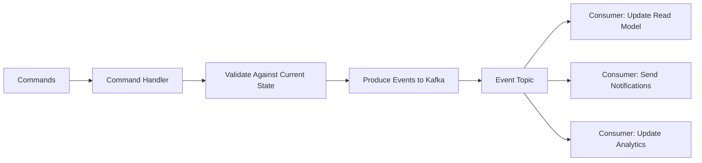

# How to Build Event-Sourced Apps with Kafka

Author: [nawazdhandala](https://www.github.com/nawazdhandala)

Tags: Kafka, Event Sourcing, Microservices, Architecture, Stream Processing

Description: Learn how to implement event sourcing patterns with Apache Kafka, including event store design, aggregate reconstruction, and snapshot strategies for scalable applications.

---

Event sourcing flips traditional data persistence on its head. Instead of storing the current state, you store every change that led to that state. Kafka excels at this pattern because it was built from the ground up as a distributed, append-only log.

## Why Event Sourcing?

Traditional CRUD applications overwrite data. When you update a user's email, the old email disappears. Event sourcing keeps the full history:

- **Auditability**: Every change is recorded with timestamps
- **Debugging**: Replay events to understand how a bug occurred
- **Temporal Queries**: Answer "what was the state at 3pm yesterday?"
- **Decoupling**: Multiple consumers can build different views from the same events

## Event Store Architecture with Kafka

Kafka topics serve as your event store. Each aggregate type gets its own topic, and events are keyed by aggregate ID to ensure ordering.



## Defining Events

Events should be immutable facts about what happened. Use past tense naming and include all relevant data.

```java
// Define events as immutable records
// Each event captures a fact that happened in the system
public record OrderCreated(
    String orderId,
    String customerId,
    List<LineItem> items,
    BigDecimal totalAmount,
    Instant createdAt
) implements OrderEvent {}

public record OrderShipped(
    String orderId,
    String trackingNumber,
    String carrier,
    Instant shippedAt
) implements OrderEvent {}

public record OrderCancelled(
    String orderId,
    String reason,
    String cancelledBy,
    Instant cancelledAt
) implements OrderEvent {}

// Sealed interface ensures we handle all event types
public sealed interface OrderEvent
    permits OrderCreated, OrderShipped, OrderCancelled {
    String orderId();
}
```

## Producing Events to Kafka

Events must be serialized consistently. Avro or Protobuf with a schema registry prevents versioning headaches down the road.

```java
@Service
public class OrderEventProducer {

    private final KafkaTemplate<String, OrderEvent> kafkaTemplate;
    private static final String TOPIC = "order-events";

    public OrderEventProducer(KafkaTemplate<String, OrderEvent> kafkaTemplate) {
        this.kafkaTemplate = kafkaTemplate;
    }

    // Key by orderId to guarantee ordering for each order
    // All events for the same order go to the same partition
    public CompletableFuture<SendResult<String, OrderEvent>> publish(OrderEvent event) {
        ProducerRecord<String, OrderEvent> record = new ProducerRecord<>(
            TOPIC,
            event.orderId(),  // Partition key ensures ordering per aggregate
            event
        );

        // Add metadata headers for debugging and tracing
        record.headers()
            .add("event-type", event.getClass().getSimpleName().getBytes())
            .add("event-time", event.createdAt().toString().getBytes());

        return kafkaTemplate.send(record);
    }
}
```

## Rebuilding State from Events

The aggregate reconstructs its state by replaying events. This is the core of event sourcing.

```java
public class Order {
    private String orderId;
    private OrderStatus status;
    private List<LineItem> items;
    private BigDecimal totalAmount;
    private String trackingNumber;

    // Private constructor - state comes only from events
    private Order() {
        this.items = new ArrayList<>();
        this.status = OrderStatus.UNKNOWN;
    }

    // Factory method that rebuilds state from event history
    public static Order fromEvents(List<OrderEvent> events) {
        Order order = new Order();
        for (OrderEvent event : events) {
            order.apply(event);
        }
        return order;
    }

    // Each event type modifies state in a specific way
    // This method must be deterministic - same events always produce same state
    private void apply(OrderEvent event) {
        switch (event) {
            case OrderCreated e -> {
                this.orderId = e.orderId();
                this.items = new ArrayList<>(e.items());
                this.totalAmount = e.totalAmount();
                this.status = OrderStatus.CREATED;
            }
            case OrderShipped e -> {
                this.trackingNumber = e.trackingNumber();
                this.status = OrderStatus.SHIPPED;
            }
            case OrderCancelled e -> {
                this.status = OrderStatus.CANCELLED;
            }
        }
    }

    // Command handlers validate and return new events
    public OrderShipped ship(String trackingNumber, String carrier) {
        if (status != OrderStatus.CREATED) {
            throw new IllegalStateException("Cannot ship order in status: " + status);
        }
        return new OrderShipped(orderId, trackingNumber, carrier, Instant.now());
    }
}
```

## Event Store Repository

The repository fetches events from Kafka and rebuilds aggregates.

```java
@Repository
public class OrderRepository {

    private final Consumer<String, OrderEvent> consumer;
    private final OrderEventProducer producer;

    // Fetch all events for a specific order from Kafka
    // This reads from the beginning of the partition for the given key
    public Order findById(String orderId) {
        // Assign to the partition containing this order's events
        TopicPartition partition = findPartitionForKey(orderId);
        consumer.assign(List.of(partition));
        consumer.seekToBeginning(List.of(partition));

        List<OrderEvent> events = new ArrayList<>();

        // Read all events, filtering by orderId
        while (true) {
            ConsumerRecords<String, OrderEvent> records =
                consumer.poll(Duration.ofMillis(100));

            if (records.isEmpty()) break;

            for (ConsumerRecord<String, OrderEvent> record : records) {
                if (record.key().equals(orderId)) {
                    events.add(record.value());
                }
            }
        }

        if (events.isEmpty()) {
            throw new OrderNotFoundException(orderId);
        }

        return Order.fromEvents(events);
    }

    // Save new events to Kafka
    public void save(Order order, List<OrderEvent> newEvents) {
        for (OrderEvent event : newEvents) {
            producer.publish(event).join();  // Wait for acknowledgment
        }
    }
}
```

## Snapshots for Performance

Replaying thousands of events is slow. Snapshots store periodic checkpoints.

```java
@Service
public class OrderSnapshotService {

    private final Map<String, OrderSnapshot> snapshots = new ConcurrentHashMap<>();
    private static final int SNAPSHOT_INTERVAL = 100;  // Snapshot every 100 events

    // Snapshot captures state at a point in time
    public record OrderSnapshot(
        Order state,
        long lastEventOffset,
        Instant snapshotTime
    ) {}

    // Rebuild using snapshot plus subsequent events
    public Order loadOrder(String orderId, Consumer<String, OrderEvent> consumer) {
        OrderSnapshot snapshot = snapshots.get(orderId);

        List<OrderEvent> events;
        if (snapshot != null) {
            // Start reading after the snapshot offset
            events = readEventsAfterOffset(orderId, snapshot.lastEventOffset(), consumer);
            Order order = snapshot.state();

            // Apply only the events after the snapshot
            for (OrderEvent event : events) {
                order.apply(event);
            }
            return order;
        } else {
            // No snapshot - replay all events
            events = readAllEvents(orderId, consumer);
            return Order.fromEvents(events);
        }
    }

    // Create snapshot after processing events
    public void maybeSnapshot(Order order, long currentOffset, int eventCount) {
        if (eventCount % SNAPSHOT_INTERVAL == 0) {
            snapshots.put(order.getOrderId(),
                new OrderSnapshot(order.copy(), currentOffset, Instant.now()));
        }
    }
}
```

## Building Read Models

Event sourcing separates write and read models. Consumers build optimized read views.

```java
@Component
public class OrderSearchProjection {

    private final ElasticsearchClient esClient;

    // Consumer builds a denormalized search index
    @KafkaListener(topics = "order-events", groupId = "order-search-projection")
    public void onEvent(OrderEvent event) {
        switch (event) {
            case OrderCreated e -> {
                // Index new order for search
                esClient.index(i -> i
                    .index("orders")
                    .id(e.orderId())
                    .document(Map.of(
                        "orderId", e.orderId(),
                        "customerId", e.customerId(),
                        "totalAmount", e.totalAmount(),
                        "status", "CREATED",
                        "createdAt", e.createdAt()
                    ))
                );
            }
            case OrderShipped e -> {
                // Update status in search index
                esClient.update(u -> u
                    .index("orders")
                    .id(e.orderId())
                    .doc(Map.of(
                        "status", "SHIPPED",
                        "trackingNumber", e.trackingNumber()
                    ))
                );
            }
            case OrderCancelled e -> {
                esClient.update(u -> u
                    .index("orders")
                    .id(e.orderId())
                    .doc(Map.of("status", "CANCELLED"))
                );
            }
        }
    }
}
```

## Handling Schema Evolution

Events are forever. Plan for schema changes from day one.

```json
{
  "type": "record",
  "name": "OrderCreated",
  "namespace": "com.example.events",
  "fields": [
    {"name": "orderId", "type": "string"},
    {"name": "customerId", "type": "string"},
    {"name": "totalAmount", "type": "double"},
    {"name": "currency", "type": "string", "default": "USD"},
    {"name": "createdAt", "type": "long", "logicalType": "timestamp-millis"}
  ]
}
```

Rules for safe evolution:
- Add new fields with defaults
- Never remove or rename fields
- Never change field types
- Use schema registry with compatibility checks

## Topic Configuration for Event Stores

Configure Kafka topics appropriately for event sourcing workloads.

```bash
# Create topic with infinite retention - events are never deleted
kafka-topics.sh --create \
  --topic order-events \
  --bootstrap-server localhost:9092 \
  --partitions 12 \
  --replication-factor 3 \
  --config retention.ms=-1 \
  --config cleanup.policy=delete \
  --config min.insync.replicas=2
```

Key settings:
- `retention.ms=-1`: Keep events forever
- `cleanup.policy=delete`: Do not compact (we need full history)
- `min.insync.replicas=2`: Durability guarantee

---

Event sourcing with Kafka gives you a reliable, scalable foundation for systems that need full audit trails and temporal queries. The trade-off is increased complexity in rebuilding state and managing schema evolution. Start with clear event definitions, plan for snapshots early, and use schema registry from the beginning. The investment pays off when you need to debug production issues or build new features from historical data.
