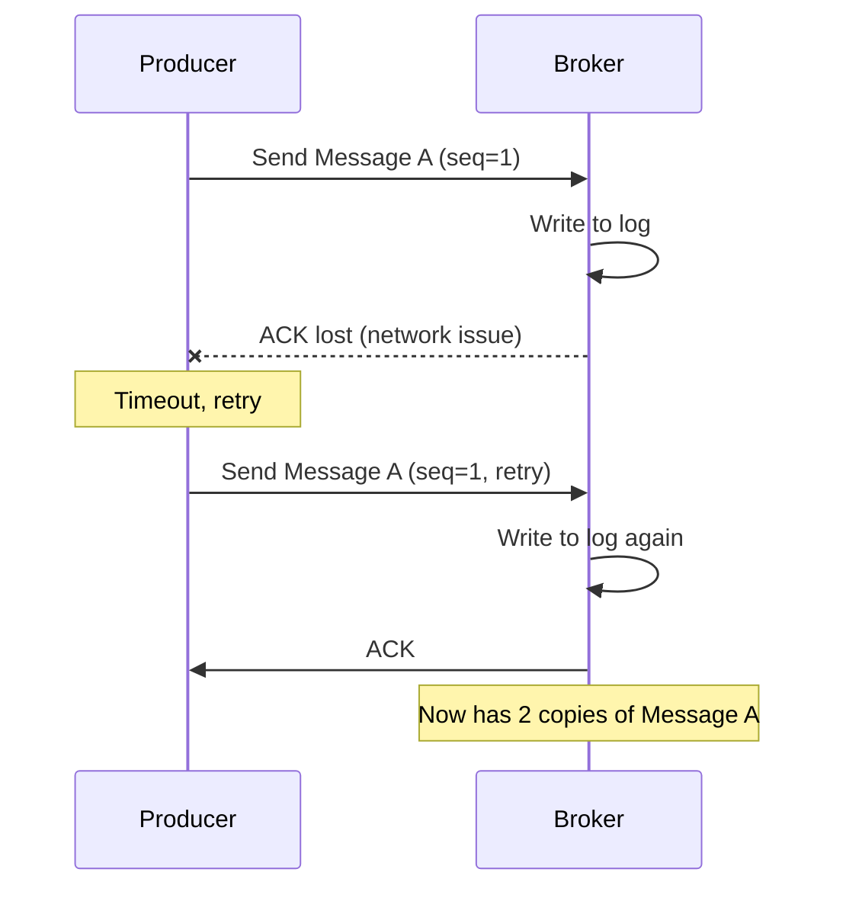
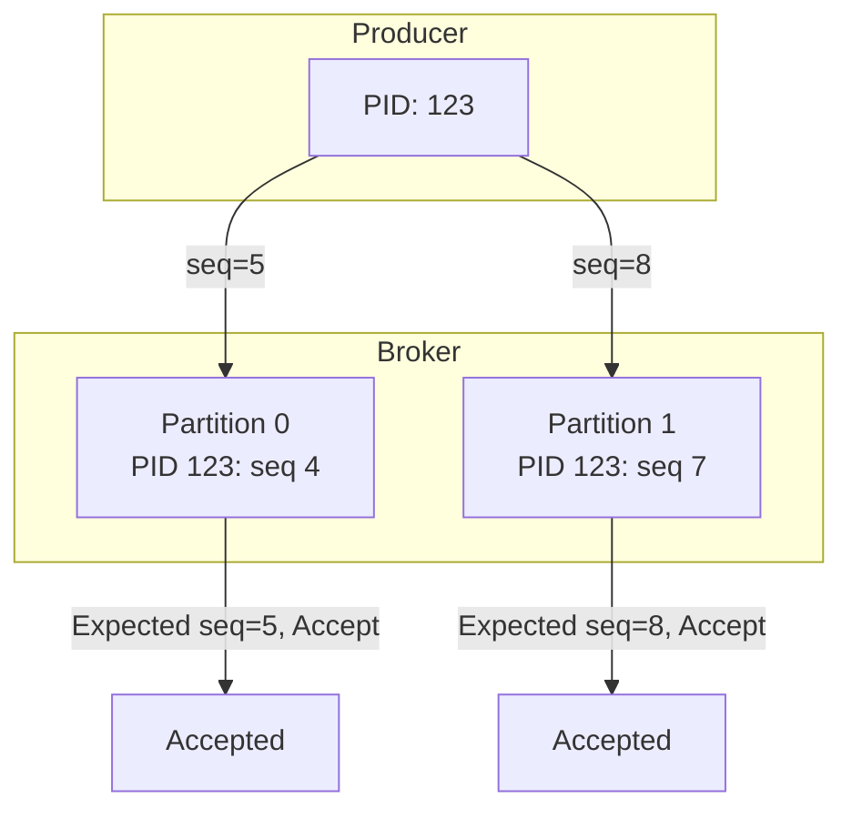

# How to Prevent Duplicates with Idempotent Producers in Kafka

Author: [nawazdhandala](https://www.github.com/nawazdhandala)

Tags: Kafka, Idempotence, Exactly-Once, Data Quality, Reliability

Description: Configure Kafka idempotent producers to eliminate duplicate messages caused by retries, ensuring exactly-once delivery semantics.

---

Network failures and retries cause duplicates. A producer sends a message, the broker writes it, but the acknowledgment gets lost. The producer retries, and now you have two copies of the same message. Idempotent producers solve this by making retries safe.

## The Duplicate Problem

Without idempotency, this sequence creates duplicates:



## Enabling Idempotent Producer

A single configuration change enables idempotency.

```java
Properties props = new Properties();
props.put("bootstrap.servers", "localhost:9092");
props.put("key.serializer", StringSerializer.class.getName());
props.put("value.serializer", StringSerializer.class.getName());

// Enable idempotent producer
props.put("enable.idempotence", "true");

// These are automatically set when idempotence is enabled:
// acks=all (required for idempotence)
// retries=Integer.MAX_VALUE (safe to retry indefinitely)
// max.in.flight.requests.per.connection=5 (ordering guaranteed)

KafkaProducer<String, String> producer = new KafkaProducer<>(props);
```

When `enable.idempotence=true`, Kafka:
- Assigns each producer a unique Producer ID (PID)
- Tracks sequence numbers per partition
- Deduplicates retried messages automatically

## How Idempotence Works

The broker tracks sequence numbers for each producer/partition combination.



If a retry arrives with an already-seen sequence number, the broker acknowledges it without writing again.

## Configuration Requirements

Certain settings are mandatory for idempotent producers.

```java
Properties props = new Properties();
props.put("bootstrap.servers", "localhost:9092");

// Required: idempotence flag
props.put("enable.idempotence", "true");

// Required: acks must be "all" (set automatically)
// You can set it explicitly for clarity
props.put("acks", "all");

// Recommended: configure retries and timeouts
props.put("retries", Integer.MAX_VALUE);  // Set automatically
props.put("delivery.timeout.ms", "120000");  // 2 minutes total
props.put("request.timeout.ms", "30000");  // 30 seconds per request
props.put("retry.backoff.ms", "100");  // Wait between retries

// Optional but recommended: limit in-flight requests
// Values 1-5 maintain ordering with idempotence
props.put("max.in.flight.requests.per.connection", "5");

KafkaProducer<String, String> producer = new KafkaProducer<>(props);
```

## Handling Producer Failures

Idempotence protects against broker-side retries, but producer restarts need special handling.

```java
@Service
public class ResilientProducer {

    private KafkaProducer<String, String> producer;

    @PostConstruct
    public void init() {
        producer = createProducer();
    }

    private KafkaProducer<String, String> createProducer() {
        Properties props = new Properties();
        props.put("bootstrap.servers", "localhost:9092");
        props.put("enable.idempotence", "true");
        props.put("acks", "all");
        // Transactional ID enables recovery across restarts
        props.put("transactional.id", "order-producer-1");

        KafkaProducer<String, String> p = new KafkaProducer<>(props);
        p.initTransactions();
        return p;
    }

    public void sendWithExactlyOnce(String topic, String key, String value) {
        try {
            producer.beginTransaction();
            producer.send(new ProducerRecord<>(topic, key, value));
            producer.commitTransaction();
        } catch (ProducerFencedException e) {
            // Another producer with same transactional.id took over
            // This instance should shut down
            producer.close();
            throw e;
        } catch (KafkaException e) {
            producer.abortTransaction();
            throw e;
        }
    }
}
```

## Verifying Idempotence

Confirm your producer is configured correctly.

```java
public class IdempotenceVerifier {

    public void verify(KafkaProducer<?, ?> producer) {
        // Check metrics that indicate idempotent mode
        Map<MetricName, ? extends Metric> metrics = producer.metrics();

        metrics.forEach((name, metric) -> {
            if (name.name().equals("record-error-total")) {
                // Should be 0 if idempotence is working
                System.out.println("Record errors: " + metric.metricValue());
            }
            if (name.name().equals("produce-throttle-time-avg")) {
                System.out.println("Throttle time: " + metric.metricValue());
            }
        });
    }

    // Test by producing duplicates intentionally
    public void testIdempotence() throws Exception {
        Properties props = new Properties();
        props.put("bootstrap.servers", "localhost:9092");
        props.put("enable.idempotence", "true");

        try (KafkaProducer<String, String> producer =
                 new KafkaProducer<>(props)) {

            String testKey = "test-" + System.currentTimeMillis();
            String testValue = "duplicate-test";

            // Produce same message multiple times rapidly
            for (int i = 0; i < 10; i++) {
                producer.send(new ProducerRecord<>("test-topic", testKey, testValue));
            }
            producer.flush();
        }

        // Count messages with testKey - should be 10 even with retries
        // If duplicates occurred, count would be higher
    }
}
```

## Transactions for Exactly-Once

For complete exactly-once semantics (produce + consume atomically), use transactions.

```java
@Service
public class ExactlyOnceProcessor {

    private final KafkaProducer<String, String> producer;
    private final KafkaConsumer<String, String> consumer;

    public ExactlyOnceProcessor() {
        // Producer with transactional ID
        Properties producerProps = new Properties();
        producerProps.put("bootstrap.servers", "localhost:9092");
        producerProps.put("enable.idempotence", "true");
        producerProps.put("transactional.id", "processor-1");

        producer = new KafkaProducer<>(producerProps);
        producer.initTransactions();

        // Consumer with isolation level
        Properties consumerProps = new Properties();
        consumerProps.put("bootstrap.servers", "localhost:9092");
        consumerProps.put("group.id", "processor-group");
        // Only read committed messages
        consumerProps.put("isolation.level", "read_committed");
        consumerProps.put("enable.auto.commit", "false");

        consumer = new KafkaConsumer<>(consumerProps);
    }

    public void processExactlyOnce() {
        consumer.subscribe(List.of("input-topic"));

        while (true) {
            ConsumerRecords<String, String> records =
                consumer.poll(Duration.ofMillis(100));

            if (records.isEmpty()) continue;

            try {
                producer.beginTransaction();

                for (ConsumerRecord<String, String> record : records) {
                    // Process and produce to output
                    String result = process(record.value());
                    producer.send(new ProducerRecord<>(
                        "output-topic", record.key(), result));
                }

                // Commit consumer offsets as part of transaction
                producer.sendOffsetsToTransaction(
                    getOffsets(records),
                    consumer.groupMetadata()
                );

                producer.commitTransaction();

            } catch (Exception e) {
                producer.abortTransaction();
                // Reset consumer to last committed offset
                consumer.seekToBeginning(consumer.assignment());
            }
        }
    }

    private Map<TopicPartition, OffsetAndMetadata> getOffsets(
            ConsumerRecords<String, String> records) {
        Map<TopicPartition, OffsetAndMetadata> offsets = new HashMap<>();

        for (TopicPartition partition : records.partitions()) {
            List<ConsumerRecord<String, String>> partitionRecords =
                records.records(partition);
            long lastOffset = partitionRecords.get(
                partitionRecords.size() - 1).offset();
            offsets.put(partition, new OffsetAndMetadata(lastOffset + 1));
        }

        return offsets;
    }
}
```

## Performance Impact

Idempotence adds minimal overhead.

```
Benchmark (messages/sec):
- Without idempotence: 850,000
- With idempotence:    820,000
- Overhead:            ~3.5%
```

The broker maintains a small in-memory map of recent sequence numbers per producer. Memory usage is bounded by `max.in.flight.requests.per.connection`.

## Common Issues

**OutOfOrderSequenceException**: Sequence numbers arrived out of order. Usually caused by:
- Multiple producers with same transactional.id
- Network partitions during transaction

```java
try {
    producer.send(record).get();
} catch (ExecutionException e) {
    if (e.getCause() instanceof OutOfOrderSequenceException) {
        // Producer state corrupted - create new producer instance
        producer.close();
        producer = createProducer();
    }
}
```

**ProducerFencedException**: Another producer took over your transactional.id.

```java
try {
    producer.commitTransaction();
} catch (ProducerFencedException e) {
    // This producer is no longer valid
    // Shut down gracefully
    producer.close();
    System.exit(1);
}
```

## Broker Configuration

Ensure brokers support idempotent producers.

```properties
# server.properties

# Enable idempotent producers (default since Kafka 3.0)
enable.idempotence=true

# Max time to remember producer IDs (default 7 days)
transactional.id.expiration.ms=604800000

# Max sequence numbers cached per producer
producer.id.expiration.check.interval.ms=600000
```

---

Idempotent producers eliminate duplicates with one configuration flag. For simple produce-only workflows, `enable.idempotence=true` is sufficient. For consume-process-produce patterns, add transactions with `transactional.id`. The performance cost is negligible compared to the data quality benefits. Enable idempotence by default and only disable it when you have a specific reason to accept duplicates.
