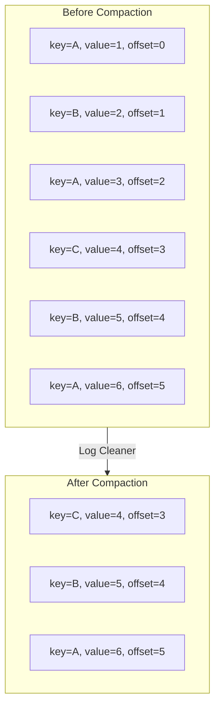

# How to Keep Latest Values with Log Compaction in Kafka

Author: [nawazdhandala](https://www.github.com/nawazdhandala)

Tags: Kafka, Log Compaction, Data Management, State Store, Event Streaming

Description: Use Kafka log compaction to maintain the latest state per key, reducing storage while preserving the most recent value for each record.

---

Kafka topics use time- or size-based delete retention by default. Log compaction offers an alternative: keep at least the most recent value for each key. This pattern is perfect for changelog topics, state stores, and any scenario where you care about current state rather than complete history.

## How Log Compaction Works

The log cleaner periodically scans topic segments and removes older records with the same key, keeping only the latest.



Key points:
- Offsets are preserved (no reordering)
- Older records for duplicate keys are removed within each partition
- Recent segments are untouched (active segment never compacted)

## Creating a Compacted Topic

Configure cleanup.policy to enable compaction.

```bash
# Create a compacted topic

kafka-topics.sh --create \
  --topic user-profiles \
  --bootstrap-server localhost:9092 \
  --partitions 12 \
  --replication-factor 3 \
  --config cleanup.policy=compact \
  --config min.cleanable.dirty.ratio=0.5 \
  --config segment.ms=86400000 \
  --config delete.retention.ms=86400000
```

Configuration explained:
- `cleanup.policy=compact`: Enable compaction (vs `delete` or `compact,delete`)
- `min.cleanable.dirty.ratio=0.5`: Compact when the dirty ratio threshold is met
- `segment.ms`: Roll segments daily
- `delete.retention.ms`: Keep tombstones for 24 hours before removal

## Modifying Existing Topics

Change an existing topic to use compaction.

```bash
# Switch from delete to compact policy
kafka-configs.sh --alter \
  --entity-type topics \
  --entity-name user-profiles \
  --bootstrap-server localhost:9092 \
  --add-config cleanup.policy=compact

# Verify the change
kafka-configs.sh --describe \
  --entity-type topics \
  --entity-name user-profiles \
  --bootstrap-server localhost:9092
```

## Use Case: User Profile Store

Compacted topics work well as a distributed key-value store.

```java
@Service
public class UserProfileProducer {

    private final KafkaTemplate<String, UserProfile> kafkaTemplate;

    // Each update replaces the previous profile for this user
    public void updateProfile(String userId, UserProfile profile) {
        // Key is userId - compaction keeps latest profile per user
        kafkaTemplate.send("user-profiles", userId, profile);
    }

    // To delete a user, send a tombstone (null value)
    public void deleteProfile(String userId) {
        // Null value marks the key for deletion after delete.retention.ms
        kafkaTemplate.send("user-profiles", userId, null);
    }
}
```

Reading the compacted topic gives you the current state of all users:

```java
@Service
public class UserProfileReader {

    // Build an in-memory cache from the compacted topic
    public Map<String, UserProfile> loadAllProfiles() {
        Map<String, UserProfile> profiles = new HashMap<>();

        Properties props = new Properties();
        props.put("bootstrap.servers", "localhost:9092");
        props.put("group.id", "profile-loader-" + UUID.randomUUID());
        props.put("auto.offset.reset", "earliest");
        props.put("enable.auto.commit", "false");
        props.put("key.deserializer", StringDeserializer.class.getName());
        props.put("value.deserializer", UserProfileDeserializer.class.getName());

        try (KafkaConsumer<String, UserProfile> consumer =
                 new KafkaConsumer<>(props)) {

            List<TopicPartition> partitions = consumer.partitionsFor("user-profiles")
                .stream()
                .map(info -> new TopicPartition(info.topic(), info.partition()))
                .toList();

            consumer.assign(partitions);
            consumer.seekToBeginning(partitions);
            Map<TopicPartition, Long> endOffsets = consumer.endOffsets(partitions);
            for (TopicPartition partition : partitions) {
                if (consumer.position(partition) >= endOffsets.get(partition)) {
                    endOffsets.remove(partition);
                }
            }

            // Read from beginning to end
            while (!endOffsets.isEmpty()) {
                ConsumerRecords<String, UserProfile> records =
                    consumer.poll(Duration.ofSeconds(1));

                for (ConsumerRecord<String, UserProfile> record : records) {
                    if (record.value() == null) {
                        // Tombstone - user was deleted
                        profiles.remove(record.key());
                    } else {
                        profiles.put(record.key(), record.value());
                    }

                    TopicPartition partition =
                        new TopicPartition(record.topic(), record.partition());
                    if (record.offset() + 1 >= endOffsets.get(partition)) {
                        endOffsets.remove(partition);
                    }
                }
            }
        }

        return profiles;
    }
}
```

## Use Case: Kafka Streams State Store

Kafka Streams uses compacted topics as changelog backups for state stores.

```java
StreamsBuilder builder = new StreamsBuilder();

// Create a state store backed by a compacted changelog topic
StoreBuilder<KeyValueStore<String, Long>> storeBuilder = Stores
    .keyValueStoreBuilder(
        Stores.persistentKeyValueStore("word-counts"),
        Serdes.String(),
        Serdes.Long()
    )
    // Enables automatic compacted changelog topic
    .withLoggingEnabled(Map.of(
        "cleanup.policy", "compact",
        "min.cleanable.dirty.ratio", "0.1"
    ));

builder.addStateStore(storeBuilder);

// Use the store in processing
builder.stream("words", Consumed.with(Serdes.String(), Serdes.String()))
    .processValues(() -> new FixedKeyProcessor<String, String, Long>() {
        private KeyValueStore<String, Long> store;
        private FixedKeyProcessorContext<String, Long> context;

        @Override
        public void init(FixedKeyProcessorContext<String, Long> context) {
            this.context = context;
            store = context.getStateStore("word-counts");
        }

        @Override
        public void process(FixedKeyRecord<String, String> record) {
            Long count = store.get(record.key());
            count = (count == null) ? 1L : count + 1;
            store.put(record.key(), count);
            context.forward(record.withValue(count));
        }

        @Override
        public void close() {}
    }, "word-counts")
    .to("word-count-output");
```

## Tombstones and Deletion

Null values (tombstones) mark keys for deletion.

```java
// Send tombstone to delete a key
producer.send(new ProducerRecord<>("user-profiles", userId, null));
```

Tombstone lifecycle:
1. Producer sends null value for key
2. Consumers see the tombstone (can react to deletion)
3. After `delete.retention.ms`, tombstone is removed during compaction
4. Key no longer exists in the compacted log

Configure tombstone retention:

```bash
# Keep tombstones for 7 days to ensure consumers see deletions
kafka-configs.sh --alter \
  --entity-type topics \
  --entity-name user-profiles \
  --bootstrap-server localhost:9092 \
  --add-config delete.retention.ms=604800000
```

## Compaction Tuning

Control when and how aggressively compaction runs.

```bash
# Broker-level settings (server.properties)

# Number of cleaner threads
log.cleaner.threads=2

# Memory for deduplication map (per cleaner thread)
log.cleaner.dedupe.buffer.size=134217728

# Dedupe buffer load factor
log.cleaner.io.buffer.load.factor=0.9

# IO budget for cleaner in bytes per second
log.cleaner.io.max.bytes.per.second=104857600

# Minimum time before compacting
log.cleaner.min.compaction.lag.ms=0

# Maximum time before compacting (forces compaction of old data)
log.cleaner.max.compaction.lag.ms=9223372036854775807
```

Topic-level overrides:

```bash
kafka-configs.sh --alter \
  --entity-type topics \
  --entity-name user-profiles \
  --bootstrap-server localhost:9092 \
  --add-config min.compaction.lag.ms=3600000 \
  --add-config max.compaction.lag.ms=86400000
```

This ensures:
- Records less than 1 hour old are never compacted (consumers can see recent updates)
- Records older than 24 hours become eligible for compaction even if the ratio threshold is not met

## Monitoring Compaction

Track cleaner progress and identify issues.

```bash
# Inspect partition log directory state
kafka-log-dirs.sh --describe \
  --bootstrap-server localhost:9092 \
  --topic-list user-profiles
```

Key JMX metrics:

```text
# Cleaner is making progress
kafka.log:type=LogCleaner,name=cleaner-recopy-percent

# Maximum cleaning time
kafka.log:type=LogCleaner,name=max-clean-time-secs

# Maximum delay before compaction eligibility
kafka.log:type=LogCleaner,name=max-compaction-delay-secs

# Uncleanable partitions
kafka.log:logDirectory="{/log-directory}":type=LogCleanerManager,name=uncleanable-partitions-count

# Max dirty percentage
kafka.log:type=LogCleanerManager,name=max-dirty-percent
```

## Compact + Delete Policy

Combine compaction with time-based retention for bounded growth.

```bash
# Keep latest value per key, but delete everything older than 30 days
kafka-topics.sh --create \
  --topic audit-events \
  --bootstrap-server localhost:9092 \
  --partitions 12 \
  --replication-factor 3 \
  --config cleanup.policy=compact,delete \
  --config retention.ms=2592000000 \
  --config min.cleanable.dirty.ratio=0.5
```

This is useful when you need:
- Latest state for recent keys (compaction)
- Automatic cleanup of old inactive keys (deletion)

## Gotchas and Best Practices

**Keys are required**: Compaction only works with keyed messages. Null keys are invalid for compacted topics.

```java
// This message will be rejected by a compacted topic
producer.send(new ProducerRecord<>("compacted-topic", null, null, null, "orphan value"));
```

**Segment must be closed**: Active segments are never compacted. Consider smaller segment sizes for faster compaction.

```bash
# Roll segments more frequently
--config segment.bytes=104857600  # 100MB
--config segment.ms=3600000       # 1 hour
```

**Consumer offset management**: Compaction can remove messages. Consumers resuming from an old offset may miss records if those offsets were compacted away.

```java
// Use earliest reset for compacted topic consumers
props.put("auto.offset.reset", "earliest");
```

---

Log compaction transforms Kafka into a distributed, fault-tolerant key-value store. Use it for state snapshots, changelog topics, and any scenario where the latest value matters more than history. Remember that compaction is not immediate and recent data stays uncompacted. Size your retention settings based on your recovery needs, and monitor cleaner metrics to catch stuck compaction early.
