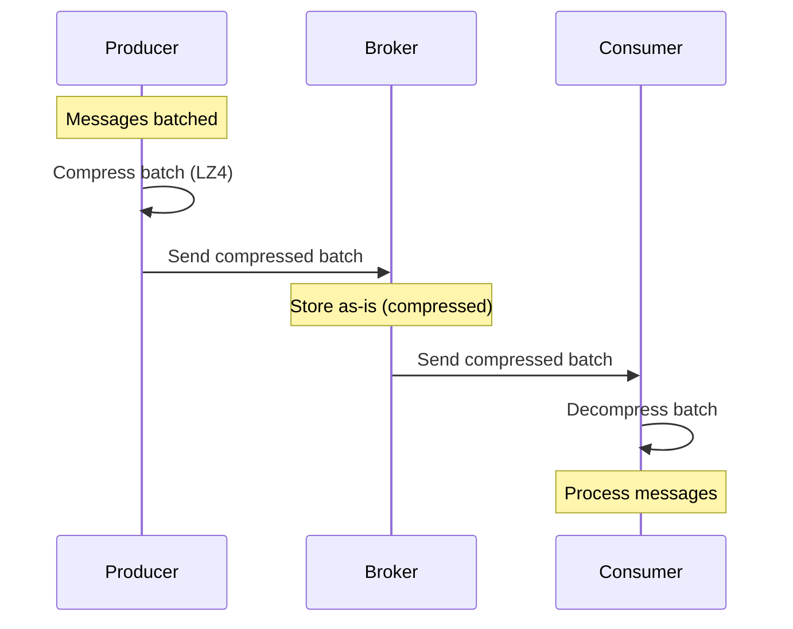

# How to Reduce Storage with Kafka Message Compression

Author: [nawazdhandala](https://www.github.com/nawazdhandala)

Tags: Kafka, Compression, Storage, Performance, Cost Optimization

Description: Learn how to configure message compression in Kafka to reduce storage costs and network bandwidth, including comparison of compression algorithms and their performance tradeoffs.

---

Kafka can store terabytes of data, and storage costs add up fast. Message compression reduces disk usage by 50-90% depending on your data. It also reduces network bandwidth between producers, brokers, and consumers. This guide covers configuring compression effectively.

## How Kafka Compression Works

Compression happens at the batch level, not individual messages. This is important because compression algorithms work better with more data.



Key insight: Brokers store compressed data and forward it compressed. Decompression only happens at the consumer, minimizing broker CPU usage.

## Configuring Producer Compression

Set the compression type in producer configuration:

```java
import org.apache.kafka.clients.producer.*;
import java.util.Properties;

public class CompressedProducer {

    public static KafkaProducer<String, String> createProducer() {
        Properties props = new Properties();
        props.put(ProducerConfig.BOOTSTRAP_SERVERS_CONFIG, "kafka:9092");

        // Compression type: none, gzip, snappy, lz4, or zstd
        props.put(ProducerConfig.COMPRESSION_TYPE_CONFIG, "lz4");

        // Larger batches compress better
        props.put(ProducerConfig.BATCH_SIZE_CONFIG, 131072);  // 128KB
        props.put(ProducerConfig.LINGER_MS_CONFIG, 20);        // Wait for batch to fill

        // Buffer memory for pending batches
        props.put(ProducerConfig.BUFFER_MEMORY_CONFIG, 67108864);  // 64MB

        props.put(ProducerConfig.KEY_SERIALIZER_CLASS_CONFIG,
            "org.apache.kafka.common.serialization.StringSerializer");
        props.put(ProducerConfig.VALUE_SERIALIZER_CLASS_CONFIG,
            "org.apache.kafka.common.serialization.StringSerializer");

        return new KafkaProducer<>(props);
    }
}
```

## Compression Algorithm Comparison

Each algorithm offers different tradeoffs:

| Algorithm | Compression Ratio | CPU (Compress) | CPU (Decompress) | Best For |
|-----------|-------------------|----------------|------------------|----------|
| **none** | 1.0x | - | - | Already compressed data |
| **gzip** | Best (5-8x) | High | Medium | Maximum storage savings |
| **snappy** | Good (2-3x) | Low | Low | Balanced performance |
| **lz4** | Good (2-4x) | Very Low | Very Low | High throughput |
| **zstd** | Very Good (4-6x) | Medium | Low | Best ratio with good speed |

### Benchmarking Compression

Here is a comparison using 1 million JSON log messages (average 500 bytes each):

```bash
# Test with kafka-producer-perf-test
for compression in none gzip snappy lz4 zstd; do
    echo "Testing $compression compression..."
    kafka-producer-perf-test.sh \
        --topic compression-test-$compression \
        --num-records 1000000 \
        --record-size 500 \
        --throughput -1 \
        --producer-props \
            bootstrap.servers=kafka:9092 \
            compression.type=$compression \
            batch.size=131072 \
            linger.ms=20
done
```

Typical results:

```
Compression | Throughput (msg/s) | Storage (MB) | Ratio
------------|-------------------|--------------|-------
none        | 850,000           | 476          | 1.0x
gzip        | 320,000           | 62           | 7.7x
snappy      | 680,000           | 142          | 3.4x
lz4         | 780,000           | 118          | 4.0x
zstd        | 520,000           | 78           | 6.1x
```

## Topic-Level Compression Configuration

Override producer compression at the topic level:

```bash
# Create topic with compression preference
kafka-topics.sh --bootstrap-server kafka:9092 \
    --create \
    --topic logs \
    --partitions 12 \
    --replication-factor 3 \
    --config compression.type=zstd

# Modify existing topic
kafka-configs.sh --bootstrap-server kafka:9092 \
    --entity-type topics \
    --entity-name logs \
    --alter \
    --add-config compression.type=zstd
```

Compression type options at topic level:

- `producer` - Use whatever the producer sends (default)
- `none`, `gzip`, `snappy`, `lz4`, `zstd` - Force specific compression

## Broker-Level Compression

Set default compression for all topics:

```properties
# server.properties

# Default compression type for new topics
compression.type=producer

# For maximum storage savings across all topics
# compression.type=zstd
```

## Zstd Compression Levels

Zstd supports compression levels 1-22. Higher levels = better compression but more CPU.

```java
// Java producer with zstd level
Properties props = new Properties();
props.put(ProducerConfig.COMPRESSION_TYPE_CONFIG, "zstd");

// Zstd compression level (1-22, default is 3)
// Level 1: Fastest, less compression
// Level 3: Good balance (default)
// Level 9+: Maximum compression, slow
props.put("compression.zstd.level", "3");
```

For librdkafka (Python, Go, etc.):

```python
from confluent_kafka import Producer

producer = Producer({
    'bootstrap.servers': 'kafka:9092',
    'compression.type': 'zstd',
    'compression.level': 3  # 1-12 for zstd in librdkafka
})
```

## Measuring Compression Effectiveness

Check actual compression ratios for your data:

```java
import org.apache.kafka.clients.producer.*;
import org.apache.kafka.common.Metric;
import org.apache.kafka.common.MetricName;
import java.util.Map;

public class CompressionMetrics {

    public static void printCompressionMetrics(KafkaProducer<String, String> producer) {
        Map<MetricName, ? extends Metric> metrics = producer.metrics();

        for (Map.Entry<MetricName, ? extends Metric> entry : metrics.entrySet()) {
            MetricName name = entry.getKey();

            // Look for compression-related metrics
            if (name.name().contains("compression") ||
                name.name().contains("batch-size")) {

                System.out.printf("%s: %.2f%n",
                    name.name(),
                    entry.getValue().metricValue());
            }
        }
    }
}
```

Using command line to check storage:

```bash
# Check actual disk usage per topic
kafka-log-dirs.sh --bootstrap-server kafka:9092 \
    --describe \
    --topic-list logs | grep -E "topic|size"

# Compare compressed vs uncompressed topic sizes
du -sh /var/kafka-logs/logs-compressed-*
du -sh /var/kafka-logs/logs-uncompressed-*
```

## Consumer-Side Decompression

Consumers decompress automatically. No configuration needed, but you can monitor decompression overhead:

```java
// Monitor consumer decompression time
Map<MetricName, ? extends Metric> metrics = consumer.metrics();

for (Map.Entry<MetricName, ? extends Metric> entry : metrics.entrySet()) {
    if (entry.getKey().name().equals("fetch-latency-avg")) {
        System.out.println("Fetch latency (includes decompression): " +
            entry.getValue().metricValue() + " ms");
    }
}
```

## When NOT to Use Compression

Skip compression when:

1. **Data is already compressed**: Images, videos, encrypted data
2. **Latency is critical**: Compression adds ~1-5ms latency
3. **CPU is the bottleneck**: Use `snappy` or `lz4` instead of `gzip`
4. **Messages are very small**: Compression overhead may exceed savings

```java
// Check if compression helps for your data
public boolean shouldCompress(byte[] message) {
    // Very small messages may not benefit
    if (message.length < 100) {
        return false;
    }

    // Already compressed data (check magic bytes)
    if (isCompressedFormat(message)) {
        return false;
    }

    return true;
}

private boolean isCompressedFormat(byte[] data) {
    // GZIP magic bytes: 1f 8b
    if (data[0] == (byte) 0x1f && data[1] == (byte) 0x8b) {
        return true;
    }
    // ZIP magic bytes: 50 4b
    if (data[0] == (byte) 0x50 && data[1] == (byte) 0x4b) {
        return true;
    }
    return false;
}
```

## Compression with Kafka Connect

Configure compression for Connect sink/source connectors:

```json
{
  "name": "jdbc-sink",
  "config": {
    "connector.class": "io.confluent.connect.jdbc.JdbcSinkConnector",
    "topics": "orders",

    "producer.override.compression.type": "lz4",
    "producer.override.batch.size": "131072",
    "producer.override.linger.ms": "20"
  }
}
```

## Cost Savings Example

For a typical logging workload:

| Metric | No Compression | LZ4 Compression | Savings |
|--------|----------------|-----------------|---------|
| Daily data volume | 1 TB | 250 GB | 75% |
| Retention (7 days) | 7 TB | 1.75 TB | 75% |
| Network bandwidth | 100 Mbps | 25 Mbps | 75% |
| Monthly storage cost | $700 | $175 | $525/month |

With cloud storage at $0.10/GB/month, compression saves significant costs.

## Best Practices

1. **Use LZ4 as default**: Best throughput with good compression
2. **Use Zstd for archival topics**: Better ratio when CPU is not constrained
3. **Increase batch size with compression**: Larger batches compress better
4. **Monitor CPU and throughput**: Adjust if compression becomes a bottleneck
5. **Test with your actual data**: Compression ratios vary widely by data type
6. **Match compression to use case**: High-throughput pipelines use LZ4, archival uses Zstd

```java
// Production-ready configuration
Properties props = new Properties();
props.put(ProducerConfig.COMPRESSION_TYPE_CONFIG, "lz4");
props.put(ProducerConfig.BATCH_SIZE_CONFIG, 131072);     // 128KB
props.put(ProducerConfig.LINGER_MS_CONFIG, 10);          // Wait up to 10ms
props.put(ProducerConfig.BUFFER_MEMORY_CONFIG, 67108864); // 64MB buffer
```

---

Message compression is one of the easiest ways to reduce Kafka operational costs. LZ4 offers the best balance of speed and compression for most workloads. Enable compression at the producer level, set appropriate batch sizes, and monitor the compression ratio to ensure you are getting the expected savings. For archival or cost-sensitive workloads, Zstd provides better compression at the cost of more CPU.
