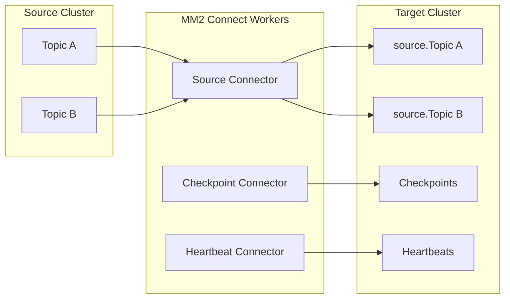

# How to Replicate Topics with MirrorMaker 2 in Kafka

Author: [nawazdhandala](https://www.github.com/nawazdhandala)

Tags: Kafka, MirrorMaker 2, Replication, Disaster Recovery, Multi-Datacenter

Description: Set up cross-cluster topic replication with MirrorMaker 2 for disaster recovery, geographic distribution, and cluster migration scenarios.

---

MirrorMaker 2 (MM2) replicates data between Kafka clusters. It handles disaster recovery, multi-region deployments, and cluster migrations. Unlike the original MirrorMaker, MM2 uses the Kafka Connect framework and preserves consumer offsets across clusters.

## MirrorMaker 2 Architecture

MM2 runs as Kafka Connect connectors that read from source clusters and write to target clusters.



## Basic Configuration

Create a properties file defining source and target clusters.

```properties
# mm2.properties
# Define the two clusters
clusters = source, target

# Source cluster connection
source.bootstrap.servers = kafka-source-1:9092,kafka-source-2:9092,kafka-source-3:9092
source.security.protocol = PLAINTEXT

# Target cluster connection
target.bootstrap.servers = kafka-target-1:9092,kafka-target-2:9092,kafka-target-3:9092
target.security.protocol = PLAINTEXT

# Enable replication from source to target
source->target.enabled = true

# Topics to replicate (regex pattern)
source->target.topics = orders.*,payments.*,users

# Topics to exclude
source->target.topics.exclude = .*-internal,__.*

# Disable reverse replication (target->source)
target->source.enabled = false

# Replication factor for mirrored topics
replication.factor = 3

# Offset sync settings
checkpoints.topic.replication.factor = 3
heartbeats.topic.replication.factor = 3
offset-syncs.topic.replication.factor = 3

# Sync consumer group offsets
sync.group.offsets.enabled = true
sync.group.offsets.interval.seconds = 60

# How often to refresh topic list
refresh.topics.interval.seconds = 30
```

## Running MirrorMaker 2

Start MM2 using the connect-mirror-maker script.

```bash
# Start MM2 with the configuration file
connect-mirror-maker.sh mm2.properties

# Or run as a daemon
nohup connect-mirror-maker.sh mm2.properties > mm2.log 2>&1 &
```

## Running as Kafka Connect Connectors

For more control, deploy MM2 as Connect connectors.

```bash
# Start Connect workers
connect-distributed.sh connect-distributed.properties
```

Then deploy connectors via REST API:

```bash
# Deploy MirrorSourceConnector
curl -X POST http://localhost:8083/connectors \
  -H "Content-Type: application/json" \
  -d '{
    "name": "mirror-source-connector",
    "config": {
      "connector.class": "org.apache.kafka.connect.mirror.MirrorSourceConnector",
      "tasks.max": "4",
      "source.cluster.alias": "source",
      "target.cluster.alias": "target",
      "source.cluster.bootstrap.servers": "kafka-source-1:9092",
      "target.cluster.bootstrap.servers": "kafka-target-1:9092",
      "topics": "orders.*,payments.*",
      "replication.factor": "3",
      "offset-syncs.topic.replication.factor": "3",
      "sync.topic.acls.enabled": "false",
      "key.converter": "org.apache.kafka.connect.converters.ByteArrayConverter",
      "value.converter": "org.apache.kafka.connect.converters.ByteArrayConverter"
    }
  }'

# Deploy MirrorCheckpointConnector for offset translation
curl -X POST http://localhost:8083/connectors \
  -H "Content-Type: application/json" \
  -d '{
    "name": "mirror-checkpoint-connector",
    "config": {
      "connector.class": "org.apache.kafka.connect.mirror.MirrorCheckpointConnector",
      "tasks.max": "1",
      "source.cluster.alias": "source",
      "target.cluster.alias": "target",
      "source.cluster.bootstrap.servers": "kafka-source-1:9092",
      "target.cluster.bootstrap.servers": "kafka-target-1:9092",
      "groups": ".*",
      "checkpoints.topic.replication.factor": "3",
      "sync.group.offsets.enabled": "true",
      "sync.group.offsets.interval.seconds": "60"
    }
  }'

# Deploy MirrorHeartbeatConnector for monitoring
curl -X POST http://localhost:8083/connectors \
  -H "Content-Type: application/json" \
  -d '{
    "name": "mirror-heartbeat-connector",
    "config": {
      "connector.class": "org.apache.kafka.connect.mirror.MirrorHeartbeatConnector",
      "tasks.max": "1",
      "source.cluster.alias": "source",
      "target.cluster.alias": "target",
      "source.cluster.bootstrap.servers": "kafka-source-1:9092",
      "target.cluster.bootstrap.servers": "kafka-target-1:9092",
      "heartbeats.topic.replication.factor": "3"
    }
  }'
```

## Topic Naming Convention

MM2 prefixes replicated topics with the source cluster alias.

```bash
# Source cluster topics
orders
payments
users

# Replicated to target cluster as
source.orders
source.payments
source.users
```

Override the naming convention if needed:

```properties
# Custom topic renaming policy
replication.policy.class = org.apache.kafka.connect.mirror.IdentityReplicationPolicy
```

The IdentityReplicationPolicy keeps original topic names (useful for active-passive setups).

## Consumer Offset Translation

MM2 translates consumer group offsets so consumers can switch clusters seamlessly.

```java
// Consumer that can failover between clusters
public class FailoverConsumer {

    private final String primaryBootstrap;
    private final String secondaryBootstrap;
    private final String groupId;

    public void consumeWithFailover() {
        String bootstrap = primaryBootstrap;

        while (true) {
            try {
                consumeFromCluster(bootstrap);
            } catch (Exception e) {
                // Primary failed, switch to secondary
                log.warn("Cluster {} failed, switching to secondary", bootstrap);
                bootstrap = bootstrap.equals(primaryBootstrap)
                    ? secondaryBootstrap
                    : primaryBootstrap;

                // Wait for MM2 to sync offsets
                Thread.sleep(5000);
            }
        }
    }

    private void consumeFromCluster(String bootstrap) {
        Properties props = new Properties();
        props.put("bootstrap.servers", bootstrap);
        props.put("group.id", groupId);
        // MM2 syncs offsets so we resume from the right position
        props.put("auto.offset.reset", "latest");

        try (KafkaConsumer<String, String> consumer =
                 new KafkaConsumer<>(props)) {
            consumer.subscribe(List.of("orders"));

            while (true) {
                ConsumerRecords<String, String> records =
                    consumer.poll(Duration.ofSeconds(1));
                processRecords(records);
                consumer.commitSync();
            }
        }
    }
}
```

## Monitoring Replication Lag

Check heartbeat topics to measure replication latency.

```java
@Service
public class MM2LagMonitor {

    // Heartbeats contain timestamps from source cluster
    // Compare with current time to measure lag
    @KafkaListener(topics = "source.heartbeats", groupId = "mm2-monitor")
    public void checkHeartbeat(ConsumerRecord<String, String> record) {
        // Parse heartbeat timestamp
        JsonObject heartbeat = JsonParser.parseString(record.value())
            .getAsJsonObject();
        long sourceTimestamp = heartbeat.get("timestamp").getAsLong();
        long currentTime = System.currentTimeMillis();
        long lagMs = currentTime - sourceTimestamp;

        // Record metric
        Metrics.gauge("mm2.replication.lag.ms", lagMs);

        if (lagMs > 30000) {
            log.warn("MM2 replication lag is {}ms", lagMs);
        }
    }
}
```

Use JMX metrics for detailed monitoring:

```bash
# Key MM2 metrics
kafka.connect:type=mirror-source-connector-task-metrics,*
  - record-count
  - byte-count
  - replication-latency-ms-avg
  - replication-latency-ms-max

kafka.connect:type=connect-worker-metrics,*
  - task-count
  - connector-count
```

## Active-Active Replication

For bidirectional replication, configure both directions.

```properties
# mm2-active-active.properties
clusters = dc1, dc2

dc1.bootstrap.servers = kafka-dc1-1:9092
dc2.bootstrap.servers = kafka-dc2-1:9092

# Bidirectional replication
dc1->dc2.enabled = true
dc2->dc1.enabled = true

# Replicate all topics except internal ones
dc1->dc2.topics = .*
dc1->dc2.topics.exclude = .*\..*,__.*,mm2.*

dc2->dc1.topics = .*
dc2->dc1.topics.exclude = .*\..*,__.*,mm2.*

# Both clusters create prefixed copies
# dc1 gets: dc2.topic-name
# dc2 gets: dc1.topic-name
```

Handle the prefixed topics in consumers:

```java
// Consumer that reads from both local and replicated topics
@KafkaListener(topics = {"orders", "dc2.orders"}, groupId = "orders-processor")
public void processOrder(ConsumerRecord<String, String> record) {
    String sourceDc = record.topic().startsWith("dc2.") ? "dc2" : "dc1";
    log.info("Processing order from {} datacenter", sourceDc);
    // Process identically regardless of source
    handleOrder(record.value());
}
```

## Disaster Recovery Failover

Steps to failover consumers to the secondary cluster:

```bash
# 1. Verify MM2 is caught up (check heartbeat lag)
kafka-console-consumer.sh \
  --bootstrap-server kafka-target-1:9092 \
  --topic source.heartbeats \
  --from-beginning --max-messages 1

# 2. Stop consumers on primary cluster

# 3. Verify checkpoint sync is current
kafka-console-consumer.sh \
  --bootstrap-server kafka-target-1:9092 \
  --topic mm2-offset-syncs.source.internal \
  --from-beginning

# 4. Update consumer bootstrap servers to target cluster

# 5. Restart consumers - they will use translated offsets
```

## Tuning Performance

Adjust settings for high-throughput replication.

```properties
# Increase parallelism
tasks.max = 10

# Batch settings for better throughput
source.consumer.fetch.min.bytes = 1048576
source.consumer.fetch.max.wait.ms = 500

# Producer settings on target cluster
target.producer.batch.size = 65536
target.producer.linger.ms = 10
target.producer.compression.type = lz4

# More memory for larger batches
offset.lag.max = 100000
```

---

MirrorMaker 2 simplifies cross-cluster replication with automatic offset translation and Connect framework integration. Start with simple active-passive for disaster recovery, then graduate to active-active if you need geographic distribution. Monitor heartbeat lag constantly and test failover procedures regularly. The time to learn MM2 is not during an outage.
