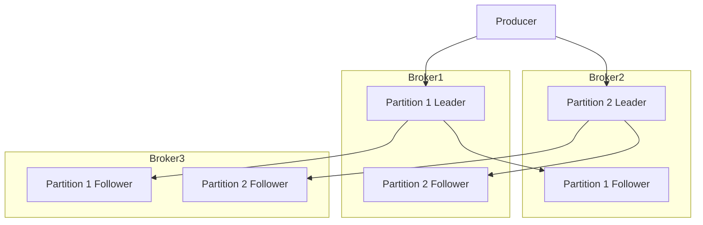
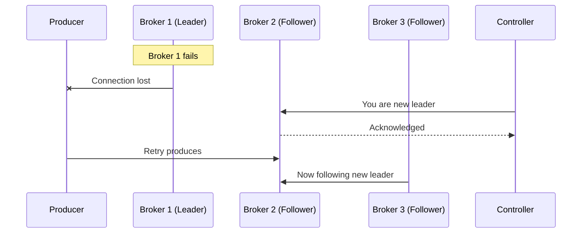

# How to Configure Replication for Fault Tolerance in Kafka

Author: [nawazdhandala](https://www.github.com/nawazdhandala)

Tags: Kafka, Replication, Fault Tolerance, High Availability, DevOps

Description: Master Kafka replication configuration including replication factors, ISR management, leader election, and tuning for durability vs latency trade-offs.

---

Kafka achieves fault tolerance through replication. Every partition can have multiple copies spread across different brokers. When a broker fails, another replica takes over. Getting replication right is the difference between a resilient system and one that loses data.

## Replication Basics

Each partition has one leader and zero or more followers. Producers and consumers only talk to the leader. Followers pull data from the leader to stay synchronized.



## Setting Replication Factor

Create topics with the appropriate replication factor for your durability needs.

```bash
# Create a topic with replication factor 3
# Data exists on 3 different brokers simultaneously
kafka-topics.sh --create \
  --topic orders \
  --bootstrap-server localhost:9092 \
  --partitions 6 \
  --replication-factor 3

# Verify replication status
kafka-topics.sh --describe \
  --topic orders \
  --bootstrap-server localhost:9092
```

Output shows leader and replica assignments:

```
Topic: orders   Partition: 0    Leader: 1    Replicas: 1,2,3    Isr: 1,2,3
Topic: orders   Partition: 1    Leader: 2    Replicas: 2,3,1    Isr: 2,3,1
Topic: orders   Partition: 2    Leader: 3    Replicas: 3,1,2    Isr: 3,1,2
```

## Understanding In-Sync Replicas (ISR)

ISR is the set of replicas that are fully caught up with the leader. Only ISR members can become the new leader if the current one fails.

```bash
# Broker configuration for ISR behavior
# server.properties

# How far behind a replica can fall before removal from ISR
# Default is 30 seconds - adjust based on your latency tolerance
replica.lag.time.max.ms=30000

# Minimum replicas that must acknowledge a write
# Set to 2 for strong durability with replication factor 3
min.insync.replicas=2
```

## Producer Acknowledgment Settings

The `acks` setting controls how many replicas must confirm a write before the producer considers it successful.

```java
Properties props = new Properties();
props.put("bootstrap.servers", "kafka1:9092,kafka2:9092,kafka3:9092");
props.put("key.serializer", "org.apache.kafka.common.serialization.StringSerializer");
props.put("value.serializer", "org.apache.kafka.common.serialization.StringSerializer");

// acks=0: Fire and forget. No waiting. Risk of data loss.
// acks=1: Wait for leader only. Fast but follower might not have data if leader dies.
// acks=all: Wait for all ISR replicas. Slowest but safest.
props.put("acks", "all");

// Combined with min.insync.replicas=2, this ensures
// at least 2 brokers have the data before returning success
KafkaProducer<String, String> producer = new KafkaProducer<>(props);

// Send with callback to handle failures
producer.send(new ProducerRecord<>("orders", "order-123", orderJson),
    (metadata, exception) -> {
        if (exception != null) {
            // Handle failure - message was NOT durably stored
            log.error("Failed to produce message", exception);
        } else {
            log.info("Message stored at partition {} offset {}",
                metadata.partition(), metadata.offset());
        }
    });
```

## Configuring min.insync.replicas

This topic-level setting works with `acks=all` to guarantee durability.

```bash
# Set at topic creation
kafka-topics.sh --create \
  --topic critical-events \
  --bootstrap-server localhost:9092 \
  --partitions 12 \
  --replication-factor 3 \
  --config min.insync.replicas=2

# Or modify existing topic
kafka-configs.sh --alter \
  --entity-type topics \
  --entity-name critical-events \
  --bootstrap-server localhost:9092 \
  --add-config min.insync.replicas=2
```

With `replication-factor=3` and `min.insync.replicas=2`:
- Writes succeed if at least 2 replicas are in sync
- One broker can fail without blocking producers
- Two broker failures block writes (safety over availability)

## Unclean Leader Election

By default, Kafka only elects leaders from ISR. Enabling unclean election allows out-of-sync replicas to become leader, risking data loss.

```bash
# Broker configuration
# server.properties

# Default is false - only ISR members can become leader
# Set to true only if availability matters more than consistency
unclean.leader.election.enable=false
```

When to enable unclean election:
- Logging systems where some data loss is acceptable
- Metrics pipelines with aggregation that can tolerate gaps
- Never enable for financial transactions or audit logs

## Rack-Aware Replication

Spread replicas across failure domains (racks, availability zones).

```bash
# Broker configuration - assign each broker to a rack
# server.properties on broker 1
broker.rack=us-east-1a

# server.properties on broker 2
broker.rack=us-east-1b

# server.properties on broker 3
broker.rack=us-east-1c
```

Kafka automatically distributes replicas across racks:

```java
// Create topic with rack awareness
AdminClient admin = AdminClient.create(props);

NewTopic topic = new NewTopic("orders", 6, (short) 3);

// Kafka will place replicas in different racks automatically
admin.createTopics(List.of(topic)).all().get();
```

## Monitoring Replication Health

Track replication lag and under-replicated partitions.

```bash
# Check for under-replicated partitions (ISR size < replication factor)
kafka-topics.sh --describe \
  --under-replicated-partitions \
  --bootstrap-server localhost:9092

# Check consumer group lag (different from replication lag)
kafka-consumer-groups.sh --describe \
  --group my-consumer-group \
  --bootstrap-server localhost:9092
```

Key JMX metrics to monitor:

```yaml
# Prometheus scrape config for Kafka metrics
- job_name: 'kafka'
  static_configs:
    - targets: ['kafka1:9999', 'kafka2:9999', 'kafka3:9999']
  metrics:
    # Under-replicated partitions - should be 0
    - kafka_server_replicamanager_underreplicatedpartitions

    # ISR shrink/expand rate - frequent changes indicate problems
    - kafka_server_replicamanager_isrshrinkspersec
    - kafka_server_replicamanager_isrexpandspersec

    # Replication lag in messages
    - kafka_server_replicafetchermanager_maxlag
```

## Handling Broker Failures

When a broker fails, Kafka automatically handles failover.



Producer retry configuration:

```java
Properties props = new Properties();
// Retry failed sends
props.put("retries", 3);

// Wait between retries (exponential backoff)
props.put("retry.backoff.ms", 100);

// Total time to retry before giving up
props.put("delivery.timeout.ms", 120000);

// Ensure ordering even with retries
props.put("max.in.flight.requests.per.connection", 1);
// Or use idempotent producer which handles this automatically
props.put("enable.idempotence", true);
```

## Rebalancing Replicas

After adding brokers or recovering from failures, rebalance partitions.

```bash
# Generate reassignment plan
kafka-reassign-partitions.sh --generate \
  --bootstrap-server localhost:9092 \
  --topics-to-move-json-file topics.json \
  --broker-list "1,2,3,4"

# topics.json content
# {"topics": [{"topic": "orders"}], "version": 1}

# Execute reassignment
kafka-reassign-partitions.sh --execute \
  --bootstrap-server localhost:9092 \
  --reassignment-json-file reassignment.json

# Verify progress
kafka-reassign-partitions.sh --verify \
  --bootstrap-server localhost:9092 \
  --reassignment-json-file reassignment.json
```

## Preferred Leader Election

Kafka tracks the "preferred" leader for each partition (first replica in the list). Trigger election to restore balanced leadership.

```bash
# Trigger preferred leader election for all topics
kafka-leader-election.sh --election-type preferred \
  --bootstrap-server localhost:9092 \
  --all-topic-partitions

# Or for specific topic
kafka-leader-election.sh --election-type preferred \
  --bootstrap-server localhost:9092 \
  --topic orders
```

Enable automatic preferred leader election:

```bash
# Broker configuration
# server.properties

# Automatically balance leaders (default is true)
auto.leader.rebalance.enable=true

# Check every 5 minutes
leader.imbalance.check.interval.seconds=300

# Trigger rebalance if imbalance exceeds 10%
leader.imbalance.per.broker.percentage=10
```

## Durability vs Latency Trade-offs

| Setting | High Durability | Low Latency |
|---------|-----------------|-------------|
| acks | all | 1 |
| min.insync.replicas | 2 | 1 |
| replication.factor | 3 | 2 |
| unclean.leader.election | false | true |

Choose based on your data criticality. Financial transactions need high durability. Clickstream events can tolerate some loss for speed.

---

Replication is your insurance policy against hardware failures. Configure `replication-factor=3` with `min.insync.replicas=2` and `acks=all` for critical data. Monitor under-replicated partitions and ISR changes. Test failover scenarios in staging before trusting production. The few milliseconds of latency added by synchronous replication is worth it when a disk dies at 3am.
