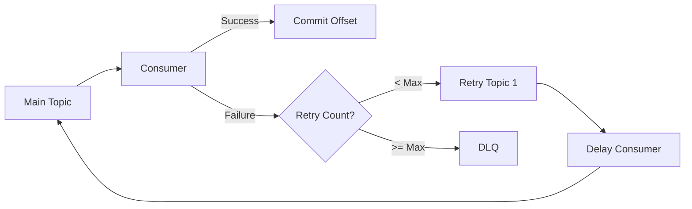

# How to Implement Retry Queues in Kafka

Author: [nawazdhandala](https://www.github.com/nawazdhandala)

Tags: Kafka, Error Handling, Retry, Dead Letter Queue, Reliability

Description: Build robust retry mechanisms in Kafka with exponential backoff, dead letter queues, and selective message reprocessing without blocking your main consumer.

---

Not every message processes successfully on the first try. External services go down, databases timeout, and validation fails. A solid retry strategy handles transient failures gracefully while dead-lettering messages that cannot be recovered.

## The Retry Pattern

The basic approach uses separate topics for each retry level. Failed messages move through increasing delays before landing in a dead letter queue (DLQ).



## Setting Up Retry Topics

Create topics for each retry level with different retention settings.

```bash
# Main topic
kafka-topics.sh --create \
  --topic orders \
  --bootstrap-server localhost:9092 \
  --partitions 12 \
  --replication-factor 3

# Retry topics with increasing delays
kafka-topics.sh --create \
  --topic orders-retry-1 \
  --bootstrap-server localhost:9092 \
  --partitions 6 \
  --replication-factor 3

kafka-topics.sh --create \
  --topic orders-retry-2 \
  --bootstrap-server localhost:9092 \
  --partitions 6 \
  --replication-factor 3

# Dead letter queue - keep messages for analysis
kafka-topics.sh --create \
  --topic orders-dlq \
  --bootstrap-server localhost:9092 \
  --partitions 6 \
  --replication-factor 3 \
  --config retention.ms=604800000  # 7 days
```

## Basic Retry Consumer

Track retry attempts in message headers and route failures appropriately.

```java
@Service
public class OrderProcessor {

    private final KafkaTemplate<String, String> kafkaTemplate;
    private static final int MAX_RETRIES = 3;

    @KafkaListener(topics = {"orders", "orders-retry-1", "orders-retry-2"})
    public void processOrder(ConsumerRecord<String, String> record) {
        int retryCount = getRetryCount(record);

        try {
            // Attempt to process the order
            processOrderInternal(record.value());

        } catch (TransientException e) {
            // Temporary failure - retry is appropriate
            handleRetry(record, retryCount, e);

        } catch (PermanentException e) {
            // Permanent failure - send directly to DLQ
            sendToDlq(record, e, "Permanent failure: " + e.getMessage());
        }
    }

    private void handleRetry(ConsumerRecord<String, String> record,
                            int retryCount, Exception e) {
        if (retryCount >= MAX_RETRIES) {
            sendToDlq(record, e, "Max retries exceeded");
            return;
        }

        // Determine next retry topic
        String nextTopic = "orders-retry-" + (retryCount + 1);
        if (retryCount + 1 > 2) {
            nextTopic = "orders-dlq";
        }

        // Build retry record with incremented count
        ProducerRecord<String, String> retryRecord = new ProducerRecord<>(
            nextTopic,
            record.key(),
            record.value()
        );

        // Preserve original headers and add retry metadata
        record.headers().forEach(h -> retryRecord.headers().add(h));
        retryRecord.headers().add("retry-count",
            String.valueOf(retryCount + 1).getBytes());
        retryRecord.headers().add("original-topic",
            record.topic().getBytes());
        retryRecord.headers().add("failure-reason",
            e.getMessage().getBytes());
        retryRecord.headers().add("failure-time",
            Instant.now().toString().getBytes());

        kafkaTemplate.send(retryRecord);
    }

    private int getRetryCount(ConsumerRecord<String, String> record) {
        Header header = record.headers().lastHeader("retry-count");
        if (header == null) return 0;
        return Integer.parseInt(new String(header.value()));
    }

    private void sendToDlq(ConsumerRecord<String, String> record,
                          Exception e, String reason) {
        ProducerRecord<String, String> dlqRecord = new ProducerRecord<>(
            "orders-dlq",
            record.key(),
            record.value()
        );

        // Add diagnostic headers for later analysis
        record.headers().forEach(h -> dlqRecord.headers().add(h));
        dlqRecord.headers().add("dlq-reason", reason.getBytes());
        dlqRecord.headers().add("exception-class",
            e.getClass().getName().getBytes());
        dlqRecord.headers().add("dlq-time",
            Instant.now().toString().getBytes());

        kafkaTemplate.send(dlqRecord);
    }
}
```

## Implementing Exponential Backoff

Add delays between retries using a scheduled consumer or timestamp-based filtering.

```java
@Service
public class DelayedRetryConsumer {

    private final KafkaTemplate<String, String> kafkaTemplate;

    // Delays in milliseconds for each retry level
    private static final Map<Integer, Long> RETRY_DELAYS = Map.of(
        1, 5000L,      // 5 seconds
        2, 30000L,     // 30 seconds
        3, 300000L     // 5 minutes
    );

    @KafkaListener(topics = "orders-retry-1", groupId = "retry-consumer-1")
    public void processRetry1(ConsumerRecord<String, String> record) {
        processWithDelay(record, 1);
    }

    @KafkaListener(topics = "orders-retry-2", groupId = "retry-consumer-2")
    public void processRetry2(ConsumerRecord<String, String> record) {
        processWithDelay(record, 2);
    }

    private void processWithDelay(ConsumerRecord<String, String> record,
                                  int retryLevel) {
        // Check if enough time has passed since failure
        Header failureTimeHeader = record.headers().lastHeader("failure-time");
        if (failureTimeHeader != null) {
            Instant failureTime = Instant.parse(
                new String(failureTimeHeader.value()));
            long delayMs = RETRY_DELAYS.get(retryLevel);
            Instant readyTime = failureTime.plusMillis(delayMs);

            if (Instant.now().isBefore(readyTime)) {
                // Not ready yet - pause and requeue
                long waitMs = Duration.between(Instant.now(), readyTime).toMillis();
                try {
                    Thread.sleep(Math.min(waitMs, 5000));
                } catch (InterruptedException e) {
                    Thread.currentThread().interrupt();
                }
                // Requeue to same topic for later processing
                kafkaTemplate.send(record.topic(), record.key(), record.value());
                return;
            }
        }

        // Ready for retry - send back to main topic
        ProducerRecord<String, String> mainRecord = new ProducerRecord<>(
            "orders",
            record.key(),
            record.value()
        );
        record.headers().forEach(h -> mainRecord.headers().add(h));
        kafkaTemplate.send(mainRecord);
    }
}
```

## Using Spring Kafka Retry Template

Spring Kafka provides built-in retry support with customizable backoff.

```java
@Configuration
@EnableKafka
public class KafkaRetryConfig {

    @Bean
    public ConcurrentKafkaListenerContainerFactory<String, String>
           kafkaListenerContainerFactory(ConsumerFactory<String, String> cf,
                                        KafkaTemplate<String, String> template) {

        ConcurrentKafkaListenerContainerFactory<String, String> factory =
            new ConcurrentKafkaListenerContainerFactory<>();
        factory.setConsumerFactory(cf);

        // Configure retry with exponential backoff
        DefaultErrorHandler errorHandler = new DefaultErrorHandler(
            // Dead letter publisher
            new DeadLetterPublishingRecoverer(template,
                (record, ex) -> new TopicPartition("orders-dlq", -1)),
            // Backoff: 1s, 2s, 4s, 8s, then give up
            new ExponentialBackOff(1000L, 2.0)
        );

        // Only retry on transient exceptions
        errorHandler.addNotRetryableExceptions(
            ValidationException.class,
            IllegalArgumentException.class
        );

        factory.setCommonErrorHandler(errorHandler);
        return factory;
    }
}

@Service
public class OrderService {

    // Spring handles retries automatically based on config
    @KafkaListener(topics = "orders", groupId = "order-processor")
    public void process(String orderJson) {
        Order order = parseOrder(orderJson);

        // This might throw TransientException (retried) or
        // ValidationException (sent to DLQ immediately)
        validateAndSave(order);
    }
}
```

## Selective Reprocessing from DLQ

Build a tool to selectively replay messages from the dead letter queue.

```java
@Service
public class DlqReprocessor {

    private final ConsumerFactory<String, String> consumerFactory;
    private final KafkaTemplate<String, String> kafkaTemplate;

    // Reprocess messages matching specific criteria
    public int reprocessByKey(String keyPattern, String targetTopic) {
        Properties props = new Properties();
        props.put(ConsumerConfig.GROUP_ID_CONFIG,
            "dlq-reprocessor-" + UUID.randomUUID());
        props.put(ConsumerConfig.AUTO_OFFSET_RESET_CONFIG, "earliest");
        props.put(ConsumerConfig.ENABLE_AUTO_COMMIT_CONFIG, false);

        try (Consumer<String, String> consumer =
                 consumerFactory.createConsumer("dlq-reprocessor", "")) {

            consumer.subscribe(List.of("orders-dlq"));
            int reprocessed = 0;

            while (true) {
                ConsumerRecords<String, String> records =
                    consumer.poll(Duration.ofSeconds(1));

                if (records.isEmpty()) break;

                for (ConsumerRecord<String, String> record : records) {
                    if (record.key() != null &&
                        record.key().matches(keyPattern)) {

                        // Send back to main topic with clean headers
                        ProducerRecord<String, String> freshRecord =
                            new ProducerRecord<>(
                                targetTopic,
                                record.key(),
                                record.value()
                            );
                        freshRecord.headers().add("reprocessed-from",
                            "dlq".getBytes());
                        freshRecord.headers().add("reprocessed-at",
                            Instant.now().toString().getBytes());

                        kafkaTemplate.send(freshRecord).get();
                        reprocessed++;
                    }
                }
            }

            return reprocessed;
        } catch (Exception e) {
            throw new RuntimeException("DLQ reprocessing failed", e);
        }
    }

    // Reprocess messages that failed after a specific time
    // Useful after fixing a bug
    public int reprocessAfter(Instant afterTime, String targetTopic) {
        // Similar implementation filtering by dlq-time header
        // ...
    }
}
```

## Monitoring Retry Metrics

Track retry rates to identify systemic issues.

```java
@Component
public class RetryMetrics {

    private final MeterRegistry meterRegistry;
    private final Counter retryCounter;
    private final Counter dlqCounter;

    public RetryMetrics(MeterRegistry meterRegistry) {
        this.meterRegistry = meterRegistry;

        this.retryCounter = Counter.builder("kafka.message.retry")
            .description("Messages sent to retry topics")
            .register(meterRegistry);

        this.dlqCounter = Counter.builder("kafka.message.dlq")
            .description("Messages sent to dead letter queue")
            .register(meterRegistry);
    }

    public void recordRetry(String topic, int retryLevel, String reason) {
        Counter.builder("kafka.message.retry")
            .tag("topic", topic)
            .tag("retry_level", String.valueOf(retryLevel))
            .tag("reason", reason)
            .register(meterRegistry)
            .increment();
    }

    public void recordDlq(String topic, String reason) {
        Counter.builder("kafka.message.dlq")
            .tag("topic", topic)
            .tag("reason", reason)
            .register(meterRegistry)
            .increment();
    }
}
```

Set up alerts:

```yaml
# Prometheus alerting rules
groups:
  - name: kafka-retry-alerts
    rules:
      - alert: HighRetryRate
        expr: rate(kafka_message_retry_total[5m]) > 10
        for: 5m
        labels:
          severity: warning
        annotations:
          summary: "High Kafka message retry rate"

      - alert: DlqGrowing
        expr: increase(kafka_message_dlq_total[1h]) > 100
        for: 15m
        labels:
          severity: critical
        annotations:
          summary: "DLQ receiving too many messages"
```

---

Retry queues transform brittle consumers into resilient ones. Use separate topics for each retry level, implement exponential backoff, and always have a dead letter queue as your safety net. Monitor retry rates closely because they reveal upstream service problems. And build reprocessing tools before you need them because DLQ messages always come at the worst possible time.
