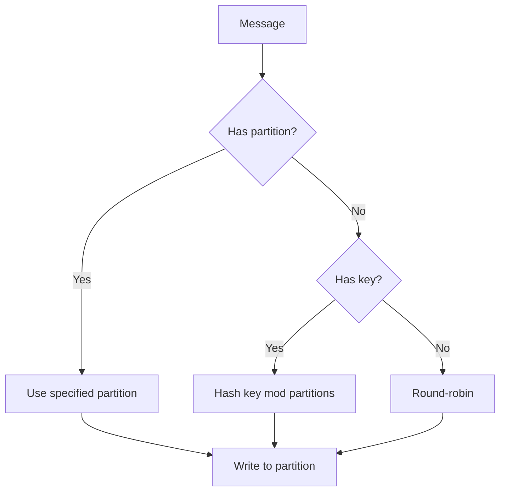

# How to Design Topic Partition Strategies in Kafka

Author: [nawazdhandala](https://www.github.com/nawazdhandala)

Tags: Kafka, Partitioning, Scalability, Data Architecture, Message Ordering

Description: Learn how to design effective Kafka partition strategies for your use cases, including partition key selection, custom partitioners, and balancing throughput with message ordering requirements.

---

Partition strategy is one of the most important decisions in Kafka architecture. It affects message ordering, consumer parallelism, and data locality. A poor partition strategy can create hot partitions that bottleneck throughput or break ordering guarantees your application depends on. This guide covers designing partition strategies for common scenarios.

## Partitioning Fundamentals

Every message in Kafka goes to exactly one partition. The partition is determined by:

1. Explicit partition number (if specified)
2. Key hash (if key is provided)
3. Round-robin (if no key)



## Why Partitioning Matters

### Message Ordering

Kafka only guarantees ordering within a partition. If you need related messages processed in order, they must go to the same partition.

```java
// All orders for the same customer go to the same partition
// This guarantees order processing happens in sequence
ProducerRecord<String, String> record = new ProducerRecord<>(
    "orders",
    customerId,  // Key determines partition
    orderJson
);
```

### Parallelism

More partitions enable more concurrent consumers. But too many partitions increase overhead.

```
Partitions: 1   -> Max consumers: 1
Partitions: 10  -> Max consumers: 10
Partitions: 100 -> Max consumers: 100
```

### Data Locality

Related data in the same partition enables efficient joins and aggregations without shuffling.

## Common Partitioning Strategies

### Strategy 1: Entity ID Partitioning

Use the entity identifier as the key to group related events.

```java
public class EntityPartitioner {

    // Order events partitioned by order ID
    // All events for an order go to the same partition
    public void sendOrderEvent(Order order) {
        ProducerRecord<String, String> record = new ProducerRecord<>(
            "order-events",
            order.getOrderId(),  // Key = order ID
            toJson(order)
        );
        producer.send(record);
    }

    // User events partitioned by user ID
    // Enables processing all user activity in order
    public void sendUserEvent(UserEvent event) {
        ProducerRecord<String, String> record = new ProducerRecord<>(
            "user-events",
            event.getUserId(),  // Key = user ID
            toJson(event)
        );
        producer.send(record);
    }
}
```

### Strategy 2: Time-Based Partitioning

Partition by time window for time-series data.

```java
public class TimeBasedPartitioner implements Partitioner {

    @Override
    public int partition(String topic, Object key, byte[] keyBytes,
                         Object value, byte[] valueBytes, Cluster cluster) {

        int numPartitions = cluster.partitionCountForTopic(topic);

        // Extract timestamp from the key (format: "2026-01-25T14")
        String hourKey = (String) key;

        // Hash the hour to get consistent partition
        return Math.abs(hourKey.hashCode()) % numPartitions;
    }

    @Override
    public void close() {}

    @Override
    public void configure(Map<String, ?> configs) {}
}
```

Usage:

```java
// Key is the hour bucket
String hourBucket = event.getTimestamp()
    .truncatedTo(ChronoUnit.HOURS)
    .toString();

ProducerRecord<String, String> record = new ProducerRecord<>(
    "metrics",
    hourBucket,
    toJson(event)
);
```

### Strategy 3: Geographic Partitioning

Partition by region for data locality and compliance.

```java
public class GeoPartitioner implements Partitioner {

    private static final Map<String, Integer> REGION_PARTITIONS = Map.of(
        "us-east", 0,
        "us-west", 1,
        "eu-west", 2,
        "ap-south", 3
    );

    @Override
    public int partition(String topic, Object key, byte[] keyBytes,
                         Object value, byte[] valueBytes, Cluster cluster) {

        String region = (String) key;
        Integer partition = REGION_PARTITIONS.get(region);

        if (partition != null) {
            return partition;
        }

        // Fallback for unknown regions
        return Math.abs(region.hashCode()) %
            cluster.partitionCountForTopic(topic);
    }
}
```

### Strategy 4: Composite Key Partitioning

Use multiple fields for partition assignment while maintaining ordering within groups.

```java
public class CompositeKeyStrategy {

    // Partition by tenant, order by event time
    public void sendTenantEvent(String tenantId, String eventId, String payload) {
        // Key structure: tenantId (for partitioning)
        // Include eventId in value for ordering within partition

        ProducerRecord<String, String> record = new ProducerRecord<>(
            "tenant-events",
            tenantId,  // Partition by tenant
            String.format("{\"eventId\":\"%s\",\"data\":%s}", eventId, payload)
        );
        producer.send(record);
    }

    // Partition by account, sub-sort by transaction
    public void sendTransaction(String accountId, String txnId, Transaction txn) {
        String key = accountId;  // Partition by account

        // All transactions for an account in same partition = ordered processing
        producer.send(new ProducerRecord<>("transactions", key, toJson(txn)));
    }
}
```

## Custom Partitioner Implementation

When the default hash partitioner does not fit your needs:

```java
import org.apache.kafka.clients.producer.Partitioner;
import org.apache.kafka.common.Cluster;
import java.util.Map;

public class PriorityPartitioner implements Partitioner {

    private int highPriorityPartition;
    private int totalPartitions;

    @Override
    public void configure(Map<String, ?> configs) {
        // Reserve partition 0 for high-priority messages
        this.highPriorityPartition = 0;
    }

    @Override
    public int partition(String topic, Object key, byte[] keyBytes,
                         Object value, byte[] valueBytes, Cluster cluster) {

        totalPartitions = cluster.partitionCountForTopic(topic);

        // Parse priority from key (format: "priority:entityId")
        String keyStr = (String) key;
        String[] parts = keyStr.split(":");

        if (parts[0].equals("high")) {
            // All high-priority messages to partition 0
            return highPriorityPartition;
        }

        // Normal priority: distribute across remaining partitions
        String entityId = parts.length > 1 ? parts[1] : keyStr;
        int hash = Math.abs(entityId.hashCode());

        // Use partitions 1 to N-1 for normal priority
        return 1 + (hash % (totalPartitions - 1));
    }

    @Override
    public void close() {}
}
```

Register the custom partitioner:

```java
props.put(ProducerConfig.PARTITIONER_CLASS_CONFIG,
    "com.example.PriorityPartitioner");
```

## Handling Hot Partitions

Hot partitions occur when one key receives disproportionate traffic.

### Detection

```java
// Monitor partition distribution
public void checkPartitionBalance(KafkaProducer<String, String> producer) {
    Map<MetricName, ? extends Metric> metrics = producer.metrics();

    for (Map.Entry<MetricName, ? extends Metric> entry : metrics.entrySet()) {
        if (entry.getKey().name().equals("record-send-rate") &&
            entry.getKey().tags().containsKey("partition")) {

            System.out.printf("Partition %s: %.2f records/sec%n",
                entry.getKey().tags().get("partition"),
                entry.getValue().metricValue());
        }
    }
}
```

### Mitigation: Key Salting

Add randomness to spread hot keys across partitions while maintaining some locality:

```java
public class SaltedPartitioner {

    private static final int SALT_BUCKETS = 10;

    public String saltKey(String originalKey) {
        // Add salt to spread hot keys
        int salt = ThreadLocalRandom.current().nextInt(SALT_BUCKETS);
        return originalKey + "-" + salt;
    }

    // Consumer must aggregate across all salt buckets
    public void consumeWithDesalt(ConsumerRecord<String, String> record) {
        String saltedKey = record.key();
        String originalKey = saltedKey.substring(0, saltedKey.lastIndexOf("-"));
        // Process with original key
    }
}
```

### Mitigation: Sub-Partitioning

Create separate topics for high-volume entities:

```java
public void routeByVolume(Event event) {
    String entityId = event.getEntityId();

    if (isHighVolumeEntity(entityId)) {
        // High-volume entities get dedicated topic with more partitions
        producer.send(new ProducerRecord<>(
            "events-high-volume",
            entityId,
            toJson(event)
        ));
    } else {
        producer.send(new ProducerRecord<>(
            "events",
            entityId,
            toJson(event)
        ));
    }
}
```

## Choosing Partition Count

Guidelines for partition count:

```
Target throughput / Per-partition throughput = Minimum partitions

Example:
- Target: 100,000 messages/sec
- Per-partition throughput: 10,000 messages/sec
- Minimum partitions: 10
- Add headroom: 15-20 partitions
```

Other factors:

- **Consumer parallelism**: At least one partition per consumer
- **Rebalancing time**: More partitions = longer rebalances
- **Memory overhead**: Each partition uses ~1MB on brokers
- **Open file handles**: Each partition has multiple segment files

```bash
# Create topic with calculated partition count
kafka-topics.sh --bootstrap-server kafka:9092 \
    --create \
    --topic events \
    --partitions 20 \
    --replication-factor 3
```

## Partition Assignment for Consumers

Control how partitions are distributed to consumers:

```java
// Subscribe with automatic assignment
consumer.subscribe(Collections.singletonList("events"));

// Or manually assign specific partitions
List<TopicPartition> partitions = Arrays.asList(
    new TopicPartition("events", 0),
    new TopicPartition("events", 1)
);
consumer.assign(partitions);
```

Assignment strategies:

```java
// Range: Assigns contiguous partitions
props.put(ConsumerConfig.PARTITION_ASSIGNMENT_STRATEGY_CONFIG,
    "org.apache.kafka.clients.consumer.RangeAssignor");

// RoundRobin: Distributes evenly
props.put(ConsumerConfig.PARTITION_ASSIGNMENT_STRATEGY_CONFIG,
    "org.apache.kafka.clients.consumer.RoundRobinAssignor");

// CooperativeSticky: Minimizes reassignment during rebalance
props.put(ConsumerConfig.PARTITION_ASSIGNMENT_STRATEGY_CONFIG,
    "org.apache.kafka.clients.consumer.CooperativeStickyAssignor");
```

## Best Practices

1. **Choose keys that distribute evenly**: Avoid keys with high cardinality skew
2. **Plan for growth**: Set partition count based on expected peak, not current load
3. **Do not over-partition**: More partitions is not always better
4. **Test partition distribution**: Monitor for hot partitions in production
5. **Document your strategy**: Future maintainers need to understand key semantics
6. **Consider ordering requirements first**: This often dictates the partition key

---

Partition strategy directly impacts your Kafka cluster's performance and your application's correctness. Start by identifying your ordering requirements, then choose keys that distribute data evenly while keeping related messages together. Monitor partition balance in production and adjust your strategy if hot partitions emerge. Remember that partition count cannot be decreased, so start conservatively and scale up as needed.
