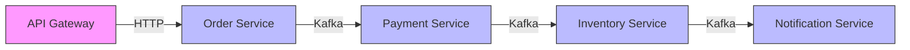

# How to Pass Tracing IDs in Kafka Headers

Author: [nawazdhandala](https://www.github.com/nawazdhandala)

Tags: Kafka, Distributed Tracing, OpenTelemetry, Observability, Headers

Description: Propagate trace context through Kafka messages using headers for end-to-end distributed tracing across microservices.

---

When a request flows through multiple services connected by Kafka, you need distributed tracing to understand the full picture. Kafka headers carry trace context from producer to consumer, letting you correlate logs and traces across your entire system.

## Why Tracing Matters in Event-Driven Systems

Without tracing, debugging Kafka-based systems is painful. A message might pass through five services before failing, and you have no way to connect the dots.



With proper trace propagation, one trace ID connects all these hops.

## Using Kafka Headers for Context

Kafka records support headers since version 0.11. Headers are key-value pairs attached to each message.

```java
// Producing a message with trace headers
public class TracingProducer {

    private final KafkaProducer<String, String> producer;
    private final Tracer tracer;

    public void sendWithTrace(String topic, String key, String value) {
        // Get current trace context
        Span currentSpan = tracer.currentSpan();
        TraceContext context = currentSpan.context();

        ProducerRecord<String, String> record = new ProducerRecord<>(
            topic, key, value
        );

        // Add W3C trace context headers
        // traceparent format: version-traceId-spanId-flags
        String traceparent = String.format("00-%s-%s-01",
            context.traceIdString(),
            context.spanIdString()
        );
        record.headers().add("traceparent", traceparent.getBytes());

        // Optional: add tracestate for vendor-specific data
        record.headers().add("tracestate",
            "vendorname=opaqueValue".getBytes());

        // Add correlation ID for simpler debugging
        record.headers().add("correlation-id",
            context.traceIdString().getBytes());

        producer.send(record, (metadata, exception) -> {
            if (exception != null) {
                currentSpan.recordException(exception);
            }
        });
    }
}
```

## Extracting Context in Consumers

Consumers read headers and restore the trace context before processing.

```java
@Service
public class TracingConsumer {

    private final Tracer tracer;

    @KafkaListener(topics = "orders", groupId = "payment-service")
    public void processOrder(ConsumerRecord<String, String> record) {
        // Extract trace context from headers
        TraceContext parentContext = extractTraceContext(record);

        // Create a new span as a child of the producer's span
        Span consumerSpan = tracer.spanBuilder("process-order")
            .setParent(Context.current().with(parentContext))
            .setSpanKind(SpanKind.CONSUMER)
            .setAttribute("messaging.system", "kafka")
            .setAttribute("messaging.destination", record.topic())
            .setAttribute("messaging.kafka.partition", record.partition())
            .setAttribute("messaging.kafka.offset", record.offset())
            .startSpan();

        try (Scope scope = consumerSpan.makeCurrent()) {
            // Process the message within the trace context
            handleOrder(record.value());

        } catch (Exception e) {
            consumerSpan.recordException(e);
            consumerSpan.setStatus(StatusCode.ERROR, e.getMessage());
            throw e;

        } finally {
            consumerSpan.end();
        }
    }

    private TraceContext extractTraceContext(ConsumerRecord<?, ?> record) {
        Header traceparentHeader = record.headers().lastHeader("traceparent");

        if (traceparentHeader == null) {
            // No trace context - start a new trace
            return null;
        }

        String traceparent = new String(traceparentHeader.value());
        // Parse: 00-traceId-spanId-flags
        String[] parts = traceparent.split("-");

        return TraceContext.create(
            parts[1],  // traceId
            parts[2],  // spanId
            TraceFlags.fromHex(parts[3], 0),
            TraceState.getDefault()
        );
    }
}
```

## OpenTelemetry Auto-Instrumentation

OpenTelemetry provides automatic Kafka instrumentation that handles context propagation.

```java
// build.gradle
dependencies {
    implementation 'io.opentelemetry.instrumentation:opentelemetry-kafka-clients-2.6:1.32.0'
}
```

```java
// Wrap your Kafka producer with tracing
@Configuration
public class KafkaTracingConfig {

    @Bean
    public KafkaProducer<String, String> tracingProducer() {
        Properties props = new Properties();
        props.put("bootstrap.servers", "localhost:9092");
        props.put("key.serializer", StringSerializer.class.getName());
        props.put("value.serializer", StringSerializer.class.getName());

        KafkaProducer<String, String> producer = new KafkaProducer<>(props);

        // Wrap with OpenTelemetry tracing
        return KafkaTelemetry.create(GlobalOpenTelemetry.get())
            .wrap(producer);
    }

    @Bean
    public Consumer<String, String> tracingConsumer() {
        Properties props = new Properties();
        props.put("bootstrap.servers", "localhost:9092");
        props.put("group.id", "my-service");
        props.put("key.deserializer", StringDeserializer.class.getName());
        props.put("value.deserializer", StringDeserializer.class.getName());

        KafkaConsumer<String, String> consumer = new KafkaConsumer<>(props);

        // Wrap with OpenTelemetry tracing
        return KafkaTelemetry.create(GlobalOpenTelemetry.get())
            .wrap(consumer);
    }
}
```

## Spring Kafka with Micrometer Tracing

Spring Boot 3 integrates tracing directly.

```yaml
# application.yml
spring:
  kafka:
    bootstrap-servers: localhost:9092
    producer:
      key-serializer: org.apache.kafka.common.serialization.StringSerializer
      value-serializer: org.apache.kafka.common.serialization.StringSerializer
    consumer:
      group-id: my-service
      key-deserializer: org.apache.kafka.common.serialization.StringDeserializer
      value-deserializer: org.apache.kafka.common.serialization.StringDeserializer

management:
  tracing:
    sampling:
      probability: 1.0  # Sample all traces in dev

# Enable Kafka observation
spring.kafka.listener.observation-enabled: true
spring.kafka.template.observation-enabled: true
```

```java
// No manual instrumentation needed - Spring handles it
@Service
public class OrderService {

    private final KafkaTemplate<String, String> kafkaTemplate;

    // Trace context is automatically propagated
    @Transactional
    public void createOrder(Order order) {
        // Current trace context flows into Kafka headers automatically
        kafkaTemplate.send("orders", order.getId(), toJson(order));
    }
}

@Component
public class PaymentProcessor {

    // Trace context is automatically extracted and continued
    @KafkaListener(topics = "orders")
    public void process(String orderJson) {
        // This runs within the trace started by OrderService
        processPayment(orderJson);
    }
}
```

## Custom Headers for Business Context

Beyond tracing, headers carry business metadata.

```java
public class EnrichedProducer {

    private final KafkaTemplate<String, String> kafkaTemplate;

    public void send(String topic, String key, String value,
                     Map<String, String> metadata) {
        ProducerRecord<String, String> record = new ProducerRecord<>(
            topic, key, value
        );

        // Standard tracing headers (handled by instrumentation)
        // Add business context headers manually

        record.headers().add("source-service",
            "order-service".getBytes(StandardCharsets.UTF_8));
        record.headers().add("api-version",
            "v2".getBytes(StandardCharsets.UTF_8));
        record.headers().add("user-id",
            metadata.get("userId").getBytes(StandardCharsets.UTF_8));
        record.headers().add("tenant-id",
            metadata.get("tenantId").getBytes(StandardCharsets.UTF_8));
        record.headers().add("event-time",
            Instant.now().toString().getBytes(StandardCharsets.UTF_8));

        kafkaTemplate.send(record);
    }
}
```

## Handling Missing Context

Not all messages have trace headers (legacy producers, external systems).

```java
@Service
public class ResilientTracingConsumer {

    private final Tracer tracer;

    @KafkaListener(topics = "external-events")
    public void process(ConsumerRecord<String, String> record) {
        Span span;
        Header traceparent = record.headers().lastHeader("traceparent");

        if (traceparent != null) {
            // Continue existing trace
            TraceContext parentContext = parseTraceparent(
                new String(traceparent.value()));
            span = tracer.spanBuilder("process-external-event")
                .setParent(Context.current().with(parentContext))
                .startSpan();
        } else {
            // Start new trace - use message key or generate ID for correlation
            String correlationId = record.key() != null
                ? record.key()
                : UUID.randomUUID().toString();

            span = tracer.spanBuilder("process-external-event")
                .setNoParent()  // Root span
                .setAttribute("correlation.id", correlationId)
                .setAttribute("messaging.kafka.message_key", record.key())
                .startSpan();
        }

        try (Scope scope = span.makeCurrent()) {
            handleEvent(record.value());
        } finally {
            span.end();
        }
    }
}
```

## Tracing Kafka Streams

Kafka Streams requires manual span management around processing.

```java
public class TracingTransformer implements
        Transformer<String, String, KeyValue<String, String>> {

    private final Tracer tracer;
    private ProcessorContext context;

    @Override
    public void init(ProcessorContext context) {
        this.context = context;
    }

    @Override
    public KeyValue<String, String> transform(String key, String value) {
        // Extract context from record headers
        Headers headers = context.headers();
        TraceContext parentContext = extractContext(headers);

        Span span = tracer.spanBuilder("streams-transform")
            .setParent(Context.current().with(parentContext))
            .setAttribute("kafka.streams.application.id",
                context.applicationId())
            .setAttribute("kafka.streams.task.id",
                context.taskId().toString())
            .startSpan();

        try (Scope scope = span.makeCurrent()) {
            // Transform logic
            String result = process(value);

            // Propagate context to downstream
            String traceparent = formatTraceparent(span.getSpanContext());
            context.headers().add("traceparent", traceparent.getBytes());

            return KeyValue.pair(key, result);

        } finally {
            span.end();
        }
    }
}
```

## Viewing Traces

With proper propagation, traces show the complete message flow in Jaeger, Zipkin, or your observability platform.

```
Trace: abc123
  |
  +-- [API Gateway] POST /orders (45ms)
       |
       +-- [Order Service] create-order (12ms)
            |
            +-- [Kafka Producer] send to orders (3ms)

  +-- [Payment Service] process-order (89ms)
       |
       +-- [Kafka Consumer] receive from orders (2ms)
       |
       +-- [Payment Gateway] charge card (85ms)
       |
       +-- [Kafka Producer] send to payments (2ms)

  +-- [Inventory Service] reserve-inventory (23ms)
       |
       +-- [Kafka Consumer] receive from payments (1ms)
       |
       +-- [Database] update stock (20ms)
```

---

Trace propagation through Kafka headers connects the dots in event-driven systems. Use OpenTelemetry instrumentation for automatic context handling, fall back to manual propagation when needed, and always handle missing context gracefully. The visibility you gain is worth the small overhead of a few extra header bytes.
