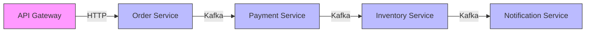

# How to Pass Tracing IDs in Kafka Headers

Author: [nawazdhandala](https://www.github.com/nawazdhandala)

Tags: Kafka, Distributed Tracing, OpenTelemetry, Observability, Header

Description: Propagate trace context through Kafka messages using headers for end-to-end distributed tracing across microservices.

---

When a request flows through multiple services connected by Kafka, you need distributed tracing to understand the full picture. Kafka headers carry trace context from producer to consumer, letting you correlate logs and traces across your entire system.

## Why Tracing Matters in Event-Driven Systems

Without tracing, debugging Kafka-based systems is painful. A message might pass through five services before failing, and you have no way to connect the dots.


```mermaid
flowchart LR
    A[API Gateway] -->|HTTP| B[Order Service]
    B -->|Kafka| C[Payment Service]
    C -->|Kafka| D[Inventory Service]
    D -->|Kafka| E[Notification Service]

    style A fill:#f9f,stroke:#333
    style B fill:#bbf,stroke:#333
    style C fill:#bbf,stroke:#333
    style D fill:#bbf,stroke:#333
    style E fill:#bbf,stroke:#333
```

With proper trace propagation, one trace ID connects all these hops.

## Using Kafka Headers for Context

Kafka records support headers since version 0.11. Headers are key-value pairs attached to each message.

```java
// Producing a message with trace headers
public class TracingProducer {

    private final KafkaProducer<String, String> producer;

    private static final TextMapSetter<Headers> KAFKA_HEADER_SETTER =
        (headers, key, value) -> {
            if (headers != null && value != null) {
                headers.remove(key);
                headers.add(key, value.getBytes(StandardCharsets.UTF_8));
            }
        };

    public void sendWithTrace(String topic, String key, String value) {
        // Get current trace context
        Span currentSpan = Span.current();
        SpanContext context = currentSpan.getSpanContext();

        ProducerRecord<String, String> record = new ProducerRecord<>(
            topic, key, value
        );

        // Add W3C trace context headers using the configured propagator
        GlobalOpenTelemetry.getPropagators()
            .getTextMapPropagator()
            .inject(Context.current(), record.headers(), KAFKA_HEADER_SETTER);

        // Add correlation ID for simpler debugging
        if (context.isValid()) {
            record.headers().add("correlation-id",
                context.getTraceId().getBytes(StandardCharsets.UTF_8));
        }

        producer.send(record, (metadata, exception) -> {
            if (exception != null) {
                currentSpan.recordException(exception);
            }
        });
    }
}
```

If you build headers manually, keep the W3C `traceparent` format intact:

```java
// traceparent format: version-traceId-spanId-flags
SpanContext context = Span.current().getSpanContext();
String traceparent = String.format("00-%s-%s-%s",
    context.getTraceId(),
    context.getSpanId(),
    context.getTraceFlags().asHex()
);
record.headers().add("traceparent",
    traceparent.getBytes(StandardCharsets.UTF_8));
```

## Extracting Context in Consumers

Consumers read headers and restore the trace context before processing.

```java
@Service
public class TracingConsumer {

    private final Tracer tracer;

    private static final TextMapGetter<Headers> KAFKA_HEADER_GETTER =
        new TextMapGetter<Headers>() {
            @Override
            public Iterable<String> keys(Headers headers) {
                List<String> keys = new ArrayList<>();
                if (headers != null) {
                    headers.forEach(header -> keys.add(header.key()));
                }
                return keys;
            }

            @Override
            public String get(Headers headers, String key) {
                if (headers == null) {
                    return null;
                }
                Header header = headers.lastHeader(key);
                return header == null
                    ? null
                    : new String(header.value(), StandardCharsets.UTF_8);
            }
        };

    @KafkaListener(topics = "orders", groupId = "payment-service")
    public void processOrder(ConsumerRecord<String, String> record) {
        // Extract trace context from headers
        Context parentContext = extractTraceContext(record);

        // Create a new span as a child of the producer's span
        SpanBuilder spanBuilder = tracer.spanBuilder("process-order")
            .setSpanKind(SpanKind.CONSUMER)
            .setAttribute("messaging.system", "kafka")
            .setAttribute("messaging.destination.name", record.topic())
            .setAttribute("messaging.kafka.source.partition", record.partition())
            .setAttribute("messaging.kafka.message.offset", record.offset());

        if (Span.fromContext(parentContext).getSpanContext().isValid()) {
            spanBuilder.setParent(parentContext);
        } else {
            spanBuilder.setNoParent();
        }

        Span consumerSpan = spanBuilder.startSpan();

        try (Scope scope = consumerSpan.makeCurrent()) {
            // Process the message within the trace context
            handleOrder(record.value());

        } catch (Exception e) {
            consumerSpan.recordException(e);
            consumerSpan.setStatus(StatusCode.ERROR, e.getMessage());
            throw e;

        } finally {
            consumerSpan.end();
        }
    }

    private Context extractTraceContext(ConsumerRecord<?, ?> record) {
        return GlobalOpenTelemetry.getPropagators()
            .getTextMapPropagator()
            .extract(Context.current(), record.headers(), KAFKA_HEADER_GETTER);
    }
}
```

If you parse `traceparent` directly, create a remote parent `SpanContext`:

```java
String traceparent = new String(traceparentHeader.value(),
    StandardCharsets.UTF_8);
String[] parts = traceparent.split("-");

SpanContext parentSpanContext = SpanContext.createFromRemoteParent(
    parts[1],  // traceId
    parts[2],  // spanId
    TraceFlags.fromHex(parts[3], 0),
    TraceState.getDefault()
);

Context parentContext = Context.current()
    .with(Span.wrap(parentSpanContext));
```

## OpenTelemetry Kafka Instrumentation

OpenTelemetry provides Kafka client instrumentation that handles context propagation.

```java
// build.gradle
dependencies {
    implementation platform('io.opentelemetry.instrumentation:opentelemetry-instrumentation-bom-alpha:2.28.1-alpha')
    implementation 'io.opentelemetry.instrumentation:opentelemetry-kafka-clients-2.6'
}
```

```java
// Wrap your Kafka producer with tracing
@Configuration
public class KafkaTracingConfig {

    @Bean
    public Producer<String, String> tracingProducer() {
        Properties props = new Properties();
        props.put("bootstrap.servers", "localhost:9092");
        props.put("key.serializer", StringSerializer.class.getName());
        props.put("value.serializer", StringSerializer.class.getName());

        KafkaProducer<String, String> producer = new KafkaProducer<>(props);

        // Wrap with OpenTelemetry tracing
        return KafkaTelemetry.create(GlobalOpenTelemetry.get())
            .wrap(producer);
    }

    @Bean
    public Consumer<String, String> tracingConsumer() {
        Properties props = new Properties();
        props.put("bootstrap.servers", "localhost:9092");
        props.put("group.id", "my-service");
        props.put("key.deserializer", StringDeserializer.class.getName());
        props.put("value.deserializer", StringDeserializer.class.getName());

        KafkaConsumer<String, String> consumer = new KafkaConsumer<>(props);

        // Wrap with OpenTelemetry tracing
        return KafkaTelemetry.create(GlobalOpenTelemetry.get())
            .wrap(consumer);
    }
}
```

## Spring Kafka with Micrometer Tracing

Spring Boot 3 integrates tracing directly.

```yaml
# application.yml

spring:
  kafka:
    bootstrap-servers: localhost:9092
    producer:
      key-serializer: org.apache.kafka.common.serialization.StringSerializer
      value-serializer: org.apache.kafka.common.serialization.StringSerializer
    consumer:
      group-id: my-service
      key-deserializer: org.apache.kafka.common.serialization.StringDeserializer
      value-deserializer: org.apache.kafka.common.serialization.StringDeserializer

management:
  tracing:
    sampling:
      probability: 1.0  # Sample all traces in dev

# Enable Kafka observation
spring.kafka.listener.observation-enabled: true
spring.kafka.template.observation-enabled: true
```

```java
// No manual instrumentation needed - Spring handles it
@Service
public class OrderService {

    private final KafkaTemplate<String, String> kafkaTemplate;

    // Trace context is automatically propagated
    @Transactional
    public void createOrder(Order order) {
        // Current trace context flows into Kafka headers automatically
        kafkaTemplate.send("orders", order.getId(), toJson(order));
    }
}

@Component
public class PaymentProcessor {

    // Trace context is automatically extracted and continued
    @KafkaListener(topics = "orders")
    public void process(String orderJson) {
        // This runs within the trace started by OrderService
        processPayment(orderJson);
    }
}
```

## Custom Headers for Business Context

Beyond tracing, headers carry business metadata.

```java
public class EnrichedProducer {

    private final KafkaTemplate<String, String> kafkaTemplate;

    public void send(String topic, String key, String value,
                     Map<String, String> metadata) {
        ProducerRecord<String, String> record = new ProducerRecord<>(
            topic, key, value
        );

        // Standard tracing headers (handled by instrumentation)
        // Add business context headers manually

        record.headers().add("source-service",
            "order-service".getBytes(StandardCharsets.UTF_8));
        record.headers().add("api-version",
            "v2".getBytes(StandardCharsets.UTF_8));
        record.headers().add("user-id",
            metadata.get("userId").getBytes(StandardCharsets.UTF_8));
        record.headers().add("tenant-id",
            metadata.get("tenantId").getBytes(StandardCharsets.UTF_8));
        record.headers().add("event-time",
            Instant.now().toString().getBytes(StandardCharsets.UTF_8));

        kafkaTemplate.send(record);
    }
}
```

## Handling Missing Context

Not all messages have trace headers (legacy producers, external systems).

```java
@Service
public class ResilientTracingConsumer {

    private final Tracer tracer;

    @KafkaListener(topics = "external-events")
    public void process(ConsumerRecord<String, String> record) {
        Context parentContext = GlobalOpenTelemetry.getPropagators()
            .getTextMapPropagator()
            .extract(Context.current(), record.headers(), KAFKA_HEADER_GETTER);

        SpanBuilder spanBuilder = tracer.spanBuilder("process-external-event")
            .setSpanKind(SpanKind.CONSUMER)
            .setAttribute("messaging.system", "kafka");

        if (Span.fromContext(parentContext).getSpanContext().isValid()) {
            // Continue existing trace
            spanBuilder.setParent(parentContext);
        } else {
            // Start new trace - use message key or generate ID for correlation
            String correlationId = record.key() != null
                ? record.key()
                : UUID.randomUUID().toString();

            spanBuilder
                .setNoParent()  // Root span
                .setAttribute("correlation.id", correlationId);
            if (record.key() != null) {
                spanBuilder.setAttribute("messaging.kafka.message_key",
                    record.key());
            }
        }

        Span span = spanBuilder.startSpan();

        try (Scope scope = span.makeCurrent()) {
            handleEvent(record.value());
        } finally {
            span.end();
        }
    }
}
```

## Tracing Kafka Streams

Kafka Streams requires manual span management around processing.

```java
public class TracingProcessor implements
        Processor<String, String, String, String> {

    private final Tracer tracer;
    private ProcessorContext<String, String> context;

    @Override
    public void init(ProcessorContext<String, String> context) {
        this.context = context;
    }

    @Override
    public void process(Record<String, String> record) {
        // Extract context from record headers
        Headers headers = new RecordHeaders(record.headers());
        Context parentContext = GlobalOpenTelemetry.getPropagators()
            .getTextMapPropagator()
            .extract(Context.current(), headers, KAFKA_HEADER_GETTER);

        SpanBuilder spanBuilder = tracer.spanBuilder("streams-process")
            .setAttribute("messaging.system", "kafka");

        if (Span.fromContext(parentContext).getSpanContext().isValid()) {
            spanBuilder.setParent(parentContext);
        } else {
            spanBuilder.setNoParent();
        }

        Span span = spanBuilder.startSpan();

        try (Scope scope = span.makeCurrent()) {
            // Transform logic
            String result = transformValue(record.value());

            // Propagate context to downstream
            GlobalOpenTelemetry.getPropagators()
                .getTextMapPropagator()
                .inject(Context.current(), headers, KAFKA_HEADER_SETTER);

            context.forward(record.withValue(result).withHeaders(headers));
        } finally {
            span.end();
        }
    }
}
```

## Viewing Traces

With proper propagation, traces show the complete message flow in Jaeger, Zipkin, or your observability platform.

```text
Trace: abc123
  |
  +-- [API Gateway] POST /orders (45ms)
       |
       +-- [Order Service] create-order (12ms)
            |
            +-- [Kafka Producer] send to orders (3ms)

  +-- [Payment Service] process-order (89ms)
       |
       +-- [Kafka Consumer] receive from orders (2ms)
       |
       +-- [Payment Gateway] charge card (85ms)
       |
       +-- [Kafka Producer] send to payments (2ms)

  +-- [Inventory Service] reserve-inventory (23ms)
       |
       +-- [Kafka Consumer] receive from payments (1ms)
       |
       +-- [Database] update stock (20ms)
```

---

Trace propagation through Kafka headers connects the dots in event-driven systems. Use OpenTelemetry instrumentation for automatic context handling, fall back to manual propagation when needed, and always handle missing context gracefully. The visibility you gain is worth the small overhead of a few extra header bytes.
