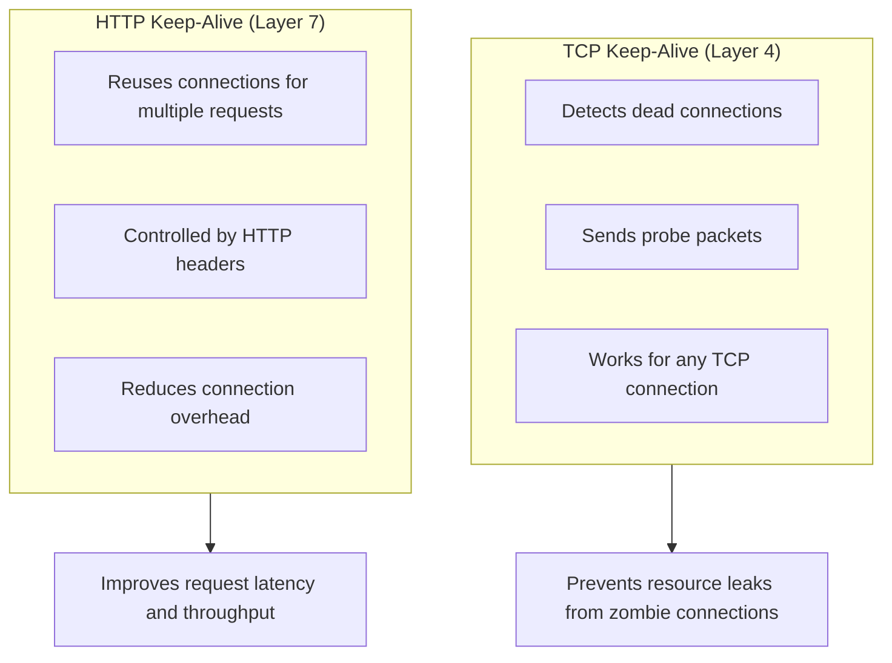
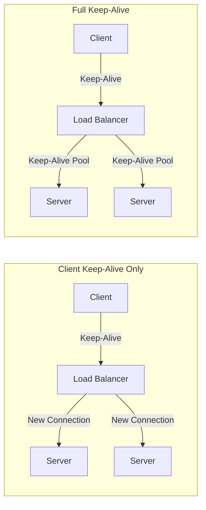

# How to Configure Keep-Alive Settings

Author: [nawazdhandala](https://www.github.com/nawazdhandala)

Tags: Networking, TCP, HTTP, Keep-Alive, Performance, Connection Pooling, Optimization

Description: Learn how to configure TCP and HTTP keep-alive settings to improve performance and reduce latency. This guide covers Linux kernel tuning, web server configuration, and client-side settings.

---

Keep-alive mechanisms maintain persistent connections between clients and servers, avoiding the overhead of establishing new connections for each request. Proper keep-alive configuration can dramatically reduce latency and server load. This guide covers both TCP keep-alive (detecting dead connections) and HTTP keep-alive (connection reuse).

## TCP Keep-Alive vs HTTP Keep-Alive

These serve different purposes and work at different layers:



## Linux TCP Keep-Alive Configuration

Configure system-wide TCP keep-alive settings:

```bash
#!/bin/bash
# tcp_keepalive_tuning.sh - Configure TCP keep-alive parameters

# View current settings
echo "Current TCP keep-alive settings:"
echo "  tcp_keepalive_time:   $(cat /proc/sys/net/ipv4/tcp_keepalive_time) seconds"
echo "  tcp_keepalive_intvl:  $(cat /proc/sys/net/ipv4/tcp_keepalive_intvl) seconds"
echo "  tcp_keepalive_probes: $(cat /proc/sys/net/ipv4/tcp_keepalive_probes)"

# Configure keep-alive settings
# tcp_keepalive_time: Time before sending first probe (default: 7200s = 2 hours)
# tcp_keepalive_intvl: Interval between probes (default: 75s)
# tcp_keepalive_probes: Number of probes before declaring connection dead (default: 9)

# More aggressive settings for cloud environments
# Total time to detect dead connection: 60 + (10 * 6) = 120 seconds
sysctl -w net.ipv4.tcp_keepalive_time=60
sysctl -w net.ipv4.tcp_keepalive_intvl=10
sysctl -w net.ipv4.tcp_keepalive_probes=6

# Make persistent across reboots
cat >> /etc/sysctl.conf << EOF
# TCP Keep-Alive settings
net.ipv4.tcp_keepalive_time = 60
net.ipv4.tcp_keepalive_intvl = 10
net.ipv4.tcp_keepalive_probes = 6
EOF

sysctl -p
```

## Application-Level TCP Keep-Alive

Set keep-alive per socket for finer control:

```python
# socket_keepalive.py - Configure TCP keep-alive on individual sockets
import socket

def create_keepalive_socket(
    keepalive_time: int = 60,
    keepalive_interval: int = 10,
    keepalive_probes: int = 6
) -> socket.socket:
    """Create a TCP socket with keep-alive enabled"""
    sock = socket.socket(socket.AF_INET, socket.SOCK_STREAM)

    # Enable TCP keep-alive
    sock.setsockopt(socket.SOL_SOCKET, socket.SO_KEEPALIVE, 1)

    # Linux-specific options
    # TCP_KEEPIDLE: Time before first probe
    sock.setsockopt(socket.IPPROTO_TCP, socket.TCP_KEEPIDLE, keepalive_time)

    # TCP_KEEPINTVL: Interval between probes
    sock.setsockopt(socket.IPPROTO_TCP, socket.TCP_KEEPINTVL, keepalive_interval)

    # TCP_KEEPCNT: Number of probes before failure
    sock.setsockopt(socket.IPPROTO_TCP, socket.TCP_KEEPCNT, keepalive_probes)

    return sock

# Example server with keep-alive
def run_server():
    server = create_keepalive_socket()
    server.setsockopt(socket.SOL_SOCKET, socket.SO_REUSEADDR, 1)
    server.bind(('0.0.0.0', 8080))
    server.listen(10)

    print("Server listening with TCP keep-alive enabled")

    while True:
        client, addr = server.accept()
        # Client socket inherits keep-alive settings
        print(f"Connection from {addr}")
        # Handle client...

# Example with requests library (Python HTTP client)
import requests
from requests.adapters import HTTPAdapter

class KeepAliveAdapter(HTTPAdapter):
    """HTTP adapter with custom keep-alive settings"""

    def init_poolmanager(self, *args, **kwargs):
        # Configure connection pool keep-alive
        kwargs['socket_options'] = [
            (socket.SOL_SOCKET, socket.SO_KEEPALIVE, 1),
            (socket.IPPROTO_TCP, socket.TCP_KEEPIDLE, 60),
            (socket.IPPROTO_TCP, socket.TCP_KEEPINTVL, 10),
            (socket.IPPROTO_TCP, socket.TCP_KEEPCNT, 6),
        ]
        super().init_poolmanager(*args, **kwargs)

# Use the custom adapter
session = requests.Session()
session.mount('http://', KeepAliveAdapter())
session.mount('https://', KeepAliveAdapter())
```

## Go TCP Keep-Alive

```go
// tcp_keepalive.go - TCP keep-alive configuration in Go
package main

import (
    "net"
    "time"
)

func createKeepAliveListener(addr string) (net.Listener, error) {
    config := &net.ListenConfig{
        KeepAlive: 60 * time.Second, // Keep-alive interval
    }

    return config.Listen(nil, "tcp", addr)
}

func setKeepAlive(conn *net.TCPConn) error {
    // Enable keep-alive
    if err := conn.SetKeepAlive(true); err != nil {
        return err
    }

    // Set keep-alive period
    if err := conn.SetKeepAlivePeriod(60 * time.Second); err != nil {
        return err
    }

    return nil
}

// HTTP client with keep-alive
func createHTTPClient() *http.Client {
    transport := &http.Transport{
        DialContext: (&net.Dialer{
            Timeout:   30 * time.Second,
            KeepAlive: 60 * time.Second, // TCP keep-alive
        }).DialContext,
        MaxIdleConns:        100,
        MaxIdleConnsPerHost: 10,
        IdleConnTimeout:     90 * time.Second,
    }

    return &http.Client{
        Transport: transport,
        Timeout:   30 * time.Second,
    }
}
```

## HTTP Keep-Alive Configuration

### NGINX

```nginx
# nginx_keepalive.conf - HTTP keep-alive configuration

http {
    # Client-side keep-alive
    # Maximum time to keep connection open with client
    keepalive_timeout 65s;

    # Maximum requests per keep-alive connection
    keepalive_requests 1000;

    # Upstream (backend) keep-alive
    upstream backend {
        server 10.0.1.10:8080;
        server 10.0.1.11:8080;

        # Number of idle keep-alive connections to backends
        keepalive 32;

        # Maximum time a keep-alive connection can be idle
        keepalive_timeout 60s;

        # Maximum requests per backend keep-alive connection
        keepalive_requests 100;
    }

    server {
        listen 80;

        location / {
            proxy_pass http://backend;

            # Required for upstream keep-alive
            proxy_http_version 1.1;
            proxy_set_header Connection "";

            # Alternative: explicitly close connections
            # proxy_set_header Connection "close";
        }
    }
}
```

### HAProxy

```haproxy
# haproxy_keepalive.cfg - HTTP keep-alive configuration

global
    maxconn 50000

defaults
    mode http

    # HTTP keep-alive mode
    # tunnel: hold connection open (for websockets)
    # http-keep-alive: allow multiple requests per connection
    # httpclose: close after each request
    # http-server-close: keep-alive to client, close to server
    option http-keep-alive

    # Keep-alive timeout (client side)
    timeout http-keep-alive 10s

    # Other timeouts
    timeout connect 5s
    timeout client 30s
    timeout server 30s

frontend http_front
    bind *:80

    # ACL to detect keep-alive support
    acl is_http11 req.ver 1.1

    default_backend http_back

backend http_back
    balance roundrobin

    # Keep-alive to backend servers
    option http-keep-alive

    # Reuse connections to backends
    http-reuse safe

    server web1 10.0.1.10:8080 check
    server web2 10.0.1.11:8080 check
```

### Apache

```apache
# httpd.conf - Apache keep-alive configuration

# Enable keep-alive
KeepAlive On

# Maximum requests per keep-alive connection
MaxKeepAliveRequests 100

# Timeout for keep-alive connections (seconds)
KeepAliveTimeout 5

# Worker MPM settings
<IfModule mpm_worker_module>
    # Threads affect keep-alive capacity
    ServerLimit 16
    StartServers 4
    MaxRequestWorkers 400
    MinSpareThreads 75
    MaxSpareThreads 250
    ThreadsPerChild 25
</IfModule>
```

## Load Balancer Keep-Alive Strategies

Different strategies for different scenarios:



```nginx
# Strategy 1: Keep-alive to clients only (simpler load distribution)
upstream backend_no_keepalive {
    server 10.0.1.10:8080;
    server 10.0.1.11:8080;
    # No keepalive directive - new connection per request
}

server {
    listen 80;
    keepalive_timeout 65s;  # Client keep-alive

    location / {
        proxy_pass http://backend_no_keepalive;
        proxy_http_version 1.1;
        proxy_set_header Connection "close";  # Force close to backend
    }
}

# Strategy 2: Full keep-alive (better performance, requires careful tuning)
upstream backend_with_keepalive {
    server 10.0.1.10:8080;
    server 10.0.1.11:8080;
    keepalive 32;
    keepalive_timeout 60s;
}

server {
    listen 80;
    keepalive_timeout 65s;

    location / {
        proxy_pass http://backend_with_keepalive;
        proxy_http_version 1.1;
        proxy_set_header Connection "";  # Enable backend keep-alive
    }
}
```

## Database Connection Keep-Alive

### PostgreSQL

```python
# postgres_keepalive.py - PostgreSQL connection with keep-alive
import psycopg2
from psycopg2 import pool

# Connection string with TCP keep-alive
conn_params = {
    'host': 'db.example.com',
    'database': 'myapp',
    'user': 'appuser',
    'password': 'secret',
    # TCP keep-alive settings via options
    'keepalives': 1,
    'keepalives_idle': 30,      # Seconds before first probe
    'keepalives_interval': 10,  # Seconds between probes
    'keepalives_count': 5,      # Probes before failure
}

# Single connection
conn = psycopg2.connect(**conn_params)

# Connection pool with keep-alive
db_pool = pool.ThreadedConnectionPool(
    minconn=5,
    maxconn=20,
    **conn_params
)

def get_connection():
    """Get connection from pool"""
    return db_pool.getconn()

def return_connection(conn):
    """Return connection to pool"""
    db_pool.putconn(conn)
```

### Redis

```python
# redis_keepalive.py - Redis connection with keep-alive
import redis

# Connection with TCP keep-alive
client = redis.Redis(
    host='redis.example.com',
    port=6379,
    db=0,
    # Socket options for keep-alive
    socket_keepalive=True,
    socket_keepalive_options={
        # Linux-specific options
        1: 60,   # TCP_KEEPIDLE
        2: 10,   # TCP_KEEPINTVL
        3: 6,    # TCP_KEEPCNT
    },
    # Connection pool keep-alive
    health_check_interval=30,
)

# Connection pool configuration
pool = redis.ConnectionPool(
    host='redis.example.com',
    port=6379,
    db=0,
    max_connections=50,
    socket_keepalive=True,
    socket_keepalive_options={1: 60, 2: 10, 3: 6},
)

client_with_pool = redis.Redis(connection_pool=pool)
```

## Kubernetes Service Keep-Alive

Configure keep-alive in Kubernetes deployments:

```yaml
# deployment-with-keepalive.yaml
apiVersion: apps/v1
kind: Deployment
metadata:
  name: web-app
spec:
  replicas: 3
  selector:
    matchLabels:
      app: web-app
  template:
    metadata:
      labels:
        app: web-app
    spec:
      containers:
        - name: app
          image: myapp:latest
          ports:
            - containerPort: 8080
          env:
            # Application-level keep-alive configuration
            - name: HTTP_KEEPALIVE_TIMEOUT
              value: "65"
            - name: HTTP_KEEPALIVE_MAX_REQUESTS
              value: "1000"

---
# NGINX Ingress with keep-alive configuration
apiVersion: networking.k8s.io/v1
kind: Ingress
metadata:
  name: web-ingress
  annotations:
    # Client keep-alive
    nginx.ingress.kubernetes.io/proxy-http-version: "1.1"
    nginx.ingress.kubernetes.io/upstream-keepalive-connections: "32"
    nginx.ingress.kubernetes.io/upstream-keepalive-timeout: "60"
    nginx.ingress.kubernetes.io/upstream-keepalive-requests: "100"
spec:
  rules:
    - host: api.example.com
      http:
        paths:
          - path: /
            pathType: Prefix
            backend:
              service:
                name: web-service
                port:
                  number: 80
```

## Monitoring Keep-Alive Effectiveness

Track keep-alive metrics:

```python
# keepalive_metrics.py - Monitor keep-alive connection reuse
from prometheus_client import Counter, Gauge, Histogram

# Connection reuse metrics
connections_created = Counter(
    'http_connections_created_total',
    'Total new connections created',
    ['target_host']
)

connections_reused = Counter(
    'http_connections_reused_total',
    'Total connections reused via keep-alive',
    ['target_host']
)

connection_pool_size = Gauge(
    'http_connection_pool_size',
    'Current size of connection pool',
    ['target_host']
)

connection_idle_time = Histogram(
    'http_connection_idle_seconds',
    'Time connections spend idle before reuse',
    ['target_host'],
    buckets=[1, 5, 10, 30, 60, 120, 300]
)

# Calculate reuse ratio
# reuse_ratio = connections_reused / (connections_created + connections_reused)
```

Check connection reuse in NGINX:

```bash
# Monitor NGINX upstream connections
# Check for connection reuse vs new connections
tail -f /var/log/nginx/access.log | \
    awk '{print $NF}' | \
    sort | uniq -c | sort -rn

# Check upstream keepalive status
curl -s http://localhost/nginx_status

# Active connections: 543
# server accepts handled requests
#  1234567 1234567 9876543
# Reading: 5 Writing: 10 Waiting: 528
#
# "Waiting" indicates keep-alive connections
```

## Best Practices

1. **Balance connection limits** - Too few keep-alive connections causes connection overhead. Too many wastes resources.

2. **Match timeouts** - Keep-alive timeout on server should be longer than on client to avoid connection resets.

3. **Consider load distribution** - Keep-alive can cause uneven load distribution. New connections spread load better.

4. **Monitor connection reuse** - Track reuse ratio to verify keep-alive is working effectively.

5. **Tune for your workload** - Batch processing benefits from keep-alive. Sporadic requests may not.

6. **Test failover** - Ensure keep-alive connections are properly drained during deployments.

7. **Use HTTP/2** - HTTP/2 multiplexing is more efficient than HTTP/1.1 keep-alive for high-concurrency scenarios.

## Conclusion

Keep-alive connections reduce latency and server load by avoiding repeated connection establishment. Configure TCP keep-alive to detect dead connections, HTTP keep-alive for connection reuse, and tune values based on your workload patterns. Monitor connection reuse metrics to verify effectiveness, and remember that keep-alive is just one tool in your performance optimization toolkit.
