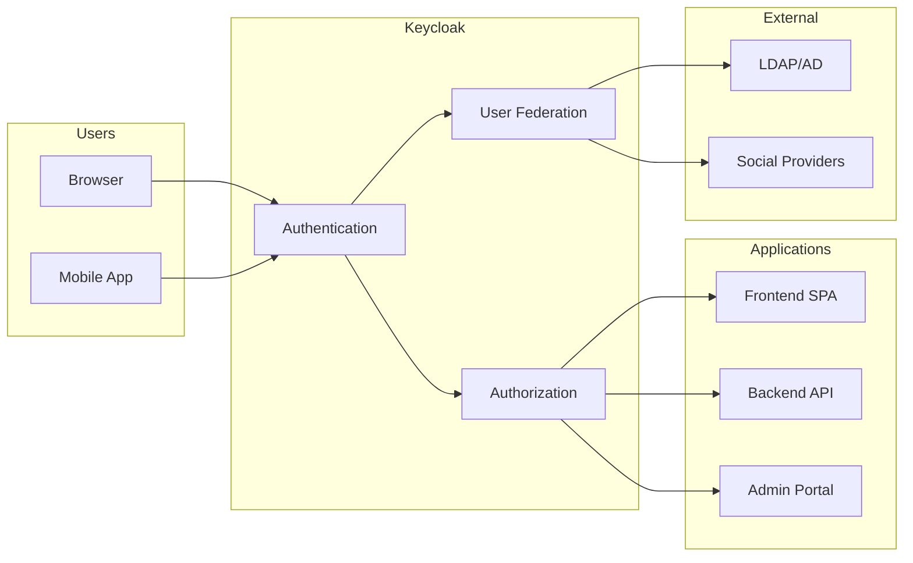

# How to Configure Keycloak for Identity Management

Author: [nawazdhandala](https://www.github.com/nawazdhandala)

Tags: Security, Keycloak, Identity Management, SSO, OAuth2, OIDC, Authentication, Authorization

Description: Learn how to deploy and configure Keycloak as a centralized identity provider for single sign-on, user federation, and fine-grained authorization across your applications.

---

Managing user authentication across multiple applications quickly becomes a mess of password databases and inconsistent security policies. Keycloak provides a centralized identity management solution supporting OAuth 2.0, OpenID Connect, and SAML. This guide covers deployment, realm configuration, user federation, and application integration.

## What Keycloak Provides

Keycloak handles identity concerns so your applications do not have to:

- **Single Sign-On (SSO)**: One login for all applications
- **User Federation**: Connect to LDAP, Active Directory, or external providers
- **Social Login**: Google, GitHub, Facebook, and others
- **Multi-Factor Authentication**: TOTP, WebAuthn, SMS
- **Fine-Grained Authorization**: Role-based and attribute-based access control
- **Admin Console**: Web UI for managing users, roles, and clients
- **Account Management**: Self-service portal for users

## Architecture Overview



## Deploying Keycloak

### Docker Compose (Development)

```yaml
# docker-compose.yml
version: '3.8'

services:
  keycloak:
    image: quay.io/keycloak/keycloak:23.0
    container_name: keycloak
    environment:
      KEYCLOAK_ADMIN: admin
      KEYCLOAK_ADMIN_PASSWORD: admin
      KC_DB: postgres
      KC_DB_URL: jdbc:postgresql://postgres:5432/keycloak
      KC_DB_USERNAME: keycloak
      KC_DB_PASSWORD: keycloak
    command: start-dev
    ports:
      - "8080:8080"
    depends_on:
      - postgres

  postgres:
    image: postgres:15
    container_name: keycloak-db
    environment:
      POSTGRES_DB: keycloak
      POSTGRES_USER: keycloak
      POSTGRES_PASSWORD: keycloak
    volumes:
      - postgres_data:/var/lib/postgresql/data

volumes:
  postgres_data:
```

Start Keycloak:

```bash
docker-compose up -d
```

Access the admin console at http://localhost:8080/admin (credentials: admin/admin).

### Kubernetes with Helm

```bash
# Add the Bitnami repository
helm repo add bitnami https://charts.bitnami.com/bitnami
helm repo update

# Install Keycloak
helm install keycloak bitnami/keycloak \
  --namespace keycloak \
  --create-namespace \
  --set auth.adminUser=admin \
  --set auth.adminPassword=your-secure-password \
  --set postgresql.enabled=true \
  --set postgresql.auth.postgresPassword=postgres-password
```

## Creating a Realm

Realms isolate users and applications. Create a realm for your organization:

1. Log into Admin Console
2. Click the dropdown next to "master" realm
3. Click "Create Realm"
4. Enter realm name (e.g., "mycompany")
5. Click "Create"

Or use the CLI:

```bash
# Get admin token
TOKEN=$(curl -s -X POST "http://localhost:8080/realms/master/protocol/openid-connect/token" \
  -H "Content-Type: application/x-www-form-urlencoded" \
  -d "username=admin" \
  -d "password=admin" \
  -d "grant_type=password" \
  -d "client_id=admin-cli" | jq -r '.access_token')

# Create realm
curl -X POST "http://localhost:8080/admin/realms" \
  -H "Authorization: Bearer $TOKEN" \
  -H "Content-Type: application/json" \
  -d '{
    "realm": "mycompany",
    "enabled": true,
    "displayName": "My Company"
  }'
```

## Configuring Clients (Applications)

Register each application as a client in Keycloak.

### For a Single Page Application (SPA)

```json
{
  "clientId": "frontend-spa",
  "name": "Frontend Application",
  "enabled": true,
  "publicClient": true,
  "standardFlowEnabled": true,
  "directAccessGrantsEnabled": false,
  "rootUrl": "https://app.example.com",
  "redirectUris": [
    "https://app.example.com/*"
  ],
  "webOrigins": [
    "https://app.example.com"
  ],
  "attributes": {
    "pkce.code.challenge.method": "S256"
  }
}
```

Create via Admin Console:
1. Go to Clients > Create client
2. Set Client ID: "frontend-spa"
3. Client authentication: Off (public client)
4. Authorization: Off
5. Set Valid redirect URIs
6. Enable PKCE for security

### For a Backend API (Confidential Client)

```json
{
  "clientId": "backend-api",
  "name": "Backend API",
  "enabled": true,
  "publicClient": false,
  "clientAuthenticatorType": "client-secret",
  "serviceAccountsEnabled": true,
  "standardFlowEnabled": false,
  "directAccessGrantsEnabled": false
}
```

After creation, note the client secret from the Credentials tab.

## User Federation with LDAP

Connect Keycloak to your existing LDAP/Active Directory:

1. Go to User Federation > Add provider > LDAP
2. Configure connection:

```yaml
# LDAP Configuration
Vendor: Active Directory
Connection URL: ldap://ldap.example.com:389
Bind DN: cn=admin,dc=example,dc=com
Bind Credential: your-ldap-password

# User Search
Users DN: ou=users,dc=example,dc=com
Username LDAP attribute: sAMAccountName
UUID LDAP attribute: objectGUID
User Object Classes: person, organizationalPerson, user

# Sync Settings
Sync Registrations: Off
Import Users: On
Periodic Full Sync: On
Full Sync Period: 86400  # Daily
Periodic Changed Users Sync: On
Changed Users Sync Period: 3600  # Hourly
```

Test the connection and synchronize users:

```bash
# Trigger sync via API
curl -X POST "http://localhost:8080/admin/realms/mycompany/user-storage/$PROVIDER_ID/sync?action=triggerFullSync" \
  -H "Authorization: Bearer $TOKEN"
```

## Configuring Social Login

Add Google as an identity provider:

1. Go to Identity Providers > Add provider > Google
2. Enter credentials from Google Cloud Console:

```yaml
Client ID: your-google-client-id.apps.googleusercontent.com
Client Secret: your-google-client-secret
```

3. Copy the Redirect URI to Google Cloud Console

Users can now log in with their Google accounts.

## Setting Up Multi-Factor Authentication

Enable TOTP for all users:

1. Go to Authentication > Required Actions
2. Enable "Configure OTP" as Default Action

Or make it conditional based on roles:

```json
{
  "alias": "mfa-required-flow",
  "description": "MFA for privileged users",
  "providerId": "basic-flow",
  "topLevel": true,
  "builtIn": false,
  "authenticationExecutions": [
    {
      "authenticator": "auth-username-password-form",
      "requirement": "REQUIRED"
    },
    {
      "authenticator": "auth-otp-form",
      "requirement": "CONDITIONAL"
    }
  ]
}
```

## Integrating Applications

### Node.js/Express with Passport

```javascript
// app.js
const express = require('express');
const passport = require('passport');
const KeycloakStrategy = require('passport-keycloak-oauth2-oidc').Strategy;

const app = express();

// Configure Keycloak strategy
passport.use(new KeycloakStrategy({
    clientID: 'backend-api',
    clientSecret: 'your-client-secret',
    realm: 'mycompany',
    authServerURL: 'http://localhost:8080',
    callbackURL: 'http://localhost:3000/auth/callback'
  },
  (accessToken, refreshToken, profile, done) => {
    // Find or create user in your database
    return done(null, profile);
  }
));

// Routes
app.get('/auth/login', passport.authenticate('keycloak'));

app.get('/auth/callback',
  passport.authenticate('keycloak', { failureRedirect: '/login' }),
  (req, res) => {
    res.redirect('/dashboard');
  }
);

// Protected route
app.get('/api/protected', ensureAuthenticated, (req, res) => {
  res.json({ user: req.user });
});

function ensureAuthenticated(req, res, next) {
  if (req.isAuthenticated()) {
    return next();
  }
  res.status(401).json({ error: 'Unauthorized' });
}
```

### React SPA with keycloak-js

```javascript
// keycloak.js
import Keycloak from 'keycloak-js';

const keycloak = new Keycloak({
  url: 'http://localhost:8080',
  realm: 'mycompany',
  clientId: 'frontend-spa'
});

export default keycloak;

// App.jsx
import React, { useEffect, useState } from 'react';
import keycloak from './keycloak';

function App() {
  const [authenticated, setAuthenticated] = useState(false);

  useEffect(() => {
    keycloak.init({
      onLoad: 'check-sso',
      pkceMethod: 'S256'
    }).then((auth) => {
      setAuthenticated(auth);

      // Auto-refresh token
      setInterval(() => {
        keycloak.updateToken(30).catch(() => {
          console.log('Failed to refresh token');
        });
      }, 60000);
    });
  }, []);

  const login = () => keycloak.login();
  const logout = () => keycloak.logout();

  if (!authenticated) {
    return <button onClick={login}>Login</button>;
  }

  return (
    <div>
      <p>Welcome, {keycloak.tokenParsed?.preferred_username}</p>
      <button onClick={logout}>Logout</button>
    </div>
  );
}

export default App;
```

### Validating Tokens in APIs

```python
# Python FastAPI example
from fastapi import FastAPI, Depends, HTTPException
from fastapi.security import OAuth2AuthorizationCodeBearer
import httpx
from jose import jwt, JWTError

app = FastAPI()

oauth2_scheme = OAuth2AuthorizationCodeBearer(
    authorizationUrl="http://localhost:8080/realms/mycompany/protocol/openid-connect/auth",
    tokenUrl="http://localhost:8080/realms/mycompany/protocol/openid-connect/token",
)

# Cache the JWKS
jwks_client = None

async def get_jwks():
    global jwks_client
    if jwks_client is None:
        async with httpx.AsyncClient() as client:
            response = await client.get(
                "http://localhost:8080/realms/mycompany/protocol/openid-connect/certs"
            )
            jwks_client = response.json()
    return jwks_client

async def verify_token(token: str = Depends(oauth2_scheme)):
    try:
        jwks = await get_jwks()
        # Decode and validate the token
        payload = jwt.decode(
            token,
            jwks,
            algorithms=["RS256"],
            audience="backend-api"
        )
        return payload
    except JWTError as e:
        raise HTTPException(status_code=401, detail=str(e))

@app.get("/api/protected")
async def protected_route(token_data: dict = Depends(verify_token)):
    return {"user": token_data.get("preferred_username")}
```

## Role-Based Access Control

Create roles and assign to users:

```bash
# Create realm role
curl -X POST "http://localhost:8080/admin/realms/mycompany/roles" \
  -H "Authorization: Bearer $TOKEN" \
  -H "Content-Type: application/json" \
  -d '{"name": "admin"}'

# Assign role to user
curl -X POST "http://localhost:8080/admin/realms/mycompany/users/$USER_ID/role-mappings/realm" \
  -H "Authorization: Bearer $TOKEN" \
  -H "Content-Type: application/json" \
  -d '[{"name": "admin"}]'
```

Check roles in your application:

```javascript
// Check if user has admin role
const hasAdminRole = keycloak.hasRealmRole('admin');
```

---

Keycloak centralizes authentication and authorization, eliminating the need to build login systems for every application. Start with a single realm and a few applications, then expand to user federation and advanced features as your identity needs grow.
