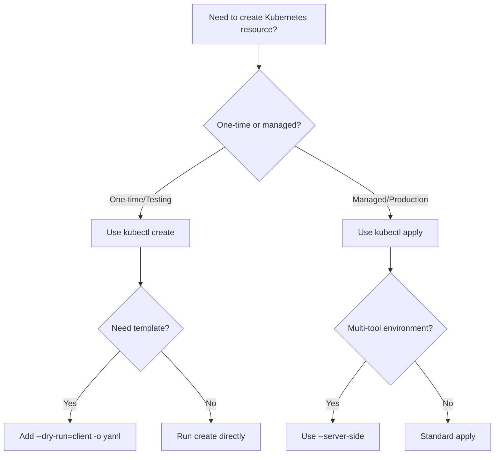

# How to Use kubectl apply vs kubectl create

Author: [nawazdhandala](https://www.github.com/nawazdhandala)

Tags: Kubernetes, kubectl, DevOps, Configuration Management

Description: Learn the key differences between kubectl apply and kubectl create, when to use each command, and best practices for managing Kubernetes resources declaratively and imperatively.

---

Every Kubernetes operator eventually faces the question: should I use `kubectl apply` or `kubectl create`? While both commands create resources, they follow fundamentally different philosophies and have distinct behaviors that affect how you manage your cluster.

## Understanding the Core Difference

The difference comes down to declarative versus imperative approaches:

- **kubectl create**: Imperative command that creates a resource. Fails if the resource already exists.
- **kubectl apply**: Declarative command that creates or updates a resource based on the desired state in your manifest.

Think of `create` as saying "make this thing now" and `apply` as saying "ensure this thing looks like this."

## When to Use kubectl create

Use `create` for one-time operations, quick experiments, or generating resource templates. It works well in scripts where you need strict control over whether resources already exist.

```bash
# Create a deployment imperatively
# This will fail if the deployment already exists
kubectl create deployment nginx --image=nginx:1.24

# Create a namespace for your application
kubectl create namespace staging

# Create a secret from literal values
# Useful for quick setups and testing
kubectl create secret generic db-creds \
  --from-literal=username=admin \
  --from-literal=password=secretpass

# Generate a YAML template without creating the resource
# The --dry-run=client flag prevents actual creation
# The -o yaml outputs the manifest to stdout
kubectl create deployment web --image=nginx:1.24 \
  --dry-run=client -o yaml > deployment.yaml
```

The `--dry-run=client` flag is particularly useful for generating starter manifests that you can customize before applying.

## When to Use kubectl apply

Use `apply` for production deployments, GitOps workflows, and any scenario where you want idempotent operations. This is the standard approach for managing resources declaratively.

```yaml
# deployment.yaml
# This manifest defines the desired state of our web deployment
apiVersion: apps/v1
kind: Deployment
metadata:
  name: web
  namespace: production
  labels:
    app: web
    version: v1.2.0
spec:
  replicas: 3
  selector:
    matchLabels:
      app: web
  template:
    metadata:
      labels:
        app: web
        version: v1.2.0
    spec:
      containers:
        - name: web
          image: myregistry/web:1.2.0
          ports:
            - containerPort: 8080
          resources:
            requests:
              memory: "128Mi"
              cpu: "100m"
            limits:
              memory: "256Mi"
              cpu: "200m"
```

Apply the manifest to create or update the deployment:

```bash
# Apply the deployment manifest
# Creates the resource if it does not exist
# Updates the resource if it does exist
kubectl apply -f deployment.yaml

# Apply all manifests in a directory
kubectl apply -f ./manifests/

# Apply manifests recursively from nested directories
kubectl apply -R -f ./k8s/
```

## How kubectl apply Tracks Changes

When you run `kubectl apply`, Kubernetes stores the last applied configuration in an annotation called `kubectl.kubernetes.io/last-applied-configuration`. This enables three-way merge behavior:

1. Compare the new manifest with the last applied configuration
2. Compare both with the current live state
3. Merge changes intelligently

```bash
# View the last applied configuration annotation
kubectl get deployment web -o jsonpath='{.metadata.annotations.kubectl\.kubernetes\.io/last-applied-configuration}' | jq .
```

This tracking mechanism is why you should not mix `create` and `apply` on the same resource. If you create a resource with `kubectl create` and later try to `apply` changes, the merge behavior may not work as expected because the annotation is missing.

## Practical Comparison

Let us walk through a scenario that illustrates the difference:

```bash
# First, create a deployment with kubectl create
kubectl create deployment test --image=nginx:1.24

# Try to create it again - this fails
kubectl create deployment test --image=nginx:1.24
# Error: deployments.apps "test" already exists

# Now export and apply the same deployment
kubectl get deployment test -o yaml > test-deployment.yaml

# Apply works even though the resource exists
# It will update the resource to match the manifest
kubectl apply -f test-deployment.yaml

# Modify the manifest and apply again
# Change replicas from 1 to 3 in test-deployment.yaml
kubectl apply -f test-deployment.yaml
# deployment.apps/test configured
```

## Server-Side Apply

Kubernetes 1.18 introduced server-side apply, which moves the merge logic to the API server. This provides better conflict detection and field ownership tracking.

```bash
# Use server-side apply for better conflict handling
# The --server-side flag enables this mode
kubectl apply --server-side -f deployment.yaml

# Force apply to take ownership of conflicting fields
# Use this when you need to override changes made by other tools
kubectl apply --server-side --force-conflicts -f deployment.yaml
```

Server-side apply tracks which manager last modified each field, preventing accidental overwrites in multi-tool environments.

## Working with Multiple Resources

Both commands can handle multiple resources, but `apply` offers more flexibility:

```bash
# Create multiple resources from a single file
# Resources are separated by '---' in YAML
kubectl create -f multi-resource.yaml

# Apply all resources matching a label selector
kubectl apply -f ./manifests/ -l environment=staging

# Apply with pruning to remove resources not in the manifests
# WARNING: This deletes resources, use with caution
kubectl apply -f ./manifests/ --prune -l app=myapp
```

The `--prune` flag is powerful for GitOps workflows where you want your cluster state to exactly match your repository.

## Best Practices

Here is a decision flow for choosing between the commands:



Follow these guidelines:

1. **Use apply for production**: Declarative management with version-controlled manifests is the standard.

2. **Use create for bootstrapping**: Generating initial manifests or creating one-time resources.

3. **Never mix approaches**: If you start with `apply`, stick with `apply` for that resource.

4. **Enable server-side apply in teams**: Better conflict detection when multiple tools modify resources.

5. **Version control your manifests**: Store all YAML files in Git for auditability and rollback capability.

## Common Pitfalls

Avoid these mistakes when working with both commands:

```bash
# WRONG: Creating then applying without the annotation
kubectl create -f deployment.yaml
kubectl apply -f deployment.yaml  # May have unexpected merge behavior

# RIGHT: Use apply from the start
kubectl apply -f deployment.yaml

# WRONG: Using create in CI/CD pipelines
kubectl create -f deployment.yaml  # Fails on re-run

# RIGHT: Use apply for idempotent deployments
kubectl apply -f deployment.yaml  # Succeeds every time
```

## Migrating from create to apply

If you have resources created with `kubectl create` that you want to manage with `apply`:

```bash
# Export the current resource state
kubectl get deployment web -o yaml > web-deployment.yaml

# Remove status and other runtime fields
# Keep only spec and necessary metadata

# Apply to add the last-applied-configuration annotation
kubectl apply -f web-deployment.yaml
```

After this migration, future applies will work correctly with three-way merge.

---

Understanding when to use `kubectl apply` versus `kubectl create` is fundamental to effective Kubernetes operations. For most production scenarios, `apply` is the right choice because it supports declarative management, enables GitOps workflows, and handles updates gracefully. Reserve `create` for quick experiments, template generation, and situations where you need strict create-only semantics.
