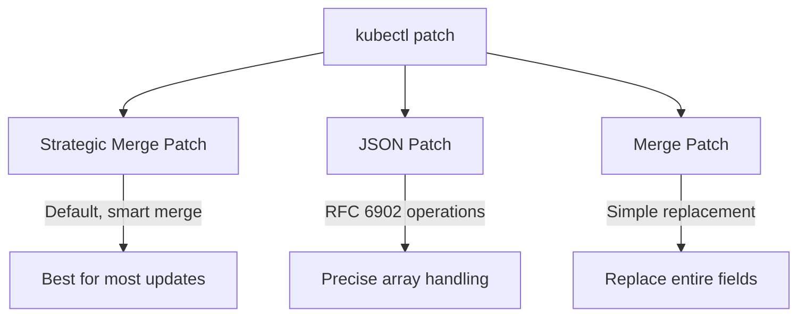

# How to Use kubectl patch for In-Place Updates

Author: [nawazdhandala](https://www.github.com/nawazdhandala)

Tags: Kubernetes, kubectl, DevOps, Configuration Management, Updates

Description: Learn how to use kubectl patch for making targeted in-place updates to Kubernetes resources, including strategic merge patches, JSON patches, and merge patches with practical examples.

---

The `kubectl patch` command lets you update specific fields of a Kubernetes resource without replacing the entire specification. This is useful for quick fixes, automation scripts, and situations where you need to modify just one or two fields. This guide covers the three patch strategies and when to use each.

## Understanding Patch Strategies

kubectl supports three patch types:



- **Strategic Merge Patch** (default): Kubernetes-aware merging that understands resource schemas
- **JSON Patch**: RFC 6902 operations for precise control over arrays
- **Merge Patch**: Simple JSON merge that replaces fields wholesale

## Strategic Merge Patch

The default and most commonly used patch type:

```bash
# Update replica count
kubectl patch deployment web-app -n production \
  -p '{"spec":{"replicas":5}}'

# Update container image
kubectl patch deployment web-app -n production \
  -p '{"spec":{"template":{"spec":{"containers":[{"name":"web","image":"myapp:2.0.0"}]}}}}'

# Add an annotation
kubectl patch deployment web-app -n production \
  -p '{"metadata":{"annotations":{"updated-by":"automation"}}}'

# Add a label
kubectl patch deployment web-app -n production \
  -p '{"metadata":{"labels":{"version":"v2"}}}'
```

Strategic merge patch handles arrays intelligently by merging based on key fields:

```yaml
# Original deployment has containers: [web]
# Patch adds logging sidecar instead of replacing
kubectl patch deployment web-app -n production -p '
spec:
  template:
    spec:
      containers:
        - name: logging
          image: fluentbit:2.1
'
# Result: containers now has both [web, logging]
```

## Using YAML Files for Patches

For complex patches, use a file:

```yaml
# patch-file.yaml
spec:
  replicas: 5
  template:
    spec:
      containers:
        - name: web
          image: myapp:2.0.0
          resources:
            limits:
              memory: "512Mi"
              cpu: "500m"
```

Apply the patch:

```bash
kubectl patch deployment web-app -n production --patch-file patch-file.yaml
```

## JSON Patch for Array Operations

JSON Patch (RFC 6902) provides precise control over arrays:

```bash
# Add an item to an array at specific index
kubectl patch deployment web-app -n production --type='json' \
  -p='[{"op":"add","path":"/spec/template/spec/containers/0/env/-","value":{"name":"NEW_VAR","value":"test"}}]'

# Replace a specific array element
kubectl patch deployment web-app -n production --type='json' \
  -p='[{"op":"replace","path":"/spec/template/spec/containers/0/image","value":"myapp:3.0.0"}]'

# Remove an element by index
kubectl patch deployment web-app -n production --type='json' \
  -p='[{"op":"remove","path":"/spec/template/spec/containers/0/env/2"}]'

# Test a value before patching (atomic operation)
kubectl patch deployment web-app -n production --type='json' \
  -p='[{"op":"test","path":"/spec/replicas","value":3},{"op":"replace","path":"/spec/replicas","value":5}]'
```

JSON Patch operations:
- `add`: Add a value to an object or array
- `remove`: Remove a value
- `replace`: Replace an existing value
- `move`: Move a value from one path to another
- `copy`: Copy a value from one path to another
- `test`: Test that a value matches before applying other operations

## Merge Patch

Simple JSON merge that replaces fields:

```bash
# Replace entire labels (removes any not specified)
kubectl patch deployment web-app -n production --type='merge' \
  -p '{"metadata":{"labels":{"app":"web-app","version":"v2"}}}'

# With merge patch, arrays are completely replaced
# This replaces ALL containers, not just the named one
kubectl patch deployment web-app -n production --type='merge' \
  -p '{"spec":{"template":{"spec":{"containers":[{"name":"web","image":"myapp:2.0.0"}]}}}}'
```

Use merge patch when you want to replace a field entirely rather than merge it.

## Common Patch Use Cases

### Update Image Tag

```bash
# Quick image update for rollback or deployment
kubectl patch deployment api-server -n production \
  -p '{"spec":{"template":{"spec":{"containers":[{"name":"api","image":"api:1.2.3"}]}}}}'
```

### Add or Update Environment Variables

```bash
# Add environment variable using JSON patch
kubectl patch deployment web-app -n production --type='json' \
  -p='[{"op":"add","path":"/spec/template/spec/containers/0/env/-","value":{"name":"DEBUG","value":"true"}}]'

# Update existing environment variable
kubectl patch deployment web-app -n production \
  -p '{"spec":{"template":{"spec":{"containers":[{"name":"web","env":[{"name":"DEBUG","value":"false"}]}]}}}}'
```

### Update Resource Limits

```bash
kubectl patch deployment web-app -n production \
  -p '{"spec":{"template":{"spec":{"containers":[{"name":"web","resources":{"limits":{"memory":"1Gi","cpu":"1000m"},"requests":{"memory":"512Mi","cpu":"500m"}}}]}}}}'
```

### Add Annotations for Deployment Triggers

```bash
# Force rollout by changing an annotation
kubectl patch deployment web-app -n production \
  -p "{\"spec\":{\"template\":{\"metadata\":{\"annotations\":{\"kubectl.kubernetes.io/restartedAt\":\"$(date -u +%Y-%m-%dT%H:%M:%SZ)\"}}}}}"
```

### Pause and Resume Deployments

```bash
# Pause a deployment (stops rollout)
kubectl patch deployment web-app -n production \
  -p '{"spec":{"paused":true}}'

# Resume the deployment
kubectl patch deployment web-app -n production \
  -p '{"spec":{"paused":false}}'
```

### Update Service Selector

```bash
# Change which pods a service routes to
kubectl patch service web-app -n production \
  -p '{"spec":{"selector":{"app":"web-app","version":"v2"}}}'
```

### Scale StatefulSet

```bash
kubectl patch statefulset database -n production \
  -p '{"spec":{"replicas":5}}'
```

## Patching with Subresources

Some resources have subresources that need special handling:

```bash
# Patch the status subresource (requires appropriate permissions)
kubectl patch deployment web-app -n production --subresource=status \
  -p '{"status":{"availableReplicas":3}}'

# Scale using the scale subresource
kubectl patch deployment web-app -n production --subresource=scale \
  -p '{"spec":{"replicas":5}}'
```

## Dry Run and Output

Test patches before applying:

```bash
# Dry run to see what would change
kubectl patch deployment web-app -n production \
  -p '{"spec":{"replicas":10}}' \
  --dry-run=client -o yaml

# Server-side dry run (validates against cluster)
kubectl patch deployment web-app -n production \
  -p '{"spec":{"replicas":10}}' \
  --dry-run=server -o yaml

# Output in different formats
kubectl patch deployment web-app -n production \
  -p '{"spec":{"replicas":10}}' \
  -o jsonpath='{.spec.replicas}'
```

## Scripting with Patches

Use patches in automation scripts:

```bash
#!/bin/bash
# deploy-version.sh

VERSION=$1
DEPLOYMENT=$2
NAMESPACE=${3:-default}

if [ -z "$VERSION" ] || [ -z "$DEPLOYMENT" ]; then
    echo "Usage: $0 <version> <deployment> [namespace]"
    exit 1
fi

# Build the patch JSON
PATCH=$(cat <<EOF
{
  "spec": {
    "template": {
      "spec": {
        "containers": [{
          "name": "app",
          "image": "myregistry/app:${VERSION}"
        }]
      },
      "metadata": {
        "annotations": {
          "deployed-version": "${VERSION}",
          "deployed-at": "$(date -u +%Y-%m-%dT%H:%M:%SZ)"
        }
      }
    }
  }
}
EOF
)

# Apply the patch
kubectl patch deployment "$DEPLOYMENT" -n "$NAMESPACE" -p "$PATCH"

# Wait for rollout
kubectl rollout status deployment/"$DEPLOYMENT" -n "$NAMESPACE" --timeout=5m
```

## Patching CRDs

Patch custom resources the same way:

```bash
# Patch an ArgoCD Application
kubectl patch application my-app -n argocd \
  -p '{"spec":{"source":{"targetRevision":"v2.0.0"}}}'

# Patch a Prometheus ServiceMonitor
kubectl patch servicemonitor api-metrics -n monitoring \
  -p '{"spec":{"endpoints":[{"port":"metrics","interval":"15s"}]}}'
```

## Troubleshooting Patches

Common issues and solutions:

```bash
# Error: "unable to find container named X"
# Solution: Check the container name matches exactly
kubectl get deployment web-app -n production -o jsonpath='{.spec.template.spec.containers[*].name}'

# Error: "patch is not mergeable"
# Solution: Use JSON patch for complex array operations
kubectl patch deployment web-app -n production --type='json' -p='[...]'

# Error: "validation error"
# Solution: Verify the field path and value types
kubectl explain deployment.spec.replicas

# Debug: See what the patch produces
kubectl patch deployment web-app -n production \
  -p '{"spec":{"replicas":5}}' \
  --dry-run=server -o yaml | diff - <(kubectl get deployment web-app -n production -o yaml)
```

## Best Practices

1. **Use strategic merge for most cases**: It handles Kubernetes resources intelligently.

2. **Test with dry-run first**: Verify patches before applying to production.

3. **Use JSON patch for arrays**: When you need precise array control.

4. **Store patches in version control**: Keep patch files alongside your manifests.

5. **Prefer declarative management**: Use `kubectl apply` for regular deployments; reserve `patch` for quick fixes and automation.

---

kubectl patch is a powerful tool for making targeted updates to Kubernetes resources. Strategic merge patch handles most use cases with intelligent merging, while JSON patch provides precise control when needed. Use patches for automation scripts, quick fixes, and situations where updating a full manifest would be overkill. Combined with dry-run validation, patches become a safe and efficient way to manage your cluster.
