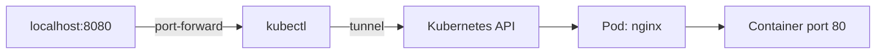

# How to Set Up kubectl port-forward for Pod Access

Author: [nawazdhandala](https://www.github.com/nawazdhandala)

Tags: Kubernetes, kubectl, Debugging, Networking, Development

Description: Learn how to use kubectl port-forward to access pods, services, and deployments directly from your local machine. Includes practical examples for debugging and development.

---

The `kubectl port-forward` command creates a tunnel between your local machine and a pod in your Kubernetes cluster. It lets you access applications running in pods without exposing them through a Service or Ingress. This is invaluable for debugging, development, and one-off administrative tasks.

## Basic Port Forwarding to a Pod

The simplest form forwards a local port to a port on a specific pod:

```bash
# Forward local port 8080 to pod port 80
kubectl port-forward pod/nginx-7d4b8c9f6-x2j9k 8080:80

# Access the pod at http://localhost:8080
```

The format is `local-port:pod-port`. While the command runs, any traffic to `localhost:8080` goes to port 80 on the pod.



## Forward to Services and Deployments

You do not need to know the exact pod name. Forward to a Service or Deployment instead:

```bash
# Forward to a Service (picks a backing pod)
kubectl port-forward svc/nginx-service 8080:80

# Forward to a Deployment (picks a pod from the deployment)
kubectl port-forward deployment/nginx 8080:80
```

This is more convenient since pod names change with each restart, but Service and Deployment names stay constant.

## Forward Multiple Ports

Forward several ports in a single command:

```bash
# Forward HTTP and HTTPS ports
kubectl port-forward svc/web-app 8080:80 8443:443

# Forward app port and debug port
kubectl port-forward pod/myapp-abc123 3000:3000 9229:9229
```

This keeps your terminal cleaner than running multiple port-forward commands.

## Listen on All Interfaces

By default, port-forward binds to `127.0.0.1` (localhost only). To allow access from other machines on your network:

```bash
# Listen on all network interfaces
kubectl port-forward --address 0.0.0.0 svc/web-app 8080:80

# Listen on specific IP address
kubectl port-forward --address 192.168.1.100 svc/web-app 8080:80
```

**Warning**: This exposes the forwarded port to your network. Use carefully, especially in shared environments.

## Specify Namespace

Forward to resources in a specific namespace:

```bash
# Forward to a pod in the staging namespace
kubectl port-forward -n staging pod/api-server 8080:8080

# Or set namespace context first
kubectl config set-context --current --namespace=staging
kubectl port-forward pod/api-server 8080:8080
```

## Run in Background

Keep port-forward running while you continue working:

```bash
# Run in background with nohup
nohup kubectl port-forward svc/database 5432:5432 > /dev/null 2>&1 &

# Or use the shell background operator
kubectl port-forward svc/database 5432:5432 &

# Find the process later
ps aux | grep port-forward

# Kill it when done
kill %1  # or use the PID
```

For long-running forwards, consider using a terminal multiplexer like tmux or screen.

## Common Use Cases

### Access a Database

Connect to a database pod for queries or administration:

```bash
# Forward PostgreSQL port
kubectl port-forward svc/postgres 5432:5432

# In another terminal, connect with psql
psql -h localhost -p 5432 -U postgres -d mydb
```

```bash
# Forward MongoDB port
kubectl port-forward svc/mongodb 27017:27017

# Connect with mongosh
mongosh mongodb://localhost:27017
```

### Access Internal Dashboards

Reach admin interfaces that are not exposed externally:

```bash
# Kubernetes Dashboard
kubectl port-forward -n kubernetes-dashboard svc/kubernetes-dashboard 8443:443

# Grafana
kubectl port-forward -n monitoring svc/grafana 3000:80

# Prometheus
kubectl port-forward -n monitoring svc/prometheus 9090:9090
```

### Debug an Application

Connect a debugger to a running application:

```bash
# Node.js debug port
kubectl port-forward deployment/node-app 9229:9229

# Then attach your debugger to localhost:9229
# In VS Code, use the "Attach" debug configuration
```

```json
// VS Code launch.json for attaching to forwarded debug port
{
  "type": "node",
  "request": "attach",
  "name": "Attach to K8s",
  "address": "localhost",
  "port": 9229,
  "localRoot": "${workspaceFolder}",
  "remoteRoot": "/app"
}
```

### Test API Endpoints

Forward an API service to test with curl or Postman:

```bash
# Forward API service
kubectl port-forward svc/api 8080:80

# Test endpoints
curl http://localhost:8080/health
curl http://localhost:8080/api/v1/users
```

## Handling Connection Issues

### Port Already in Use

If the local port is occupied:

```bash
# Error: unable to listen on port 8080: port is already in use

# Find what is using the port
lsof -i :8080

# Kill the process or choose a different local port
kubectl port-forward svc/web-app 9090:80  # Use 9090 instead
```

### Connection Refused or Timeout

Check that the target pod is running and the port is correct:

```bash
# Verify pod is running
kubectl get pod nginx-abc123

# Check which ports the container exposes
kubectl get pod nginx-abc123 -o jsonpath='{.spec.containers[*].ports}'

# Test connectivity from inside the cluster
kubectl run test --rm -it --image=busybox -- wget -qO- http://nginx-service:80
```

### Connection Drops

Port-forward connections can be unstable. For persistent access, wrap it in a restart loop:

```bash
#!/bin/bash
# port-forward-loop.sh - Restart port-forward on failure

while true; do
    echo "Starting port-forward..."
    kubectl port-forward svc/database 5432:5432
    echo "Connection dropped. Reconnecting in 2 seconds..."
    sleep 2
done
```

Or use a tool like `kubefwd` for more robust forwarding.

## Script for Quick Access

Create shortcuts for frequently used forwards:

```bash
#!/bin/bash
# k8s-forward.sh - Quick port forwarding shortcuts

case "$1" in
    db)
        kubectl port-forward -n production svc/postgres 5432:5432
        ;;
    redis)
        kubectl port-forward -n production svc/redis 6379:6379
        ;;
    grafana)
        kubectl port-forward -n monitoring svc/grafana 3000:80
        ;;
    api)
        kubectl port-forward -n production svc/api 8080:80
        ;;
    *)
        echo "Usage: $0 {db|redis|grafana|api}"
        exit 1
        ;;
esac
```

Usage:

```bash
chmod +x k8s-forward.sh
./k8s-forward.sh db  # Forwards PostgreSQL
```

## Alternatives to port-forward

While port-forward is great for debugging, consider these for other scenarios:

| Scenario | Better Alternative |
|----------|-------------------|
| Production access | Ingress or LoadBalancer Service |
| Persistent local access | VPN to cluster network |
| Multiple services at once | kubefwd tool |
| CI/CD testing | In-cluster test pods |

## Summary

`kubectl port-forward` creates secure tunnels from your local machine to pods, Services, or Deployments in Kubernetes. Use it to access databases, dashboards, debug ports, and APIs without exposing them externally. Forward to Services or Deployments when possible to avoid hardcoding pod names. For long-running forwards, run in the background or use a restart script. It is an essential tool for Kubernetes debugging and development workflows.
