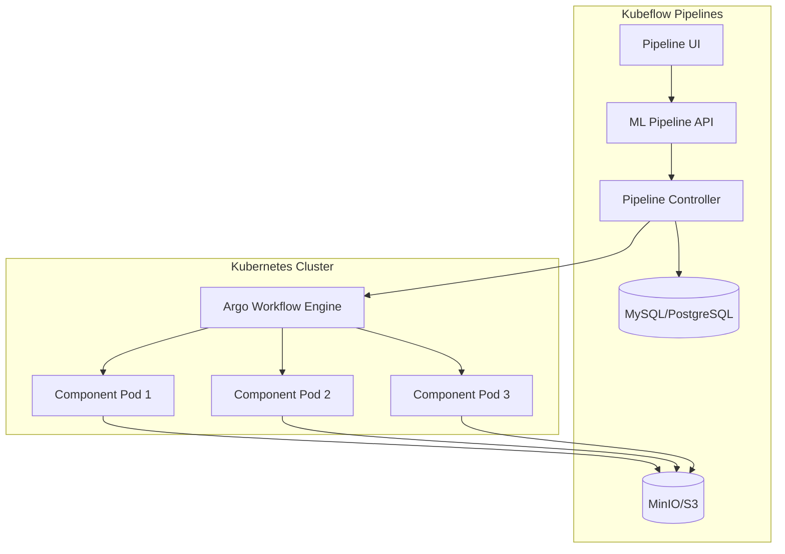

# How to Implement Kubeflow Pipelines

Author: [nawazdhandala](https://www.github.com/nawazdhandala)

Tags: Kubeflow, MLOps, Kubernetes, Machine Learning, Pipelines

Description: Learn how to build and deploy machine learning pipelines using Kubeflow Pipelines on Kubernetes, from simple components to production-ready workflows.

---

Running ML experiments on your laptop works until you need to scale. Kubeflow Pipelines provides a platform for building and deploying portable, scalable ML workflows on Kubernetes. Each step in your pipeline runs as a container, making it reproducible and easy to debug.

## What is Kubeflow Pipelines?

Kubeflow Pipelines is a platform for building ML workflows that run on Kubernetes. It provides:

- A Python SDK for defining pipelines and components
- A UI for managing and monitoring pipeline runs
- Integration with Kubernetes for scalable execution
- Artifact tracking and metadata management
- Support for recurring scheduled runs

## Installing Kubeflow Pipelines

You can install Kubeflow Pipelines as a standalone component or as part of the full Kubeflow distribution.

```bash
# Install the standalone Kubeflow Pipelines on an existing cluster
export PIPELINE_VERSION=2.0.5

kubectl apply -k "github.com/kubeflow/pipelines/manifests/kustomize/cluster-scoped-resources?ref=$PIPELINE_VERSION"
kubectl wait --for condition=established --timeout=60s crd/applications.app.k8s.io

kubectl apply -k "github.com/kubeflow/pipelines/manifests/kustomize/env/platform-agnostic?ref=$PIPELINE_VERSION"

# Wait for all pods to be ready
kubectl wait --for=condition=ready pod -l app=ml-pipeline -n kubeflow --timeout=300s

# Access the UI via port-forward
kubectl port-forward -n kubeflow svc/ml-pipeline-ui 8080:80
```

Install the Python SDK on your development machine:

```bash
pip install kfp==2.5.0
```

## Creating Your First Pipeline

Kubeflow Pipelines uses Python decorators to define components and pipelines. Here is a simple example:

```python
from kfp import dsl
from kfp import compiler

# Define a component that loads data
@dsl.component(base_image="python:3.11-slim")
def load_data(output_path: dsl.OutputPath("Dataset")):
    """Load sample data and save it to the output path."""
    import json

    # Simulated dataset
    data = {
        "features": [[1, 2], [3, 4], [5, 6], [7, 8]],
        "labels": [0, 0, 1, 1]
    }

    with open(output_path, "w") as f:
        json.dump(data, f)

# Define a component that trains a model
@dsl.component(
    base_image="python:3.11-slim",
    packages_to_install=["scikit-learn==1.3.0"]
)
def train_model(
    data_path: dsl.InputPath("Dataset"),
    model_path: dsl.OutputPath("Model"),
    n_estimators: int = 100
):
    """Train a simple classifier on the input data."""
    import json
    import pickle
    from sklearn.ensemble import RandomForestClassifier

    # Load data from previous step
    with open(data_path, "r") as f:
        data = json.load(f)

    # Train the model
    model = RandomForestClassifier(n_estimators=n_estimators)
    model.fit(data["features"], data["labels"])

    # Save the trained model
    with open(model_path, "wb") as f:
        pickle.dump(model, f)

# Define a component that evaluates the model
@dsl.component(
    base_image="python:3.11-slim",
    packages_to_install=["scikit-learn==1.3.0"]
)
def evaluate_model(
    model_path: dsl.InputPath("Model"),
    data_path: dsl.InputPath("Dataset"),
) -> float:
    """Evaluate the model and return accuracy."""
    import json
    import pickle

    with open(model_path, "rb") as f:
        model = pickle.load(f)

    with open(data_path, "r") as f:
        data = json.load(f)

    accuracy = model.score(data["features"], data["labels"])
    print(f"Model accuracy: {accuracy}")
    return accuracy

# Define the pipeline that connects components
@dsl.pipeline(
    name="Simple ML Pipeline",
    description="A basic pipeline that loads data, trains, and evaluates a model"
)
def ml_pipeline(n_estimators: int = 100):
    # Each task is an instance of a component
    load_task = load_data()

    train_task = train_model(
        data_path=load_task.outputs["output_path"],
        n_estimators=n_estimators
    )

    eval_task = evaluate_model(
        model_path=train_task.outputs["model_path"],
        data_path=load_task.outputs["output_path"]
    )

# Compile the pipeline to a YAML file
compiler.Compiler().compile(ml_pipeline, "pipeline.yaml")
```

## Running the Pipeline

Submit the compiled pipeline to your Kubeflow cluster:

```python
from kfp.client import Client

# Connect to the Kubeflow Pipelines API
client = Client(host="http://localhost:8080")

# Create a new experiment or get existing one
experiment = client.create_experiment(
    name="ml-experiments",
    description="Experiments for ML model development"
)

# Submit a run with custom parameters
run = client.create_run_from_pipeline_package(
    pipeline_file="pipeline.yaml",
    experiment_name="ml-experiments",
    run_name="first-run",
    arguments={"n_estimators": 200}
)

print(f"Run created: {run.run_id}")
```

## Building Custom Container Components

For complex components that need custom dependencies, build a dedicated container:

```dockerfile
# components/preprocessor/Dockerfile
FROM python:3.11-slim

WORKDIR /app

# Install dependencies
COPY requirements.txt .
RUN pip install --no-cache-dir -r requirements.txt

# Copy component code
COPY preprocess.py .

ENTRYPOINT ["python", "preprocess.py"]
```

```python
# components/preprocessor/preprocess.py
import argparse
import pandas as pd
from sklearn.preprocessing import StandardScaler
import pickle

def main():
    parser = argparse.ArgumentParser()
    parser.add_argument("--input-path", required=True)
    parser.add_argument("--output-path", required=True)
    parser.add_argument("--scaler-path", required=True)
    args = parser.parse_args()

    # Load raw data
    df = pd.read_csv(args.input_path)

    # Fit and transform with scaler
    scaler = StandardScaler()
    scaled_data = scaler.fit_transform(df)

    # Save outputs
    pd.DataFrame(scaled_data, columns=df.columns).to_csv(
        args.output_path, index=False
    )
    with open(args.scaler_path, "wb") as f:
        pickle.dump(scaler, f)

if __name__ == "__main__":
    main()
```

Use the custom container in your pipeline:

```python
from kfp import dsl

@dsl.container_component
def preprocess_data(
    input_path: str,
    output_path: dsl.OutputPath("CSV"),
    scaler_path: dsl.OutputPath("Scaler")
):
    return dsl.ContainerSpec(
        image="registry.example.com/preprocessor:v1.0",
        command=["python", "preprocess.py"],
        args=[
            "--input-path", input_path,
            "--output-path", output_path,
            "--scaler-path", scaler_path
        ]
    )
```

## Pipeline Control Flow

Kubeflow Pipelines supports conditional execution and loops:

```python
from kfp import dsl

@dsl.component(base_image="python:3.11-slim")
def check_data_quality(data_path: str) -> bool:
    """Return True if data passes quality checks."""
    # Simulated quality check
    return True

@dsl.component(base_image="python:3.11-slim")
def send_alert(message: str):
    """Send an alert about data quality issues."""
    print(f"ALERT: {message}")

@dsl.component(base_image="python:3.11-slim")
def train_variant(variant: str) -> float:
    """Train a model variant and return score."""
    scores = {"baseline": 0.85, "improved": 0.90, "experimental": 0.88}
    return scores.get(variant, 0.80)

@dsl.pipeline(name="Pipeline with Control Flow")
def control_flow_pipeline():
    # Conditional execution based on data quality
    quality_check = check_data_quality(data_path="/data/input.csv")

    with dsl.If(quality_check.output == True):
        # Run training only if data quality passes
        train_variant(variant="baseline")

    with dsl.Else():
        # Send alert if quality check fails
        send_alert(message="Data quality check failed")

    # Parallel execution with loop
    variants = ["baseline", "improved", "experimental"]
    with dsl.ParallelFor(items=variants) as variant:
        train_variant(variant=variant)
```

## Resource Management

Specify resource requirements for each component:

```python
from kfp import dsl
from kubernetes.client.models import V1ResourceRequirements

@dsl.component(base_image="python:3.11-slim")
def gpu_training(epochs: int) -> float:
    """Train a model using GPU."""
    import time
    time.sleep(epochs)  # Simulated training
    return 0.95

@dsl.pipeline(name="Resource-Aware Pipeline")
def resource_pipeline():
    training_task = gpu_training(epochs=10)

    # Set resource requests and limits
    training_task.set_cpu_request("2")
    training_task.set_cpu_limit("4")
    training_task.set_memory_request("4Gi")
    training_task.set_memory_limit("8Gi")

    # Request GPU resources
    training_task.set_gpu_limit("1")

    # Add node selector for GPU nodes
    training_task.add_node_selector_constraint(
        "cloud.google.com/gke-accelerator", "nvidia-tesla-t4"
    )

    # Set a timeout for long-running tasks
    training_task.set_timeout(3600)  # 1 hour in seconds
```

## Caching and Reuse

Kubeflow Pipelines caches component outputs by default. You can control this behavior:

```python
from kfp import dsl

@dsl.component(base_image="python:3.11-slim")
def expensive_computation(seed: int) -> float:
    """An expensive computation that should be cached."""
    import time
    time.sleep(60)  # Simulate expensive work
    return seed * 1.5

@dsl.pipeline(name="Caching Demo")
def caching_pipeline(seed: int):
    # This task will be cached based on its inputs
    compute_task = expensive_computation(seed=seed)

    # Disable caching for tasks that should always run
    compute_task.set_caching_options(False)
```

## Scheduling Recurring Runs

Create recurring pipeline runs for retraining jobs:

```python
from kfp.client import Client

client = Client(host="http://localhost:8080")

# Create a recurring run that executes weekly
recurring_run = client.create_recurring_run(
    experiment_id="your-experiment-id",
    job_name="weekly-retraining",
    pipeline_package_path="pipeline.yaml",
    cron_expression="0 0 * * 0",  # Every Sunday at midnight
    max_concurrency=1,  # Only one run at a time
    enabled=True,
    parameters={"n_estimators": 100}
)

print(f"Recurring run created: {recurring_run.id}")
```

## Architecture Overview



## Best Practices

1. **Keep components small**: Each component should do one thing well
2. **Version your container images**: Use specific tags, not `latest`
3. **Use input/output paths**: Pass data between components using paths, not inline
4. **Set resource limits**: Prevent runaway containers from consuming cluster resources
5. **Add retries for flaky steps**: Network calls and external services can fail
6. **Log structured output**: Makes debugging easier in the UI

---

Kubeflow Pipelines transforms ad-hoc scripts into reproducible, scalable workflows. Start with simple pipelines and add complexity as your needs grow. The Kubernetes foundation means your pipelines can scale from experimentation to production without rewriting.
