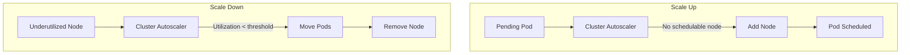

# How to Set Up Kubernetes Cluster Autoscaler

Author: [nawazdhandala](https://www.github.com/nawazdhandala)

Tags: Kubernetes, Autoscaling, Cluster Management, DevOps, Cost Optimization

Description: Learn how to configure Kubernetes Cluster Autoscaler to automatically add and remove nodes based on workload demand, including cloud provider setup, configuration tuning, and best practices.

---

Cluster Autoscaler automatically adjusts the size of your Kubernetes cluster by adding nodes when pods cannot be scheduled due to insufficient resources, and removing nodes when they are underutilized. This guide covers setting up and configuring Cluster Autoscaler for efficient resource management.

## How Cluster Autoscaler Works

The autoscaler monitors pending pods and node utilization:



Key behaviors:
- **Scale up**: Triggered when pods are pending due to insufficient resources
- **Scale down**: Triggered when nodes are underutilized for a configurable period
- **Respects PodDisruptionBudgets**: Will not remove nodes if it violates PDBs

## Prerequisites

Before setting up Cluster Autoscaler:

1. **Cloud provider support**: Your nodes must be managed by a cloud provider's node group (AWS Auto Scaling Group, GCP Managed Instance Group, Azure VMSS)

2. **Node group configuration**: Define minimum and maximum node counts

3. **IAM permissions**: Cluster Autoscaler needs permissions to modify node groups

## AWS EKS Setup

### Create IAM Policy

```json
{
  "Version": "2012-10-17",
  "Statement": [
    {
      "Effect": "Allow",
      "Action": [
        "autoscaling:DescribeAutoScalingGroups",
        "autoscaling:DescribeAutoScalingInstances",
        "autoscaling:DescribeLaunchConfigurations",
        "autoscaling:DescribeTags",
        "autoscaling:SetDesiredCapacity",
        "autoscaling:TerminateInstanceInAutoScalingGroup",
        "ec2:DescribeLaunchTemplateVersions",
        "ec2:DescribeInstanceTypes"
      ],
      "Resource": ["*"]
    }
  ]
}
```

### Deploy Cluster Autoscaler

```yaml
# cluster-autoscaler.yaml
apiVersion: apps/v1
kind: Deployment
metadata:
  name: cluster-autoscaler
  namespace: kube-system
  labels:
    app: cluster-autoscaler
spec:
  replicas: 1
  selector:
    matchLabels:
      app: cluster-autoscaler
  template:
    metadata:
      labels:
        app: cluster-autoscaler
    spec:
      serviceAccountName: cluster-autoscaler
      containers:
        - name: cluster-autoscaler
          image: registry.k8s.io/autoscaling/cluster-autoscaler:v1.28.0
          command:
            - ./cluster-autoscaler
            - --v=4
            - --stderrthreshold=info
            - --cloud-provider=aws
            - --skip-nodes-with-local-storage=false
            - --expander=least-waste
            - --node-group-auto-discovery=asg:tag=k8s.io/cluster-autoscaler/enabled,k8s.io/cluster-autoscaler/my-cluster
            - --balance-similar-node-groups
            - --scale-down-enabled=true
            - --scale-down-delay-after-add=10m
            - --scale-down-unneeded-time=10m
            - --scale-down-utilization-threshold=0.5
          resources:
            limits:
              cpu: 100m
              memory: 600Mi
            requests:
              cpu: 100m
              memory: 300Mi
          env:
            - name: AWS_REGION
              value: us-west-2
      priorityClassName: system-cluster-critical
```

### Create ServiceAccount with IRSA

```yaml
# service-account.yaml
apiVersion: v1
kind: ServiceAccount
metadata:
  name: cluster-autoscaler
  namespace: kube-system
  annotations:
    eks.amazonaws.com/role-arn: arn:aws:iam::123456789012:role/cluster-autoscaler-role
```

### Tag Your Auto Scaling Groups

```bash
# Tag ASGs for auto-discovery
aws autoscaling create-or-update-tags --tags \
  ResourceId=my-asg-name \
  ResourceType=auto-scaling-group \
  Key=k8s.io/cluster-autoscaler/enabled \
  Value=true \
  PropagateAtLaunch=true

aws autoscaling create-or-update-tags --tags \
  ResourceId=my-asg-name \
  ResourceType=auto-scaling-group \
  Key=k8s.io/cluster-autoscaler/my-cluster \
  Value=owned \
  PropagateAtLaunch=true
```

## GKE Setup

On GKE, Cluster Autoscaler is built-in:

```bash
# Enable autoscaling on a node pool
gcloud container clusters update my-cluster \
  --enable-autoscaling \
  --min-nodes=1 \
  --max-nodes=10 \
  --node-pool=default-pool \
  --zone=us-central1-a

# Or create a new node pool with autoscaling
gcloud container node-pools create high-memory-pool \
  --cluster=my-cluster \
  --enable-autoscaling \
  --min-nodes=0 \
  --max-nodes=5 \
  --machine-type=n2-highmem-4 \
  --zone=us-central1-a
```

## Configuration Parameters

Key autoscaler parameters:

```yaml
# Important flags for cluster-autoscaler
command:
  - ./cluster-autoscaler
  # Logging verbosity
  - --v=4

  # Cloud provider (aws, gce, azure, etc.)
  - --cloud-provider=aws

  # Expander strategy: how to choose which node group to scale
  # Options: random, most-pods, least-waste, price, priority
  - --expander=least-waste

  # Scale down configuration
  - --scale-down-enabled=true
  # Wait time after scale up before considering scale down
  - --scale-down-delay-after-add=10m
  # Time node must be unneeded before removal
  - --scale-down-unneeded-time=10m
  # Node utilization threshold (0.5 = 50%)
  - --scale-down-utilization-threshold=0.5

  # Skip nodes with local storage (emptyDir with data)
  - --skip-nodes-with-local-storage=false

  # Skip nodes with system pods (kube-system)
  - --skip-nodes-with-system-pods=true

  # Balance similar node groups
  - --balance-similar-node-groups=true

  # Maximum time to wait for node to be provisioned
  - --max-node-provision-time=15m
```

## Expander Strategies

Choose how the autoscaler selects which node group to scale:

```yaml
# Least Waste: Choose group that wastes least resources after scale up
- --expander=least-waste

# Most Pods: Choose group that can schedule most pending pods
- --expander=most-pods

# Random: Choose randomly (useful for testing)
- --expander=random

# Price: Choose cheapest option (requires pricing info)
- --expander=price

# Priority: Use explicit priority configuration
- --expander=priority
```

For priority expander, create a ConfigMap:

```yaml
# priority-expander-config.yaml
apiVersion: v1
kind: ConfigMap
metadata:
  name: cluster-autoscaler-priority-expander
  namespace: kube-system
data:
  priorities: |
    10:
      - spot-node-group-.*
    50:
      - on-demand-node-group-.*
```

## Preventing Scale Down

Some pods should prevent node scale down:

```yaml
# deployment-no-scale-down.yaml
apiVersion: apps/v1
kind: Deployment
metadata:
  name: critical-service
spec:
  template:
    metadata:
      annotations:
        # Prevent autoscaler from evicting this pod
        cluster-autoscaler.kubernetes.io/safe-to-evict: "false"
    spec:
      containers:
        - name: app
          image: critical-app:1.0.0
```

Pods that prevent scale down by default:
- Pods with local storage (unless configured otherwise)
- Pods with restrictive PodDisruptionBudget
- Pods in kube-system without PDB
- Pods with the safe-to-evict annotation set to false

## Pod Priority and Preemption

Use priority classes with autoscaling:

```yaml
# priority-classes.yaml
apiVersion: scheduling.k8s.io/v1
kind: PriorityClass
metadata:
  name: high-priority
value: 1000000
globalDefault: false
description: "High priority workloads"
---
apiVersion: scheduling.k8s.io/v1
kind: PriorityClass
metadata:
  name: low-priority
value: 100
globalDefault: false
preemptionPolicy: Never  # Will not preempt other pods
description: "Low priority batch workloads"
```

## Monitoring Cluster Autoscaler

Check autoscaler status and activity:

```bash
# View autoscaler logs
kubectl logs -n kube-system -l app=cluster-autoscaler -f

# Check autoscaler status ConfigMap
kubectl get configmap cluster-autoscaler-status -n kube-system -o yaml

# View events related to scaling
kubectl get events -n kube-system | grep -i autoscaler

# Check node group status
kubectl describe configmap cluster-autoscaler-status -n kube-system
```

Key metrics to monitor:

```yaml
# Prometheus rules for autoscaler monitoring
groups:
  - name: cluster-autoscaler
    rules:
      - alert: ClusterAutoscalerUnschedulablePods
        expr: cluster_autoscaler_unschedulable_pods_count > 0
        for: 10m
        labels:
          severity: warning
        annotations:
          summary: "Unschedulable pods exist for more than 10 minutes"

      - alert: ClusterAutoscalerNotReady
        expr: cluster_autoscaler_last_activity == 0
        for: 5m
        labels:
          severity: critical
        annotations:
          summary: "Cluster Autoscaler is not running"
```

## Combining with Horizontal Pod Autoscaler

Cluster Autoscaler works well with HPA:

```yaml
# hpa.yaml
apiVersion: autoscaling/v2
kind: HorizontalPodAutoscaler
metadata:
  name: web-app-hpa
spec:
  scaleTargetRef:
    apiVersion: apps/v1
    kind: Deployment
    name: web-app
  minReplicas: 2
  maxReplicas: 50
  metrics:
    - type: Resource
      resource:
        name: cpu
        target:
          type: Utilization
          averageUtilization: 70
```

The flow:
1. HPA increases pod replicas when CPU is high
2. New pods become pending if no capacity
3. Cluster Autoscaler adds nodes for pending pods
4. When load decreases, HPA reduces replicas
5. Cluster Autoscaler removes underutilized nodes

## Troubleshooting

Common issues and solutions:

```bash
# Pods stuck pending but autoscaler not scaling
# Check if pods can be scheduled on any node group
kubectl describe pod pending-pod-xyz | grep -A 10 Events

# Check autoscaler logs for decisions
kubectl logs -n kube-system -l app=cluster-autoscaler | grep -i "scale up"

# Verify node group tags/labels are correct
aws autoscaling describe-auto-scaling-groups --auto-scaling-group-names my-asg \
  | jq '.AutoScalingGroups[].Tags'

# Check if node group has capacity
aws autoscaling describe-auto-scaling-groups --auto-scaling-group-names my-asg \
  | jq '.AutoScalingGroups[] | {min: .MinSize, max: .MaxSize, desired: .DesiredCapacity}'
```

## Best Practices

1. **Set appropriate min/max**: Leave headroom for sudden demand spikes.

2. **Use Pod Disruption Budgets**: Protect critical workloads during scale down.

3. **Configure resource requests accurately**: Autoscaler uses requests for decisions.

4. **Enable balance-similar-node-groups**: Spread workloads across availability zones.

5. **Monitor scaling events**: Set up alerts for failed scale operations.

```bash
# Example: Set up monitoring for scale failures
kubectl logs -n kube-system -l app=cluster-autoscaler | grep -i "failed"
```

---

Cluster Autoscaler is essential for running cost-effective Kubernetes clusters that can handle variable workloads. Configure it with appropriate thresholds, use the right expander strategy for your use case, and combine it with Horizontal Pod Autoscaler for complete automatic scaling. With proper setup, your cluster will efficiently scale to meet demand while minimizing costs during low-usage periods.
