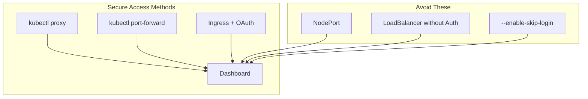

# How to Set Up Kubernetes Dashboard Securely

Author: [nawazdhandala](https://www.github.com/nawazdhandala)

Tags: Kubernetes, Dashboard, Security, RBAC, Authentication, DevOps

Description: Learn how to deploy the Kubernetes Dashboard securely with proper authentication, RBAC configuration, and access controls. This guide covers installation, creating admin users, and security best practices for production environments.

---

The Kubernetes Dashboard provides a web-based UI for managing your cluster. Out of the box, it can be a security risk if not configured properly. This guide walks through deploying the dashboard securely with proper authentication and authorization.

## Why Security Matters

The Kubernetes Dashboard has full visibility into your cluster and, with the right permissions, can create, modify, and delete resources. In 2018, Tesla's cloud infrastructure was compromised through an unsecured Kubernetes Dashboard. Do not let that be you.

## Installing the Dashboard

Deploy the official dashboard using the recommended manifest:

```bash
# Install the latest stable version
kubectl apply -f https://raw.githubusercontent.com/kubernetes/dashboard/v2.7.0/aio/deploy/recommended.yaml

# Verify installation
kubectl get pods -n kubernetes-dashboard

# Expected output:
# NAME                                         READY   STATUS
# dashboard-metrics-scraper-5cb4f4bb9c-xxxxx   1/1     Running
# kubernetes-dashboard-6967859bff-xxxxx        1/1     Running
```

The dashboard is now running but not accessible from outside the cluster.

## Understanding Access Methods

There are several ways to access the dashboard, each with different security implications:



## Method 1: kubectl proxy (Development)

The simplest and safest method for local development:

```bash
# Start the proxy
kubectl proxy

# Access the dashboard at:
# http://localhost:8001/api/v1/namespaces/kubernetes-dashboard/services/https:kubernetes-dashboard:/proxy/
```

This only works from your local machine and uses your kubeconfig credentials.

## Method 2: Port Forwarding (Development)

Direct port forwarding to the dashboard pod:

```bash
# Find the dashboard pod
kubectl get pods -n kubernetes-dashboard

# Forward the port
kubectl port-forward -n kubernetes-dashboard \
  service/kubernetes-dashboard 8443:443

# Access at https://localhost:8443
```

## Creating Service Accounts for Authentication

The dashboard needs a token to authenticate. Create service accounts with appropriate permissions.

### Option A: Read-Only User

For users who only need to view resources:

```yaml
# dashboard-readonly.yaml
apiVersion: v1
kind: ServiceAccount
metadata:
  name: dashboard-readonly
  namespace: kubernetes-dashboard
---
apiVersion: rbac.authorization.k8s.io/v1
kind: ClusterRole
metadata:
  name: dashboard-readonly
rules:
  - apiGroups: [""]
    resources: ["pods", "services", "configmaps", "secrets", "nodes", "namespaces"]
    verbs: ["get", "list", "watch"]
  - apiGroups: ["apps"]
    resources: ["deployments", "statefulsets", "daemonsets", "replicasets"]
    verbs: ["get", "list", "watch"]
  - apiGroups: ["batch"]
    resources: ["jobs", "cronjobs"]
    verbs: ["get", "list", "watch"]
  - apiGroups: ["networking.k8s.io"]
    resources: ["ingresses"]
    verbs: ["get", "list", "watch"]
---
apiVersion: rbac.authorization.k8s.io/v1
kind: ClusterRoleBinding
metadata:
  name: dashboard-readonly
roleRef:
  apiGroup: rbac.authorization.k8s.io
  kind: ClusterRole
  name: dashboard-readonly
subjects:
  - kind: ServiceAccount
    name: dashboard-readonly
    namespace: kubernetes-dashboard
```

### Option B: Admin User

For administrators who need full access:

```yaml
# dashboard-admin.yaml
apiVersion: v1
kind: ServiceAccount
metadata:
  name: dashboard-admin
  namespace: kubernetes-dashboard
---
apiVersion: rbac.authorization.k8s.io/v1
kind: ClusterRoleBinding
metadata:
  name: dashboard-admin
roleRef:
  apiGroup: rbac.authorization.k8s.io
  kind: ClusterRole
  name: cluster-admin
subjects:
  - kind: ServiceAccount
    name: dashboard-admin
    namespace: kubernetes-dashboard
```

### Option C: Namespace-Scoped User

For users who should only access a specific namespace:

```yaml
# dashboard-team-user.yaml
apiVersion: v1
kind: ServiceAccount
metadata:
  name: dashboard-team-a
  namespace: team-a
---
apiVersion: rbac.authorization.k8s.io/v1
kind: RoleBinding
metadata:
  name: dashboard-team-a
  namespace: team-a
roleRef:
  apiGroup: rbac.authorization.k8s.io
  kind: ClusterRole
  name: edit  # Built-in role with read/write access
subjects:
  - kind: ServiceAccount
    name: dashboard-team-a
    namespace: team-a
```

Apply the configuration:

```bash
kubectl apply -f dashboard-readonly.yaml
kubectl apply -f dashboard-admin.yaml
```

## Generating Authentication Tokens

### Short-Lived Token (Recommended)

Create a temporary token that expires:

```bash
# Create token valid for 24 hours
kubectl create token dashboard-admin \
  -n kubernetes-dashboard \
  --duration=24h
```

### Long-Lived Token (Kubernetes 1.24+)

For service-to-service authentication, create a Secret that generates a non-expiring token:

```yaml
# dashboard-admin-token.yaml
apiVersion: v1
kind: Secret
metadata:
  name: dashboard-admin-token
  namespace: kubernetes-dashboard
  annotations:
    kubernetes.io/service-account.name: dashboard-admin
type: kubernetes.io/service-account-token
```

Retrieve the token:

```bash
kubectl apply -f dashboard-admin-token.yaml

# Get the token
kubectl get secret dashboard-admin-token \
  -n kubernetes-dashboard \
  -o jsonpath='{.data.token}' | base64 -d
```

## Method 3: Secure Ingress Access (Production)

For production, expose the dashboard through an Ingress with proper authentication.

### Prerequisites

Install an Ingress controller and cert-manager:

```bash
# Install nginx ingress controller
kubectl apply -f https://raw.githubusercontent.com/kubernetes/ingress-nginx/controller-v1.8.0/deploy/static/provider/cloud/deploy.yaml

# Install cert-manager for TLS certificates
kubectl apply -f https://github.com/cert-manager/cert-manager/releases/download/v1.12.0/cert-manager.yaml
```

### Ingress with Basic Authentication

Create basic auth credentials:

```bash
# Create htpasswd file
htpasswd -c auth admin

# Create secret from the file
kubectl create secret generic dashboard-basic-auth \
  -n kubernetes-dashboard \
  --from-file=auth
```

Create the Ingress:

```yaml
# dashboard-ingress.yaml
apiVersion: networking.k8s.io/v1
kind: Ingress
metadata:
  name: kubernetes-dashboard
  namespace: kubernetes-dashboard
  annotations:
    nginx.ingress.kubernetes.io/backend-protocol: "HTTPS"
    nginx.ingress.kubernetes.io/auth-type: basic
    nginx.ingress.kubernetes.io/auth-secret: dashboard-basic-auth
    nginx.ingress.kubernetes.io/auth-realm: "Authentication Required"
    cert-manager.io/cluster-issuer: letsencrypt-prod
spec:
  ingressClassName: nginx
  tls:
    - hosts:
        - dashboard.example.com
      secretName: dashboard-tls
  rules:
    - host: dashboard.example.com
      http:
        paths:
          - path: /
            pathType: Prefix
            backend:
              service:
                name: kubernetes-dashboard
                port:
                  number: 443
```

### Ingress with OAuth2 Proxy

For enterprise environments, use OAuth2 proxy with your identity provider:

```yaml
# oauth2-proxy deployment (simplified)
apiVersion: apps/v1
kind: Deployment
metadata:
  name: oauth2-proxy
  namespace: kubernetes-dashboard
spec:
  replicas: 1
  selector:
    matchLabels:
      app: oauth2-proxy
  template:
    metadata:
      labels:
        app: oauth2-proxy
    spec:
      containers:
        - name: oauth2-proxy
          image: quay.io/oauth2-proxy/oauth2-proxy:v7.4.0
          args:
            - --provider=github
            - --email-domain=*
            - --upstream=https://kubernetes-dashboard.kubernetes-dashboard.svc:443
            - --http-address=0.0.0.0:4180
            - --ssl-upstream-insecure-skip-verify
            - --cookie-secure=true
            - --cookie-httponly=true
          env:
            - name: OAUTH2_PROXY_CLIENT_ID
              valueFrom:
                secretKeyRef:
                  name: oauth2-proxy-secrets
                  key: client-id
            - name: OAUTH2_PROXY_CLIENT_SECRET
              valueFrom:
                secretKeyRef:
                  name: oauth2-proxy-secrets
                  key: client-secret
            - name: OAUTH2_PROXY_COOKIE_SECRET
              valueFrom:
                secretKeyRef:
                  name: oauth2-proxy-secrets
                  key: cookie-secret
          ports:
            - containerPort: 4180
```

## Security Hardening

### Disable Skip Login

Never enable the skip login button in production:

```yaml
# This is what NOT to do
spec:
  containers:
    - name: dashboard
      args:
        - --enable-skip-login  # NEVER use this in production
```

### Network Policy

Restrict dashboard access:

```yaml
# dashboard-netpol.yaml
apiVersion: networking.k8s.io/v1
kind: NetworkPolicy
metadata:
  name: kubernetes-dashboard
  namespace: kubernetes-dashboard
spec:
  podSelector:
    matchLabels:
      app.kubernetes.io/name: kubernetes-dashboard
  policyTypes:
    - Ingress
  ingress:
    # Only allow from ingress controller
    - from:
        - namespaceSelector:
            matchLabels:
              kubernetes.io/metadata.name: ingress-nginx
      ports:
        - protocol: TCP
          port: 8443
```

### Audit Logging

Enable audit logging to track dashboard access:

```yaml
# audit-policy.yaml
apiVersion: audit.k8s.io/v1
kind: Policy
rules:
  - level: RequestResponse
    namespaces: ["kubernetes-dashboard"]
    verbs: ["create", "update", "patch", "delete"]
    resources:
      - group: ""
        resources: ["*"]
```

## Common Security Mistakes

### What to Avoid

```bash
# DO NOT expose dashboard via NodePort without auth
kubectl expose deployment kubernetes-dashboard \
  --type=NodePort \
  -n kubernetes-dashboard  # Dangerous!

# DO NOT use LoadBalancer without authentication
kubectl patch svc kubernetes-dashboard \
  -n kubernetes-dashboard \
  -p '{"spec": {"type": "LoadBalancer"}}'  # Dangerous!

# DO NOT grant cluster-admin to dashboard service account
# without proper authentication
```

### Security Checklist

- [ ] Dashboard is not exposed via NodePort or LoadBalancer
- [ ] Skip login is disabled
- [ ] ServiceAccounts have minimum required permissions
- [ ] Tokens are short-lived or properly secured
- [ ] TLS is enabled for all connections
- [ ] Network policies restrict access
- [ ] Audit logging is enabled
- [ ] OAuth or SSO is configured for production

## Troubleshooting

### Token Not Working

```bash
# Check if ServiceAccount exists
kubectl get serviceaccount dashboard-admin -n kubernetes-dashboard

# Check ClusterRoleBinding
kubectl get clusterrolebinding dashboard-admin

# Verify token is valid
kubectl auth can-i get pods --as=system:serviceaccount:kubernetes-dashboard:dashboard-admin
```

### Dashboard Not Loading

```bash
# Check pod status
kubectl get pods -n kubernetes-dashboard

# Check pod logs
kubectl logs -n kubernetes-dashboard -l app.kubernetes.io/name=kubernetes-dashboard

# Check service endpoints
kubectl get endpoints kubernetes-dashboard -n kubernetes-dashboard
```

---

The Kubernetes Dashboard is a powerful tool when configured securely. Use kubectl proxy for development, and for production, always put the dashboard behind proper authentication like OAuth2 or OIDC. Never expose the dashboard directly to the internet without authentication.
