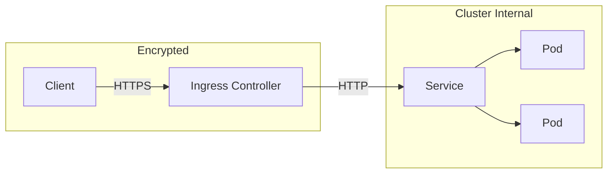

# How to Set Up Kubernetes Ingress with TLS Termination

Author: [nawazdhandala](https://www.github.com/nawazdhandala)

Tags: Kubernetes, Ingress, TLS, HTTPS, Security, cert-manager, DevOps

Description: Learn how to configure Kubernetes Ingress with TLS termination for secure HTTPS traffic. This guide covers manual certificate configuration, automated certificates with cert-manager, and production best practices.

---

Every production Kubernetes application needs HTTPS. Ingress with TLS termination handles SSL/TLS at the edge, decrypting traffic before it reaches your services. This guide shows you how to set it up properly, from manual certificates to fully automated certificate management.

## Understanding TLS Termination



The Ingress controller terminates TLS, meaning it handles the encryption/decryption. Traffic inside the cluster travels over HTTP (though you can enable end-to-end encryption if needed).

## Prerequisites

Install an Ingress controller. nginx-ingress is the most common:

```bash
# Install nginx Ingress controller
kubectl apply -f https://raw.githubusercontent.com/kubernetes/ingress-nginx/controller-v1.9.0/deploy/static/provider/cloud/deploy.yaml

# Wait for it to be ready
kubectl wait --namespace ingress-nginx \
  --for=condition=ready pod \
  --selector=app.kubernetes.io/component=controller \
  --timeout=120s

# Verify installation
kubectl get pods -n ingress-nginx
kubectl get svc -n ingress-nginx
```

## Method 1: Manual TLS Certificate

For existing certificates or internal CAs.

### Create a TLS Secret

```bash
# Create secret from certificate files
kubectl create secret tls myapp-tls \
  --cert=path/to/tls.crt \
  --key=path/to/tls.key \
  -n production
```

Or use a YAML manifest:

```yaml
# tls-secret.yaml
apiVersion: v1
kind: Secret
metadata:
  name: myapp-tls
  namespace: production
type: kubernetes.io/tls
data:
  # Base64 encoded certificate
  tls.crt: LS0tLS1CRUdJTiBDRVJUSUZJQ0FURS0tLS0t...
  # Base64 encoded private key
  tls.key: LS0tLS1CRUdJTiBQUklWQVRFIEtFWS0tLS0t...
```

Encode your certificates:

```bash
# Encode certificate and key
cat tls.crt | base64 -w0
cat tls.key | base64 -w0
```

### Configure Ingress with TLS

```yaml
# ingress-tls.yaml
apiVersion: networking.k8s.io/v1
kind: Ingress
metadata:
  name: myapp-ingress
  namespace: production
  annotations:
    nginx.ingress.kubernetes.io/ssl-redirect: "true"
spec:
  ingressClassName: nginx
  tls:
    - hosts:
        - myapp.example.com
        - api.example.com
      secretName: myapp-tls
  rules:
    - host: myapp.example.com
      http:
        paths:
          - path: /
            pathType: Prefix
            backend:
              service:
                name: myapp-frontend
                port:
                  number: 80
    - host: api.example.com
      http:
        paths:
          - path: /
            pathType: Prefix
            backend:
              service:
                name: myapp-api
                port:
                  number: 8080
```

Apply it:

```bash
kubectl apply -f ingress-tls.yaml

# Verify
kubectl get ingress myapp-ingress -n production
kubectl describe ingress myapp-ingress -n production
```

## Method 2: Automated Certificates with cert-manager

cert-manager automatically provisions and renews certificates from Let's Encrypt.

### Install cert-manager

```bash
# Install cert-manager
kubectl apply -f https://github.com/cert-manager/cert-manager/releases/download/v1.13.0/cert-manager.yaml

# Wait for pods to be ready
kubectl wait --namespace cert-manager \
  --for=condition=ready pod \
  --selector=app.kubernetes.io/instance=cert-manager \
  --timeout=120s

# Verify installation
kubectl get pods -n cert-manager
```

### Create a ClusterIssuer

For Let's Encrypt production certificates:

```yaml
# cluster-issuer.yaml
apiVersion: cert-manager.io/v1
kind: ClusterIssuer
metadata:
  name: letsencrypt-prod
spec:
  acme:
    # Let's Encrypt production server
    server: https://acme-v02.api.letsencrypt.org/directory
    # Your email for certificate notifications
    email: admin@example.com
    privateKeySecretRef:
      name: letsencrypt-prod-key
    solvers:
      # HTTP-01 challenge using Ingress
      - http01:
          ingress:
            class: nginx
```

For staging (testing without rate limits):

```yaml
# cluster-issuer-staging.yaml
apiVersion: cert-manager.io/v1
kind: ClusterIssuer
metadata:
  name: letsencrypt-staging
spec:
  acme:
    server: https://acme-staging-v02.api.letsencrypt.org/directory
    email: admin@example.com
    privateKeySecretRef:
      name: letsencrypt-staging-key
    solvers:
      - http01:
          ingress:
            class: nginx
```

Apply the issuers:

```bash
kubectl apply -f cluster-issuer.yaml
kubectl apply -f cluster-issuer-staging.yaml

# Verify
kubectl get clusterissuer
```

### Configure Ingress for Automatic Certificates

Add the cert-manager annotation:

```yaml
# ingress-auto-tls.yaml
apiVersion: networking.k8s.io/v1
kind: Ingress
metadata:
  name: myapp-ingress
  namespace: production
  annotations:
    # Tell cert-manager to issue a certificate
    cert-manager.io/cluster-issuer: letsencrypt-prod
    # Force HTTPS redirect
    nginx.ingress.kubernetes.io/ssl-redirect: "true"
spec:
  ingressClassName: nginx
  tls:
    - hosts:
        - myapp.example.com
      # cert-manager will create this secret
      secretName: myapp-example-com-tls
  rules:
    - host: myapp.example.com
      http:
        paths:
          - path: /
            pathType: Prefix
            backend:
              service:
                name: myapp
                port:
                  number: 80
```

Apply and watch cert-manager work:

```bash
kubectl apply -f ingress-auto-tls.yaml

# Watch certificate progress
kubectl get certificate -n production -w

# Check certificate status
kubectl describe certificate myapp-example-com-tls -n production

# View certificate details
kubectl get secret myapp-example-com-tls -n production -o yaml
```

## DNS-01 Challenge for Wildcards

For wildcard certificates, use DNS-01 challenge:

```yaml
# cluster-issuer-dns.yaml
apiVersion: cert-manager.io/v1
kind: ClusterIssuer
metadata:
  name: letsencrypt-dns
spec:
  acme:
    server: https://acme-v02.api.letsencrypt.org/directory
    email: admin@example.com
    privateKeySecretRef:
      name: letsencrypt-dns-key
    solvers:
      - dns01:
          cloudflare:
            email: admin@example.com
            apiTokenSecretRef:
              name: cloudflare-api-token
              key: api-token
```

Create the API token secret:

```bash
kubectl create secret generic cloudflare-api-token \
  --from-literal=api-token=YOUR_CLOUDFLARE_API_TOKEN \
  -n cert-manager
```

Wildcard Ingress:

```yaml
apiVersion: networking.k8s.io/v1
kind: Ingress
metadata:
  name: wildcard-ingress
  namespace: production
  annotations:
    cert-manager.io/cluster-issuer: letsencrypt-dns
spec:
  ingressClassName: nginx
  tls:
    - hosts:
        - "*.example.com"
      secretName: wildcard-example-com-tls
  rules:
    - host: "*.example.com"
      http:
        paths:
          - path: /
            pathType: Prefix
            backend:
              service:
                name: default-backend
                port:
                  number: 80
```

## TLS Configuration Options

### Force HTTPS Redirect

```yaml
metadata:
  annotations:
    nginx.ingress.kubernetes.io/ssl-redirect: "true"
    nginx.ingress.kubernetes.io/force-ssl-redirect: "true"
```

### HSTS (HTTP Strict Transport Security)

```yaml
metadata:
  annotations:
    nginx.ingress.kubernetes.io/hsts: "true"
    nginx.ingress.kubernetes.io/hsts-max-age: "31536000"
    nginx.ingress.kubernetes.io/hsts-include-subdomains: "true"
    nginx.ingress.kubernetes.io/hsts-preload: "true"
```

### Custom TLS Protocols and Ciphers

```yaml
metadata:
  annotations:
    nginx.ingress.kubernetes.io/ssl-protocols: "TLSv1.2 TLSv1.3"
    nginx.ingress.kubernetes.io/ssl-ciphers: "ECDHE-RSA-AES128-GCM-SHA256:ECDHE-RSA-AES256-GCM-SHA384"
```

### Backend HTTPS (End-to-End Encryption)

If your backend service also uses HTTPS:

```yaml
metadata:
  annotations:
    nginx.ingress.kubernetes.io/backend-protocol: "HTTPS"
    nginx.ingress.kubernetes.io/proxy-ssl-verify: "false"  # Skip verification for self-signed
```

## Multiple TLS Certificates

Handle multiple domains with different certificates:

```yaml
apiVersion: networking.k8s.io/v1
kind: Ingress
metadata:
  name: multi-tls-ingress
  namespace: production
  annotations:
    cert-manager.io/cluster-issuer: letsencrypt-prod
spec:
  ingressClassName: nginx
  tls:
    - hosts:
        - app.example.com
      secretName: app-example-com-tls
    - hosts:
        - api.example.com
      secretName: api-example-com-tls
    - hosts:
        - admin.example.com
      secretName: admin-example-com-tls
  rules:
    - host: app.example.com
      http:
        paths:
          - path: /
            pathType: Prefix
            backend:
              service:
                name: app-frontend
                port:
                  number: 80
    - host: api.example.com
      http:
        paths:
          - path: /
            pathType: Prefix
            backend:
              service:
                name: api-service
                port:
                  number: 8080
    - host: admin.example.com
      http:
        paths:
          - path: /
            pathType: Prefix
            backend:
              service:
                name: admin-dashboard
                port:
                  number: 3000
```

## Troubleshooting

### Certificate Not Issued

```bash
# Check certificate status
kubectl get certificate -n production
kubectl describe certificate <name> -n production

# Check cert-manager logs
kubectl logs -n cert-manager -l app=cert-manager

# Check certificate request
kubectl get certificaterequest -n production
kubectl describe certificaterequest <name> -n production

# Check challenges
kubectl get challenge -n production
kubectl describe challenge <name> -n production
```

### Common Issues

**Challenge failed**: Ensure DNS points to your Ingress controller IP.

```bash
# Get Ingress controller external IP
kubectl get svc -n ingress-nginx

# Verify DNS
dig myapp.example.com
```

**Secret not found**: Check the secret name matches in Ingress and certificate.

```bash
kubectl get secrets -n production | grep tls
```

**Certificate expired**: Check cert-manager is running and can reach Let's Encrypt.

```bash
kubectl get pods -n cert-manager
kubectl logs -n cert-manager deployment/cert-manager
```

### Verify TLS Configuration

```bash
# Test HTTPS connection
curl -v https://myapp.example.com

# Check certificate details
openssl s_client -connect myapp.example.com:443 -servername myapp.example.com

# Check certificate expiry
echo | openssl s_client -connect myapp.example.com:443 2>/dev/null | openssl x509 -noout -dates
```

## Best Practices

1. **Start with staging** to avoid Let's Encrypt rate limits
2. **Use ClusterIssuer** for cluster-wide certificate management
3. **Enable HSTS** for improved security
4. **Monitor certificate expiry** with alerts
5. **Use separate certificates** for different security zones
6. **Backup TLS secrets** for disaster recovery

```yaml
# Prometheus alert for certificate expiry
groups:
  - name: certificates
    rules:
      - alert: CertificateExpiringSoon
        expr: certmanager_certificate_expiration_timestamp_seconds - time() < 604800
        for: 1h
        labels:
          severity: warning
        annotations:
          summary: "Certificate expiring in less than 7 days"
```

---

TLS termination at the Ingress level simplifies certificate management and keeps your services focused on business logic. Use cert-manager for automatic certificate provisioning, and you will never worry about expired certificates again.
