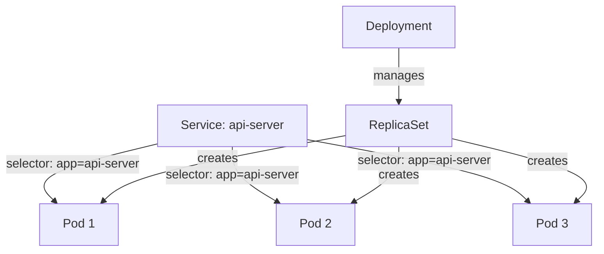

# How to Use Kubernetes Labels and Selectors Effectively

Author: [nawazdhandala](https://www.github.com/nawazdhandala)

Tags: Kubernetes, Labels, Selectors, Organization, Best Practices

Description: Learn how to design and use Kubernetes labels and selectors effectively for organizing resources, enabling service discovery, and managing deployments across namespaces and environments.

---

Labels are key-value pairs attached to Kubernetes objects. They enable you to organize resources, select subsets of objects, and connect different components. A well-designed labeling strategy makes your cluster manageable at scale and simplifies debugging during incidents.

## Understanding Labels vs Annotations

Labels and annotations both attach metadata to objects, but they serve different purposes:

- **Labels**: Used for selection and organization. Kubernetes uses them to connect Services to Pods, Deployments to ReplicaSets, and more.
- **Annotations**: Used for non-identifying metadata like build information, git commits, or tool configurations.

```yaml
# Example showing both labels and annotations
apiVersion: apps/v1
kind: Deployment
metadata:
  name: api-server
  # Labels identify and select this Deployment
  labels:
    app: api-server
    environment: production
    team: platform
  # Annotations store additional information
  annotations:
    git.commit: "abc123def"
    deployed.by: "jenkins-pipeline"
    prometheus.io/scrape: "true"
```

## Designing a Labeling Strategy

A consistent labeling strategy helps across your entire organization. Start with these recommended labels from Kubernetes documentation:

```yaml
# Standard recommended labels
metadata:
  labels:
    # The name of the application
    app.kubernetes.io/name: api-server

    # The component within the architecture
    app.kubernetes.io/component: backend

    # The current version of the application
    app.kubernetes.io/version: "1.5.0"

    # The tool being used to manage the operation
    app.kubernetes.io/managed-by: helm

    # A unique name identifying the instance of an application
    app.kubernetes.io/instance: api-server-prod

    # The name of a higher level application this one is part of
    app.kubernetes.io/part-of: ecommerce-platform
```

Add custom labels for your organization:

```yaml
# Custom organizational labels
metadata:
  labels:
    # Team ownership for routing alerts
    team: platform

    # Environment for filtering and policies
    environment: production

    # Cost allocation
    cost-center: engineering

    # Compliance and data classification
    data-classification: confidential
```

## Using Label Selectors

Selectors query objects based on their labels. Kubernetes supports two types:

### Equality-Based Selectors

Use `=`, `==`, and `!=` operators:

```bash
# Select pods where environment equals production
kubectl get pods -l environment=production

# Select pods where team is not backend
kubectl get pods -l team!=backend

# Combine multiple equality conditions (AND logic)
kubectl get pods -l environment=production,team=platform
```

### Set-Based Selectors

Use `in`, `notin`, and `exists` operators:

```bash
# Select pods where environment is production OR staging
kubectl get pods -l 'environment in (production, staging)'

# Select pods where environment is NOT in development or testing
kubectl get pods -l 'environment notin (development, testing)'

# Select pods that have a team label (any value)
kubectl get pods -l team

# Select pods that do NOT have a canary label
kubectl get pods -l '!canary'

# Combine set-based and equality-based
kubectl get pods -l 'environment in (production),team=platform'
```

## Labels in Service Discovery

Services use selectors to find Pods to route traffic to:

```yaml
# service.yaml
apiVersion: v1
kind: Service
metadata:
  name: api-server
  labels:
    app: api-server
spec:
  # This selector determines which Pods receive traffic
  selector:
    app: api-server
    environment: production
  ports:
    - port: 80
      targetPort: 8080
---
# deployment.yaml
apiVersion: apps/v1
kind: Deployment
metadata:
  name: api-server
spec:
  replicas: 3
  # Deployment uses selector to manage ReplicaSets
  selector:
    matchLabels:
      app: api-server
      environment: production
  template:
    metadata:
      # Pod labels must match the Service and Deployment selectors
      labels:
        app: api-server
        environment: production
        version: v1.5.0
    spec:
      containers:
        - name: api
          image: myapi:1.5.0
```

The relationship between these resources:



## Labels for Canary Deployments

Labels enable sophisticated deployment strategies:

```yaml
# Stable deployment serving 90% of traffic
apiVersion: apps/v1
kind: Deployment
metadata:
  name: api-server-stable
spec:
  replicas: 9  # 90% of total pods
  selector:
    matchLabels:
      app: api-server
      track: stable
  template:
    metadata:
      labels:
        app: api-server
        track: stable
        version: v1.5.0
    spec:
      containers:
        - name: api
          image: myapi:1.5.0
---
# Canary deployment serving 10% of traffic
apiVersion: apps/v1
kind: Deployment
metadata:
  name: api-server-canary
spec:
  replicas: 1  # 10% of total pods
  selector:
    matchLabels:
      app: api-server
      track: canary
  template:
    metadata:
      labels:
        app: api-server
        track: canary
        version: v1.6.0
    spec:
      containers:
        - name: api
          image: myapi:1.6.0
---
# Service selects ALL pods with app=api-server
# Traffic is distributed across both stable and canary
apiVersion: v1
kind: Service
metadata:
  name: api-server
spec:
  selector:
    app: api-server  # No track label means both tracks receive traffic
  ports:
    - port: 80
      targetPort: 8080
```

## Labels in Network Policies

Network policies use labels to define which Pods can communicate:

```yaml
# network-policy.yaml
apiVersion: networking.k8s.io/v1
kind: NetworkPolicy
metadata:
  name: api-server-policy
  namespace: production
spec:
  # This policy applies to pods with app=api-server
  podSelector:
    matchLabels:
      app: api-server

  policyTypes:
    - Ingress
    - Egress

  ingress:
    # Allow traffic from pods labeled role=frontend
    - from:
        - podSelector:
            matchLabels:
              role: frontend
      ports:
        - port: 8080

  egress:
    # Allow traffic to pods labeled app=database
    - to:
        - podSelector:
            matchLabels:
              app: database
      ports:
        - port: 5432
```

## Bulk Operations with Labels

Labels enable efficient bulk operations:

```bash
# Delete all pods in the development environment
kubectl delete pods -l environment=development

# Scale all deployments for a specific team
kubectl scale deployment -l team=platform --replicas=5

# Add a label to all running pods
kubectl label pods -l app=api-server monitored=true

# Remove a label from pods
kubectl label pods -l app=api-server monitored-

# Update an existing label (requires --overwrite)
kubectl label pods -l app=api-server version=v2.0.0 --overwrite
```

## Querying with Field and Label Selectors

Combine label selectors with field selectors for precise queries:

```bash
# Find running pods for a specific app
kubectl get pods -l app=api-server --field-selector=status.phase=Running

# Find pods on a specific node with a team label
kubectl get pods -l team=platform --field-selector=spec.nodeName=worker-1

# Watch for changes to pods with specific labels
kubectl get pods -l environment=production -w
```

## Labels in Monitoring and Alerting

Prometheus uses labels extensively for metric aggregation:

```yaml
# servicemonitor.yaml for Prometheus Operator
apiVersion: monitoring.coreos.com/v1
kind: ServiceMonitor
metadata:
  name: api-server-metrics
  labels:
    # Prometheus selects ServiceMonitors based on labels
    release: prometheus
spec:
  # Select services to scrape based on labels
  selector:
    matchLabels:
      app: api-server
      prometheus: enabled
  endpoints:
    - port: metrics
      interval: 30s
```

## Common Labeling Mistakes

Avoid these pitfalls:

```yaml
# WRONG: Label values with special characters
metadata:
  labels:
    # Spaces and special chars are not allowed
    # team: "Platform Team"

    # CORRECT: Use lowercase, dashes, and underscores
    team: platform-team

# WRONG: Changing selector labels on existing Deployment
# This creates orphaned ReplicaSets
spec:
  selector:
    matchLabels:
      app: api-server
      # Adding this to an existing deployment causes problems
      # version: v2

# WRONG: Mismatched labels between Service and Pods
# Service will not route traffic to your Pods
---
# Service selecting app=api
kind: Service
spec:
  selector:
    app: api
---
# But Pods have app=api-server
kind: Pod
metadata:
  labels:
    app: api-server  # Mismatch - traffic will not route
```

## Label Validation and Constraints

Labels have specific format requirements:

- Keys must be 63 characters or less
- Keys can have an optional prefix (up to 253 characters)
- Values must be 63 characters or less
- Both must start and end with alphanumeric characters
- Allowed characters: alphanumeric, `-`, `_`, `.`

```bash
# Validate labels with dry-run
kubectl apply -f deployment.yaml --dry-run=server

# Check existing labels on resources
kubectl get pods --show-labels

# Output labels in custom columns
kubectl get pods -o custom-columns='NAME:.metadata.name,APP:.metadata.labels.app,ENV:.metadata.labels.environment'
```

---

A well-designed labeling strategy is foundational to Kubernetes operations. Labels connect the pieces of your application, enable sophisticated deployment strategies, and make your cluster manageable at scale. Start with the recommended labels, add organization-specific ones, and enforce consistency through policy tools. The time invested in labeling pays off in simpler debugging, better organization, and more flexible deployments.
