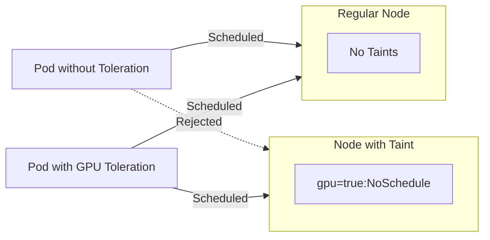

# How to Configure Kubernetes Node Taints and Tolerations

Author: [nawazdhandala](https://www.github.com/nawazdhandala)

Tags: Kubernetes, Scheduling, Nodes, DevOps, Resource Management

Description: Learn how to use Kubernetes taints and tolerations to control pod scheduling, dedicate nodes for specific workloads, and handle node maintenance without disrupting applications.

---

Taints and tolerations work together to control which pods can be scheduled on which nodes. A taint on a node repels pods unless they have a matching toleration. This mechanism lets you dedicate nodes to specific workloads, isolate problematic nodes, or reserve resources for system components.

## Understanding Taints and Tolerations

Think of taints as "keep away" signs on nodes, and tolerations as "access badges" on pods:



## Taint Effects

Kubernetes supports three taint effects:

| Effect | Behavior |
|--------|----------|
| `NoSchedule` | New pods without toleration will not be scheduled |
| `PreferNoSchedule` | Scheduler tries to avoid, but will place if no alternative |
| `NoExecute` | Existing pods without toleration are evicted |

## Adding and Removing Taints

Manage taints on nodes with kubectl:

```bash
# Add a taint to a node
# Format: kubectl taint nodes <node-name> <key>=<value>:<effect>
kubectl taint nodes worker-1 dedicated=gpu:NoSchedule

# Add a taint with no value
kubectl taint nodes worker-2 maintenance:NoSchedule

# View taints on a node
kubectl describe node worker-1 | grep -A5 Taints

# Remove a taint (add minus sign at end)
kubectl taint nodes worker-1 dedicated=gpu:NoSchedule-

# Remove all taints with a specific key
kubectl taint nodes worker-1 dedicated-
```

## Basic Tolerations

Pods need tolerations to be scheduled on tainted nodes:

```yaml
# gpu-workload.yaml
apiVersion: v1
kind: Pod
metadata:
  name: gpu-training
spec:
  # Toleration allows this pod to be scheduled on nodes with the matching taint
  tolerations:
    - key: "dedicated"
      operator: "Equal"
      value: "gpu"
      effect: "NoSchedule"

  containers:
    - name: training
      image: tensorflow/tensorflow:latest-gpu
      resources:
        limits:
          nvidia.com/gpu: 1
```

## Toleration Operators

Two operators control how tolerations match taints:

```yaml
# Equal operator: Key, value, and effect must all match
tolerations:
  - key: "dedicated"
    operator: "Equal"
    value: "gpu"
    effect: "NoSchedule"

# Exists operator: Only key and effect need to match
# Tolerates any value for the key
tolerations:
  - key: "dedicated"
    operator: "Exists"
    effect: "NoSchedule"

# Tolerate all taints with a key (any effect)
tolerations:
  - key: "dedicated"
    operator: "Exists"

# Tolerate ALL taints (use with caution)
tolerations:
  - operator: "Exists"
```

## Dedicated Node Pools

Use taints to create dedicated node pools for different workloads:

```bash
# Create a pool for database workloads
kubectl taint nodes db-node-1 db-node-2 db-node-3 \
  workload=database:NoSchedule

# Create a pool for high-memory workloads
kubectl taint nodes mem-node-1 mem-node-2 \
  workload=high-memory:NoSchedule
```

Deploy applications to their dedicated pools:

```yaml
# database-deployment.yaml
apiVersion: apps/v1
kind: Deployment
metadata:
  name: postgres
spec:
  replicas: 3
  selector:
    matchLabels:
      app: postgres
  template:
    metadata:
      labels:
        app: postgres
    spec:
      # Tolerate the database workload taint
      tolerations:
        - key: "workload"
          operator: "Equal"
          value: "database"
          effect: "NoSchedule"

      # Also use nodeSelector to prefer these nodes
      nodeSelector:
        workload-type: database

      containers:
        - name: postgres
          image: postgres:15
          resources:
            requests:
              memory: "2Gi"
              cpu: "1000m"
```

## NoExecute for Eviction

The `NoExecute` effect evicts existing pods that do not tolerate the taint:

```bash
# Mark a node for maintenance - evicts non-tolerating pods
kubectl taint nodes worker-1 maintenance=true:NoExecute
```

Control eviction timing with `tolerationSeconds`:

```yaml
# workload-with-grace-period.yaml
apiVersion: apps/v1
kind: Deployment
metadata:
  name: web-app
spec:
  replicas: 5
  selector:
    matchLabels:
      app: web-app
  template:
    metadata:
      labels:
        app: web-app
    spec:
      tolerations:
        # Tolerate maintenance taint but evict after 300 seconds
        - key: "maintenance"
          operator: "Equal"
          value: "true"
          effect: "NoExecute"
          tolerationSeconds: 300  # Pod will be evicted after 5 minutes

      containers:
        - name: web
          image: nginx:1.24
```

## Built-in Node Condition Taints

Kubernetes automatically adds taints when nodes have problems:

| Taint | Meaning |
|-------|---------|
| `node.kubernetes.io/not-ready` | Node is not ready |
| `node.kubernetes.io/unreachable` | Node is unreachable |
| `node.kubernetes.io/memory-pressure` | Node has memory pressure |
| `node.kubernetes.io/disk-pressure` | Node has disk pressure |
| `node.kubernetes.io/pid-pressure` | Node has too many processes |
| `node.kubernetes.io/network-unavailable` | Node network is not configured |

Configure pods to tolerate node conditions:

```yaml
# critical-workload.yaml
apiVersion: apps/v1
kind: Deployment
metadata:
  name: critical-service
spec:
  replicas: 3
  selector:
    matchLabels:
      app: critical-service
  template:
    metadata:
      labels:
        app: critical-service
    spec:
      tolerations:
        # Stay on node even during memory pressure
        - key: "node.kubernetes.io/memory-pressure"
          operator: "Exists"
          effect: "NoSchedule"

        # Tolerate not-ready state for 60 seconds before eviction
        - key: "node.kubernetes.io/not-ready"
          operator: "Exists"
          effect: "NoExecute"
          tolerationSeconds: 60

        # Tolerate unreachable state for 60 seconds
        - key: "node.kubernetes.io/unreachable"
          operator: "Exists"
          effect: "NoExecute"
          tolerationSeconds: 60

      containers:
        - name: service
          image: myservice:1.0.0
```

## Node Maintenance Workflow

Safely drain a node for maintenance:

```bash
# Step 1: Cordon the node (prevent new pods)
kubectl cordon worker-1

# Step 2: Add maintenance taint (triggers tolerationSeconds eviction)
kubectl taint nodes worker-1 maintenance=true:NoExecute

# Step 3: Wait for pods to migrate or drain forcefully
kubectl drain worker-1 --ignore-daemonsets --delete-emptydir-data

# Step 4: Perform maintenance...

# Step 5: Remove taint and uncordon
kubectl taint nodes worker-1 maintenance=true:NoExecute-
kubectl uncordon worker-1
```

## Taints with Node Affinity

Combine taints with node affinity for precise scheduling:

```yaml
# gpu-ml-workload.yaml
apiVersion: apps/v1
kind: Deployment
metadata:
  name: ml-training
spec:
  replicas: 2
  selector:
    matchLabels:
      app: ml-training
  template:
    metadata:
      labels:
        app: ml-training
    spec:
      # Tolerate GPU node taint
      tolerations:
        - key: "accelerator"
          operator: "Equal"
          value: "nvidia-gpu"
          effect: "NoSchedule"

      # Also require GPU nodes via affinity
      affinity:
        nodeAffinity:
          requiredDuringSchedulingIgnoredDuringExecution:
            nodeSelectorTerms:
              - matchExpressions:
                  - key: "gpu-type"
                    operator: "In"
                    values:
                      - "nvidia-a100"
                      - "nvidia-v100"

      containers:
        - name: training
          image: ml-training:2.0.0
          resources:
            limits:
              nvidia.com/gpu: 2
```

## Debugging Scheduling Issues

When pods are not scheduling due to taints:

```bash
# Check why a pod is pending
kubectl describe pod pending-pod-xyz | grep -A10 Events

# View node taints
kubectl describe nodes | grep -A3 Taints

# Check pod tolerations
kubectl get pod my-pod -o jsonpath='{.spec.tolerations}' | jq .

# List all taints across nodes
kubectl get nodes -o custom-columns='NAME:.metadata.name,TAINTS:.spec.taints'
```

Common error message:
```
Warning  FailedScheduling  pod has unbound immediate PersistentVolumeClaims
         0/5 nodes are available: 3 node(s) had taints that the pod didn't tolerate
```

## Best Practices

1. **Use meaningful taint keys**: Choose descriptive names like `workload=database` rather than generic ones.

2. **Document your taints**: Maintain a list of taints used in your cluster and their purposes.

3. **Prefer PreferNoSchedule for soft requirements**: When you want scheduling preference but not strict enforcement.

4. **Set tolerationSeconds for NoExecute**: Give pods time to gracefully terminate.

5. **Combine with Pod Disruption Budgets**: Ensure availability during node maintenance.

```yaml
# pdb.yaml
apiVersion: policy/v1
kind: PodDisruptionBudget
metadata:
  name: web-pdb
spec:
  minAvailable: 2
  selector:
    matchLabels:
      app: web-app
```

---

Taints and tolerations give you precise control over pod scheduling in Kubernetes. Use them to dedicate nodes for specific workloads, manage node maintenance gracefully, and handle node failures. Combined with node affinity and Pod Disruption Budgets, they form a complete system for managing where and how your applications run.
