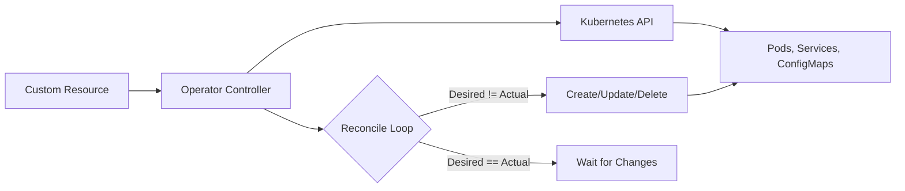

# How to Set Up Kubernetes Operators for Custom Resources

Author: [nawazdhandala](https://www.github.com/nawazdhandala)

Tags: Kubernetes, Operators, Custom Resources, CRD, Controllers, DevOps

Description: Learn how to set up and use Kubernetes Operators for managing custom resources. This guide covers understanding the operator pattern, installing community operators, and creating your own operator with practical examples.

---

Kubernetes Operators extend the platform to manage complex applications automatically. Instead of writing scripts to deploy and maintain databases, message queues, or monitoring systems, an operator handles it declaratively. Define what you want in a custom resource, and the operator makes it happen.

## Understanding the Operator Pattern



An operator consists of:
1. **Custom Resource Definition (CRD)**: Defines a new resource type
2. **Controller**: Watches for changes and reconciles state
3. **Business Logic**: Knows how to manage the application

## Installing Existing Operators

### Using Operator Lifecycle Manager (OLM)

OLM manages operator installation and updates.

```bash
# Install OLM
curl -sL https://github.com/operator-framework/operator-lifecycle-manager/releases/download/v0.27.0/install.sh | bash -s v0.27.0

# Verify installation
kubectl get pods -n olm
```

### Installing from OperatorHub

```bash
# List available operators
kubectl get packagemanifests -n olm

# Install an operator (e.g., Prometheus)
cat <<EOF | kubectl apply -f -
apiVersion: operators.coreos.com/v1alpha1
kind: Subscription
metadata:
  name: prometheus
  namespace: operators
spec:
  channel: beta
  name: prometheus
  source: operatorhubio-catalog
  sourceNamespace: olm
EOF
```

### Installing with Helm

Many operators provide Helm charts:

```bash
# Install PostgreSQL Operator
helm repo add postgres-operator https://opensource.zalando.com/postgres-operator/charts/postgres-operator
helm install postgres-operator postgres-operator/postgres-operator -n postgres-operator --create-namespace

# Install Redis Operator
helm repo add ot-helm https://ot-container-kit.github.io/helm-charts/
helm install redis-operator ot-helm/redis-operator -n redis-operator --create-namespace
```

### Installing from YAML

```bash
# Install cert-manager operator
kubectl apply -f https://github.com/cert-manager/cert-manager/releases/download/v1.13.0/cert-manager.yaml

# Verify
kubectl get pods -n cert-manager
```

## Using Operators: Examples

### Example 1: PostgreSQL with Zalando Operator

```yaml
# Create a PostgreSQL cluster
apiVersion: acid.zalan.do/v1
kind: postgresql
metadata:
  name: myapp-postgres
  namespace: database
spec:
  teamId: myteam
  volume:
    size: 10Gi
    storageClass: fast-ssd
  numberOfInstances: 3
  users:
    myappuser:
      - superuser
      - createdb
  databases:
    myappdb: myappuser
  postgresql:
    version: "15"
    parameters:
      max_connections: "200"
      shared_buffers: "256MB"
  resources:
    requests:
      cpu: 100m
      memory: 256Mi
    limits:
      cpu: 1
      memory: 1Gi
```

The operator automatically:
- Creates a StatefulSet with 3 replicas
- Sets up streaming replication
- Creates users and databases
- Manages failover

### Example 2: Redis with Redis Operator

```yaml
apiVersion: redis.redis.opstreelabs.in/v1beta2
kind: Redis
metadata:
  name: myapp-redis
  namespace: cache
spec:
  kubernetesConfig:
    image: redis:7-alpine
    imagePullPolicy: IfNotPresent
  storage:
    volumeClaimTemplate:
      spec:
        accessModes:
          - ReadWriteOnce
        resources:
          requests:
            storage: 5Gi
  redisConfig:
    maxmemory: 512mb
    maxmemory-policy: allkeys-lru
  resources:
    requests:
      cpu: 100m
      memory: 256Mi
```

### Example 3: Certificates with cert-manager

```yaml
# Define an Issuer
apiVersion: cert-manager.io/v1
kind: ClusterIssuer
metadata:
  name: letsencrypt-prod
spec:
  acme:
    server: https://acme-v02.api.letsencrypt.org/directory
    email: admin@example.com
    privateKeySecretRef:
      name: letsencrypt-prod-key
    solvers:
      - http01:
          ingress:
            class: nginx
---
# Request a Certificate
apiVersion: cert-manager.io/v1
kind: Certificate
metadata:
  name: myapp-tls
  namespace: production
spec:
  secretName: myapp-tls-secret
  issuerRef:
    name: letsencrypt-prod
    kind: ClusterIssuer
  dnsNames:
    - myapp.example.com
    - api.example.com
```

## Creating Custom Resources (CRDs)

### Define a CRD

```yaml
# myapp-crd.yaml
apiVersion: apiextensions.k8s.io/v1
kind: CustomResourceDefinition
metadata:
  name: myapps.example.com
spec:
  group: example.com
  names:
    kind: MyApp
    listKind: MyAppList
    plural: myapps
    singular: myapp
    shortNames:
      - ma
  scope: Namespaced
  versions:
    - name: v1
      served: true
      storage: true
      schema:
        openAPIV3Schema:
          type: object
          properties:
            spec:
              type: object
              required:
                - replicas
                - image
              properties:
                replicas:
                  type: integer
                  minimum: 1
                  maximum: 10
                image:
                  type: string
                config:
                  type: object
                  properties:
                    logLevel:
                      type: string
                      enum: ["debug", "info", "warn", "error"]
                    port:
                      type: integer
            status:
              type: object
              properties:
                availableReplicas:
                  type: integer
                conditions:
                  type: array
                  items:
                    type: object
                    properties:
                      type:
                        type: string
                      status:
                        type: string
                      lastTransitionTime:
                        type: string
      subresources:
        status: {}
      additionalPrinterColumns:
        - name: Replicas
          type: integer
          jsonPath: .spec.replicas
        - name: Available
          type: integer
          jsonPath: .status.availableReplicas
        - name: Age
          type: date
          jsonPath: .metadata.creationTimestamp
```

Apply the CRD:

```bash
kubectl apply -f myapp-crd.yaml

# Verify
kubectl get crd myapps.example.com
```

### Create Custom Resource Instances

```yaml
# myapp-instance.yaml
apiVersion: example.com/v1
kind: MyApp
metadata:
  name: myapp-production
  namespace: production
spec:
  replicas: 3
  image: myapp:1.0.0
  config:
    logLevel: info
    port: 8080
```

```bash
kubectl apply -f myapp-instance.yaml

# List custom resources
kubectl get myapps -n production
kubectl get ma -n production  # Using short name
```

## Building a Simple Operator

### Using Kubebuilder

```bash
# Install kubebuilder
curl -L -o kubebuilder "https://go.kubebuilder.io/dl/latest/$(go env GOOS)/$(go env GOARCH)"
chmod +x kubebuilder && mv kubebuilder /usr/local/bin/

# Initialize project
mkdir myapp-operator && cd myapp-operator
kubebuilder init --domain example.com --repo github.com/myorg/myapp-operator

# Create API
kubebuilder create api --group apps --version v1 --kind MyApp
```

### Controller Logic

```go
// controllers/myapp_controller.go
func (r *MyAppReconciler) Reconcile(ctx context.Context, req ctrl.Request) (ctrl.Result, error) {
    log := log.FromContext(ctx)

    // Fetch the MyApp instance
    myapp := &appsv1.MyApp{}
    if err := r.Get(ctx, req.NamespacedName, myapp); err != nil {
        return ctrl.Result{}, client.IgnoreNotFound(err)
    }

    // Define the desired Deployment
    deployment := &appsv1.Deployment{
        ObjectMeta: metav1.ObjectMeta{
            Name:      myapp.Name,
            Namespace: myapp.Namespace,
        },
        Spec: appsv1.DeploymentSpec{
            Replicas: &myapp.Spec.Replicas,
            Selector: &metav1.LabelSelector{
                MatchLabels: map[string]string{"app": myapp.Name},
            },
            Template: corev1.PodTemplateSpec{
                ObjectMeta: metav1.ObjectMeta{
                    Labels: map[string]string{"app": myapp.Name},
                },
                Spec: corev1.PodSpec{
                    Containers: []corev1.Container{{
                        Name:  "myapp",
                        Image: myapp.Spec.Image,
                    }},
                },
            },
        },
    }

    // Set owner reference
    ctrl.SetControllerReference(myapp, deployment, r.Scheme)

    // Create or update the Deployment
    if err := r.Create(ctx, deployment); err != nil {
        if errors.IsAlreadyExists(err) {
            if err := r.Update(ctx, deployment); err != nil {
                return ctrl.Result{}, err
            }
        } else {
            return ctrl.Result{}, err
        }
    }

    // Update status
    myapp.Status.AvailableReplicas = deployment.Status.AvailableReplicas
    if err := r.Status().Update(ctx, myapp); err != nil {
        return ctrl.Result{}, err
    }

    return ctrl.Result{}, nil
}
```

### Build and Deploy

```bash
# Build the operator image
make docker-build docker-push IMG=myregistry.io/myapp-operator:v1.0.0

# Deploy to cluster
make deploy IMG=myregistry.io/myapp-operator:v1.0.0
```

## Monitoring Operators

### Check Operator Status

```bash
# Operator pods
kubectl get pods -n operators

# Operator logs
kubectl logs -n operators -l control-plane=controller-manager

# Custom resource status
kubectl get myapps -A
kubectl describe myapp myapp-production -n production
```

### Events

```bash
# Events for custom resources
kubectl get events -n production --field-selector involvedObject.kind=MyApp
```

## Best Practices

1. **Start with existing operators** before building your own
2. **Use kubebuilder or operator-sdk** for new operators
3. **Implement proper RBAC** for operators
4. **Handle edge cases** in reconciliation loops
5. **Add status subresources** for visibility
6. **Write tests** for controller logic

### RBAC for Operators

```yaml
apiVersion: rbac.authorization.k8s.io/v1
kind: ClusterRole
metadata:
  name: myapp-operator
rules:
  - apiGroups: ["example.com"]
    resources: ["myapps"]
    verbs: ["get", "list", "watch", "create", "update", "patch", "delete"]
  - apiGroups: ["example.com"]
    resources: ["myapps/status"]
    verbs: ["get", "update", "patch"]
  - apiGroups: ["apps"]
    resources: ["deployments"]
    verbs: ["get", "list", "watch", "create", "update", "patch", "delete"]
  - apiGroups: [""]
    resources: ["services", "configmaps"]
    verbs: ["get", "list", "watch", "create", "update", "patch", "delete"]
```

---

Operators bring the power of automation to Kubernetes. They encode operational knowledge into software, handling complex tasks like database clustering, certificate renewal, and application upgrades. Start by using existing operators, then build your own when you need custom automation.
