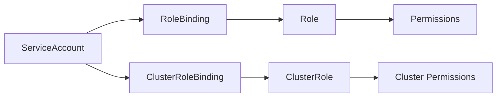

# How to Set Up Kubernetes RBAC for ServiceAccounts

Author: [nawazdhandala](https://www.github.com/nawazdhandala)

Tags: Kubernetes, RBAC, Security, ServiceAccounts, Authorization

Description: Learn how to configure Role-Based Access Control for ServiceAccounts in Kubernetes, including creating roles, role bindings, and implementing least-privilege access for your workloads.

---

ServiceAccounts in Kubernetes provide identities for processes running in Pods. When combined with Role-Based Access Control (RBAC), they enable fine-grained permissions that follow the principle of least privilege. This guide walks through setting up RBAC for ServiceAccounts to secure your cluster workloads.

## Understanding ServiceAccounts and RBAC

Every Pod in Kubernetes runs with a ServiceAccount. If you do not specify one, Kubernetes assigns the `default` ServiceAccount in the namespace. RBAC then determines what API operations that ServiceAccount can perform.

The RBAC model consists of four key resources:

- **ServiceAccount**: Identity for Pods
- **Role**: Permissions scoped to a namespace
- **ClusterRole**: Permissions scoped to the entire cluster
- **RoleBinding/ClusterRoleBinding**: Links ServiceAccounts to Roles



## Creating a ServiceAccount

Start by creating a dedicated ServiceAccount for your application:

```yaml
# serviceaccount.yaml
# Creates a ServiceAccount for the monitoring application
apiVersion: v1
kind: ServiceAccount
metadata:
  name: monitoring-sa
  namespace: monitoring
  labels:
    app: monitoring
    component: collector
```

Apply the ServiceAccount:

```bash
# Create the namespace first if it does not exist
kubectl create namespace monitoring

# Create the ServiceAccount
kubectl apply -f serviceaccount.yaml

# Verify the ServiceAccount was created
kubectl get serviceaccount monitoring-sa -n monitoring
```

## Defining a Role with Specific Permissions

Roles define what actions are permitted on which resources. Be specific about the verbs and resources needed:

```yaml
# role.yaml
# Defines permissions for reading pods and pod logs
apiVersion: rbac.authorization.k8s.io/v1
kind: Role
metadata:
  name: pod-reader
  namespace: monitoring
rules:
  # Allow listing and getting pods
  - apiGroups: [""]           # Core API group (empty string)
    resources: ["pods"]
    verbs: ["get", "list", "watch"]

  # Allow reading pod logs for debugging
  - apiGroups: [""]
    resources: ["pods/log"]
    verbs: ["get"]

  # Allow reading configmaps for configuration
  - apiGroups: [""]
    resources: ["configmaps"]
    verbs: ["get", "list"]
    resourceNames: ["monitoring-config"]  # Restrict to specific configmap
```

The `resourceNames` field adds an extra layer of restriction, limiting access to specific named resources.

## Binding the Role to the ServiceAccount

A RoleBinding connects the ServiceAccount to the Role:

```yaml
# rolebinding.yaml
# Binds the pod-reader role to the monitoring ServiceAccount
apiVersion: rbac.authorization.k8s.io/v1
kind: RoleBinding
metadata:
  name: monitoring-pod-reader
  namespace: monitoring
subjects:
  # The ServiceAccount that receives the permissions
  - kind: ServiceAccount
    name: monitoring-sa
    namespace: monitoring
roleRef:
  # The Role being granted
  kind: Role
  name: pod-reader
  apiGroup: rbac.authorization.k8s.io
```

Apply both the Role and RoleBinding:

```bash
# Apply the role and binding
kubectl apply -f role.yaml
kubectl apply -f rolebinding.yaml

# Verify the binding exists
kubectl get rolebinding monitoring-pod-reader -n monitoring
```

## Using ClusterRoles for Cross-Namespace Access

When your application needs to access resources across all namespaces, use ClusterRole and ClusterRoleBinding:

```yaml
# clusterrole.yaml
# Grants read access to nodes and persistent volumes cluster-wide
apiVersion: rbac.authorization.k8s.io/v1
kind: ClusterRole
metadata:
  name: node-reader
rules:
  # Allow reading node information
  - apiGroups: [""]
    resources: ["nodes"]
    verbs: ["get", "list", "watch"]

  # Allow reading persistent volumes
  - apiGroups: [""]
    resources: ["persistentvolumes"]
    verbs: ["get", "list"]

  # Allow reading storage classes
  - apiGroups: ["storage.k8s.io"]
    resources: ["storageclasses"]
    verbs: ["get", "list"]
---
# clusterrolebinding.yaml
apiVersion: rbac.authorization.k8s.io/v1
kind: ClusterRoleBinding
metadata:
  name: monitoring-node-reader
subjects:
  - kind: ServiceAccount
    name: monitoring-sa
    namespace: monitoring
roleRef:
  kind: ClusterRole
  name: node-reader
  apiGroup: rbac.authorization.k8s.io
```

## Assigning the ServiceAccount to a Pod

Configure your Deployment to use the ServiceAccount:

```yaml
# deployment.yaml
apiVersion: apps/v1
kind: Deployment
metadata:
  name: monitoring-agent
  namespace: monitoring
spec:
  replicas: 1
  selector:
    matchLabels:
      app: monitoring-agent
  template:
    metadata:
      labels:
        app: monitoring-agent
    spec:
      # Assign the ServiceAccount to this Pod
      serviceAccountName: monitoring-sa

      # Disable automatic token mounting if not needed
      # automountServiceAccountToken: false

      containers:
        - name: agent
          image: monitoring/agent:2.1.0
          env:
            # The token is automatically mounted at this path
            - name: KUBE_TOKEN_PATH
              value: /var/run/secrets/kubernetes.io/serviceaccount/token
          volumeMounts:
            - name: config
              mountPath: /etc/monitoring
      volumes:
        - name: config
          configMap:
            name: monitoring-config
```

## Testing RBAC Permissions

Verify that the ServiceAccount has the expected permissions:

```bash
# Check if the ServiceAccount can list pods in the monitoring namespace
kubectl auth can-i list pods \
  --as=system:serviceaccount:monitoring:monitoring-sa \
  -n monitoring
# Output: yes

# Check if it can delete pods (should be denied)
kubectl auth can-i delete pods \
  --as=system:serviceaccount:monitoring:monitoring-sa \
  -n monitoring
# Output: no

# Check cluster-wide node access
kubectl auth can-i list nodes \
  --as=system:serviceaccount:monitoring:monitoring-sa
# Output: yes

# List all permissions for the ServiceAccount
kubectl auth can-i --list \
  --as=system:serviceaccount:monitoring:monitoring-sa \
  -n monitoring
```

## Aggregated ClusterRoles

Kubernetes supports aggregating multiple ClusterRoles using labels. This is useful for building modular permission sets:

```yaml
# base-reader.yaml
# Base ClusterRole that aggregates other reader roles
apiVersion: rbac.authorization.k8s.io/v1
kind: ClusterRole
metadata:
  name: aggregate-reader
aggregationRule:
  clusterRoleSelectors:
    - matchLabels:
        rbac.example.com/aggregate-to-reader: "true"
rules: []  # Rules are automatically filled by aggregation
---
# pods-reader.yaml
# This role will be aggregated into aggregate-reader
apiVersion: rbac.authorization.k8s.io/v1
kind: ClusterRole
metadata:
  name: pods-reader
  labels:
    rbac.example.com/aggregate-to-reader: "true"
rules:
  - apiGroups: [""]
    resources: ["pods"]
    verbs: ["get", "list", "watch"]
---
# deployments-reader.yaml
apiVersion: rbac.authorization.k8s.io/v1
kind: ClusterRole
metadata:
  name: deployments-reader
  labels:
    rbac.example.com/aggregate-to-reader: "true"
rules:
  - apiGroups: ["apps"]
    resources: ["deployments"]
    verbs: ["get", "list", "watch"]
```

## Limiting Token Audiences

For enhanced security, limit which audiences can use the ServiceAccount token:

```yaml
# deployment-with-projected-token.yaml
apiVersion: apps/v1
kind: Deployment
metadata:
  name: secure-app
  namespace: production
spec:
  replicas: 2
  selector:
    matchLabels:
      app: secure-app
  template:
    metadata:
      labels:
        app: secure-app
    spec:
      serviceAccountName: secure-sa
      automountServiceAccountToken: false  # Disable default mount
      containers:
        - name: app
          image: myapp:1.0.0
          volumeMounts:
            - name: token
              mountPath: /var/run/secrets/tokens
              readOnly: true
      volumes:
        - name: token
          projected:
            sources:
              - serviceAccountToken:
                  path: api-token
                  expirationSeconds: 3600  # Token expires in 1 hour
                  audience: api.example.com  # Restrict audience
```

## Common RBAC Patterns

Here are roles for common use cases:

```yaml
# ci-deployer.yaml
# Role for CI/CD systems that need to deploy applications
apiVersion: rbac.authorization.k8s.io/v1
kind: Role
metadata:
  name: ci-deployer
  namespace: staging
rules:
  - apiGroups: ["apps"]
    resources: ["deployments", "replicasets"]
    verbs: ["get", "list", "watch", "create", "update", "patch"]
  - apiGroups: [""]
    resources: ["services", "configmaps", "secrets"]
    verbs: ["get", "list", "watch", "create", "update", "patch"]
  - apiGroups: ["networking.k8s.io"]
    resources: ["ingresses"]
    verbs: ["get", "list", "watch", "create", "update", "patch"]
---
# log-reader.yaml
# Role for applications that need to read logs
apiVersion: rbac.authorization.k8s.io/v1
kind: Role
metadata:
  name: log-reader
  namespace: production
rules:
  - apiGroups: [""]
    resources: ["pods", "pods/log"]
    verbs: ["get", "list"]
```

## Debugging RBAC Issues

When permissions are not working as expected:

```bash
# Check effective permissions for a ServiceAccount
kubectl auth can-i --list \
  --as=system:serviceaccount:monitoring:monitoring-sa

# Describe the RoleBinding to verify subjects and roleRef
kubectl describe rolebinding monitoring-pod-reader -n monitoring

# Check if the ServiceAccount token is mounted correctly
kubectl exec -it monitoring-agent-xyz -n monitoring -- \
  cat /var/run/secrets/kubernetes.io/serviceaccount/token

# View audit logs for RBAC denials (if audit logging is enabled)
kubectl logs -n kube-system -l component=kube-apiserver | grep RBAC
```

---

Properly configured RBAC for ServiceAccounts is essential for cluster security. Start with no permissions and add only what your application needs. Regularly audit your roles and bindings, remove unused ServiceAccounts, and use namespace isolation to limit the blast radius of compromised credentials. With these practices in place, your Kubernetes workloads will follow the principle of least privilege.
