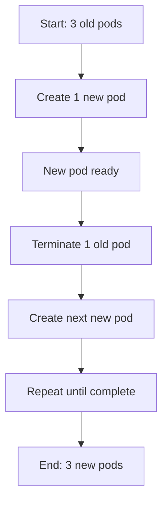

# How to Implement Rolling Updates with Zero Downtime

Author: [nawazdhandala](https://www.github.com/nawazdhandala)

Tags: Kubernetes, Rolling Updates, Zero Downtime, Deployments, DevOps

Description: A comprehensive guide to implementing rolling updates in Kubernetes that achieve true zero-downtime deployments through proper configuration of update strategies, readiness probes, and graceful shutdown handling.

---

Rolling updates allow you to update your application without downtime. Kubernetes gradually replaces old pods with new ones, ensuring your service remains available throughout the process. However, achieving true zero downtime requires careful configuration.

## How Rolling Updates Work



By default, Kubernetes Deployments use the RollingUpdate strategy:

```yaml
apiVersion: apps/v1
kind: Deployment
metadata:
  name: web-app
spec:
  replicas: 3
  strategy:
    type: RollingUpdate
    rollingUpdate:
      maxSurge: 1        # Max pods above desired count
      maxUnavailable: 0  # Max pods that can be unavailable
  selector:
    matchLabels:
      app: web
  template:
    metadata:
      labels:
        app: web
    spec:
      containers:
        - name: app
          image: myapp:v2
```

## Key Configuration Options

### maxSurge

Controls how many extra pods can be created during the update:

```yaml
strategy:
  rollingUpdate:
    maxSurge: 1         # Allow 1 extra pod (4 total with 3 replicas)
    maxSurge: "25%"     # Allow 25% extra pods
```

### maxUnavailable

Controls how many pods can be unavailable during the update:

```yaml
strategy:
  rollingUpdate:
    maxUnavailable: 0       # All pods must be available (safest)
    maxUnavailable: 1       # Allow 1 unavailable
    maxUnavailable: "25%"   # Allow 25% unavailable
```

### Recommended Settings for Zero Downtime

```yaml
strategy:
  type: RollingUpdate
  rollingUpdate:
    maxSurge: 1
    maxUnavailable: 0    # Never reduce available pods
```

This ensures at least the desired number of pods are always running.

## Critical: Readiness Probes

Without readiness probes, Kubernetes considers pods ready immediately after container start. This sends traffic to pods before they can handle it.

```yaml
apiVersion: apps/v1
kind: Deployment
metadata:
  name: web-app
spec:
  replicas: 3
  strategy:
    type: RollingUpdate
    rollingUpdate:
      maxSurge: 1
      maxUnavailable: 0
  template:
    spec:
      containers:
        - name: app
          image: myapp:v2
          ports:
            - containerPort: 8080
          readinessProbe:
            httpGet:
              path: /health
              port: 8080
            initialDelaySeconds: 5    # Wait before first check
            periodSeconds: 5          # Check every 5 seconds
            successThreshold: 1       # Pass once to be ready
            failureThreshold: 3       # Fail 3 times to be not ready
```

### Health Endpoint Example

Your application should expose a health endpoint:

```python
# Python Flask example
from flask import Flask, jsonify
import time

app = Flask(__name__)
startup_time = time.time()
ready = False

@app.route('/health')
def health():
    global ready
    # Simulate warm-up time
    if time.time() - startup_time > 10:
        ready = True

    if ready:
        return jsonify({"status": "healthy"}), 200
    else:
        return jsonify({"status": "warming up"}), 503
```

## Graceful Shutdown

When Kubernetes terminates a pod, it sends SIGTERM. Your app must handle this signal to complete in-flight requests.

### Pod Lifecycle During Termination

1. Pod marked for termination
2. Pod removed from Service endpoints
3. SIGTERM sent to container
4. Grace period countdown starts (default 30s)
5. SIGKILL sent if still running

### PreStop Hook for Connection Draining

```yaml
apiVersion: apps/v1
kind: Deployment
spec:
  template:
    spec:
      terminationGracePeriodSeconds: 60
      containers:
        - name: app
          image: myapp:v2
          lifecycle:
            preStop:
              exec:
                command:
                  - /bin/sh
                  - -c
                  - |
                    # Wait for load balancer to update
                    sleep 10
                    # Signal app to stop accepting new connections
                    kill -SIGTERM 1
```

### Application-Level Graceful Shutdown

```javascript
// Node.js example
const express = require('express');
const app = express();

let isShuttingDown = false;

// Middleware to reject new requests during shutdown
app.use((req, res, next) => {
  if (isShuttingDown) {
    res.status(503).send('Server is shutting down');
    return;
  }
  next();
});

app.get('/', (req, res) => {
  res.send('Hello World');
});

const server = app.listen(8080);

// Handle SIGTERM
process.on('SIGTERM', () => {
  console.log('SIGTERM received, starting graceful shutdown');
  isShuttingDown = true;

  // Stop accepting new connections
  server.close(() => {
    console.log('All connections closed, exiting');
    process.exit(0);
  });

  // Force exit after timeout
  setTimeout(() => {
    console.log('Forcing exit after timeout');
    process.exit(1);
  }, 25000);
});
```

## MinReadySeconds

Ensure pods are stable before considering them available:

```yaml
apiVersion: apps/v1
kind: Deployment
spec:
  minReadySeconds: 10    # Pod must be ready for 10s before being available
  template:
    spec:
      containers:
        - name: app
          image: myapp:v2
```

This prevents fast-crashing pods from being considered ready.

## Watching Rolling Updates

```bash
# Watch deployment status
kubectl rollout status deployment/web-app

# Output:
# Waiting for deployment "web-app" rollout to finish: 1 out of 3 new replicas have been updated...
# Waiting for deployment "web-app" rollout to finish: 2 out of 3 new replicas have been updated...
# deployment "web-app" successfully rolled out

# Watch pods during rollout
kubectl get pods -l app=web -w

# View rollout history
kubectl rollout history deployment/web-app
```

## Rollback on Failure

If something goes wrong, rollback quickly:

```bash
# Rollback to previous revision
kubectl rollout undo deployment/web-app

# Rollback to specific revision
kubectl rollout undo deployment/web-app --to-revision=2

# Pause rollout to investigate
kubectl rollout pause deployment/web-app

# Resume rollout
kubectl rollout resume deployment/web-app
```

## ProgressDeadlineSeconds

Set a timeout for the rollout:

```yaml
apiVersion: apps/v1
kind: Deployment
spec:
  progressDeadlineSeconds: 600    # Fail if no progress in 10 minutes
```

If the deployment does not make progress within this time, it is marked as failed.

## Pod Disruption Budgets

Protect against cluster operations during deployment:

```yaml
apiVersion: policy/v1
kind: PodDisruptionBudget
metadata:
  name: web-pdb
spec:
  minAvailable: 2    # Keep at least 2 pods running
  selector:
    matchLabels:
      app: web
```

## Complete Zero-Downtime Configuration

```yaml
apiVersion: apps/v1
kind: Deployment
metadata:
  name: web-app
  namespace: production
spec:
  replicas: 3
  strategy:
    type: RollingUpdate
    rollingUpdate:
      maxSurge: 1
      maxUnavailable: 0
  minReadySeconds: 10
  progressDeadlineSeconds: 600
  selector:
    matchLabels:
      app: web
  template:
    metadata:
      labels:
        app: web
    spec:
      terminationGracePeriodSeconds: 60
      containers:
        - name: app
          image: myapp:v2
          ports:
            - containerPort: 8080

          # Readiness probe - when to receive traffic
          readinessProbe:
            httpGet:
              path: /health
              port: 8080
            initialDelaySeconds: 5
            periodSeconds: 5
            successThreshold: 1
            failureThreshold: 3

          # Liveness probe - when to restart
          livenessProbe:
            httpGet:
              path: /health
              port: 8080
            initialDelaySeconds: 30
            periodSeconds: 10
            failureThreshold: 3

          # Graceful shutdown
          lifecycle:
            preStop:
              exec:
                command: ["/bin/sh", "-c", "sleep 15"]

          resources:
            requests:
              memory: "256Mi"
              cpu: "100m"
            limits:
              memory: "512Mi"
              cpu: "500m"
---
apiVersion: policy/v1
kind: PodDisruptionBudget
metadata:
  name: web-pdb
  namespace: production
spec:
  minAvailable: 2
  selector:
    matchLabels:
      app: web
```

## Testing Zero Downtime

### Load Test During Deployment

```bash
# Terminal 1: Start continuous requests
while true; do
  curl -s -o /dev/null -w "%{http_code}\n" http://web-app-service/
  sleep 0.1
done

# Terminal 2: Trigger deployment
kubectl set image deployment/web-app app=myapp:v3

# Watch for any non-200 responses
```

### Use Hey for Load Testing

```bash
# Install hey
go install github.com/rakyll/hey@latest

# Run load test during deployment
hey -z 5m -c 10 http://web-app-service/

# Check results for errors
# Summary:
#   Success ratio: 100.00%
```

## Troubleshooting

### Rollout Stuck

```bash
# Check deployment status
kubectl describe deployment web-app

# Look for events like:
# Warning  FailedCreate  Error creating pod: ...

# Check pod status
kubectl get pods -l app=web
```

### Pods Not Becoming Ready

```bash
# Check readiness probe results
kubectl describe pod web-app-xyz

# Look for:
# Warning  Unhealthy  Readiness probe failed: ...

# Check application logs
kubectl logs web-app-xyz
```

### Traffic Errors During Rollout

Common causes:
1. Missing or misconfigured readiness probe
2. PreStop hook too short
3. Application not handling SIGTERM
4. terminationGracePeriodSeconds too short

```bash
# Check endpoint updates
kubectl get endpoints web-service -w

# Verify pods are removed from endpoints before termination
```

## Best Practices Checklist

1. Set maxUnavailable to 0 for zero downtime
2. Configure readiness probes that accurately reflect app state
3. Implement graceful shutdown in your application
4. Use preStop hook for connection draining
5. Set appropriate terminationGracePeriodSeconds
6. Use minReadySeconds to catch fast crashes
7. Create Pod Disruption Budgets
8. Test with load during deployments
9. Monitor for errors during rollouts
10. Have rollback plan ready

---

True zero-downtime deployments require coordination between Kubernetes configuration and application behavior. Configure your Deployment correctly, implement proper health checks, handle graceful shutdown, and always test under load before relying on rolling updates in production.
