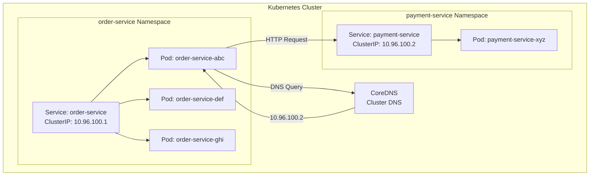

# How to Implement Service Discovery in Kubernetes

Author: [nawazdhandala](https://www.github.com/nawazdhandala)

Tags: Kubernetes, Service Discovery, DNS, CoreDNS, Microservices, Cloud Native, DevOps

Description: Learn how Kubernetes handles service discovery natively through Services, DNS, and environment variables. This guide covers ClusterIP, headless services, and DNS-based discovery patterns.

---

> Kubernetes provides built-in service discovery that eliminates the need for external service registries in most cases. Services abstract pod networking, giving your applications stable endpoints to communicate with each other.

When you deploy applications on Kubernetes, pods come and go as they scale or restart. Kubernetes Services provide a stable network identity and load balancing across pod replicas, solving the service discovery problem at the platform level.

---

## Prerequisites

Before we begin, ensure you have:
- Running Kubernetes cluster (minikube, kind, or cloud-managed)
- kubectl configured to access your cluster
- Basic understanding of Kubernetes pods and deployments

---

## Understanding Kubernetes Services

A Service in Kubernetes creates a stable endpoint for accessing a set of pods. It provides:
- A stable IP address (ClusterIP)
- DNS name resolution
- Load balancing across pod replicas
- Service discovery through environment variables

---

## ClusterIP Service (Default)

The most common service type for internal communication:

```yaml
# deployment.yaml
apiVersion: apps/v1
kind: Deployment
metadata:
  name: order-service
  labels:
    app: order-service
spec:
  replicas: 3
  selector:
    matchLabels:
      app: order-service
  template:
    metadata:
      labels:
        app: order-service
        version: v1
    spec:
      containers:
      - name: order-service
        image: myregistry/order-service:1.0.0
        ports:
        - containerPort: 8080
        env:
        - name: PAYMENT_SERVICE_URL
          # Use Kubernetes DNS for service discovery
          value: "http://payment-service:8080"
        readinessProbe:
          httpGet:
            path: /health
            port: 8080
          initialDelaySeconds: 5
          periodSeconds: 10
        livenessProbe:
          httpGet:
            path: /health
            port: 8080
          initialDelaySeconds: 15
          periodSeconds: 20
```

```yaml
# service.yaml
apiVersion: v1
kind: Service
metadata:
  name: order-service
  labels:
    app: order-service
spec:
  # ClusterIP is the default type
  type: ClusterIP
  selector:
    # Matches pods with this label
    app: order-service
  ports:
  - name: http
    port: 8080
    targetPort: 8080
    protocol: TCP
```

Apply these resources:

```bash
kubectl apply -f deployment.yaml
kubectl apply -f service.yaml

# Verify service is created
kubectl get svc order-service

# View service details
kubectl describe svc order-service
```

---

## Service Architecture



---

## DNS-Based Service Discovery

Kubernetes uses CoreDNS to provide DNS resolution for services. Every service gets a DNS name:

```bash
# Full DNS name format
<service-name>.<namespace>.svc.cluster.local

# Examples
order-service.default.svc.cluster.local
payment-service.payments.svc.cluster.local
```

### DNS Resolution Patterns

```bash
# From a pod in the same namespace, use short name
curl http://order-service:8080/api/orders

# From a different namespace, use namespace qualifier
curl http://order-service.ecommerce:8080/api/orders

# Full DNS name always works
curl http://order-service.ecommerce.svc.cluster.local:8080/api/orders
```

### Testing DNS Resolution

```bash
# Run a debug pod
kubectl run dns-test --rm -it --image=busybox --restart=Never -- sh

# Inside the pod, test DNS
nslookup order-service
nslookup order-service.default.svc.cluster.local

# Test connectivity
wget -qO- http://order-service:8080/health
```

---

## Headless Services

For stateful applications that need direct pod addresses, use headless services:

```yaml
# headless-service.yaml
apiVersion: v1
kind: Service
metadata:
  name: database
  labels:
    app: database
spec:
  # Headless service - no ClusterIP assigned
  clusterIP: None
  selector:
    app: database
  ports:
  - port: 5432
    targetPort: 5432
```

With headless services, DNS returns individual pod IPs:

```bash
# Query returns all pod IPs
nslookup database
# Server:    10.96.0.10
# Address:   10.96.0.10:53
# Name:      database.default.svc.cluster.local
# Address:   10.244.1.5
# Address:   10.244.2.6
# Address:   10.244.3.7

# Individual pods are addressable
nslookup database-0.database
# Returns specific pod IP
```

---

## StatefulSet with Headless Service

```yaml
# statefulset.yaml
apiVersion: apps/v1
kind: StatefulSet
metadata:
  name: postgres
spec:
  serviceName: postgres-headless
  replicas: 3
  selector:
    matchLabels:
      app: postgres
  template:
    metadata:
      labels:
        app: postgres
    spec:
      containers:
      - name: postgres
        image: postgres:15
        ports:
        - containerPort: 5432
        env:
        - name: POSTGRES_PASSWORD
          valueFrom:
            secretKeyRef:
              name: postgres-secret
              key: password
        volumeMounts:
        - name: data
          mountPath: /var/lib/postgresql/data
  volumeClaimTemplates:
  - metadata:
      name: data
    spec:
      accessModes: ["ReadWriteOnce"]
      resources:
        requests:
          storage: 10Gi
---
apiVersion: v1
kind: Service
metadata:
  name: postgres-headless
spec:
  clusterIP: None
  selector:
    app: postgres
  ports:
  - port: 5432
```

Each pod gets a stable DNS name:
- `postgres-0.postgres-headless.default.svc.cluster.local`
- `postgres-1.postgres-headless.default.svc.cluster.local`
- `postgres-2.postgres-headless.default.svc.cluster.local`

---

## Environment Variable Discovery

Kubernetes also injects service information as environment variables:

```yaml
# deployment.yaml
apiVersion: apps/v1
kind: Deployment
metadata:
  name: web-app
spec:
  template:
    spec:
      containers:
      - name: web-app
        image: myregistry/web-app:1.0.0
        env:
        # Kubernetes automatically creates these for existing services
        # Format: {SERVICE_NAME}_SERVICE_HOST and {SERVICE_NAME}_SERVICE_PORT
        # Note: Only services created before this pod are available
        - name: DB_HOST
          value: "$(POSTGRES_SERVICE_HOST)"
        - name: DB_PORT
          value: "$(POSTGRES_SERVICE_PORT)"
```

Environment variables are created automatically:

```bash
# View environment variables in a pod
kubectl exec -it web-app-xyz -- env | grep SERVICE

# Output
# ORDER_SERVICE_SERVICE_HOST=10.96.100.1
# ORDER_SERVICE_SERVICE_PORT=8080
# PAYMENT_SERVICE_SERVICE_HOST=10.96.100.2
# PAYMENT_SERVICE_SERVICE_PORT=8080
```

---

## Application Code Examples

### Go Application

```go
package main

import (
    "fmt"
    "io"
    "net/http"
    "os"
)

func main() {
    // Use environment variable or DNS name
    paymentServiceURL := os.Getenv("PAYMENT_SERVICE_URL")
    if paymentServiceURL == "" {
        // Default to Kubernetes DNS
        paymentServiceURL = "http://payment-service:8080"
    }

    http.HandleFunc("/api/orders", func(w http.ResponseWriter, r *http.Request) {
        // Call payment service using Kubernetes service discovery
        resp, err := http.Get(paymentServiceURL + "/api/payments/validate")
        if err != nil {
            http.Error(w, "Payment service unavailable", http.StatusServiceUnavailable)
            return
        }
        defer resp.Body.Close()

        body, _ := io.ReadAll(resp.Body)
        fmt.Fprintf(w, "Payment validation: %s", body)
    })

    http.ListenAndServe(":8080", nil)
}
```

### Python Application

```python
import os
import requests
from flask import Flask, jsonify

app = Flask(__name__)

# Service URLs from environment or DNS
PAYMENT_SERVICE = os.getenv('PAYMENT_SERVICE_URL', 'http://payment-service:8080')
USER_SERVICE = os.getenv('USER_SERVICE_URL', 'http://user-service:8080')

@app.route('/api/orders', methods=['POST'])
def create_order():
    """
    Create an order, validating user and processing payment.
    Uses Kubernetes DNS for service discovery.
    """
    # Call user service
    user_response = requests.get(
        f'{USER_SERVICE}/api/users/current',
        timeout=5
    )
    if user_response.status_code != 200:
        return jsonify({'error': 'User service unavailable'}), 503

    # Call payment service
    payment_response = requests.post(
        f'{PAYMENT_SERVICE}/api/payments',
        json={'amount': 100},
        timeout=10
    )
    if payment_response.status_code != 200:
        return jsonify({'error': 'Payment failed'}), 400

    return jsonify({
        'order_id': 'order-123',
        'status': 'created'
    })

@app.route('/health')
def health():
    return jsonify({'status': 'healthy'})

if __name__ == '__main__':
    app.run(host='0.0.0.0', port=8080)
```

---

## ExternalName Services

Reference external services through Kubernetes DNS:

```yaml
# external-service.yaml
apiVersion: v1
kind: Service
metadata:
  name: external-database
spec:
  type: ExternalName
  # DNS CNAME to external service
  externalName: database.external-provider.com
```

Now applications can use `external-database` as if it were an internal service:

```python
# Application code
DATABASE_HOST = 'external-database'  # Resolves to database.external-provider.com
```

---

## Service Mesh Integration

For advanced service discovery and traffic management, use a service mesh:

```yaml
# Istio VirtualService for advanced routing
apiVersion: networking.istio.io/v1beta1
kind: VirtualService
metadata:
  name: order-service
spec:
  hosts:
  - order-service
  http:
  - match:
    - headers:
        version:
          exact: v2
    route:
    - destination:
        host: order-service
        subset: v2
  - route:
    - destination:
        host: order-service
        subset: v1
      weight: 90
    - destination:
        host: order-service
        subset: v2
      weight: 10
```

---

## Debugging Service Discovery

```bash
# Check service endpoints
kubectl get endpoints order-service

# View service details
kubectl describe svc order-service

# Test DNS resolution from inside cluster
kubectl run debug --rm -it --image=nicolaka/netshoot -- bash

# Inside the debug pod
dig order-service.default.svc.cluster.local
curl -v http://order-service:8080/health

# Check CoreDNS logs
kubectl logs -n kube-system -l k8s-app=kube-dns

# View CoreDNS configuration
kubectl get configmap coredns -n kube-system -o yaml
```

---

## Best Practices

1. **Use DNS names** instead of environment variables for flexibility
2. **Implement readiness probes** so traffic only goes to ready pods
3. **Use short DNS names** within the same namespace
4. **Consider headless services** for stateful applications
5. **Set appropriate timeouts** for service-to-service calls
6. **Use NetworkPolicies** to control which services can communicate

---

## Conclusion

Kubernetes provides robust service discovery out of the box through Services and DNS. For most applications, you do not need external service registries like Consul or Eureka when running on Kubernetes.

Key takeaways:
- ClusterIP services provide stable endpoints and load balancing
- DNS names are the preferred discovery method
- Headless services enable direct pod addressing
- Environment variables offer an alternative to DNS

Understanding Kubernetes service discovery is fundamental to building cloud-native applications that scale and heal automatically.

---

*Running microservices on Kubernetes? [OneUptime](https://oneuptime.com) provides comprehensive monitoring for Kubernetes clusters and the services running on them.*
