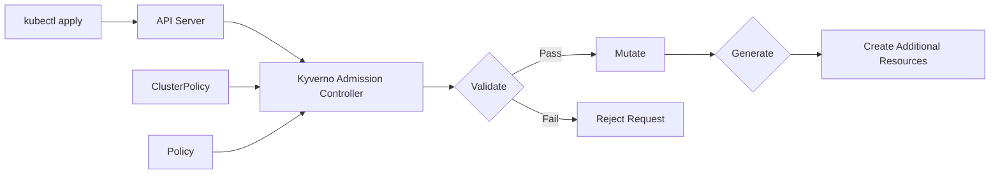

# How to Configure Kyverno Policies for Kubernetes

Author: [nawazdhandala](https://www.github.com/nawazdhandala)

Tags: Security, Kyverno, Kubernetes, Policy as Code, Admission Control, DevSecOps, Compliance

Description: Learn how to use Kyverno to validate, mutate, and generate Kubernetes resources through declarative YAML policies without learning a new language.

---

Kubernetes admission control is essential for security and compliance, but OPA/Rego has a steep learning curve. Kyverno offers an alternative: policies written in familiar YAML. This guide covers installation, policy types, common use cases, and strategies for enforcing standards across your clusters.

## Why Kyverno

Kyverno policies are Kubernetes-native:

- Written in YAML (no Rego required)
- Managed as Kubernetes resources
- Use kubectl for policy management
- Support validation, mutation, and generation
- Integrate with GitOps workflows naturally

For teams already comfortable with Kubernetes manifests, Kyverno has a gentler learning curve than OPA Gatekeeper.

## Architecture Overview



## Installing Kyverno

Deploy Kyverno using Helm:

```bash
# Add the Kyverno Helm repository
helm repo add kyverno https://kyverno.github.io/kyverno/
helm repo update

# Install Kyverno in high availability mode
helm install kyverno kyverno/kyverno \
  --namespace kyverno \
  --create-namespace \
  --set replicaCount=3 \
  --set admissionController.replicas=3
```

Verify the installation:

```bash
kubectl get pods -n kyverno
# NAME                                            READY   STATUS    RESTARTS   AGE
# kyverno-admission-controller-xxxxxxxxx-xxxxx    1/1     Running   0          1m
# kyverno-background-controller-xxxxxxxx-xxxxx    1/1     Running   0          1m
# kyverno-cleanup-controller-xxxxxxxxxxx-xxxxx    1/1     Running   0          1m
# kyverno-reports-controller-xxxxxxxxxxx-xxxxx    1/1     Running   0          1m
```

## Policy Types

Kyverno supports three policy types:

1. **Validate**: Accept or reject resources based on rules
2. **Mutate**: Modify resources before admission
3. **Generate**: Create additional resources automatically

Policies can be cluster-wide (ClusterPolicy) or namespace-scoped (Policy).

## Validation Policies

### Require Resource Limits

```yaml
# require-resource-limits.yaml
apiVersion: kyverno.io/v1
kind: ClusterPolicy
metadata:
  name: require-resource-limits
  annotations:
    policies.kyverno.io/title: Require Resource Limits
    policies.kyverno.io/description: >-
      All containers must specify CPU and memory limits to prevent
      resource exhaustion and enable proper scheduling.
spec:
  validationFailureAction: Enforce  # Enforce or Audit
  background: true
  rules:
    - name: validate-resource-limits
      match:
        any:
          - resources:
              kinds:
                - Pod
      exclude:
        any:
          - resources:
              namespaces:
                - kube-system
                - kyverno
      validate:
        message: "CPU and memory limits are required for all containers."
        pattern:
          spec:
            containers:
              - resources:
                  limits:
                    memory: "?*"
                    cpu: "?*"
```

Test the policy:

```bash
kubectl apply -f require-resource-limits.yaml

# This pod will be rejected
kubectl run test-no-limits --image=nginx
# Error: CPU and memory limits are required for all containers.

# This pod will be admitted
kubectl run test-with-limits --image=nginx \
  --limits="cpu=100m,memory=128Mi"
# pod/test-with-limits created
```

### Block Privileged Containers

```yaml
# disallow-privileged.yaml
apiVersion: kyverno.io/v1
kind: ClusterPolicy
metadata:
  name: disallow-privileged-containers
spec:
  validationFailureAction: Enforce
  background: true
  rules:
    - name: deny-privileged
      match:
        any:
          - resources:
              kinds:
                - Pod
      validate:
        message: "Privileged containers are not allowed."
        pattern:
          spec:
            containers:
              - securityContext:
                  privileged: "!true"
            =(initContainers):
              - securityContext:
                  privileged: "!true"
```

### Require Approved Image Registries

```yaml
# restrict-image-registries.yaml
apiVersion: kyverno.io/v1
kind: ClusterPolicy
metadata:
  name: restrict-image-registries
spec:
  validationFailureAction: Enforce
  background: true
  rules:
    - name: validate-registries
      match:
        any:
          - resources:
              kinds:
                - Pod
      validate:
        message: "Images must be from approved registries: gcr.io/my-project, docker.io/library"
        pattern:
          spec:
            containers:
              - image: "gcr.io/my-project/* | docker.io/library/*"
            =(initContainers):
              - image: "gcr.io/my-project/* | docker.io/library/*"
```

### Require Labels

```yaml
# require-labels.yaml
apiVersion: kyverno.io/v1
kind: ClusterPolicy
metadata:
  name: require-labels
spec:
  validationFailureAction: Enforce
  background: true
  rules:
    - name: check-for-labels
      match:
        any:
          - resources:
              kinds:
                - Deployment
                - StatefulSet
                - DaemonSet
      validate:
        message: "The label 'team' is required."
        pattern:
          metadata:
            labels:
              team: "?*"
    - name: check-environment-label
      match:
        any:
          - resources:
              kinds:
                - Deployment
      validate:
        message: "The label 'environment' must be 'dev', 'staging', or 'production'."
        pattern:
          metadata:
            labels:
              environment: "dev | staging | production"
```

## Mutation Policies

Mutations modify resources before they are created, ensuring consistency without requiring developers to remember every configuration detail.

### Add Default Resource Limits

```yaml
# add-default-resources.yaml
apiVersion: kyverno.io/v1
kind: ClusterPolicy
metadata:
  name: add-default-resources
spec:
  background: false
  rules:
    - name: add-default-limits
      match:
        any:
          - resources:
              kinds:
                - Pod
      mutate:
        patchStrategicMerge:
          spec:
            containers:
              - (name): "*"
                resources:
                  limits:
                    +(memory): "256Mi"
                    +(cpu): "200m"
                  requests:
                    +(memory): "128Mi"
                    +(cpu): "100m"
```

The `+` prefix means "add if not present" and will not override existing values.

### Add Sidecar Container

```yaml
# inject-sidecar.yaml
apiVersion: kyverno.io/v1
kind: ClusterPolicy
metadata:
  name: inject-logging-sidecar
spec:
  background: false
  rules:
    - name: inject-sidecar
      match:
        any:
          - resources:
              kinds:
                - Deployment
              selector:
                matchLabels:
                  inject-sidecar: "true"
      mutate:
        patchStrategicMerge:
          spec:
            template:
              spec:
                containers:
                  - name: logging-sidecar
                    image: fluent/fluent-bit:latest
                    resources:
                      limits:
                        memory: "64Mi"
                        cpu: "50m"
                    volumeMounts:
                      - name: varlog
                        mountPath: /var/log
                volumes:
                  - name: varlog
                    emptyDir: {}
```

### Add Image Pull Secrets

```yaml
# add-imagepullsecret.yaml
apiVersion: kyverno.io/v1
kind: ClusterPolicy
metadata:
  name: add-imagepullsecrets
spec:
  background: false
  rules:
    - name: add-pull-secret
      match:
        any:
          - resources:
              kinds:
                - Pod
      mutate:
        patchStrategicMerge:
          spec:
            imagePullSecrets:
              - name: registry-credentials
```

## Generation Policies

Generate policies create additional resources automatically when a triggering resource is created.

### Generate Network Policy for New Namespaces

```yaml
# generate-networkpolicy.yaml
apiVersion: kyverno.io/v1
kind: ClusterPolicy
metadata:
  name: generate-default-networkpolicy
spec:
  background: false
  rules:
    - name: generate-deny-all-ingress
      match:
        any:
          - resources:
              kinds:
                - Namespace
              selector:
                matchLabels:
                  environment: production
      generate:
        apiVersion: networking.k8s.io/v1
        kind: NetworkPolicy
        name: default-deny-ingress
        namespace: "{{request.object.metadata.name}}"
        synchronize: true
        data:
          spec:
            podSelector: {}
            policyTypes:
              - Ingress
```

### Generate ResourceQuota for Namespaces

```yaml
# generate-resourcequota.yaml
apiVersion: kyverno.io/v1
kind: ClusterPolicy
metadata:
  name: generate-resourcequota
spec:
  background: false
  rules:
    - name: generate-quota
      match:
        any:
          - resources:
              kinds:
                - Namespace
      exclude:
        any:
          - resources:
              namespaces:
                - kube-system
                - kyverno
      generate:
        apiVersion: v1
        kind: ResourceQuota
        name: default-quota
        namespace: "{{request.object.metadata.name}}"
        synchronize: true
        data:
          spec:
            hard:
              requests.cpu: "4"
              requests.memory: "8Gi"
              limits.cpu: "8"
              limits.memory: "16Gi"
              pods: "20"
```

## Audit Mode and Gradual Rollout

Start with audit mode to understand impact before enforcing:

```yaml
spec:
  validationFailureAction: Audit  # Log violations but don't block
```

View policy violations:

```bash
# List all policy reports
kubectl get policyreport -A
kubectl get clusterpolicyreport

# Get detailed violations
kubectl describe policyreport -n default
```

Migrate to enforcement gradually:

```yaml
spec:
  validationFailureAction: Audit
  validationFailureActionOverrides:
    - action: Enforce
      namespaces:
        - production
```

## Testing Policies

Use the Kyverno CLI to test policies locally:

```bash
# Install Kyverno CLI
brew install kyverno

# Test a policy against a resource
kyverno apply require-resource-limits.yaml --resource pod.yaml

# Test with a directory of policies
kyverno apply ./policies/ --resource ./manifests/

# Test in a CI pipeline
kyverno test ./tests/
```

Create test cases:

```yaml
# tests/require-labels-test.yaml
name: require-labels-test
policies:
  - ../policies/require-labels.yaml
resources:
  - ../resources/deployment-with-labels.yaml
  - ../resources/deployment-without-labels.yaml
results:
  - policy: require-labels
    rule: check-for-labels
    resource: deployment-with-labels
    kind: Deployment
    result: pass
  - policy: require-labels
    rule: check-for-labels
    resource: deployment-without-labels
    kind: Deployment
    result: fail
```

---

Kyverno makes Kubernetes policy management accessible to anyone who can write YAML. Start with validation policies in audit mode, observe violations, communicate with teams, then move to enforcement. Mutation policies reduce friction by automatically adding required configurations. Generation policies ensure consistent resources across namespaces. The combination creates clusters that are secure by default.
