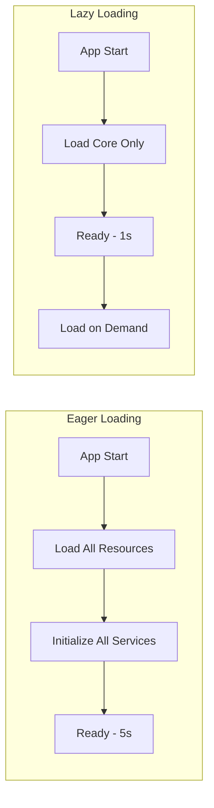

# How to Implement Lazy Loading Patterns

Author: [nawazdhandala](https://www.github.com/nawazdhandala)

Tags: Lazy Loading, Performance, JavaScript, React, Python, Design Patterns, Frontend, Backend

Description: Learn how to implement lazy loading patterns to improve application performance. This guide covers lazy initialization, code splitting, image lazy loading, and database lazy loading with practical examples.

---

> Lazy loading is a design pattern that defers the initialization of objects or loading of resources until they are actually needed. This can dramatically improve application startup time, reduce memory usage, and decrease initial page load times. This guide shows you how to implement lazy loading across different contexts.

The core principle is simple: do not load or compute something until it is needed. This applies to frontend assets, backend services, database queries, and more.

---

## Why Lazy Loading Matters



Benefits of lazy loading:
- Faster initial load times
- Lower memory footprint
- Reduced bandwidth usage
- Better perceived performance

---

## Frontend: Code Splitting in React

### Dynamic Imports with React.lazy

```jsx
// App.jsx
import React, { Suspense, lazy } from 'react';
import { BrowserRouter, Routes, Route } from 'react-router-dom';

// Eager loaded - needed immediately
import Home from './pages/Home';
import Loading from './components/Loading';

// Lazy loaded - loaded only when route is accessed
const Dashboard = lazy(() => import('./pages/Dashboard'));
const Settings = lazy(() => import('./pages/Settings'));
const Analytics = lazy(() => import('./pages/Analytics'));

// Lazy load with named exports
const AdminPanel = lazy(() =>
  import('./pages/Admin').then(module => ({ default: module.AdminPanel }))
);

function App() {
  return (
    <BrowserRouter>
      <Suspense fallback={<Loading />}>
        <Routes>
          <Route path="/" element={<Home />} />
          <Route path="/dashboard" element={<Dashboard />} />
          <Route path="/settings" element={<Settings />} />
          <Route path="/analytics" element={<Analytics />} />
          <Route path="/admin" element={<AdminPanel />} />
        </Routes>
      </Suspense>
    </BrowserRouter>
  );
}

export default App;
```

### Preloading Components

```jsx
// preload.jsx
import { lazy } from 'react';

// Create lazy component with preload capability
function lazyWithPreload(importFunc) {
  const Component = lazy(importFunc);
  Component.preload = importFunc;
  return Component;
}

// Define lazy components
const Dashboard = lazyWithPreload(() => import('./pages/Dashboard'));
const Analytics = lazyWithPreload(() => import('./pages/Analytics'));

// Preload on hover (anticipate user action)
function NavLink({ to, children, component }) {
  const handleMouseEnter = () => {
    // Start loading before user clicks
    if (component && component.preload) {
      component.preload();
    }
  };

  return (
    <Link to={to} onMouseEnter={handleMouseEnter}>
      {children}
    </Link>
  );
}

// Usage
<NavLink to="/dashboard" component={Dashboard}>Dashboard</NavLink>
<NavLink to="/analytics" component={Analytics}>Analytics</NavLink>
```

### Component-Level Lazy Loading

```jsx
// LazyComponent.jsx
import React, { useState, useEffect, lazy, Suspense } from 'react';

// Lazy load heavy components only when visible
function LazyOnVisible({ children, placeholder, rootMargin = '100px' }) {
  const [isVisible, setIsVisible] = useState(false);
  const ref = React.useRef();

  useEffect(() => {
    const observer = new IntersectionObserver(
      ([entry]) => {
        if (entry.isIntersecting) {
          setIsVisible(true);
          observer.disconnect();
        }
      },
      { rootMargin }
    );

    if (ref.current) {
      observer.observe(ref.current);
    }

    return () => observer.disconnect();
  }, [rootMargin]);

  return (
    <div ref={ref}>
      {isVisible ? children : placeholder}
    </div>
  );
}

// Heavy chart component loaded only when scrolled into view
const HeavyChart = lazy(() => import('./components/HeavyChart'));

function Dashboard() {
  return (
    <div>
      <h1>Dashboard</h1>

      {/* Chart loads only when user scrolls to it */}
      <LazyOnVisible placeholder={<div style={{ height: 400 }}>Loading chart...</div>}>
        <Suspense fallback={<div>Loading...</div>}>
          <HeavyChart />
        </Suspense>
      </LazyOnVisible>
    </div>
  );
}
```

---

## Frontend: Image Lazy Loading

### Native Browser Lazy Loading

```html
<!-- Native lazy loading (modern browsers) -->


<!-- With placeholder -->

```

### React Image Lazy Loading

```jsx
// LazyImage.jsx
import React, { useState, useEffect, useRef } from 'react';

function LazyImage({ src, alt, placeholder, className, ...props }) {
  const [imageSrc, setImageSrc] = useState(placeholder || '');
  const [isLoaded, setIsLoaded] = useState(false);
  const imgRef = useRef();

  useEffect(() => {
    let observer;

    if (imgRef.current && 'IntersectionObserver' in window) {
      observer = new IntersectionObserver(
        ([entry]) => {
          if (entry.isIntersecting) {
            // Start loading the real image
            const img = new Image();
            img.src = src;
            img.onload = () => {
              setImageSrc(src);
              setIsLoaded(true);
            };
            observer.disconnect();
          }
        },
        { rootMargin: '50px' }
      );

      observer.observe(imgRef.current);
    } else {
      // Fallback for older browsers
      setImageSrc(src);
      setIsLoaded(true);
    }

    return () => {
      if (observer) observer.disconnect();
    };
  }, [src]);

  return (
    
  );
}

// CSS
// .lazy-image { transition: opacity 0.3s; }
// .lazy-image.loading { opacity: 0.5; filter: blur(10px); }
// .lazy-image.loaded { opacity: 1; filter: blur(0); }

// Usage
<LazyImage
  src="/images/hero-large.jpg"
  placeholder="/images/hero-placeholder.jpg"
  alt="Hero image"
  width={1200}
  height={600}
/>
```

---

## Backend: Lazy Initialization in Python

### Basic Lazy Property

```python
# lazy_property.py
from functools import cached_property
from typing import TypeVar, Callable, Generic

T = TypeVar('T')

class LazyProperty(Generic[T]):
    """Descriptor for lazy initialization"""

    def __init__(self, func: Callable[..., T]):
        self.func = func
        self.attr_name = None

    def __set_name__(self, owner, name):
        self.attr_name = f'_lazy_{name}'

    def __get__(self, obj, objtype=None) -> T:
        if obj is None:
            return self

        # Check if already computed
        if not hasattr(obj, self.attr_name):
            # Compute and cache
            setattr(obj, self.attr_name, self.func(obj))

        return getattr(obj, self.attr_name)


class ExpensiveService:
    """Service with expensive resources initialized lazily"""

    def __init__(self, config: dict):
        self.config = config
        # Note: heavy resources not initialized here

    @LazyProperty
    def database(self):
        """Database connection - created on first access"""
        print("Initializing database connection...")
        return DatabasePool(self.config['db_url'])

    @LazyProperty
    def redis(self):
        """Redis client - created on first access"""
        print("Initializing Redis connection...")
        return RedisClient(self.config['redis_url'])

    @LazyProperty
    def ml_model(self):
        """ML model - loaded on first access (expensive!)"""
        print("Loading ML model...")
        return load_model(self.config['model_path'])


# Usage
service = ExpensiveService(config)  # Fast - nothing loaded yet

# Only loads database when first accessed
users = service.database.query("SELECT * FROM users")

# Redis not loaded yet if not used
# ML model not loaded yet if not used
```

### Thread-Safe Lazy Initialization

```python
# thread_safe_lazy.py
import threading
from typing import TypeVar, Callable, Optional

T = TypeVar('T')

class ThreadSafeLazy(Generic[T]):
    """Thread-safe lazy initialization using double-checked locking"""

    def __init__(self, factory: Callable[[], T]):
        self._factory = factory
        self._instance: Optional[T] = None
        self._lock = threading.Lock()

    def get(self) -> T:
        # First check without lock (fast path)
        if self._instance is None:
            with self._lock:
                # Second check with lock (thread-safe)
                if self._instance is None:
                    self._instance = self._factory()
        return self._instance

    def reset(self):
        """Reset the lazy instance (useful for testing)"""
        with self._lock:
            self._instance = None


class ServiceContainer:
    """Dependency injection container with lazy loading"""

    def __init__(self, config: dict):
        self.config = config

        # Define lazy services
        self._database = ThreadSafeLazy(self._create_database)
        self._cache = ThreadSafeLazy(self._create_cache)
        self._queue = ThreadSafeLazy(self._create_queue)

    def _create_database(self):
        from database import DatabasePool
        return DatabasePool(self.config['database_url'], pool_size=10)

    def _create_cache(self):
        from cache import RedisCache
        return RedisCache(self.config['redis_url'])

    def _create_queue(self):
        from queue import MessageQueue
        return MessageQueue(self.config['queue_url'])

    @property
    def database(self):
        return self._database.get()

    @property
    def cache(self):
        return self._cache.get()

    @property
    def queue(self):
        return self._queue.get()


# Usage in FastAPI
from fastapi import FastAPI, Depends

app = FastAPI()
container = ServiceContainer(config)

def get_database():
    return container.database

@app.get("/users")
def get_users(db = Depends(get_database)):
    return db.query("SELECT * FROM users")
```

---

## Backend: Lazy Loading in ORMs

### SQLAlchemy Lazy Loading

```python
# sqlalchemy_lazy.py
from sqlalchemy import Column, Integer, String, ForeignKey
from sqlalchemy.orm import relationship, declarative_base, joinedload, selectinload

Base = declarative_base()

class User(Base):
    __tablename__ = 'users'

    id = Column(Integer, primary_key=True)
    name = Column(String(100))

    # Lazy loading strategies:

    # 'select' (default) - load on access with separate query
    orders = relationship('Order', lazy='select', back_populates='user')

    # 'joined' - always load with JOIN
    profile = relationship('Profile', lazy='joined', uselist=False)

    # 'subquery' - load with subquery (good for collections)
    posts = relationship('Post', lazy='subquery')

    # 'dynamic' - return query object for further filtering
    comments = relationship('Comment', lazy='dynamic')


class Order(Base):
    __tablename__ = 'orders'

    id = Column(Integer, primary_key=True)
    user_id = Column(Integer, ForeignKey('users.id'))
    total = Column(Integer)

    user = relationship('User', back_populates='orders')


# Query patterns

# Bad: N+1 queries (1 for users + N for orders)
def get_users_bad(session):
    users = session.query(User).all()
    for user in users:
        print(user.orders)  # Triggers separate query for each user!
    return users

# Good: Eager load with joinedload
def get_users_with_orders(session):
    users = session.query(User).options(
        joinedload(User.orders)
    ).all()
    # All data loaded in single query with JOIN
    return users

# Good: Eager load with selectinload (better for large collections)
def get_users_with_posts(session):
    users = session.query(User).options(
        selectinload(User.posts)
    ).all()
    # Loads posts with IN query: SELECT * FROM posts WHERE user_id IN (1,2,3...)
    return users

# Dynamic loading for filtering
def get_user_recent_comments(session, user_id, limit=10):
    user = session.query(User).get(user_id)
    # comments is a Query object, not a list
    recent = user.comments.order_by(Comment.created_at.desc()).limit(limit).all()
    return recent
```

---

## Module-Level Lazy Loading

### Python Module Lazy Import

```python
# lazy_imports.py
import importlib
import sys
from types import ModuleType
from typing import Dict, Any

class LazyModule(ModuleType):
    """Module that loads submodules lazily"""

    def __init__(self, name: str, submodules: Dict[str, str]):
        super().__init__(name)
        self._submodules = submodules
        self._loaded: Dict[str, Any] = {}

    def __getattr__(self, name: str):
        if name in self._loaded:
            return self._loaded[name]

        if name in self._submodules:
            module_path = self._submodules[name]
            module = importlib.import_module(module_path)
            self._loaded[name] = module
            return module

        raise AttributeError(f"module '{self.__name__}' has no attribute '{name}'")


# Create lazy module for heavy dependencies
def setup_lazy_imports():
    """Setup lazy imports for heavy modules"""

    # Define which modules to load lazily
    lazy_modules = {
        'numpy': 'numpy',
        'pandas': 'pandas',
        'tensorflow': 'tensorflow',
        'torch': 'torch',
    }

    # Create lazy loader
    class LazyLoader:
        def __init__(self, modules: Dict[str, str]):
            self._modules = modules
            self._loaded = {}

        def __getattr__(self, name: str):
            if name in self._loaded:
                return self._loaded[name]

            if name in self._modules:
                print(f"Lazily importing {name}...")
                module = importlib.import_module(self._modules[name])
                self._loaded[name] = module
                return module

            raise AttributeError(f"Unknown module: {name}")

    return LazyLoader(lazy_modules)


# Usage
ml = setup_lazy_imports()

# numpy not loaded yet
print("Starting application...")

# numpy loads only when first accessed
arr = ml.numpy.array([1, 2, 3])
```

---

## Configuration Lazy Loading

```python
# lazy_config.py
import os
import json
from typing import Dict, Any, Optional
from functools import lru_cache

class LazyConfig:
    """Configuration that loads values lazily from various sources"""

    def __init__(self):
        self._cache: Dict[str, Any] = {}
        self._loaded_files: set = set()

    def get(self, key: str, default: Any = None) -> Any:
        """Get config value, loading from source if needed"""

        # Check cache first
        if key in self._cache:
            return self._cache[key]

        # Try environment variable
        env_key = key.upper().replace('.', '_')
        if env_key in os.environ:
            value = self._parse_env_value(os.environ[env_key])
            self._cache[key] = value
            return value

        # Try config file
        config_file = self._get_config_file(key)
        if config_file and config_file not in self._loaded_files:
            self._load_config_file(config_file)
            if key in self._cache:
                return self._cache[key]

        return default

    def _parse_env_value(self, value: str) -> Any:
        """Parse environment variable value"""
        # Try to parse as JSON
        try:
            return json.loads(value)
        except json.JSONDecodeError:
            return value

    def _get_config_file(self, key: str) -> Optional[str]:
        """Determine which config file contains the key"""
        prefix = key.split('.')[0]
        candidates = [
            f'config/{prefix}.json',
            f'config/{prefix}.yaml',
            'config/default.json'
        ]
        for path in candidates:
            if os.path.exists(path):
                return path
        return None

    def _load_config_file(self, path: str):
        """Load and cache config file"""
        print(f"Loading config file: {path}")

        with open(path) as f:
            if path.endswith('.json'):
                data = json.load(f)
            elif path.endswith('.yaml'):
                import yaml
                data = yaml.safe_load(f)
            else:
                return

        self._flatten_and_cache(data)
        self._loaded_files.add(path)

    def _flatten_and_cache(self, data: dict, prefix: str = ''):
        """Flatten nested dict and cache values"""
        for key, value in data.items():
            full_key = f'{prefix}.{key}' if prefix else key
            if isinstance(value, dict):
                self._flatten_and_cache(value, full_key)
            else:
                self._cache[full_key] = value


# Usage
config = LazyConfig()

# Config files not loaded yet
print("Application starting...")

# Only database.json loaded when first database config accessed
db_url = config.get('database.url')

# Only redis.json loaded when first redis config accessed
redis_url = config.get('redis.url')
```

---

## Best Practices Summary

| Context | Pattern | When to Use |
|---------|---------|-------------|
| React routes | `React.lazy` + Suspense | Large page components |
| React components | Intersection Observer | Below-the-fold content |
| Images | `loading="lazy"` | Non-critical images |
| Python services | Lazy property | Expensive connections |
| ORM relationships | `lazy='select'` | Rarely accessed data |
| Heavy modules | Lazy import | numpy, pandas, ML libs |
| Configuration | Lazy loading | Multi-file configs |

---

## Conclusion

Lazy loading is a powerful pattern for improving performance:

1. **Frontend**: Use code splitting for routes, lazy load images and below-fold components
2. **Backend**: Initialize expensive resources only when needed
3. **Database**: Choose appropriate ORM loading strategies to avoid N+1 queries
4. **Modules**: Defer heavy imports until actually used

The key is to identify what can be deferred without impacting user experience. Load what is needed now, defer everything else.

---

*Need to monitor your application's loading performance? [OneUptime](https://oneuptime.com) provides performance monitoring with page load metrics, API latency tracking, and resource loading analysis.*
