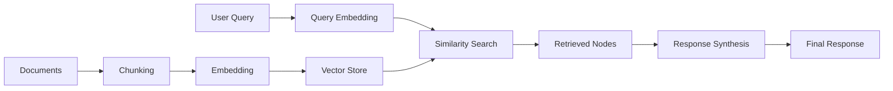

# How to Implement LlamaIndex for RAG Applications

Author: [nawazdhandala](https://www.github.com/nawazdhandala)

Tags: LlamaIndex, RAG, LLM, Vector Search, Python

Description: Learn how to build retrieval-augmented generation applications with LlamaIndex, from simple document queries to production-ready knowledge bases.

---

Large language models have impressive capabilities, but they cannot access your private data and their knowledge has a cutoff date. Retrieval-Augmented Generation (RAG) solves this by fetching relevant context from your documents before generating responses. LlamaIndex provides the tools to build RAG systems quickly and scale them to production.

## What is LlamaIndex?

LlamaIndex (formerly GPT Index) is a data framework for connecting LLMs with external data sources. It provides:

- Data connectors for loading documents from various sources
- Index structures for organizing and querying data
- Query engines for natural language interfaces
- Response synthesis strategies
- Integration with vector stores and databases

## Installation

Install LlamaIndex with the components you need:

```bash
# Core package
pip install llama-index

# OpenAI integration (default LLM)
pip install llama-index-llms-openai
pip install llama-index-embeddings-openai

# Additional readers for different file types
pip install llama-index-readers-file

# Vector store integrations
pip install llama-index-vector-stores-chroma
pip install llama-index-vector-stores-pinecone
```

Set up your API key:

```python
import os
os.environ["OPENAI_API_KEY"] = "your-openai-key"
```

## Quick Start: Querying Documents

Build a simple document QA system in a few lines:

```python
from llama_index.core import VectorStoreIndex, SimpleDirectoryReader

# Load all documents from a directory
# Supports PDF, DOCX, TXT, HTML, and more
documents = SimpleDirectoryReader("./data").load_data()

# Create an index from the documents
# This automatically chunks, embeds, and stores the data
index = VectorStoreIndex.from_documents(documents)

# Create a query engine
query_engine = index.as_query_engine()

# Ask questions
response = query_engine.query("What are the main features of the product?")
print(response)
```

## Understanding the Pipeline

The RAG pipeline in LlamaIndex has several stages:



## Customizing Document Ingestion

Control how documents are processed:

```python
from llama_index.core import VectorStoreIndex, SimpleDirectoryReader
from llama_index.core.node_parser import SentenceSplitter
from llama_index.core.extractors import TitleExtractor, SummaryExtractor
from llama_index.core.ingestion import IngestionPipeline

# Load documents
documents = SimpleDirectoryReader(
    input_dir="./data",
    recursive=True,  # Include subdirectories
    filename_as_id=True,  # Use filename as document ID
    required_exts=[".md", ".txt", ".pdf"]  # Filter file types
).load_data()

# Create a custom ingestion pipeline
pipeline = IngestionPipeline(
    transformations=[
        # Split text into chunks
        SentenceSplitter(
            chunk_size=512,      # Characters per chunk
            chunk_overlap=50,    # Overlap between chunks
            paragraph_separator="\n\n"
        ),
        # Extract titles for better retrieval
        TitleExtractor(),
        # Generate summaries for each chunk
        SummaryExtractor(summaries=["self"]),
    ]
)

# Run the pipeline
nodes = pipeline.run(documents=documents)
print(f"Created {len(nodes)} nodes from {len(documents)} documents")

# Build index from processed nodes
index = VectorStoreIndex(nodes)
```

## Using Different LLMs and Embeddings

LlamaIndex supports multiple model providers:

```python
from llama_index.core import VectorStoreIndex, Settings
from llama_index.llms.openai import OpenAI
from llama_index.llms.anthropic import Anthropic
from llama_index.embeddings.openai import OpenAIEmbedding
from llama_index.embeddings.huggingface import HuggingFaceEmbedding

# Configure OpenAI
Settings.llm = OpenAI(
    model="gpt-4",
    temperature=0.1,
    max_tokens=512
)
Settings.embed_model = OpenAIEmbedding(model="text-embedding-3-small")

# Or use Anthropic Claude
Settings.llm = Anthropic(
    model="claude-3-sonnet-20240229",
    temperature=0.1
)

# Or use local HuggingFace embeddings (free, no API key needed)
Settings.embed_model = HuggingFaceEmbedding(
    model_name="BAAI/bge-small-en-v1.5"
)

# Now build your index - it uses the configured settings
index = VectorStoreIndex.from_documents(documents)
```

## Persisting and Loading Indexes

Save indexes to disk or vector stores for production use:

```python
from llama_index.core import VectorStoreIndex, StorageContext, load_index_from_storage

# Build and persist to disk
index = VectorStoreIndex.from_documents(documents)
index.storage_context.persist(persist_dir="./storage")

# Load from disk later
storage_context = StorageContext.from_defaults(persist_dir="./storage")
loaded_index = load_index_from_storage(storage_context)

# Use with Chroma vector store
from llama_index.vector_stores.chroma import ChromaVectorStore
import chromadb

# Create Chroma client and collection
chroma_client = chromadb.PersistentClient(path="./chroma_db")
chroma_collection = chroma_client.get_or_create_collection("my_documents")

# Set up vector store
vector_store = ChromaVectorStore(chroma_collection=chroma_collection)
storage_context = StorageContext.from_defaults(vector_store=vector_store)

# Build index with Chroma backend
index = VectorStoreIndex.from_documents(
    documents,
    storage_context=storage_context
)
```

## Advanced Query Techniques

Customize how queries are processed and answered:

```python
from llama_index.core import VectorStoreIndex
from llama_index.core.query_engine import RetrieverQueryEngine
from llama_index.core.retrievers import VectorIndexRetriever
from llama_index.core.response_synthesizers import get_response_synthesizer

# Build index
index = VectorStoreIndex.from_documents(documents)

# Configure retriever
retriever = VectorIndexRetriever(
    index=index,
    similarity_top_k=5,  # Number of chunks to retrieve
)

# Configure response synthesizer
response_synthesizer = get_response_synthesizer(
    response_mode="compact",  # Options: refine, compact, tree_summarize, simple_summarize
    verbose=True
)

# Build custom query engine
query_engine = RetrieverQueryEngine(
    retriever=retriever,
    response_synthesizer=response_synthesizer
)

response = query_engine.query("Summarize the key points")
print(response)

# Access source nodes for citations
for node in response.source_nodes:
    print(f"Score: {node.score:.3f}")
    print(f"Text: {node.text[:200]}...")
    print("---")
```

## Chat Engine with Memory

Build a conversational interface that remembers context:

```python
from llama_index.core import VectorStoreIndex
from llama_index.core.memory import ChatMemoryBuffer

# Build index
index = VectorStoreIndex.from_documents(documents)

# Create chat engine with memory
memory = ChatMemoryBuffer.from_defaults(token_limit=3000)

chat_engine = index.as_chat_engine(
    chat_mode="condense_plus_context",  # Reformulates questions using history
    memory=memory,
    verbose=True,
    system_prompt="""You are a helpful assistant answering questions about our documentation.
    Be concise and cite specific sections when possible."""
)

# Have a conversation
response1 = chat_engine.chat("What authentication methods are supported?")
print(f"Assistant: {response1}")

response2 = chat_engine.chat("How do I configure the first one?")
print(f"Assistant: {response2}")  # Understands "first one" from context

# Reset conversation when needed
chat_engine.reset()
```

## Multi-Document Agents

Create agents that can reason across multiple data sources:

```python
from llama_index.core import VectorStoreIndex, SummaryIndex
from llama_index.core.tools import QueryEngineTool, ToolMetadata
from llama_index.agent.openai import OpenAIAgent

# Create separate indexes for different document types
api_docs = SimpleDirectoryReader("./docs/api").load_data()
tutorials = SimpleDirectoryReader("./docs/tutorials").load_data()

api_index = VectorStoreIndex.from_documents(api_docs)
tutorial_index = VectorStoreIndex.from_documents(tutorials)

# Create query engine tools
api_tool = QueryEngineTool(
    query_engine=api_index.as_query_engine(),
    metadata=ToolMetadata(
        name="api_documentation",
        description="Contains API reference documentation with endpoint details, parameters, and response formats."
    )
)

tutorial_tool = QueryEngineTool(
    query_engine=tutorial_index.as_query_engine(),
    metadata=ToolMetadata(
        name="tutorials",
        description="Contains step-by-step tutorials and guides for common use cases."
    )
)

# Create agent with multiple tools
agent = OpenAIAgent.from_tools(
    [api_tool, tutorial_tool],
    verbose=True,
    system_prompt="You are a helpful documentation assistant. Use the appropriate tool based on whether the user needs API details or step-by-step guidance."
)

# Agent decides which tool to use
response = agent.chat("How do I authenticate API requests?")
print(response)
```

## Evaluation and Testing

Measure the quality of your RAG system:

```python
from llama_index.core.evaluation import FaithfulnessEvaluator, RelevancyEvaluator
from llama_index.llms.openai import OpenAI

# Create evaluators
faithfulness_evaluator = FaithfulnessEvaluator(llm=OpenAI(model="gpt-4"))
relevancy_evaluator = RelevancyEvaluator(llm=OpenAI(model="gpt-4"))

# Run a query
query = "What are the system requirements?"
response = query_engine.query(query)

# Evaluate faithfulness (is the response supported by the retrieved context?)
faithfulness_result = faithfulness_evaluator.evaluate_response(response=response)
print(f"Faithfulness: {faithfulness_result.passing}")

# Evaluate relevancy (is the response relevant to the query?)
relevancy_result = relevancy_evaluator.evaluate_response(
    query=query,
    response=response
)
print(f"Relevancy: {relevancy_result.passing}")

# Run batch evaluation
from llama_index.core.evaluation import BatchEvalRunner

eval_questions = [
    "What are the main features?",
    "How do I install the software?",
    "What is the pricing model?"
]

runner = BatchEvalRunner(
    evaluators={
        "faithfulness": faithfulness_evaluator,
        "relevancy": relevancy_evaluator
    },
    workers=4
)

eval_results = await runner.aevaluate_queries(
    query_engine=query_engine,
    queries=eval_questions
)

# Analyze results
for metric, results in eval_results.items():
    passing = sum(1 for r in results if r.passing)
    print(f"{metric}: {passing}/{len(results)} passed")
```

## Production Deployment

Structure your RAG application for production:

```python
from llama_index.core import VectorStoreIndex, StorageContext
from llama_index.vector_stores.chroma import ChromaVectorStore
import chromadb
from fastapi import FastAPI, HTTPException
from pydantic import BaseModel

app = FastAPI()

# Initialize once at startup
chroma_client = chromadb.HttpClient(host="chroma-server", port=8000)
collection = chroma_client.get_collection("production_docs")
vector_store = ChromaVectorStore(chroma_collection=collection)
storage_context = StorageContext.from_defaults(vector_store=vector_store)
index = VectorStoreIndex.from_vector_store(vector_store)
query_engine = index.as_query_engine(similarity_top_k=3)

class QueryRequest(BaseModel):
    question: str
    max_tokens: int = 256

class QueryResponse(BaseModel):
    answer: str
    sources: list[str]

@app.post("/query", response_model=QueryResponse)
async def query_documents(request: QueryRequest):
    try:
        response = query_engine.query(request.question)
        sources = [node.text[:200] for node in response.source_nodes]
        return QueryResponse(
            answer=str(response),
            sources=sources
        )
    except Exception as e:
        raise HTTPException(status_code=500, detail=str(e))

@app.get("/health")
async def health_check():
    return {"status": "healthy"}
```

---

LlamaIndex handles the complexity of RAG so you can focus on your application. Start simple with the default settings, then customize chunking, retrieval, and synthesis as you learn what works for your data. The evaluation tools help you measure improvements objectively rather than relying on gut feeling.
