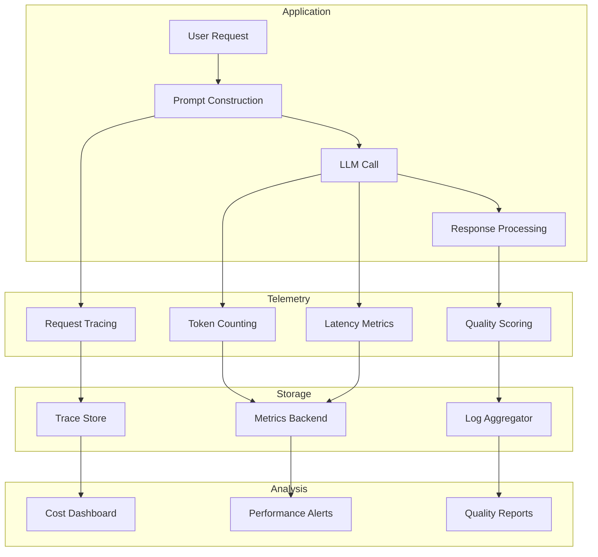

# How to Implement LLM Monitoring and Observability

Author: [nawazdhandala](https://www.github.com/nawazdhandala)

Tags: MLOps, LLM, Monitoring, Observability, OpenTelemetry, AI, Production

Description: Learn how to implement comprehensive monitoring and observability for LLM applications, covering latency tracking, token usage, quality metrics, cost monitoring, and debugging production issues.

---

LLM applications present unique monitoring challenges: variable latency, token-based costs, and output quality that cannot be measured with simple metrics. Effective observability helps you understand model behavior, control costs, and debug issues. This guide covers implementing production-grade LLM monitoring.

## LLM Observability Architecture



## Core Metrics Implementation

```python
# monitoring/llm_metrics.py
from prometheus_client import Counter, Histogram, Gauge, Summary
from dataclasses import dataclass
from typing import Dict, Any, Optional
from datetime import datetime
import time

# Request metrics
llm_requests = Counter(
    'llm_requests_total',
    'Total LLM API requests',
    ['model', 'provider', 'status']
)

llm_latency = Histogram(
    'llm_request_latency_seconds',
    'LLM request latency',
    ['model', 'provider'],
    buckets=[0.1, 0.5, 1.0, 2.5, 5.0, 10.0, 30.0, 60.0]
)

# Token metrics
llm_input_tokens = Counter(
    'llm_input_tokens_total',
    'Total input tokens processed',
    ['model', 'provider']
)

llm_output_tokens = Counter(
    'llm_output_tokens_total',
    'Total output tokens generated',
    ['model', 'provider']
)

# Cost tracking
llm_cost = Counter(
    'llm_cost_usd_total',
    'Total cost in USD',
    ['model', 'provider']
)

# Quality metrics
llm_response_length = Histogram(
    'llm_response_length_chars',
    'Response length in characters',
    ['model'],
    buckets=[100, 500, 1000, 2500, 5000, 10000]
)

# Rate limiting
llm_rate_limit_hits = Counter(
    'llm_rate_limit_hits_total',
    'Rate limit encounters',
    ['model', 'provider']
)

@dataclass
class LLMMetrics:
    """Container for LLM call metrics."""
    model: str
    provider: str
    input_tokens: int
    output_tokens: int
    latency_seconds: float
    status: str
    cost_usd: float
    response_length: int

class LLMMetricsCollector:
    """
    Collect and export LLM metrics.

    Tracks costs, latency, and usage patterns.
    """

    # Pricing per 1K tokens (as of early 2026)
    PRICING = {
        "claude-sonnet-4-20250514": {"input": 0.003, "output": 0.015},
        "claude-opus-4-20250514": {"input": 0.015, "output": 0.075},
        "gpt-4-turbo": {"input": 0.01, "output": 0.03},
        "gpt-4o": {"input": 0.005, "output": 0.015},
        "gpt-3.5-turbo": {"input": 0.0005, "output": 0.0015}
    }

    def record(self, metrics: LLMMetrics):
        """Record metrics for an LLM call."""
        labels = {
            "model": metrics.model,
            "provider": metrics.provider
        }

        # Request count
        llm_requests.labels(**labels, status=metrics.status).inc()

        # Latency
        llm_latency.labels(**labels).observe(metrics.latency_seconds)

        # Tokens
        llm_input_tokens.labels(**labels).inc(metrics.input_tokens)
        llm_output_tokens.labels(**labels).inc(metrics.output_tokens)

        # Cost
        llm_cost.labels(**labels).inc(metrics.cost_usd)

        # Response length
        llm_response_length.labels(model=metrics.model).observe(metrics.response_length)

    def calculate_cost(
        self,
        model: str,
        input_tokens: int,
        output_tokens: int
    ) -> float:
        """Calculate cost for a request."""
        if model not in self.PRICING:
            return 0.0

        pricing = self.PRICING[model]
        input_cost = (input_tokens / 1000) * pricing["input"]
        output_cost = (output_tokens / 1000) * pricing["output"]

        return input_cost + output_cost
```

## Request Tracing

```python
# monitoring/tracing.py
from opentelemetry import trace
from opentelemetry.trace import SpanKind, Status, StatusCode
from opentelemetry.sdk.trace import TracerProvider
from opentelemetry.sdk.trace.export import BatchSpanProcessor
from opentelemetry.exporter.otlp.proto.grpc.trace_exporter import OTLPSpanExporter
from typing import Dict, Any, Optional
from contextlib import contextmanager
import json

# Initialize tracer
trace.set_tracer_provider(TracerProvider())
tracer = trace.get_tracer("llm-service")

# Add OTLP exporter
otlp_exporter = OTLPSpanExporter(endpoint="http://localhost:4317")
span_processor = BatchSpanProcessor(otlp_exporter)
trace.get_tracer_provider().add_span_processor(span_processor)

class LLMTracer:
    """
    Distributed tracing for LLM calls.

    Creates detailed traces for debugging and analysis.
    """

    def __init__(self, service_name: str = "llm-service"):
        self.tracer = trace.get_tracer(service_name)

    @contextmanager
    def trace_llm_call(
        self,
        model: str,
        operation: str = "chat",
        metadata: Dict[str, Any] = None
    ):
        """
        Context manager for tracing LLM calls.

        Usage:
            with tracer.trace_llm_call("claude-3-opus", "chat") as span:
                response = llm.generate(prompt)
                span.set_attribute("output_tokens", response.usage.output_tokens)
        """
        with self.tracer.start_as_current_span(
            f"llm.{operation}",
            kind=SpanKind.CLIENT
        ) as span:
            # Set standard attributes
            span.set_attribute("llm.model", model)
            span.set_attribute("llm.operation", operation)

            if metadata:
                for key, value in metadata.items():
                    if isinstance(value, (str, int, float, bool)):
                        span.set_attribute(f"llm.{key}", value)

            try:
                yield span
            except Exception as e:
                span.set_status(Status(StatusCode.ERROR, str(e)))
                span.record_exception(e)
                raise

    def trace_prompt_construction(
        self,
        template_name: str,
        variables: Dict[str, Any]
    ):
        """Trace prompt construction step."""
        with self.tracer.start_as_current_span("llm.prompt_construction") as span:
            span.set_attribute("prompt.template", template_name)
            span.set_attribute("prompt.variable_count", len(variables))

            # Don't log actual values (may contain PII)
            span.set_attribute("prompt.variables", list(variables.keys()))

    def trace_response_processing(
        self,
        processing_type: str,
        input_length: int,
        output_length: int
    ):
        """Trace response processing step."""
        with self.tracer.start_as_current_span("llm.response_processing") as span:
            span.set_attribute("processing.type", processing_type)
            span.set_attribute("processing.input_length", input_length)
            span.set_attribute("processing.output_length", output_length)
```

## Logging and Audit Trail

```python
# monitoring/logging.py
import structlog
from typing import Dict, Any, Optional
from datetime import datetime
import hashlib
import json

# Configure structured logging
structlog.configure(
    processors=[
        structlog.stdlib.filter_by_level,
        structlog.stdlib.add_logger_name,
        structlog.stdlib.add_log_level,
        structlog.processors.TimeStamper(fmt="iso"),
        structlog.processors.JSONRenderer()
    ],
    wrapper_class=structlog.stdlib.BoundLogger,
    context_class=dict,
    logger_factory=structlog.stdlib.LoggerFactory(),
)

logger = structlog.get_logger()

class LLMLogger:
    """
    Structured logging for LLM calls.

    Logs requests and responses for debugging and audit.
    """

    def __init__(self, log_prompts: bool = False, log_responses: bool = False):
        self.log_prompts = log_prompts
        self.log_responses = log_responses

    def _hash_content(self, content: str) -> str:
        """Hash content for tracking without storing PII."""
        return hashlib.sha256(content.encode()).hexdigest()[:16]

    def log_request(
        self,
        request_id: str,
        model: str,
        prompt: str,
        parameters: Dict[str, Any],
        user_id: Optional[str] = None
    ):
        """Log an LLM request."""
        log_data = {
            "event": "llm_request",
            "request_id": request_id,
            "model": model,
            "prompt_hash": self._hash_content(prompt),
            "prompt_length": len(prompt),
            "parameters": parameters,
            "timestamp": datetime.utcnow().isoformat()
        }

        if user_id:
            log_data["user_id"] = user_id

        if self.log_prompts:
            log_data["prompt"] = prompt

        logger.info("llm_request", **log_data)

    def log_response(
        self,
        request_id: str,
        model: str,
        response: str,
        input_tokens: int,
        output_tokens: int,
        latency_ms: float,
        status: str = "success"
    ):
        """Log an LLM response."""
        log_data = {
            "event": "llm_response",
            "request_id": request_id,
            "model": model,
            "response_hash": self._hash_content(response),
            "response_length": len(response),
            "input_tokens": input_tokens,
            "output_tokens": output_tokens,
            "latency_ms": latency_ms,
            "status": status,
            "timestamp": datetime.utcnow().isoformat()
        }

        if self.log_responses:
            log_data["response"] = response

        logger.info("llm_response", **log_data)

    def log_error(
        self,
        request_id: str,
        model: str,
        error_type: str,
        error_message: str
    ):
        """Log an LLM error."""
        logger.error(
            "llm_error",
            request_id=request_id,
            model=model,
            error_type=error_type,
            error_message=error_message,
            timestamp=datetime.utcnow().isoformat()
        )
```

## Quality Monitoring

```python
# monitoring/quality.py
from dataclasses import dataclass
from typing import List, Dict, Any, Optional, Callable
import re

@dataclass
class QualityMetrics:
    response_length: int
    word_count: int
    sentence_count: int
    has_code_block: bool
    has_list: bool
    has_headers: bool
    estimated_reading_time_seconds: int
    custom_scores: Dict[str, float]

class LLMQualityMonitor:
    """
    Monitor LLM response quality.

    Tracks structural and content quality metrics.
    """

    def __init__(self):
        self.custom_evaluators: Dict[str, Callable] = {}

    def add_evaluator(self, name: str, evaluator: Callable[[str], float]):
        """Add a custom quality evaluator."""
        self.custom_evaluators[name] = evaluator

    def evaluate(self, response: str) -> QualityMetrics:
        """Evaluate response quality."""
        # Basic metrics
        word_count = len(response.split())
        sentences = re.split(r'[.!?]+', response)
        sentence_count = len([s for s in sentences if s.strip()])

        # Structural elements
        has_code_block = '```' in response
        has_list = bool(re.search(r'^\s*[-*\d]+\.?\s', response, re.MULTILINE))
        has_headers = bool(re.search(r'^#{1,6}\s', response, re.MULTILINE))

        # Reading time (assuming 200 words per minute)
        reading_time = int((word_count / 200) * 60)

        # Custom evaluators
        custom_scores = {}
        for name, evaluator in self.custom_evaluators.items():
            try:
                custom_scores[name] = evaluator(response)
            except Exception:
                custom_scores[name] = 0.0

        return QualityMetrics(
            response_length=len(response),
            word_count=word_count,
            sentence_count=sentence_count,
            has_code_block=has_code_block,
            has_list=has_list,
            has_headers=has_headers,
            estimated_reading_time_seconds=reading_time,
            custom_scores=custom_scores
        )

# Example custom evaluators
def completeness_score(response: str) -> float:
    """Check if response seems complete."""
    # Simple heuristic: ends with punctuation
    if response.strip()[-1] in '.!?':
        return 1.0
    return 0.5

def relevance_keywords_score(keywords: List[str]) -> Callable[[str], float]:
    """Create evaluator that checks for keyword presence."""
    def evaluator(response: str) -> float:
        response_lower = response.lower()
        found = sum(1 for kw in keywords if kw.lower() in response_lower)
        return found / len(keywords) if keywords else 0.0
    return evaluator

# Usage
monitor = LLMQualityMonitor()
monitor.add_evaluator("completeness", completeness_score)
monitor.add_evaluator("relevance", relevance_keywords_score(["python", "code", "example"]))

quality = monitor.evaluate(response)
```

## Cost Tracking Dashboard

```python
# monitoring/cost_tracking.py
from dataclasses import dataclass
from datetime import datetime, timedelta
from typing import Dict, List
import sqlite3
from collections import defaultdict

@dataclass
class CostRecord:
    timestamp: datetime
    model: str
    input_tokens: int
    output_tokens: int
    cost_usd: float
    user_id: Optional[str]
    request_id: str

class CostTracker:
    """
    Track and analyze LLM costs.

    Provides cost breakdowns by model, user, and time period.
    """

    def __init__(self, db_path: str = "llm_costs.db"):
        self.conn = sqlite3.connect(db_path, check_same_thread=False)
        self._init_db()

    def _init_db(self):
        """Initialize database schema."""
        self.conn.execute("""
            CREATE TABLE IF NOT EXISTS costs (
                id INTEGER PRIMARY KEY AUTOINCREMENT,
                timestamp TEXT,
                model TEXT,
                input_tokens INTEGER,
                output_tokens INTEGER,
                cost_usd REAL,
                user_id TEXT,
                request_id TEXT
            )
        """)
        self.conn.execute("""
            CREATE INDEX IF NOT EXISTS idx_costs_timestamp ON costs(timestamp)
        """)
        self.conn.execute("""
            CREATE INDEX IF NOT EXISTS idx_costs_model ON costs(model)
        """)
        self.conn.commit()

    def record(self, cost: CostRecord):
        """Record a cost entry."""
        self.conn.execute(
            """
            INSERT INTO costs (timestamp, model, input_tokens, output_tokens, cost_usd, user_id, request_id)
            VALUES (?, ?, ?, ?, ?, ?, ?)
            """,
            (
                cost.timestamp.isoformat(),
                cost.model,
                cost.input_tokens,
                cost.output_tokens,
                cost.cost_usd,
                cost.user_id,
                cost.request_id
            )
        )
        self.conn.commit()

    def get_daily_costs(self, days: int = 30) -> List[Dict]:
        """Get daily cost breakdown."""
        cutoff = (datetime.now() - timedelta(days=days)).isoformat()

        cursor = self.conn.execute(
            """
            SELECT
                date(timestamp) as day,
                model,
                SUM(cost_usd) as total_cost,
                SUM(input_tokens) as total_input,
                SUM(output_tokens) as total_output,
                COUNT(*) as request_count
            FROM costs
            WHERE timestamp > ?
            GROUP BY day, model
            ORDER BY day DESC
            """,
            (cutoff,)
        )

        return [
            {
                "day": row[0],
                "model": row[1],
                "total_cost": row[2],
                "total_input_tokens": row[3],
                "total_output_tokens": row[4],
                "request_count": row[5]
            }
            for row in cursor.fetchall()
        ]

    def get_user_costs(self, days: int = 30) -> List[Dict]:
        """Get cost breakdown by user."""
        cutoff = (datetime.now() - timedelta(days=days)).isoformat()

        cursor = self.conn.execute(
            """
            SELECT
                user_id,
                SUM(cost_usd) as total_cost,
                COUNT(*) as request_count,
                AVG(cost_usd) as avg_cost_per_request
            FROM costs
            WHERE timestamp > ? AND user_id IS NOT NULL
            GROUP BY user_id
            ORDER BY total_cost DESC
            """,
            (cutoff,)
        )

        return [
            {
                "user_id": row[0],
                "total_cost": row[1],
                "request_count": row[2],
                "avg_cost_per_request": row[3]
            }
            for row in cursor.fetchall()
        ]

    def get_cost_summary(self, days: int = 7) -> Dict:
        """Get overall cost summary."""
        cutoff = (datetime.now() - timedelta(days=days)).isoformat()

        cursor = self.conn.execute(
            """
            SELECT
                SUM(cost_usd) as total,
                AVG(cost_usd) as avg_per_request,
                COUNT(*) as total_requests,
                SUM(input_tokens) as total_input,
                SUM(output_tokens) as total_output
            FROM costs
            WHERE timestamp > ?
            """,
            (cutoff,)
        )

        row = cursor.fetchone()

        return {
            "period_days": days,
            "total_cost_usd": row[0] or 0,
            "avg_cost_per_request": row[1] or 0,
            "total_requests": row[2] or 0,
            "total_input_tokens": row[3] or 0,
            "total_output_tokens": row[4] or 0,
            "projected_monthly_cost": (row[0] or 0) * (30 / days)
        }
```

## Integrated Monitoring Client

```python
# monitoring/client.py
from typing import Dict, Any, Optional
import time
import uuid
from contextlib import contextmanager

class LLMMonitoringClient:
    """
    Unified monitoring client for LLM applications.

    Combines metrics, tracing, logging, and cost tracking.
    """

    def __init__(
        self,
        metrics_collector: LLMMetricsCollector,
        tracer: LLMTracer,
        logger: LLMLogger,
        cost_tracker: CostTracker,
        quality_monitor: LLMQualityMonitor
    ):
        self.metrics = metrics_collector
        self.tracer = tracer
        self.logger = logger
        self.costs = cost_tracker
        self.quality = quality_monitor

    @contextmanager
    def monitor_call(
        self,
        model: str,
        provider: str,
        user_id: Optional[str] = None,
        metadata: Dict[str, Any] = None
    ):
        """
        Context manager for monitoring an LLM call.

        Usage:
            with client.monitor_call("claude-3-opus", "anthropic") as monitor:
                response = llm.generate(prompt)
                monitor.record_response(response, input_tokens, output_tokens)
        """
        request_id = str(uuid.uuid4())
        start_time = time.time()

        class CallMonitor:
            def __init__(self, parent, request_id, model, provider, user_id, start_time):
                self.parent = parent
                self.request_id = request_id
                self.model = model
                self.provider = provider
                self.user_id = user_id
                self.start_time = start_time
                self.prompt = None

            def record_prompt(self, prompt: str, parameters: Dict = None):
                self.prompt = prompt
                self.parent.logger.log_request(
                    request_id=self.request_id,
                    model=self.model,
                    prompt=prompt,
                    parameters=parameters or {},
                    user_id=self.user_id
                )

            def record_response(
                self,
                response: str,
                input_tokens: int,
                output_tokens: int
            ):
                latency = time.time() - self.start_time
                cost = self.parent.metrics.calculate_cost(
                    self.model, input_tokens, output_tokens
                )

                # Record metrics
                self.parent.metrics.record(LLMMetrics(
                    model=self.model,
                    provider=self.provider,
                    input_tokens=input_tokens,
                    output_tokens=output_tokens,
                    latency_seconds=latency,
                    status="success",
                    cost_usd=cost,
                    response_length=len(response)
                ))

                # Log response
                self.parent.logger.log_response(
                    request_id=self.request_id,
                    model=self.model,
                    response=response,
                    input_tokens=input_tokens,
                    output_tokens=output_tokens,
                    latency_ms=latency * 1000
                )

                # Track costs
                self.parent.costs.record(CostRecord(
                    timestamp=datetime.now(),
                    model=self.model,
                    input_tokens=input_tokens,
                    output_tokens=output_tokens,
                    cost_usd=cost,
                    user_id=self.user_id,
                    request_id=self.request_id
                ))

                # Evaluate quality
                quality = self.parent.quality.evaluate(response)

                return {
                    "request_id": self.request_id,
                    "latency_seconds": latency,
                    "cost_usd": cost,
                    "quality": quality
                }

            def record_error(self, error: Exception):
                self.parent.logger.log_error(
                    request_id=self.request_id,
                    model=self.model,
                    error_type=type(error).__name__,
                    error_message=str(error)
                )

                self.parent.metrics.record(LLMMetrics(
                    model=self.model,
                    provider=self.provider,
                    input_tokens=0,
                    output_tokens=0,
                    latency_seconds=time.time() - self.start_time,
                    status="error",
                    cost_usd=0,
                    response_length=0
                ))

        monitor = CallMonitor(self, request_id, model, provider, user_id, start_time)

        with self.tracer.trace_llm_call(model, metadata=metadata):
            yield monitor
```

## Summary

| Metric Category | What to Track | Alert Threshold |
|-----------------|---------------|-----------------|
| **Latency** | p50, p95, p99 response time | p95 > 10s |
| **Tokens** | Input/output tokens per request | Avg > 4000 |
| **Cost** | Daily/hourly spend | Daily > budget |
| **Errors** | Rate limit hits, API errors | Error rate > 1% |
| **Quality** | Response length, completeness | Custom thresholds |

LLM monitoring requires tracking dimensions that traditional application monitoring does not cover: token usage, cost, and output quality. Implementing comprehensive observability helps you optimize costs, debug issues, and ensure your LLM applications meet user expectations in production.
