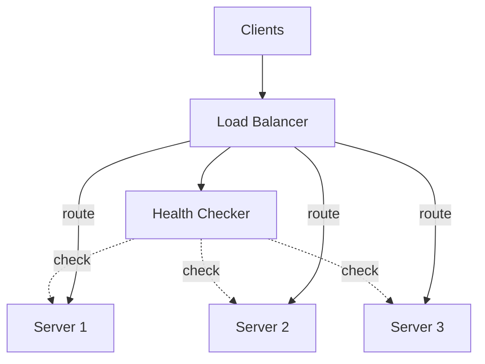

# How to Build a Load Balancer with Health Checks in Python

Author: [nawazdhandala](https://www.github.com/nawazdhandala)

Tags: Python, Load Balancer, Health Checks, asyncio, High Availability, Distributed Systems, Networking

Description: Learn how to build a load balancer with health checks in Python using asyncio. This guide covers round-robin, weighted, and least-connections algorithms, plus health monitoring for automatic failover.

---

> A single server is a single point of failure. Load balancers distribute traffic across multiple servers, providing redundancy and scaling capacity. Health checks ensure traffic only reaches servers that can handle it.

Building a load balancer from scratch teaches you how production load balancers work and gives you flexibility for custom routing logic.

---

## Load Balancer Architecture



The load balancer receives client requests and routes them to healthy backend servers. The health checker continuously monitors backends and removes unhealthy ones from rotation.

---

## Backend Server Model

First, define the backend server data structure:

```python
# models.py
from dataclasses import dataclass, field
from datetime import datetime
from typing import Optional
from enum import Enum, auto


class ServerStatus(Enum):
    """Health status of a backend server"""
    HEALTHY = auto()
    UNHEALTHY = auto()
    UNKNOWN = auto()


@dataclass
class BackendServer:
    """Represents a backend server in the pool"""
    host: str
    port: int
    weight: int = 1                    # For weighted load balancing
    max_connections: int = 100         # Connection limit
    health_check_path: str = "/health" # Health check endpoint

    # Runtime state
    status: ServerStatus = ServerStatus.UNKNOWN
    active_connections: int = 0
    total_requests: int = 0
    failed_requests: int = 0
    last_health_check: Optional[datetime] = None
    consecutive_failures: int = 0
    consecutive_successes: int = 0

    @property
    def url(self) -> str:
        """Get base URL for this server"""
        return f"http://{self.host}:{self.port}"

    @property
    def health_url(self) -> str:
        """Get health check URL"""
        return f"{self.url}{self.health_check_path}"

    @property
    def is_healthy(self) -> bool:
        """Check if server is healthy and accepting connections"""
        return (
            self.status == ServerStatus.HEALTHY and
            self.active_connections < self.max_connections
        )

    def record_request(self, success: bool) -> None:
        """Record a request result"""
        self.total_requests += 1
        if not success:
            self.failed_requests += 1
```

---

## Health Checker

The health checker monitors backend servers and updates their status:

```python
# health_checker.py
import asyncio
import aiohttp
from typing import List, Callable, Awaitable
from datetime import datetime
import logging

logger = logging.getLogger(__name__)

# Type for health check result callback
HealthCallback = Callable[[BackendServer, bool], Awaitable[None]]


class HealthChecker:
    """
    Continuously monitors backend server health.

    Performs HTTP health checks at regular intervals and updates
    server status based on consecutive successes or failures.
    """

    def __init__(
        self,
        servers: List[BackendServer],
        check_interval: float = 5.0,
        timeout: float = 3.0,
        healthy_threshold: int = 2,    # Successes to mark healthy
        unhealthy_threshold: int = 3,  # Failures to mark unhealthy
        on_status_change: HealthCallback = None
    ):
        self.servers = servers
        self.check_interval = check_interval
        self.timeout = timeout
        self.healthy_threshold = healthy_threshold
        self.unhealthy_threshold = unhealthy_threshold
        self.on_status_change = on_status_change

        self._running = False
        self._task: asyncio.Task = None
        self._session: aiohttp.ClientSession = None

    async def start(self) -> None:
        """Start the health checker"""
        self._running = True
        self._session = aiohttp.ClientSession(
            timeout=aiohttp.ClientTimeout(total=self.timeout)
        )
        self._task = asyncio.create_task(self._check_loop())
        logger.info(f"Health checker started (interval={self.check_interval}s)")

    async def stop(self) -> None:
        """Stop the health checker"""
        self._running = False
        if self._task:
            self._task.cancel()
            try:
                await self._task
            except asyncio.CancelledError:
                pass
        if self._session:
            await self._session.close()
        logger.info("Health checker stopped")

    async def _check_loop(self) -> None:
        """Main health check loop"""
        while self._running:
            try:
                # Check all servers concurrently
                await asyncio.gather(*[
                    self._check_server(server)
                    for server in self.servers
                ], return_exceptions=True)

                await asyncio.sleep(self.check_interval)
            except asyncio.CancelledError:
                break
            except Exception as e:
                logger.error(f"Health check loop error: {e}")
                await asyncio.sleep(1)

    async def _check_server(self, server: BackendServer) -> None:
        """Check health of a single server"""
        old_status = server.status

        try:
            async with self._session.get(server.health_url) as response:
                healthy = response.status == 200
                server.last_health_check = datetime.utcnow()

                if healthy:
                    server.consecutive_failures = 0
                    server.consecutive_successes += 1

                    if server.consecutive_successes >= self.healthy_threshold:
                        server.status = ServerStatus.HEALTHY
                else:
                    await self._handle_failure(server, f"HTTP {response.status}")

        except asyncio.TimeoutError:
            await self._handle_failure(server, "timeout")
        except aiohttp.ClientError as e:
            await self._handle_failure(server, str(e))
        except Exception as e:
            await self._handle_failure(server, str(e))

        # Notify on status change
        if old_status != server.status and self.on_status_change:
            await self.on_status_change(server, server.is_healthy)

    async def _handle_failure(self, server: BackendServer, reason: str) -> None:
        """Handle a failed health check"""
        server.consecutive_successes = 0
        server.consecutive_failures += 1
        server.last_health_check = datetime.utcnow()

        if server.consecutive_failures >= self.unhealthy_threshold:
            if server.status != ServerStatus.UNHEALTHY:
                logger.warning(
                    f"Server {server.url} marked unhealthy: {reason}"
                )
            server.status = ServerStatus.UNHEALTHY
        else:
            logger.debug(
                f"Server {server.url} check failed ({server.consecutive_failures}/"
                f"{self.unhealthy_threshold}): {reason}"
            )

    async def check_now(self, server: BackendServer) -> bool:
        """Perform an immediate health check"""
        await self._check_server(server)
        return server.is_healthy
```

---

## Load Balancing Algorithms

Implement different algorithms for server selection:

```python
# algorithms.py
from abc import ABC, abstractmethod
from typing import List, Optional
import itertools
import random


class LoadBalancingAlgorithm(ABC):
    """Base class for load balancing algorithms"""

    @abstractmethod
    def select(self, servers: List[BackendServer]) -> Optional[BackendServer]:
        """Select a server from the pool"""
        pass


class RoundRobinAlgorithm(LoadBalancingAlgorithm):
    """
    Round-robin selection.
    Distributes requests evenly across all healthy servers.
    """

    def __init__(self):
        self._index = 0

    def select(self, servers: List[BackendServer]) -> Optional[BackendServer]:
        healthy = [s for s in servers if s.is_healthy]
        if not healthy:
            return None

        # Move to next server, wrapping around
        server = healthy[self._index % len(healthy)]
        self._index = (self._index + 1) % len(healthy)
        return server


class WeightedRoundRobinAlgorithm(LoadBalancingAlgorithm):
    """
    Weighted round-robin selection.
    Servers with higher weights receive more requests.
    """

    def __init__(self):
        self._current_weight = 0
        self._index = 0

    def select(self, servers: List[BackendServer]) -> Optional[BackendServer]:
        healthy = [s for s in servers if s.is_healthy]
        if not healthy:
            return None

        # Find server using weighted selection
        total_weight = sum(s.weight for s in healthy)
        max_weight = max(s.weight for s in healthy)
        gcd = self._gcd_list([s.weight for s in healthy])

        while True:
            self._index = (self._index + 1) % len(healthy)
            if self._index == 0:
                self._current_weight -= gcd
                if self._current_weight <= 0:
                    self._current_weight = max_weight

            server = healthy[self._index]
            if server.weight >= self._current_weight:
                return server

    def _gcd_list(self, weights: List[int]) -> int:
        """Calculate GCD of a list of numbers"""
        from math import gcd
        from functools import reduce
        return reduce(gcd, weights)


class LeastConnectionsAlgorithm(LoadBalancingAlgorithm):
    """
    Least connections selection.
    Routes to the server with fewest active connections.
    """

    def select(self, servers: List[BackendServer]) -> Optional[BackendServer]:
        healthy = [s for s in servers if s.is_healthy]
        if not healthy:
            return None

        # Find server with minimum connections
        return min(healthy, key=lambda s: s.active_connections)


class WeightedLeastConnectionsAlgorithm(LoadBalancingAlgorithm):
    """
    Weighted least connections selection.
    Considers both connection count and server weight.
    """

    def select(self, servers: List[BackendServer]) -> Optional[BackendServer]:
        healthy = [s for s in servers if s.is_healthy]
        if not healthy:
            return None

        # Score = connections / weight (lower is better)
        return min(healthy, key=lambda s: s.active_connections / s.weight)


class RandomAlgorithm(LoadBalancingAlgorithm):
    """
    Random selection.
    Simple but provides good distribution over many requests.
    """

    def select(self, servers: List[BackendServer]) -> Optional[BackendServer]:
        healthy = [s for s in servers if s.is_healthy]
        if not healthy:
            return None
        return random.choice(healthy)


class IPHashAlgorithm(LoadBalancingAlgorithm):
    """
    IP hash selection.
    Routes requests from the same IP to the same server (session affinity).
    """

    def __init__(self):
        self._client_ip: str = ""

    def set_client_ip(self, ip: str) -> None:
        """Set client IP for the current request"""
        self._client_ip = ip

    def select(self, servers: List[BackendServer]) -> Optional[BackendServer]:
        healthy = [s for s in servers if s.is_healthy]
        if not healthy:
            return None

        # Hash the IP to select a server
        ip_hash = hash(self._client_ip)
        index = ip_hash % len(healthy)
        return healthy[index]
```

---

## Load Balancer Core

The main load balancer class that ties everything together:

```python
# load_balancer.py
import asyncio
import aiohttp
from typing import List, Optional, Dict, Any
from dataclasses import dataclass
from datetime import datetime
import logging

logger = logging.getLogger(__name__)


@dataclass
class LoadBalancerConfig:
    """Configuration for the load balancer"""
    algorithm: str = "round_robin"
    health_check_interval: float = 5.0
    health_check_timeout: float = 3.0
    healthy_threshold: int = 2
    unhealthy_threshold: int = 3
    request_timeout: float = 30.0
    max_retries: int = 2


class LoadBalancer:
    """
    HTTP load balancer with health checks.

    Routes incoming requests to healthy backend servers using
    configurable algorithms. Automatically removes unhealthy
    servers from rotation.
    """

    # Available algorithms
    ALGORITHMS = {
        "round_robin": RoundRobinAlgorithm,
        "weighted_round_robin": WeightedRoundRobinAlgorithm,
        "least_connections": LeastConnectionsAlgorithm,
        "weighted_least_connections": WeightedLeastConnectionsAlgorithm,
        "random": RandomAlgorithm,
        "ip_hash": IPHashAlgorithm,
    }

    def __init__(
        self,
        servers: List[BackendServer],
        config: LoadBalancerConfig = None
    ):
        self.servers = servers
        self.config = config or LoadBalancerConfig()

        # Initialize algorithm
        algorithm_class = self.ALGORITHMS.get(self.config.algorithm)
        if not algorithm_class:
            raise ValueError(f"Unknown algorithm: {self.config.algorithm}")
        self._algorithm = algorithm_class()

        # Initialize health checker
        self._health_checker = HealthChecker(
            servers=servers,
            check_interval=self.config.health_check_interval,
            timeout=self.config.health_check_timeout,
            healthy_threshold=self.config.healthy_threshold,
            unhealthy_threshold=self.config.unhealthy_threshold,
            on_status_change=self._on_server_status_change
        )

        self._session: aiohttp.ClientSession = None
        self._request_count = 0
        self._error_count = 0

    async def start(self) -> None:
        """Start the load balancer"""
        self._session = aiohttp.ClientSession(
            timeout=aiohttp.ClientTimeout(total=self.config.request_timeout)
        )
        await self._health_checker.start()
        logger.info(f"Load balancer started with {len(self.servers)} servers")

    async def stop(self) -> None:
        """Stop the load balancer"""
        await self._health_checker.stop()
        if self._session:
            await self._session.close()
        logger.info("Load balancer stopped")

    async def _on_server_status_change(
        self,
        server: BackendServer,
        healthy: bool
    ) -> None:
        """Called when a server's health status changes"""
        status = "healthy" if healthy else "unhealthy"
        logger.info(f"Server {server.url} is now {status}")

    def _select_server(self, client_ip: str = None) -> Optional[BackendServer]:
        """Select a backend server for the request"""
        # Set client IP for IP hash algorithm
        if isinstance(self._algorithm, IPHashAlgorithm) and client_ip:
            self._algorithm.set_client_ip(client_ip)

        return self._algorithm.select(self.servers)

    async def forward_request(
        self,
        method: str,
        path: str,
        headers: Dict[str, str] = None,
        body: bytes = None,
        client_ip: str = None
    ) -> Dict[str, Any]:
        """
        Forward a request to a backend server.

        Returns a dict with status, headers, and body from the backend.
        Retries on failure up to max_retries times.
        """
        self._request_count += 1
        headers = headers or {}
        tried_servers = set()

        for attempt in range(self.config.max_retries + 1):
            server = self._select_server(client_ip)

            # Skip servers we have already tried
            while server and server.url in tried_servers:
                tried_servers.add(server.url)
                server = self._select_server(client_ip)

            if not server:
                self._error_count += 1
                return {
                    "status": 503,
                    "headers": {},
                    "body": b'{"error": "No healthy servers available"}'
                }

            tried_servers.add(server.url)
            target_url = f"{server.url}{path}"

            # Add forwarding headers
            forward_headers = headers.copy()
            forward_headers["X-Forwarded-For"] = client_ip or ""
            forward_headers["X-Forwarded-Host"] = headers.get("Host", "")

            server.active_connections += 1

            try:
                async with self._session.request(
                    method=method,
                    url=target_url,
                    headers=forward_headers,
                    data=body
                ) as response:
                    response_body = await response.read()
                    server.record_request(success=True)

                    return {
                        "status": response.status,
                        "headers": dict(response.headers),
                        "body": response_body
                    }

            except Exception as e:
                server.record_request(success=False)
                logger.warning(
                    f"Request to {server.url} failed (attempt {attempt + 1}): {e}"
                )

                if attempt == self.config.max_retries:
                    self._error_count += 1
                    return {
                        "status": 502,
                        "headers": {},
                        "body": f'{{"error": "Backend error: {str(e)}"}}'.encode()
                    }

            finally:
                server.active_connections -= 1

        # Should not reach here
        return {"status": 500, "headers": {}, "body": b'{"error": "Unknown error"}'}

    def get_stats(self) -> Dict[str, Any]:
        """Get load balancer statistics"""
        return {
            "total_requests": self._request_count,
            "total_errors": self._error_count,
            "error_rate": self._error_count / max(self._request_count, 1),
            "servers": [
                {
                    "url": s.url,
                    "status": s.status.name,
                    "active_connections": s.active_connections,
                    "total_requests": s.total_requests,
                    "failed_requests": s.failed_requests,
                    "weight": s.weight,
                    "last_check": s.last_health_check.isoformat()
                    if s.last_health_check else None
                }
                for s in self.servers
            ]
        }

    def get_healthy_servers(self) -> List[BackendServer]:
        """Get list of healthy servers"""
        return [s for s in self.servers if s.is_healthy]
```

---

## HTTP Server Integration

Create an aiohttp server that uses the load balancer:

```python
# server.py
from aiohttp import web
import logging

logger = logging.getLogger(__name__)


class LoadBalancerServer:
    """HTTP server that acts as a load balancer"""

    def __init__(self, load_balancer: LoadBalancer):
        self.lb = load_balancer

    async def handle_request(self, request: web.Request) -> web.Response:
        """Handle incoming request and forward to backend"""
        # Get client IP
        client_ip = request.remote or request.headers.get("X-Real-IP", "")

        # Forward the request
        result = await self.lb.forward_request(
            method=request.method,
            path=request.path_qs,
            headers=dict(request.headers),
            body=await request.read() if request.body_exists else None,
            client_ip=client_ip
        )

        return web.Response(
            status=result["status"],
            headers=result["headers"],
            body=result["body"]
        )

    async def handle_stats(self, request: web.Request) -> web.Response:
        """Return load balancer statistics"""
        return web.json_response(self.lb.get_stats())

    async def handle_health(self, request: web.Request) -> web.Response:
        """Health check endpoint for the load balancer itself"""
        healthy_count = len(self.lb.get_healthy_servers())
        total_count = len(self.lb.servers)

        if healthy_count == 0:
            return web.json_response(
                {"status": "unhealthy", "healthy_servers": 0},
                status=503
            )

        return web.json_response({
            "status": "healthy",
            "healthy_servers": healthy_count,
            "total_servers": total_count
        })


def create_app(servers: List[BackendServer], config: LoadBalancerConfig = None) -> web.Application:
    """Create the load balancer application"""
    lb = LoadBalancer(servers, config)
    server = LoadBalancerServer(lb)

    app = web.Application()

    # Setup lifecycle
    async def on_startup(app):
        await lb.start()

    async def on_cleanup(app):
        await lb.stop()

    app.on_startup.append(on_startup)
    app.on_cleanup.append(on_cleanup)

    # Routes
    app.router.add_route("*", "/lb/stats", server.handle_stats)
    app.router.add_route("GET", "/lb/health", server.handle_health)
    app.router.add_route("*", "/{path:.*}", server.handle_request)

    return app


# Main entry point
if __name__ == "__main__":
    # Configure backend servers
    servers = [
        BackendServer(host="localhost", port=8001, weight=2),
        BackendServer(host="localhost", port=8002, weight=1),
        BackendServer(host="localhost", port=8003, weight=1),
    ]

    config = LoadBalancerConfig(
        algorithm="weighted_round_robin",
        health_check_interval=5.0,
        max_retries=2
    )

    app = create_app(servers, config)
    web.run_app(app, host="0.0.0.0", port=8080)
```

---

## Graceful Degradation

Handle scenarios where backends are failing:

```python
# degradation.py
from typing import Callable, Awaitable, Optional
from dataclasses import dataclass


@dataclass
class FallbackConfig:
    """Configuration for fallback behavior"""
    enable_fallback: bool = True
    fallback_response: bytes = b'{"status": "degraded", "message": "Service temporarily unavailable"}'
    fallback_status: int = 503
    min_healthy_servers: int = 1


class DegradationHandler:
    """Handles graceful degradation when backends fail"""

    def __init__(
        self,
        load_balancer: LoadBalancer,
        config: FallbackConfig = None
    ):
        self.lb = load_balancer
        self.config = config or FallbackConfig()
        self._fallback_handler: Optional[Callable] = None

    def set_fallback_handler(
        self,
        handler: Callable[[str, str], Awaitable[bytes]]
    ) -> None:
        """Set a custom fallback handler"""
        self._fallback_handler = handler

    async def forward_with_fallback(
        self,
        method: str,
        path: str,
        headers: dict = None,
        body: bytes = None,
        client_ip: str = None
    ) -> dict:
        """Forward request with fallback on failure"""
        healthy_count = len(self.lb.get_healthy_servers())

        # Check if we have enough healthy servers
        if healthy_count < self.config.min_healthy_servers:
            if self.config.enable_fallback:
                return await self._handle_fallback(method, path)
            return {
                "status": 503,
                "headers": {},
                "body": b'{"error": "Insufficient healthy servers"}'
            }

        # Try normal forwarding
        result = await self.lb.forward_request(
            method=method,
            path=path,
            headers=headers,
            body=body,
            client_ip=client_ip
        )

        # Check if we need fallback
        if result["status"] >= 500 and self.config.enable_fallback:
            return await self._handle_fallback(method, path)

        return result

    async def _handle_fallback(self, method: str, path: str) -> dict:
        """Execute fallback behavior"""
        if self._fallback_handler:
            body = await self._fallback_handler(method, path)
            return {
                "status": self.config.fallback_status,
                "headers": {"Content-Type": "application/json"},
                "body": body
            }

        return {
            "status": self.config.fallback_status,
            "headers": {"Content-Type": "application/json"},
            "body": self.config.fallback_response
        }
```

---

## Testing Your Load Balancer

Create simple backend servers for testing:

```python
# test_backends.py
from aiohttp import web
import asyncio
import random


async def create_backend(port: int, fail_rate: float = 0.0):
    """Create a simple backend server for testing"""

    async def handle_request(request: web.Request) -> web.Response:
        # Simulate occasional failures
        if random.random() < fail_rate:
            return web.Response(status=500, text="Internal error")

        # Simulate processing time
        await asyncio.sleep(random.uniform(0.01, 0.1))

        return web.json_response({
            "server": f"backend-{port}",
            "path": request.path,
            "method": request.method
        })

    async def handle_health(request: web.Request) -> web.Response:
        return web.Response(text="OK")

    app = web.Application()
    app.router.add_get("/health", handle_health)
    app.router.add_route("*", "/{path:.*}", handle_request)

    runner = web.AppRunner(app)
    await runner.setup()
    site = web.TCPSite(runner, "localhost", port)
    await site.start()
    print(f"Backend server started on port {port}")
    return runner


async def main():
    # Start three backend servers
    runners = await asyncio.gather(
        create_backend(8001),
        create_backend(8002, fail_rate=0.1),  # 10% failure rate
        create_backend(8003),
    )

    print("All backends running. Press Ctrl+C to stop.")
    try:
        await asyncio.Event().wait()
    except KeyboardInterrupt:
        pass
    finally:
        for runner in runners:
            await runner.cleanup()


if __name__ == "__main__":
    asyncio.run(main())
```

---

## Best Practices

**1. Choose the right algorithm:**
```python
# Use weighted for heterogeneous servers
config = LoadBalancerConfig(algorithm="weighted_least_connections")

# Use IP hash for session affinity
config = LoadBalancerConfig(algorithm="ip_hash")
```

**2. Configure appropriate thresholds:**
```python
# Quick detection, slower recovery
config = LoadBalancerConfig(
    unhealthy_threshold=2,  # Mark unhealthy after 2 failures
    healthy_threshold=5     # Require 5 successes to recover
)
```

**3. Monitor key metrics:**
```python
stats = lb.get_stats()
# Alert if error rate exceeds threshold
if stats["error_rate"] > 0.05:  # 5%
    logger.warning("High error rate detected")

# Alert if too few healthy servers
healthy = len(lb.get_healthy_servers())
if healthy < 2:
    logger.critical("Insufficient healthy backends")
```

**4. Implement connection draining:**
```python
async def drain_server(server: BackendServer, timeout: float = 30.0):
    """Drain connections before removing server"""
    server.status = ServerStatus.DRAINING
    start = datetime.utcnow()

    while server.active_connections > 0:
        elapsed = (datetime.utcnow() - start).total_seconds()
        if elapsed > timeout:
            break
        await asyncio.sleep(1)

    server.status = ServerStatus.UNHEALTHY
```

---

## Conclusion

Building a load balancer teaches you the fundamentals of traffic distribution and high availability. Key components include:

- **Health checks**: Continuously monitor backend health
- **Multiple algorithms**: Choose based on your workload characteristics
- **Automatic failover**: Remove unhealthy servers from rotation
- **Graceful degradation**: Provide fallback behavior when backends fail
- **Metrics**: Monitor error rates and server health

For production deployments, consider using proven load balancers like nginx, HAProxy, or cloud provider solutions. The patterns shown here help you understand how they work and enable custom routing logic when needed.

---

*Need to monitor your load balancer and backend health? [OneUptime](https://oneuptime.com) provides uptime monitoring, health checks, and alerting to help you maintain high availability.*

**Related Reading:**
- [How to Build an HTTP Proxy with aiohttp in Python](https://oneuptime.com/blog/post/2026-01-25-http-proxy-aiohttp-python/view)
