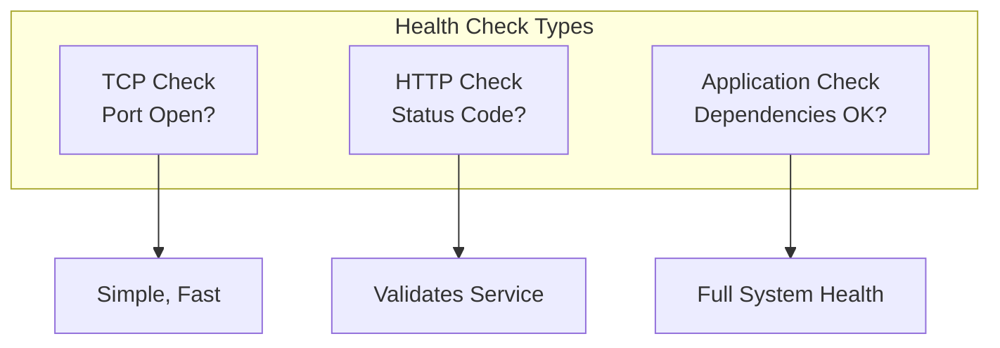
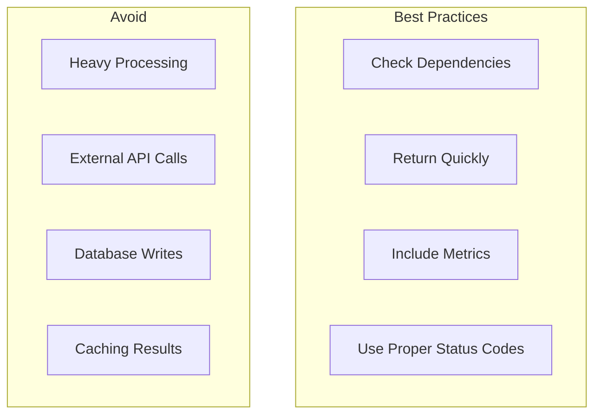

# How to Implement Load Balancer Health Checks

Author: [nawazdhandala](https://www.github.com/nawazdhandala)

Tags: Load Balancing, Health Checks, High Availability, Nginx, HAProxy, DevOps

Description: A hands-on guide to implementing effective health checks for load balancers, covering HTTP, TCP, and application-level health checks with examples for Nginx, HAProxy, and cloud load balancers.

---

Health checks are the heartbeat of any load-balanced system. Without proper health checks, your load balancer will send traffic to dead or degraded servers, causing user-facing errors. This guide covers how to implement health checks that actually work.

## Health Check Types



## Nginx Health Checks

### Passive Health Checks (Open Source)

Nginx open source only supports passive health checks by default.

```nginx
upstream backend {
    server 10.0.1.100:8080 max_fails=3 fail_timeout=30s;
    server 10.0.1.101:8080 max_fails=3 fail_timeout=30s;
    server 10.0.1.102:8080 max_fails=3 fail_timeout=30s backup;

    # Passive health check parameters:
    # max_fails: Number of failed requests before marking server down
    # fail_timeout: Time to consider failures and time server stays marked down
}

server {
    listen 80;

    location / {
        proxy_pass http://backend;
        proxy_connect_timeout 5s;
        proxy_read_timeout 30s;

        # What counts as failure
        proxy_next_upstream error timeout http_500 http_502 http_503 http_504;
        proxy_next_upstream_tries 3;
        proxy_next_upstream_timeout 10s;
    }
}
```

### Active Health Checks (Nginx Plus)

```nginx
upstream backend {
    zone backend 64k;

    server 10.0.1.100:8080;
    server 10.0.1.101:8080;
    server 10.0.1.102:8080;
}

server {
    listen 80;

    location / {
        proxy_pass http://backend;

        # Active health check configuration
        health_check interval=5s fails=3 passes=2 uri=/health;
    }
}

# Match block for custom health check validation
match health_check {
    status 200;
    header Content-Type ~ "application/json";
    body ~ "\"status\":\\s*\"healthy\"";
}
```

## HAProxy Health Checks

HAProxy provides comprehensive health checking out of the box.

### HTTP Health Checks

```haproxy
# /etc/haproxy/haproxy.cfg

global
    log /dev/log local0
    maxconn 4096

defaults
    mode http
    log global
    option httplog
    option dontlognull
    timeout connect 5s
    timeout client 30s
    timeout server 30s

frontend http_front
    bind *:80
    default_backend http_back

backend http_back
    balance roundrobin

    # HTTP health check configuration
    option httpchk GET /health HTTP/1.1\r\nHost:\ localhost
    http-check expect status 200

    # Health check intervals
    default-server inter 3s fall 3 rise 2

    server web1 10.0.1.100:8080 check
    server web2 10.0.1.101:8080 check
    server web3 10.0.1.102:8080 check backup
```

### Advanced Health Checks

```haproxy
backend api_servers
    balance leastconn

    # More detailed HTTP check
    option httpchk
    http-check connect
    http-check send meth GET uri /health ver HTTP/1.1 hdr Host localhost
    http-check expect status 200
    http-check expect string "healthy"

    # Custom health check timing
    default-server inter 5s fastinter 1s downinter 10s fall 3 rise 2

    # Server definitions with health check
    server api1 10.0.1.100:8080 check port 8081  # Check on different port
    server api2 10.0.1.101:8080 check ssl verify none
    server api3 10.0.1.102:8080 check agent-check agent-port 9999

backend database_proxy
    mode tcp
    balance roundrobin

    # TCP health check
    option tcp-check
    tcp-check connect

    # MySQL health check
    tcp-check send-binary 0100000185a23f00  # MySQL ping packet
    tcp-check expect binary 0500000007

    server db1 10.0.2.100:3306 check
    server db2 10.0.2.101:3306 check backup
```

## Application Health Endpoints

The load balancer needs something to check. Here's how to build proper health endpoints.

### Basic Health Endpoint (Python/Flask)

```python
from flask import Flask, jsonify
import psycopg2
import redis
import time

app = Flask(__name__)

def check_database():
    """Check database connectivity"""
    try:
        conn = psycopg2.connect(
            host="localhost",
            database="myapp",
            user="user",
            password="pass",
            connect_timeout=3
        )
        cursor = conn.cursor()
        cursor.execute("SELECT 1")
        cursor.close()
        conn.close()
        return True, None
    except Exception as e:
        return False, str(e)

def check_redis():
    """Check Redis connectivity"""
    try:
        r = redis.Redis(host='localhost', port=6379, socket_timeout=3)
        r.ping()
        return True, None
    except Exception as e:
        return False, str(e)

@app.route('/health')
def health():
    """Basic health check - just confirms app is running"""
    return jsonify({"status": "healthy"}), 200

@app.route('/health/live')
def liveness():
    """Liveness probe - is the process alive?"""
    return jsonify({"status": "alive"}), 200

@app.route('/health/ready')
def readiness():
    """Readiness probe - can the app serve traffic?"""
    checks = {}

    # Check database
    db_ok, db_error = check_database()
    checks['database'] = {
        'healthy': db_ok,
        'error': db_error
    }

    # Check Redis
    redis_ok, redis_error = check_redis()
    checks['redis'] = {
        'healthy': redis_ok,
        'error': redis_error
    }

    # Overall status
    all_healthy = all(c['healthy'] for c in checks.values())
    status_code = 200 if all_healthy else 503

    return jsonify({
        'status': 'healthy' if all_healthy else 'unhealthy',
        'checks': checks,
        'timestamp': time.time()
    }), status_code

@app.route('/health/deep')
def deep_health():
    """Deep health check - verify all dependencies"""
    start = time.time()
    checks = {}

    # Database check with timing
    db_start = time.time()
    db_ok, db_error = check_database()
    checks['database'] = {
        'healthy': db_ok,
        'latency_ms': (time.time() - db_start) * 1000,
        'error': db_error
    }

    # Redis check with timing
    redis_start = time.time()
    redis_ok, redis_error = check_redis()
    checks['redis'] = {
        'healthy': redis_ok,
        'latency_ms': (time.time() - redis_start) * 1000,
        'error': redis_error
    }

    all_healthy = all(c['healthy'] for c in checks.values())

    return jsonify({
        'status': 'healthy' if all_healthy else 'degraded',
        'checks': checks,
        'total_latency_ms': (time.time() - start) * 1000
    }), 200 if all_healthy else 503
```

### Go Health Endpoint

```go
package main

import (
    "database/sql"
    "encoding/json"
    "net/http"
    "sync"
    "time"

    "github.com/go-redis/redis/v8"
    _ "github.com/lib/pq"
)

type HealthStatus struct {
    Status    string                 `json:"status"`
    Checks    map[string]CheckResult `json:"checks,omitempty"`
    Timestamp int64                  `json:"timestamp"`
}

type CheckResult struct {
    Healthy   bool    `json:"healthy"`
    LatencyMs float64 `json:"latency_ms,omitempty"`
    Error     string  `json:"error,omitempty"`
}

var (
    db  *sql.DB
    rdb *redis.Client
)

func checkDatabase() CheckResult {
    start := time.Now()
    err := db.Ping()
    latency := float64(time.Since(start).Milliseconds())

    if err != nil {
        return CheckResult{Healthy: false, LatencyMs: latency, Error: err.Error()}
    }
    return CheckResult{Healthy: true, LatencyMs: latency}
}

func checkRedis() CheckResult {
    start := time.Now()
    ctx := context.Background()
    _, err := rdb.Ping(ctx).Result()
    latency := float64(time.Since(start).Milliseconds())

    if err != nil {
        return CheckResult{Healthy: false, LatencyMs: latency, Error: err.Error()}
    }
    return CheckResult{Healthy: true, LatencyMs: latency}
}

func healthHandler(w http.ResponseWriter, r *http.Request) {
    status := HealthStatus{
        Status:    "healthy",
        Timestamp: time.Now().Unix(),
    }
    w.Header().Set("Content-Type", "application/json")
    json.NewEncoder(w).Encode(status)
}

func readinessHandler(w http.ResponseWriter, r *http.Request) {
    var wg sync.WaitGroup
    checks := make(map[string]CheckResult)
    var mu sync.Mutex

    // Run checks concurrently
    wg.Add(2)

    go func() {
        defer wg.Done()
        result := checkDatabase()
        mu.Lock()
        checks["database"] = result
        mu.Unlock()
    }()

    go func() {
        defer wg.Done()
        result := checkRedis()
        mu.Lock()
        checks["redis"] = result
        mu.Unlock()
    }()

    wg.Wait()

    // Determine overall health
    allHealthy := true
    for _, check := range checks {
        if !check.Healthy {
            allHealthy = false
            break
        }
    }

    status := HealthStatus{
        Status:    "healthy",
        Checks:    checks,
        Timestamp: time.Now().Unix(),
    }

    if !allHealthy {
        status.Status = "unhealthy"
        w.WriteHeader(http.StatusServiceUnavailable)
    }

    w.Header().Set("Content-Type", "application/json")
    json.NewEncoder(w).Encode(status)
}

func main() {
    http.HandleFunc("/health", healthHandler)
    http.HandleFunc("/health/ready", readinessHandler)
    http.ListenAndServe(":8080", nil)
}
```

## AWS ALB Health Checks

```yaml
# CloudFormation template
Resources:
  TargetGroup:
    Type: AWS::ElasticLoadBalancingV2::TargetGroup
    Properties:
      Name: api-targets
      Protocol: HTTP
      Port: 8080
      VpcId: !Ref VPC
      TargetType: ip

      # Health check configuration
      HealthCheckEnabled: true
      HealthCheckProtocol: HTTP
      HealthCheckPort: "8080"
      HealthCheckPath: /health/ready
      HealthCheckIntervalSeconds: 15
      HealthCheckTimeoutSeconds: 5
      HealthyThresholdCount: 2
      UnhealthyThresholdCount: 3

      # Response codes to consider healthy
      Matcher:
        HttpCode: "200"

      # Target attributes
      TargetGroupAttributes:
        - Key: deregistration_delay.timeout_seconds
          Value: "30"
        - Key: slow_start.duration_seconds
          Value: "60"
```

### Terraform Configuration

```hcl
resource "aws_lb_target_group" "api" {
  name     = "api-targets"
  port     = 8080
  protocol = "HTTP"
  vpc_id   = aws_vpc.main.id

  health_check {
    enabled             = true
    healthy_threshold   = 2
    unhealthy_threshold = 3
    timeout             = 5
    interval            = 15
    path                = "/health/ready"
    port                = "traffic-port"
    protocol            = "HTTP"
    matcher             = "200"
  }

  # Slow start gives new instances time to warm up
  slow_start = 60

  # Deregistration delay for graceful shutdown
  deregistration_delay = 30

  stickiness {
    type            = "lb_cookie"
    cookie_duration = 3600
    enabled         = false
  }
}
```

## Kubernetes Health Checks

```yaml
apiVersion: apps/v1
kind: Deployment
metadata:
  name: api
spec:
  replicas: 3
  selector:
    matchLabels:
      app: api
  template:
    metadata:
      labels:
        app: api
    spec:
      containers:
        - name: api
          image: api:latest
          ports:
            - containerPort: 8080

          # Liveness probe - restart container if this fails
          livenessProbe:
            httpGet:
              path: /health/live
              port: 8080
            initialDelaySeconds: 10
            periodSeconds: 10
            timeoutSeconds: 5
            failureThreshold: 3

          # Readiness probe - remove from service if this fails
          readinessProbe:
            httpGet:
              path: /health/ready
              port: 8080
            initialDelaySeconds: 5
            periodSeconds: 5
            timeoutSeconds: 3
            failureThreshold: 3

          # Startup probe - for slow-starting containers
          startupProbe:
            httpGet:
              path: /health
              port: 8080
            initialDelaySeconds: 0
            periodSeconds: 5
            timeoutSeconds: 3
            failureThreshold: 30  # 30 * 5 = 150 seconds max startup
```

## Health Check Best Practices



### Timing Configuration

```
# Recommended health check intervals

## High Traffic / Critical Services
interval: 5s
timeout: 2s
unhealthy_threshold: 2

## Standard Services
interval: 15s
timeout: 5s
unhealthy_threshold: 3

## Background Workers
interval: 30s
timeout: 10s
unhealthy_threshold: 5
```

### Monitoring Health Check Status

```bash
#!/bin/bash
# monitor-health.sh - Monitor health check status

ENDPOINTS=(
    "http://10.0.1.100:8080/health/ready"
    "http://10.0.1.101:8080/health/ready"
    "http://10.0.1.102:8080/health/ready"
)

for endpoint in "${ENDPOINTS[@]}"; do
    echo "Checking $endpoint..."

    response=$(curl -s -o /dev/null -w "%{http_code} %{time_total}" $endpoint)
    status_code=$(echo $response | cut -d' ' -f1)
    response_time=$(echo $response | cut -d' ' -f2)

    if [ "$status_code" = "200" ]; then
        echo "  Status: HEALTHY (${response_time}s)"
    else
        echo "  Status: UNHEALTHY (HTTP $status_code)"
    fi
done
```

---

Effective health checks are the foundation of reliable load balancing. Use layered health checks with different depths, configure appropriate intervals for your traffic patterns, and make sure your health endpoints actually verify what matters. A health check that always returns 200 is worse than no health check at all.
