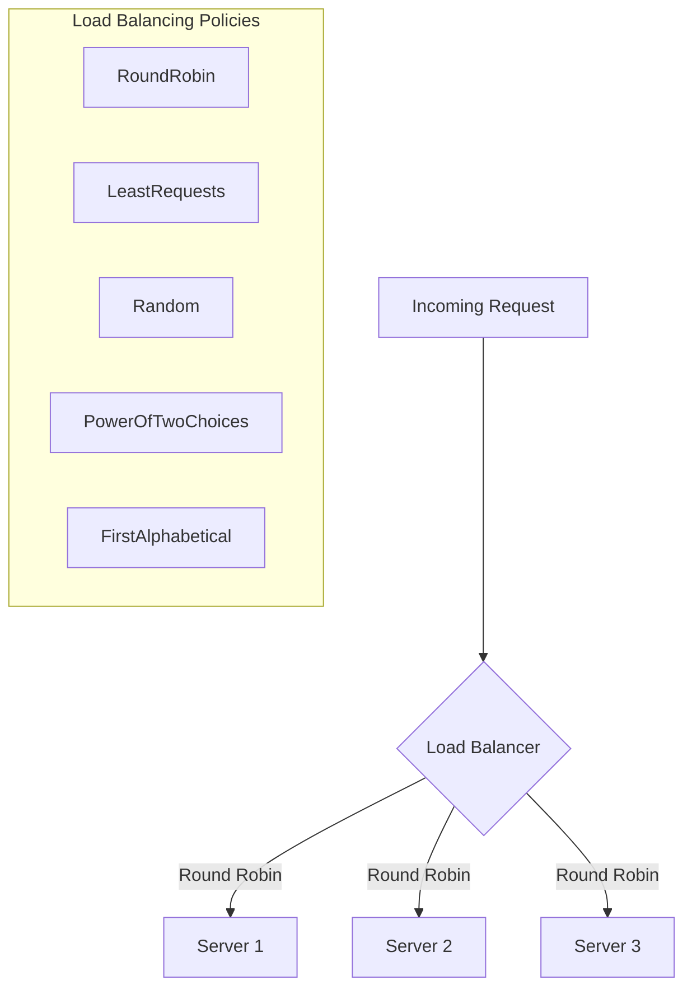

# How to Build a Load Balancer with YARP in .NET

Author: [nawazdhandala](https://www.github.com/nawazdhandala)

Tags: .NET, C#, YARP, Load Balancer, Reverse Proxy, ASP.NET Core, Microservices

Description: Learn how to build a production-ready load balancer in .NET using YARP (Yet Another Reverse Proxy). This guide covers load balancing algorithms, health checks, and configuration patterns for microservices.

---

YARP (Yet Another Reverse Proxy) is Microsoft's high-performance reverse proxy library for .NET. Beyond simple proxying, YARP provides powerful load balancing capabilities that let you distribute traffic across multiple backend servers. This guide shows how to build a load balancer using YARP that can handle production workloads.

## Getting Started with YARP

Install the YARP package:

```bash
dotnet add package Yarp.ReverseProxy
```

Create a basic load balancer configuration:

```csharp
// Program.cs
var builder = WebApplication.CreateBuilder(args);

// Add YARP services
builder.Services.AddReverseProxy()
    .LoadFromConfig(builder.Configuration.GetSection("ReverseProxy"));

var app = builder.Build();

// Map the reverse proxy endpoints
app.MapReverseProxy();

app.Run();
```

Configure routes and clusters in `appsettings.json`:

```json
{
  "ReverseProxy": {
    "Routes": {
      "api-route": {
        "ClusterId": "api-cluster",
        "Match": {
          "Path": "/api/{**catch-all}"
        }
      }
    },
    "Clusters": {
      "api-cluster": {
        "LoadBalancingPolicy": "RoundRobin",
        "Destinations": {
          "api-1": {
            "Address": "http://api-server-1:5000"
          },
          "api-2": {
            "Address": "http://api-server-2:5000"
          },
          "api-3": {
            "Address": "http://api-server-3:5000"
          }
        }
      }
    }
  }
}
```

## Load Balancing Algorithms

YARP supports several load balancing policies out of the box:



### Round Robin

Distributes requests evenly across all healthy destinations:

```json
{
  "Clusters": {
    "api-cluster": {
      "LoadBalancingPolicy": "RoundRobin",
      "Destinations": {
        "server-1": { "Address": "http://server1:5000" },
        "server-2": { "Address": "http://server2:5000" },
        "server-3": { "Address": "http://server3:5000" }
      }
    }
  }
}
```

### Least Requests

Sends requests to the destination with the fewest active requests:

```json
{
  "Clusters": {
    "api-cluster": {
      "LoadBalancingPolicy": "LeastRequests",
      "Destinations": {
        "server-1": { "Address": "http://server1:5000" },
        "server-2": { "Address": "http://server2:5000" }
      }
    }
  }
}
```

### Power of Two Choices

Randomly picks two destinations and selects the one with fewer requests:

```json
{
  "Clusters": {
    "api-cluster": {
      "LoadBalancingPolicy": "PowerOfTwoChoices",
      "Destinations": {
        "server-1": { "Address": "http://server1:5000" },
        "server-2": { "Address": "http://server2:5000" },
        "server-3": { "Address": "http://server3:5000" },
        "server-4": { "Address": "http://server4:5000" }
      }
    }
  }
}
```

## Custom Load Balancing Policy

Implement your own load balancing logic:

```csharp
public class WeightedLoadBalancingPolicy : ILoadBalancingPolicy
{
    public string Name => "Weighted";

    public DestinationState? PickDestination(
        HttpContext context,
        ClusterState cluster,
        IReadOnlyList<DestinationState> availableDestinations)
    {
        if (availableDestinations.Count == 0)
            return null;

        // Calculate total weight
        var totalWeight = 0;
        foreach (var destination in availableDestinations)
        {
            if (destination.Model.Config.Metadata?.TryGetValue("Weight", out var weightStr) == true
                && int.TryParse(weightStr, out var weight))
            {
                totalWeight += weight;
            }
            else
            {
                totalWeight += 1; // Default weight
            }
        }

        // Pick random point in weight range
        var random = Random.Shared.Next(totalWeight);
        var currentWeight = 0;

        foreach (var destination in availableDestinations)
        {
            var weight = 1;
            if (destination.Model.Config.Metadata?.TryGetValue("Weight", out var weightStr) == true)
            {
                int.TryParse(weightStr, out weight);
            }

            currentWeight += weight;
            if (random < currentWeight)
            {
                return destination;
            }
        }

        return availableDestinations[0];
    }
}
```

Register the custom policy:

```csharp
// Program.cs
builder.Services.AddReverseProxy()
    .LoadFromConfig(builder.Configuration.GetSection("ReverseProxy"))
    .AddConfigFilter<CustomConfigFilter>();

// Register custom load balancing policy
builder.Services.AddSingleton<ILoadBalancingPolicy, WeightedLoadBalancingPolicy>();
```

Configure weighted destinations:

```json
{
  "Clusters": {
    "api-cluster": {
      "LoadBalancingPolicy": "Weighted",
      "Destinations": {
        "server-1": {
          "Address": "http://server1:5000",
          "Metadata": { "Weight": "5" }
        },
        "server-2": {
          "Address": "http://server2:5000",
          "Metadata": { "Weight": "3" }
        },
        "server-3": {
          "Address": "http://server3:5000",
          "Metadata": { "Weight": "2" }
        }
      }
    }
  }
}
```

## Health Checks

Configure active and passive health checks to route traffic only to healthy destinations:

```json
{
  "Clusters": {
    "api-cluster": {
      "LoadBalancingPolicy": "RoundRobin",
      "HealthCheck": {
        "Active": {
          "Enabled": true,
          "Interval": "00:00:10",
          "Timeout": "00:00:05",
          "Policy": "ConsecutiveFailures",
          "Path": "/health"
        },
        "Passive": {
          "Enabled": true,
          "Policy": "TransportFailureRate",
          "ReactivationPeriod": "00:01:00"
        }
      },
      "Destinations": {
        "server-1": { "Address": "http://server1:5000", "Health": "http://server1:5000/health" },
        "server-2": { "Address": "http://server2:5000", "Health": "http://server2:5000/health" }
      }
    }
  }
}
```

### Custom Health Check Policy

Create a custom health check for specific requirements:

```csharp
public class CustomHealthCheckPolicy : IActiveHealthCheckPolicy
{
    public string Name => "CustomCheck";

    private readonly ILogger<CustomHealthCheckPolicy> _logger;

    public CustomHealthCheckPolicy(ILogger<CustomHealthCheckPolicy> logger)
    {
        _logger = logger;
    }

    public void ProbingCompleted(
        ClusterState cluster,
        IReadOnlyList<DestinationProbingResult> probingResults)
    {
        foreach (var result in probingResults)
        {
            var destination = result.Destination;
            var response = result.Response;

            DestinationHealth health;

            if (response == null)
            {
                // No response means unhealthy
                health = DestinationHealth.Unhealthy;
                _logger.LogWarning("Destination {Destination} is unhealthy: no response",
                    destination.DestinationId);
            }
            else if (!response.IsSuccessStatusCode)
            {
                // Non-2xx response
                health = DestinationHealth.Unhealthy;
                _logger.LogWarning("Destination {Destination} returned {StatusCode}",
                    destination.DestinationId, response.StatusCode);
            }
            else
            {
                // Check response body for custom health indicators
                var content = result.Response?.Content.ReadAsStringAsync().Result;
                if (content?.Contains("\"status\":\"healthy\"") == true)
                {
                    health = DestinationHealth.Healthy;
                }
                else
                {
                    health = DestinationHealth.Unhealthy;
                    _logger.LogWarning("Destination {Destination} health check failed validation",
                        destination.DestinationId);
                }
            }

            destination.Health.Active = health;
        }
    }
}
```

## Session Affinity (Sticky Sessions)

Route requests from the same client to the same backend:

```json
{
  "Clusters": {
    "api-cluster": {
      "LoadBalancingPolicy": "RoundRobin",
      "SessionAffinity": {
        "Enabled": true,
        "Policy": "Cookie",
        "FailurePolicy": "Redistribute",
        "AffinityKeyName": "X-Server-Affinity"
      },
      "Destinations": {
        "server-1": { "Address": "http://server1:5000" },
        "server-2": { "Address": "http://server2:5000" }
      }
    }
  }
}
```

Available session affinity policies:
- **Cookie** - Uses a cookie to track affinity
- **CustomHeader** - Uses a custom header
- **HashCookie** - Uses hashed cookie value

## Code-Based Configuration

Configure YARP programmatically for dynamic scenarios:

```csharp
public class YarpConfigProvider : IProxyConfigProvider
{
    private volatile InMemoryConfig _config;

    public YarpConfigProvider()
    {
        _config = CreateConfig();
    }

    public IProxyConfig GetConfig() => _config;

    public void UpdateConfig(List<ServerInfo> servers)
    {
        var oldConfig = _config;
        _config = CreateConfig(servers);
        oldConfig.SignalChange();
    }

    private InMemoryConfig CreateConfig(List<ServerInfo>? servers = null)
    {
        servers ??= new List<ServerInfo>
        {
            new("server-1", "http://localhost:5001"),
            new("server-2", "http://localhost:5002")
        };

        var routes = new[]
        {
            new RouteConfig
            {
                RouteId = "api-route",
                ClusterId = "api-cluster",
                Match = new RouteMatch { Path = "/api/{**catch-all}" }
            }
        };

        var destinations = servers.ToDictionary(
            s => s.Name,
            s => new DestinationConfig { Address = s.Address });

        var clusters = new[]
        {
            new ClusterConfig
            {
                ClusterId = "api-cluster",
                LoadBalancingPolicy = "RoundRobin",
                Destinations = destinations,
                HealthCheck = new HealthCheckConfig
                {
                    Active = new ActiveHealthCheckConfig
                    {
                        Enabled = true,
                        Interval = TimeSpan.FromSeconds(10),
                        Path = "/health"
                    }
                }
            }
        };

        return new InMemoryConfig(routes, clusters);
    }
}

public record ServerInfo(string Name, string Address);
```

Register and use the config provider:

```csharp
// Program.cs
var configProvider = new YarpConfigProvider();

builder.Services.AddSingleton(configProvider);
builder.Services.AddReverseProxy()
    .LoadFromMemory(configProvider);

var app = builder.Build();

// API to update servers dynamically
app.MapPost("/admin/servers", (List<ServerInfo> servers, YarpConfigProvider provider) =>
{
    provider.UpdateConfig(servers);
    return Results.Ok();
});

app.MapReverseProxy();
app.Run();
```

## Request and Response Transformation

Add headers, modify requests, or transform responses:

```csharp
// Program.cs
builder.Services.AddReverseProxy()
    .LoadFromConfig(builder.Configuration.GetSection("ReverseProxy"))
    .AddTransforms(context =>
    {
        // Add headers to proxied requests
        context.AddRequestHeader("X-Forwarded-By", "YARP-LB");
        context.AddRequestHeader("X-Request-Id", Guid.NewGuid().ToString());

        // Copy original host
        context.AddOriginalHostHeader();

        // Add response transformation
        context.AddResponseTransform(async transformContext =>
        {
            var response = transformContext.HttpContext.Response;
            response.Headers["X-Served-By"] = transformContext.DestinationPrefix;
        });
    });
```

Custom transform for advanced scenarios:

```csharp
public class TimingTransform : ITransformProvider
{
    public void ValidateCluster(TransformClusterValidationContext context) { }
    public void ValidateRoute(TransformRouteValidationContext context) { }

    public void Apply(TransformBuilderContext context)
    {
        context.AddRequestTransform(transformContext =>
        {
            transformContext.HttpContext.Items["RequestStart"] = Stopwatch.StartNew();
            return ValueTask.CompletedTask;
        });

        context.AddResponseTransform(transformContext =>
        {
            if (transformContext.HttpContext.Items["RequestStart"] is Stopwatch sw)
            {
                sw.Stop();
                transformContext.HttpContext.Response.Headers["X-Upstream-Time-Ms"] =
                    sw.ElapsedMilliseconds.ToString();
            }
            return ValueTask.CompletedTask;
        });
    }
}

// Register the transform
builder.Services.AddSingleton<ITransformProvider, TimingTransform>();
builder.Services.AddReverseProxy()
    .LoadFromConfig(builder.Configuration.GetSection("ReverseProxy"));
```

## Metrics and Monitoring

Add Prometheus metrics for load balancer monitoring:

```csharp
public class LoadBalancerMetrics
{
    private readonly Counter _requestsForwarded;
    private readonly Histogram _requestDuration;
    private readonly Gauge _healthyDestinations;

    public LoadBalancerMetrics()
    {
        _requestsForwarded = Metrics.CreateCounter(
            "loadbalancer_requests_forwarded_total",
            "Total requests forwarded to backends",
            new CounterConfiguration
            {
                LabelNames = new[] { "cluster", "destination", "status_code" }
            });

        _requestDuration = Metrics.CreateHistogram(
            "loadbalancer_request_duration_seconds",
            "Request forwarding duration",
            new HistogramConfiguration
            {
                LabelNames = new[] { "cluster" },
                Buckets = new[] { 0.01, 0.05, 0.1, 0.5, 1.0, 5.0 }
            });

        _healthyDestinations = Metrics.CreateGauge(
            "loadbalancer_healthy_destinations",
            "Number of healthy destinations",
            new GaugeConfiguration
            {
                LabelNames = new[] { "cluster" }
            });
    }

    public void RecordRequest(string cluster, string destination, int statusCode, double duration)
    {
        _requestsForwarded.WithLabels(cluster, destination, statusCode.ToString()).Inc();
        _requestDuration.WithLabels(cluster).Observe(duration);
    }

    public void SetHealthyDestinations(string cluster, int count)
    {
        _healthyDestinations.WithLabels(cluster).Set(count);
    }
}
```

## Complete Load Balancer Example

Here is a complete load balancer setup:

```csharp
// Program.cs
using Prometheus;
using Yarp.ReverseProxy.Configuration;

var builder = WebApplication.CreateBuilder(args);

// Add services
builder.Services.AddSingleton<LoadBalancerMetrics>();

builder.Services.AddReverseProxy()
    .LoadFromConfig(builder.Configuration.GetSection("ReverseProxy"))
    .AddTransforms(context =>
    {
        context.AddRequestHeader("X-Forwarded-By", "YarpLoadBalancer");
        context.AddOriginalHostHeader();
    });

var app = builder.Build();

// Metrics endpoint
app.UseMetricServer(port: 9090);

// Health endpoint for the load balancer itself
app.MapGet("/lb/health", () => Results.Ok(new { status = "healthy" }));

// Admin endpoint to check cluster status
app.MapGet("/lb/status", (IProxyStateLookup lookup) =>
{
    var clusters = lookup.GetClusters();
    var status = clusters.Select(c => new
    {
        Cluster = c.ClusterId,
        Destinations = c.Destinations.Select(d => new
        {
            d.Key,
            Address = d.Value.Model.Config.Address,
            Health = d.Value.Health.Active.ToString()
        })
    });
    return Results.Ok(status);
});

// Reverse proxy
app.MapReverseProxy(pipeline =>
{
    pipeline.Use(async (context, next) =>
    {
        var sw = Stopwatch.StartNew();
        await next();
        sw.Stop();

        // Log proxied requests
        var cluster = context.GetRouteModel()?.Config?.ClusterId ?? "unknown";
        var destination = context.GetProxyFeature().ProxiedDestination?.DestinationId ?? "unknown";
        var status = context.Response.StatusCode;

        context.RequestServices.GetRequiredService<LoadBalancerMetrics>()
            .RecordRequest(cluster, destination, status, sw.Elapsed.TotalSeconds);
    });
});

app.Run();
```

Configuration for the complete example:

```json
{
  "ReverseProxy": {
    "Routes": {
      "users-route": {
        "ClusterId": "users-cluster",
        "Match": { "Path": "/api/users/{**catch-all}" }
      },
      "orders-route": {
        "ClusterId": "orders-cluster",
        "Match": { "Path": "/api/orders/{**catch-all}" }
      }
    },
    "Clusters": {
      "users-cluster": {
        "LoadBalancingPolicy": "LeastRequests",
        "HealthCheck": {
          "Active": { "Enabled": true, "Interval": "00:00:10", "Path": "/health" }
        },
        "Destinations": {
          "users-1": { "Address": "http://users-service-1:5000" },
          "users-2": { "Address": "http://users-service-2:5000" }
        }
      },
      "orders-cluster": {
        "LoadBalancingPolicy": "RoundRobin",
        "SessionAffinity": { "Enabled": true, "Policy": "Cookie" },
        "HealthCheck": {
          "Active": { "Enabled": true, "Interval": "00:00:10", "Path": "/health" }
        },
        "Destinations": {
          "orders-1": { "Address": "http://orders-service-1:5000" },
          "orders-2": { "Address": "http://orders-service-2:5000" },
          "orders-3": { "Address": "http://orders-service-3:5000" }
        }
      }
    }
  }
}
```

## Summary

| Feature | Use Case |
|---------|----------|
| **Round Robin** | Equal distribution across similar servers |
| **Least Requests** | When servers have different capacities |
| **Power of Two Choices** | Large clusters with varying load |
| **Weighted** | Servers with different processing power |
| **Session Affinity** | Stateful applications requiring sticky sessions |

YARP provides everything you need to build a production-ready load balancer in .NET. With built-in health checks, multiple load balancing algorithms, and session affinity support, you can handle complex routing scenarios without deploying separate infrastructure. For most microservices architectures, YARP offers a simpler alternative to hardware load balancers or dedicated proxy software.
