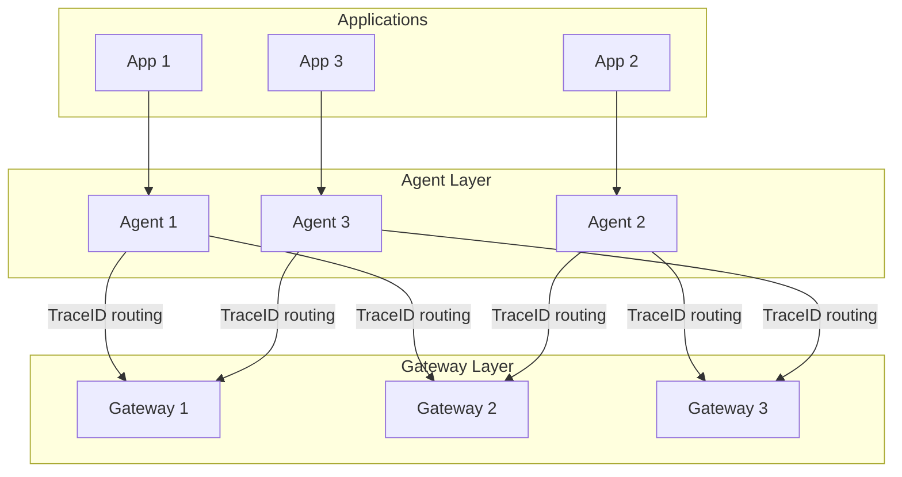

# How to Configure Load Balancing in OpenTelemetry

Author: [nawazdhandala](https://www.github.com/nawazdhandala)

Tags: OpenTelemetry, Load Balancing, Collector, Scalability, High Availability, Tail Sampling

Description: Learn how to configure load balancing in OpenTelemetry for scalable telemetry pipelines. This guide covers trace-aware load balancing, collector scaling, and routing strategies for tail sampling.

---

As telemetry volume grows, a single collector instance becomes a bottleneck. Load balancing distributes the load across multiple collector instances. But telemetry has unique requirements - traces need special handling to keep spans together for sampling decisions.

This guide covers configuring load balancing in OpenTelemetry collector deployments.

## Load Balancing Challenges

Standard round-robin load balancing works for stateless workloads. Telemetry has specific challenges:

| Challenge | Impact | Solution |
|-----------|--------|----------|
| Tail sampling | Spans from same trace go to different collectors | Trace-aware routing |
| Connection persistence | gRPC connections stick to one backend | Client-side load balancing |
| Hot spots | Some services generate more telemetry | Weighted distribution |



## Load Balancing Exporter

The load balancing exporter distributes telemetry across multiple backends using consistent hashing.

### Basic Configuration

```yaml
# agent-config.yaml
receivers:
  otlp:
    protocols:
      grpc:
        endpoint: 0.0.0.0:4317

exporters:
  loadbalancing:
    protocol:
      otlp:
        timeout: 10s
        tls:
          insecure: true
    resolver:
      static:
        hostnames:
          - gateway-1.collectors.svc.cluster.local:4317
          - gateway-2.collectors.svc.cluster.local:4317
          - gateway-3.collectors.svc.cluster.local:4317
    routing_key: traceID  # Route by trace ID for tail sampling

service:
  pipelines:
    traces:
      receivers: [otlp]
      exporters: [loadbalancing]
```

### DNS-Based Discovery

For dynamic environments, use DNS discovery:

```yaml
# agent-config-dns.yaml
exporters:
  loadbalancing:
    protocol:
      otlp:
        timeout: 10s
        tls:
          insecure: true
    resolver:
      dns:
        hostname: gateway-headless.collectors.svc.cluster.local
        port: 4317
        interval: 30s  # How often to refresh DNS
    routing_key: traceID

service:
  pipelines:
    traces:
      receivers: [otlp]
      exporters: [loadbalancing]
```

### Kubernetes Headless Service

Create a headless service for DNS discovery:

```yaml
# gateway-headless-service.yaml
apiVersion: v1
kind: Service
metadata:
  name: gateway-headless
  namespace: collectors
spec:
  clusterIP: None  # Headless service
  selector:
    app: otel-gateway
  ports:
    - name: otlp-grpc
      port: 4317
      targetPort: 4317
```

## Routing Keys

The routing key determines how telemetry is distributed:

| Routing Key | Use Case | Behavior |
|-------------|----------|----------|
| traceID | Tail sampling | All spans from a trace go to same collector |
| service | Service isolation | Each service's telemetry goes to dedicated collector |
| resource | Resource grouping | Group by any resource attribute |

### Trace ID Routing

Essential for tail sampling:

```yaml
exporters:
  loadbalancing:
    routing_key: traceID  # Hash trace ID to pick backend
    resolver:
      dns:
        hostname: gateway-headless.collectors.svc.cluster.local
```

### Service-Based Routing

Route by service name:

```yaml
exporters:
  loadbalancing:
    routing_key: service  # Hash service.name attribute
    resolver:
      static:
        hostnames:
          - gateway-1:4317
          - gateway-2:4317
```

### Custom Resource Routing

Route by any resource attribute:

```yaml
exporters:
  loadbalancing:
    routing_key: "resource.attributes.k8s.namespace.name"
    resolver:
      dns:
        hostname: gateway-headless:4317
```

## Multi-Tier Architecture

For large deployments, use multiple tiers:

```yaml
# tier-1-agent.yaml (runs on each node)
receivers:
  otlp:
    protocols:
      grpc:
        endpoint: 0.0.0.0:4317

processors:
  batch:
    send_batch_size: 512
    timeout: 5s

exporters:
  loadbalancing:
    protocol:
      otlp:
        timeout: 10s
    resolver:
      dns:
        hostname: tier2-collectors.svc.cluster.local
    routing_key: traceID

service:
  pipelines:
    traces:
      receivers: [otlp]
      processors: [batch]
      exporters: [loadbalancing]
```

```yaml
# tier-2-gateway.yaml (multiple replicas with tail sampling)
receivers:
  otlp:
    protocols:
      grpc:
        endpoint: 0.0.0.0:4317

processors:
  tail_sampling:
    decision_wait: 10s
    num_traces: 100000
    policies:
      - name: errors
        type: status_code
        status_code:
          status_codes: [ERROR]
      - name: slow
        type: latency
        latency:
          threshold_ms: 1000
      - name: sample
        type: probabilistic
        probabilistic:
          sampling_percentage: 10

  batch:
    send_batch_size: 2000
    timeout: 10s

exporters:
  otlphttp:
    endpoint: "https://oneuptime.com/otlp"
    headers:
      "x-oneuptime-token": "${ONEUPTIME_TOKEN}"

service:
  pipelines:
    traces:
      receivers: [otlp]
      processors: [tail_sampling, batch]
      exporters: [otlphttp]
```

## Handling Backend Failures

Configure retry and failover:

```yaml
exporters:
  loadbalancing:
    protocol:
      otlp:
        timeout: 10s
        retry_on_failure:
          enabled: true
          initial_interval: 5s
          max_interval: 30s
          max_elapsed_time: 120s
        sending_queue:
          enabled: true
          num_consumers: 10
          queue_size: 10000
    resolver:
      dns:
        hostname: gateway-headless:4317
        interval: 10s  # Fast DNS refresh for failover
```

## Metrics Load Balancing

For metrics, you can use round-robin since there is no trace correlation requirement:

```yaml
# metrics-load-balancing.yaml
exporters:
  # Use standard OTLP exporter with Kubernetes service
  # Service provides round-robin by default
  otlp/metrics:
    endpoint: gateway-service.collectors.svc.cluster.local:4317
    tls:
      insecure: true

  # Or use load balancing exporter with service routing
  loadbalancing/metrics:
    protocol:
      otlp:
        timeout: 10s
    resolver:
      dns:
        hostname: gateway-headless.collectors.svc.cluster.local
    routing_key: service  # Group metrics by service

service:
  pipelines:
    metrics:
      receivers: [otlp]
      exporters: [otlp/metrics]  # Or loadbalancing/metrics
```

## Kubernetes Deployment

### Agent DaemonSet

```yaml
# agent-daemonset.yaml
apiVersion: apps/v1
kind: DaemonSet
metadata:
  name: otel-agent
  namespace: collectors
spec:
  selector:
    matchLabels:
      app: otel-agent
  template:
    metadata:
      labels:
        app: otel-agent
    spec:
      containers:
        - name: collector
          image: otel/opentelemetry-collector-contrib:latest
          args:
            - --config=/conf/agent-config.yaml
          ports:
            - containerPort: 4317
              hostPort: 4317
          volumeMounts:
            - name: config
              mountPath: /conf
          resources:
            limits:
              cpu: 500m
              memory: 512Mi
      volumes:
        - name: config
          configMap:
            name: otel-agent-config
```

### Gateway StatefulSet

Use StatefulSet for stable network identities:

```yaml
# gateway-statefulset.yaml
apiVersion: apps/v1
kind: StatefulSet
metadata:
  name: otel-gateway
  namespace: collectors
spec:
  serviceName: gateway-headless
  replicas: 3
  selector:
    matchLabels:
      app: otel-gateway
  template:
    metadata:
      labels:
        app: otel-gateway
    spec:
      affinity:
        podAntiAffinity:
          preferredDuringSchedulingIgnoredDuringExecution:
            - weight: 100
              podAffinityTerm:
                labelSelector:
                  matchLabels:
                    app: otel-gateway
                topologyKey: topology.kubernetes.io/zone
      containers:
        - name: collector
          image: otel/opentelemetry-collector-contrib:latest
          args:
            - --config=/conf/gateway-config.yaml
          ports:
            - containerPort: 4317
          volumeMounts:
            - name: config
              mountPath: /conf
          resources:
            limits:
              cpu: 2
              memory: 4Gi
      volumes:
        - name: config
          configMap:
            name: otel-gateway-config
---
apiVersion: v1
kind: Service
metadata:
  name: gateway-headless
  namespace: collectors
spec:
  clusterIP: None
  selector:
    app: otel-gateway
  ports:
    - port: 4317
```

## Monitoring Load Distribution

Enable metrics to monitor distribution:

```yaml
# gateway-config.yaml
service:
  telemetry:
    metrics:
      level: detailed
      address: 0.0.0.0:8888
```

Key metrics:

```
# Spans received per collector
sum(rate(otelcol_receiver_accepted_spans[5m])) by (pod)

# Distribution should be roughly even
stddev(rate(otelcol_receiver_accepted_spans[5m])) by (pod)

# Queue sizes (uneven means routing issues)
otelcol_exporter_queue_size
```

## Handling Scale Events

When collectors scale up or down, consistent hashing minimizes redistribution:

```yaml
# agent-config-resilient.yaml
exporters:
  loadbalancing:
    protocol:
      otlp:
        timeout: 10s
    resolver:
      dns:
        hostname: gateway-headless.collectors.svc.cluster.local
        interval: 5s  # Fast discovery of new pods
    routing_key: traceID

processors:
  # Buffer during scale events
  batch:
    send_batch_size: 512
    timeout: 5s
```

## Summary

Load balancing in OpenTelemetry requires trace-aware routing for tail sampling to work correctly. Use the load balancing exporter with `routing_key: traceID` to ensure all spans from a trace reach the same collector. Deploy collectors as StatefulSets with headless services for stable DNS-based discovery.

Key configuration points:
- Use DNS resolver for dynamic environments
- Set `routing_key: traceID` for traces with tail sampling
- Configure retry and queuing for resilience during failures
- Use StatefulSets and anti-affinity for high availability
- Monitor distribution metrics to detect imbalances

With proper load balancing, your telemetry pipeline scales horizontally while maintaining correct sampling behavior.
