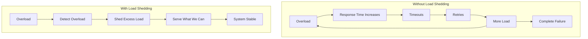

# How to Configure Load Shedding

Author: [nawazdhandala](https://www.github.com/nawazdhandala)

Tags: Load Shedding, Reliability, Performance, Resilience, Backend, Kubernetes, Rate Limiting

Description: Learn how to implement load shedding to protect your services from overload. This guide covers request prioritization, graceful degradation, and automatic load shedding strategies with practical examples.

---

> Load shedding is the practice of intentionally dropping requests when a system is overloaded to protect overall availability. Without load shedding, an overloaded system can cascade into complete failure. With load shedding, you serve what you can and gracefully reject the rest. This guide shows you how to implement effective load shedding.

The goal is not to handle every request, but to handle the requests you accept reliably.

---

## Why Load Shedding Matters



Without load shedding, an overloaded system enters a death spiral. Load shedding breaks this cycle.

---

## Request Queue Based Shedding

### Python Implementation

```python
# load_shedding.py
import asyncio
import time
from typing import Callable, Any, Optional
from dataclasses import dataclass
from enum import Enum
import logging

logger = logging.getLogger(__name__)

class Priority(Enum):
    CRITICAL = 1  # Health checks, payments
    HIGH = 2      # User-facing requests
    NORMAL = 3    # Regular API calls
    LOW = 4       # Background tasks, analytics

@dataclass
class LoadSheddingConfig:
    max_queue_size: int = 1000           # Max pending requests
    max_latency_ms: float = 500          # Target latency
    shed_threshold_percent: float = 0.9  # Shed when at 90% capacity
    min_priority_to_shed: Priority = Priority.LOW

class LoadShedder:
    """Load shedding based on queue depth and latency"""

    def __init__(self, config: LoadSheddingConfig):
        self.config = config
        self.queue_size = 0
        self.recent_latencies = []
        self.shed_count = 0
        self.total_count = 0
        self._lock = asyncio.Lock()

    async def should_shed(self, priority: Priority = Priority.NORMAL) -> bool:
        """Determine if request should be shed"""
        async with self._lock:
            self.total_count += 1

            # Never shed critical requests
            if priority == Priority.CRITICAL:
                return False

            # Check queue depth
            queue_ratio = self.queue_size / self.config.max_queue_size
            if queue_ratio > self.config.shed_threshold_percent:
                if priority.value >= self.config.min_priority_to_shed.value:
                    self.shed_count += 1
                    logger.warning(f"Shedding request (queue: {queue_ratio:.1%})")
                    return True

            # Check latency
            if self.recent_latencies:
                avg_latency = sum(self.recent_latencies) / len(self.recent_latencies)
                if avg_latency > self.config.max_latency_ms:
                    if priority.value >= Priority.NORMAL.value:
                        self.shed_count += 1
                        logger.warning(f"Shedding request (latency: {avg_latency:.0f}ms)")
                        return True

            return False

    async def track_request(self):
        """Track request entering the system"""
        async with self._lock:
            self.queue_size += 1

    async def complete_request(self, latency_ms: float):
        """Track request completion"""
        async with self._lock:
            self.queue_size = max(0, self.queue_size - 1)

            # Keep last 100 latencies
            self.recent_latencies.append(latency_ms)
            if len(self.recent_latencies) > 100:
                self.recent_latencies.pop(0)

    def get_stats(self) -> dict:
        return {
            'queue_size': self.queue_size,
            'shed_count': self.shed_count,
            'total_count': self.total_count,
            'shed_ratio': self.shed_count / max(1, self.total_count),
            'avg_latency': sum(self.recent_latencies) / max(1, len(self.recent_latencies))
        }


# FastAPI middleware
from fastapi import FastAPI, Request, HTTPException
from starlette.middleware.base import BaseHTTPMiddleware

app = FastAPI()
shedder = LoadShedder(LoadSheddingConfig(
    max_queue_size=500,
    max_latency_ms=200,
    shed_threshold_percent=0.8
))

class LoadSheddingMiddleware(BaseHTTPMiddleware):
    async def dispatch(self, request: Request, call_next):
        # Determine priority from path or header
        priority = self._get_priority(request)

        # Check if we should shed
        if await shedder.should_shed(priority):
            raise HTTPException(
                status_code=503,
                detail="Service temporarily overloaded",
                headers={"Retry-After": "5"}
            )

        # Track request
        await shedder.track_request()
        start = time.perf_counter()

        try:
            response = await call_next(request)
            return response
        finally:
            latency = (time.perf_counter() - start) * 1000
            await shedder.complete_request(latency)

    def _get_priority(self, request: Request) -> Priority:
        # Health checks are critical
        if request.url.path in ['/health', '/ready']:
            return Priority.CRITICAL

        # Payment endpoints are high priority
        if '/payment' in request.url.path:
            return Priority.HIGH

        # Check header
        priority_header = request.headers.get('X-Request-Priority', 'normal')
        return Priority[priority_header.upper()] if priority_header else Priority.NORMAL

app.add_middleware(LoadSheddingMiddleware)
```

---

## CPU-Based Load Shedding

```python
# cpu_shedding.py
import psutil
import asyncio
from typing import Optional
import time

class CPUBasedShedder:
    """Shed load based on CPU utilization"""

    def __init__(
        self,
        cpu_threshold: float = 0.8,      # Shed when CPU > 80%
        check_interval: float = 1.0,      # Check CPU every second
        smoothing_factor: float = 0.3     # EMA smoothing
    ):
        self.cpu_threshold = cpu_threshold
        self.check_interval = check_interval
        self.smoothing_factor = smoothing_factor
        self.current_cpu = 0.0
        self._running = False

    async def start(self):
        """Start background CPU monitoring"""
        self._running = True
        asyncio.create_task(self._monitor_loop())

    async def stop(self):
        """Stop monitoring"""
        self._running = False

    async def _monitor_loop(self):
        """Background loop to monitor CPU"""
        while self._running:
            # Get CPU usage (non-blocking)
            cpu = psutil.cpu_percent(interval=None) / 100.0

            # Exponential moving average for smoothing
            self.current_cpu = (
                self.smoothing_factor * cpu +
                (1 - self.smoothing_factor) * self.current_cpu
            )

            await asyncio.sleep(self.check_interval)

    def should_shed(self) -> bool:
        """Check if we should shed based on CPU"""
        return self.current_cpu > self.cpu_threshold

    def get_cpu_usage(self) -> float:
        return self.current_cpu


# Usage
cpu_shedder = CPUBasedShedder(cpu_threshold=0.85)

@app.on_event("startup")
async def startup():
    await cpu_shedder.start()

@app.middleware("http")
async def cpu_shed_middleware(request: Request, call_next):
    if cpu_shedder.should_shed():
        # Don't shed health checks
        if request.url.path not in ['/health', '/ready']:
            return JSONResponse(
                status_code=503,
                content={"error": "Server overloaded"},
                headers={"Retry-After": "10"}
            )

    return await call_next(request)
```

---

## Adaptive Load Shedding

```python
# adaptive_shedding.py
import time
import random
from dataclasses import dataclass
from typing import Deque
from collections import deque
import statistics

@dataclass
class AdaptiveConfig:
    target_latency_ms: float = 100       # Target p99 latency
    latency_window: int = 1000           # Samples to consider
    adjustment_interval: float = 1.0     # Seconds between adjustments
    min_accept_rate: float = 0.1         # Never drop below 10%
    max_accept_rate: float = 1.0         # Maximum accept rate

class AdaptiveLoadShedder:
    """
    Adaptive load shedding based on latency feedback.
    Automatically adjusts accept rate to maintain target latency.
    """

    def __init__(self, config: AdaptiveConfig):
        self.config = config
        self.accept_rate = 1.0  # Start accepting everything
        self.latencies: Deque[float] = deque(maxlen=config.latency_window)
        self.last_adjustment = time.time()

    def record_latency(self, latency_ms: float):
        """Record a request latency"""
        self.latencies.append(latency_ms)
        self._maybe_adjust()

    def _maybe_adjust(self):
        """Adjust accept rate based on recent latencies"""
        now = time.time()
        if now - self.last_adjustment < self.config.adjustment_interval:
            return

        if len(self.latencies) < 100:
            return  # Not enough data

        self.last_adjustment = now

        # Calculate p99 latency
        sorted_latencies = sorted(self.latencies)
        p99_index = int(len(sorted_latencies) * 0.99)
        p99_latency = sorted_latencies[p99_index]

        # Adjust accept rate
        if p99_latency > self.config.target_latency_ms * 1.1:
            # Latency too high - reduce accept rate
            self.accept_rate = max(
                self.config.min_accept_rate,
                self.accept_rate * 0.95
            )
        elif p99_latency < self.config.target_latency_ms * 0.9:
            # Latency low - increase accept rate
            self.accept_rate = min(
                self.config.max_accept_rate,
                self.accept_rate * 1.05
            )

    def should_accept(self) -> bool:
        """Probabilistically accept based on current rate"""
        return random.random() < self.accept_rate

    def get_stats(self) -> dict:
        if not self.latencies:
            return {'accept_rate': self.accept_rate, 'p99_latency': 0}

        sorted_latencies = sorted(self.latencies)
        return {
            'accept_rate': self.accept_rate,
            'p50_latency': sorted_latencies[len(sorted_latencies) // 2],
            'p99_latency': sorted_latencies[int(len(sorted_latencies) * 0.99)],
            'sample_count': len(self.latencies)
        }


# Usage
shedder = AdaptiveLoadShedder(AdaptiveConfig(target_latency_ms=100))

@app.middleware("http")
async def adaptive_middleware(request: Request, call_next):
    if not shedder.should_accept():
        return JSONResponse(
            status_code=503,
            content={"error": "Service busy"},
            headers={"Retry-After": "1"}
        )

    start = time.perf_counter()
    response = await call_next(request)
    latency = (time.perf_counter() - start) * 1000

    shedder.record_latency(latency)
    return response
```

---

## Kubernetes Pod-Level Shedding

### Using Readiness Probes

```yaml
# deployment.yaml
apiVersion: apps/v1
kind: Deployment
metadata:
  name: api-server
spec:
  replicas: 3
  template:
    spec:
      containers:
      - name: api
        image: api-server:latest
        ports:
        - containerPort: 8080
        # Readiness probe - marks pod as not ready when overloaded
        readinessProbe:
          httpGet:
            path: /health/ready
            port: 8080
          initialDelaySeconds: 5
          periodSeconds: 5
          failureThreshold: 2
          successThreshold: 1
        resources:
          requests:
            cpu: "500m"
            memory: "512Mi"
          limits:
            cpu: "1000m"
            memory: "1Gi"
```

```python
# health_endpoint.py
from fastapi import FastAPI
import psutil

app = FastAPI()

# Load shedding thresholds
CPU_THRESHOLD = 0.85
MEMORY_THRESHOLD = 0.90
QUEUE_THRESHOLD = 500

@app.get("/health/ready")
async def readiness():
    """
    Readiness endpoint - returns 503 when overloaded.
    Kubernetes will stop sending traffic to this pod.
    """
    # Check CPU
    cpu = psutil.cpu_percent(interval=0.1) / 100
    if cpu > CPU_THRESHOLD:
        return JSONResponse(
            status_code=503,
            content={"status": "overloaded", "reason": "cpu", "value": cpu}
        )

    # Check memory
    memory = psutil.virtual_memory().percent / 100
    if memory > MEMORY_THRESHOLD:
        return JSONResponse(
            status_code=503,
            content={"status": "overloaded", "reason": "memory", "value": memory}
        )

    # Check application queue
    if request_queue.size() > QUEUE_THRESHOLD:
        return JSONResponse(
            status_code=503,
            content={"status": "overloaded", "reason": "queue", "value": request_queue.size()}
        )

    return {"status": "ready"}

@app.get("/health/live")
async def liveness():
    """Liveness endpoint - only fails if app is broken"""
    return {"status": "alive"}
```

---

## Circuit Breaker with Load Shedding

```python
# circuit_breaker_shedding.py
import time
from enum import Enum
from dataclasses import dataclass
from typing import Callable, Any
import asyncio

class CircuitState(Enum):
    CLOSED = "closed"      # Normal operation
    OPEN = "open"          # Failing fast
    HALF_OPEN = "half_open"  # Testing recovery

@dataclass
class CircuitConfig:
    failure_threshold: int = 5       # Failures before opening
    success_threshold: int = 3       # Successes before closing
    timeout: float = 30.0            # Time before half-open
    half_open_max_requests: int = 3  # Requests to test in half-open

class CircuitBreaker:
    """Circuit breaker that sheds load when failing"""

    def __init__(self, name: str, config: CircuitConfig):
        self.name = name
        self.config = config
        self.state = CircuitState.CLOSED
        self.failure_count = 0
        self.success_count = 0
        self.last_failure_time = 0
        self.half_open_requests = 0

    def should_allow(self) -> bool:
        """Check if request should be allowed"""
        if self.state == CircuitState.CLOSED:
            return True

        if self.state == CircuitState.OPEN:
            # Check if timeout has passed
            if time.time() - self.last_failure_time > self.config.timeout:
                self.state = CircuitState.HALF_OPEN
                self.half_open_requests = 0
                return True
            return False

        if self.state == CircuitState.HALF_OPEN:
            # Allow limited requests in half-open
            if self.half_open_requests < self.config.half_open_max_requests:
                self.half_open_requests += 1
                return True
            return False

        return False

    def record_success(self):
        """Record a successful request"""
        if self.state == CircuitState.HALF_OPEN:
            self.success_count += 1
            if self.success_count >= self.config.success_threshold:
                self.state = CircuitState.CLOSED
                self.failure_count = 0
                self.success_count = 0
        elif self.state == CircuitState.CLOSED:
            self.failure_count = 0

    def record_failure(self):
        """Record a failed request"""
        self.failure_count += 1
        self.last_failure_time = time.time()

        if self.state == CircuitState.HALF_OPEN:
            self.state = CircuitState.OPEN
            self.success_count = 0

        elif self.state == CircuitState.CLOSED:
            if self.failure_count >= self.config.failure_threshold:
                self.state = CircuitState.OPEN

    async def execute(self, func: Callable, *args, **kwargs) -> Any:
        """Execute function with circuit breaker protection"""
        if not self.should_allow():
            raise CircuitOpenError(f"Circuit {self.name} is open")

        try:
            result = await func(*args, **kwargs)
            self.record_success()
            return result
        except Exception as e:
            self.record_failure()
            raise

class CircuitOpenError(Exception):
    pass


# Usage
db_circuit = CircuitBreaker("database", CircuitConfig(
    failure_threshold=5,
    timeout=30.0
))

async def query_database(query: str):
    return await db_circuit.execute(db.execute, query)
```

---

## Monitoring Load Shedding

```python
# shedding_metrics.py
from prometheus_client import Counter, Gauge, Histogram

# Metrics
requests_total = Counter(
    'requests_total',
    'Total requests',
    ['status']  # accepted, shed
)

shed_reason = Counter(
    'requests_shed_total',
    'Shed requests by reason',
    ['reason']  # queue, cpu, latency, circuit
)

accept_rate = Gauge(
    'load_shedding_accept_rate',
    'Current accept rate'
)

queue_depth = Gauge(
    'request_queue_depth',
    'Current request queue depth'
)

latency_histogram = Histogram(
    'request_latency_seconds',
    'Request latency',
    buckets=[0.01, 0.05, 0.1, 0.25, 0.5, 1, 2.5, 5, 10]
)

# Update metrics in middleware
@app.middleware("http")
async def metrics_middleware(request: Request, call_next):
    if shedder.should_shed():
        requests_total.labels(status='shed').inc()
        shed_reason.labels(reason=shedder.shed_reason).inc()
        raise HTTPException(status_code=503)

    requests_total.labels(status='accepted').inc()
    queue_depth.set(shedder.queue_size)
    accept_rate.set(shedder.accept_rate)

    start = time.perf_counter()
    response = await call_next(request)
    duration = time.perf_counter() - start

    latency_histogram.observe(duration)
    return response
```

---

## Best Practices Summary

| Strategy | Best For | Key Metric |
|----------|----------|------------|
| Queue-based | General API | Queue depth |
| CPU-based | Compute-heavy | CPU utilization |
| Latency-based | User-facing | p99 latency |
| Adaptive | Variable load | Accept rate |
| Circuit breaker | Downstream failures | Error rate |

---

## Conclusion

Load shedding is essential for building resilient systems:

1. **Shed early**: Better to reject fast than serve slow
2. **Prioritize**: Protect critical paths, shed low-priority first
3. **Communicate**: Return proper 503 with Retry-After header
4. **Monitor**: Track shed rate, reasons, and impact
5. **Test**: Verify shedding behavior under load

The goal is graceful degradation: serve what you can reliably, reject the rest quickly.

---

*Need to monitor your service reliability? [OneUptime](https://oneuptime.com) provides load monitoring with alerting for high rejection rates, latency spikes, and capacity issues.*
