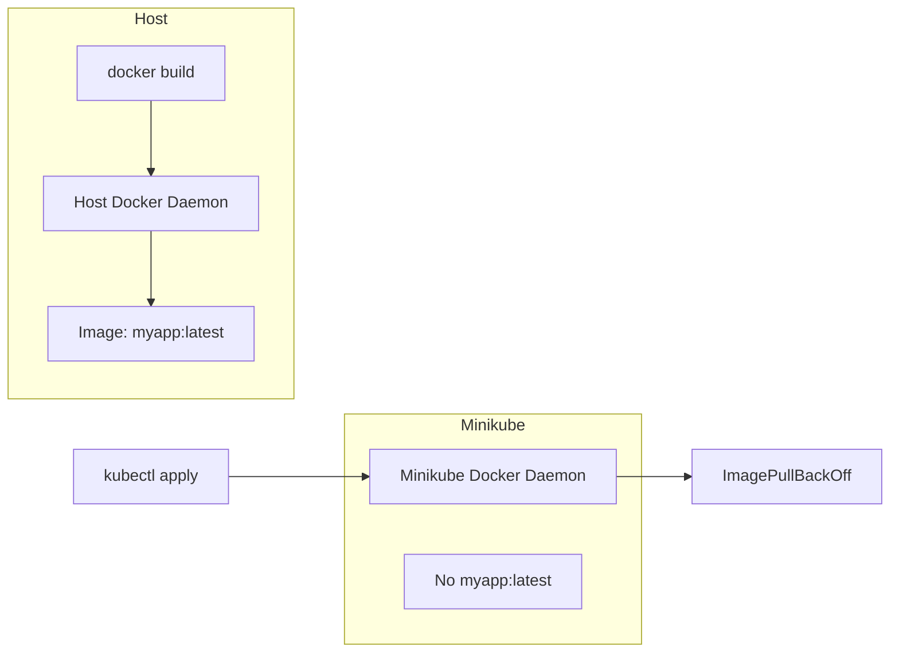

# How to Use Local Docker Images with Minikube Without a Registry

Author: [nawazdhandala](https://www.github.com/nawazdhandala)

Tags: Kubernetes, Minikube, Docker, Development, Containers

Description: Learn how to use locally built Docker images in Minikube without pushing to a registry. This guide covers multiple approaches including docker-env, image loading, and caching strategies.

---

When developing with Minikube, you want to test local Docker images without pushing them to a remote registry. The problem is that Minikube runs its own Docker daemon, separate from your host. Images built on your host are invisible to Minikube. Here are several ways to solve this.

## Understanding the Problem

Minikube runs inside a VM or container with its own isolated Docker daemon. When you run `docker build` on your host, the image exists in your host's Docker, not Minikube's:



## Method 1: Use Minikube's Docker Daemon (Recommended)

The cleanest approach is building images directly inside Minikube's Docker daemon. Point your shell to use Minikube's Docker:

```bash
# Configure your shell to use Minikube's Docker daemon
eval $(minikube docker-env)

# Verify you are using Minikube's Docker
docker info | grep Name
# Output should show minikube, not your host

# Now build your image - it goes directly into Minikube
docker build -t myapp:latest .

# List images to confirm
docker images | grep myapp
```

Your image now exists inside Minikube. Create a deployment that uses it:

```yaml
# deployment.yaml
apiVersion: apps/v1
kind: Deployment
metadata:
  name: myapp
spec:
  replicas: 1
  selector:
    matchLabels:
      app: myapp
  template:
    metadata:
      labels:
        app: myapp
    spec:
      containers:
      - name: myapp
        image: myapp:latest
        # Critical: prevent Kubernetes from trying to pull from registry
        imagePullPolicy: Never
```

Apply it:

```bash
kubectl apply -f deployment.yaml

# Check that the pod is running
kubectl get pods
```

To switch back to your host's Docker daemon:

```bash
# Reset to host Docker
eval $(minikube docker-env -u)
```

## Method 2: Load Image into Minikube

If you already built the image on your host, load it into Minikube:

```bash
# Build on host (regular Docker)
docker build -t myapp:latest .

# Load the image into Minikube
minikube image load myapp:latest

# Verify it is available in Minikube
minikube image ls | grep myapp
```

This copies the image from your host Docker to Minikube's Docker. It takes time for large images since the entire image transfers.

## Method 3: Build Inside Minikube

Minikube can build images directly without switching Docker contexts:

```bash
# Build image inside Minikube using your local Dockerfile
minikube image build -t myapp:latest .

# The image is now available in Minikube
minikube image ls | grep myapp
```

This runs the build inside Minikube, so it has access to the resulting image immediately.

## Method 4: Use Minikube's Registry Addon

For a workflow closer to production, use Minikube's built-in registry:

```bash
# Enable the registry addon
minikube addons enable registry

# Get the registry's cluster IP
kubectl get svc -n kube-system registry

# On Linux, access via localhost:5000 (port-forwarded automatically)
# On macOS/Windows, set up port forwarding
kubectl port-forward --namespace kube-system svc/registry 5000:80 &
```

Push images to the local registry:

```bash
# Tag your image for the local registry
docker tag myapp:latest localhost:5000/myapp:latest

# Push to Minikube's registry
docker push localhost:5000/myapp:latest
```

Use the registry image in your deployment:

```yaml
spec:
  containers:
  - name: myapp
    image: localhost:5000/myapp:latest
    # Can use IfNotPresent or Always since it pulls from local registry
    imagePullPolicy: IfNotPresent
```

## Setting imagePullPolicy Correctly

The `imagePullPolicy` setting determines whether Kubernetes tries to pull the image:

| Policy | Behavior |
|--------|----------|
| `Never` | Never pull, use local image only. Fails if image missing. |
| `IfNotPresent` | Pull only if image not in local cache. |
| `Always` | Always pull from registry. Default for `:latest` tag. |

For local development with methods 1-3, always use `imagePullPolicy: Never`:

```yaml
# Prevent Kubernetes from trying to pull your local image
spec:
  containers:
  - name: myapp
    image: myapp:v1.0.0  # Use a specific tag, not :latest
    imagePullPolicy: Never
```

## Workflow Script for Development

Here is a script that automates the build and deploy cycle:

```bash
#!/bin/bash
# dev-deploy.sh - Build and deploy to Minikube

APP_NAME=${1:-myapp}
TAG=${2:-latest}

echo "Switching to Minikube Docker daemon..."
eval $(minikube docker-env)

echo "Building $APP_NAME:$TAG..."
docker build -t $APP_NAME:$TAG .

echo "Restarting deployment to pick up new image..."
kubectl rollout restart deployment/$APP_NAME

echo "Waiting for rollout..."
kubectl rollout status deployment/$APP_NAME

echo "Done. Pod status:"
kubectl get pods -l app=$APP_NAME
```

Usage:

```bash
chmod +x dev-deploy.sh
./dev-deploy.sh myapp v1.0.0
```

## Handling Multi-Stage Builds

Multi-stage builds work the same way. Just build with Minikube's Docker:

```dockerfile
# Dockerfile with multi-stage build
FROM node:20-alpine AS builder
WORKDIR /app
COPY package*.json ./
RUN npm ci
COPY . .
RUN npm run build

FROM node:20-alpine
WORKDIR /app
COPY --from=builder /app/dist ./dist
COPY --from=builder /app/node_modules ./node_modules
CMD ["node", "dist/index.js"]
```

```bash
eval $(minikube docker-env)
docker build -t myapp:latest .
```

## Troubleshooting

### Image Not Found After Build

Verify you built with Minikube's Docker:

```bash
# Check which Docker you are using
docker info 2>/dev/null | grep -i name

# Should show minikube, not Docker Desktop or similar
```

### ImagePullBackOff Despite Local Image

Check the imagePullPolicy:

```bash
kubectl get deployment myapp -o jsonpath='{.spec.template.spec.containers[0].imagePullPolicy}'
# Should output: Never
```

If it shows `Always`, update your deployment:

```bash
kubectl patch deployment myapp -p '{"spec":{"template":{"spec":{"containers":[{"name":"myapp","imagePullPolicy":"Never"}]}}}}'
```

### Old Image Still Running

Force a new rollout:

```bash
# Restart deployment to pull the new image
kubectl rollout restart deployment/myapp

# Or delete the pod to force recreation
kubectl delete pod -l app=myapp
```

### Clean Up Minikube Images

Remove unused images to free space:

```bash
# List images in Minikube
minikube image ls

# Remove a specific image
minikube image rm myapp:old-tag

# Prune unused images
eval $(minikube docker-env)
docker image prune -a
```

## Summary

The fastest way to use local images with Minikube is to build directly in Minikube's Docker daemon using `eval $(minikube docker-env)`. Set `imagePullPolicy: Never` in your deployments to prevent Kubernetes from trying to pull from a registry. For existing images, use `minikube image load` to copy them into Minikube. Whichever method you choose, remember that Minikube has its own Docker daemon, and images need to exist there for pods to use them.
