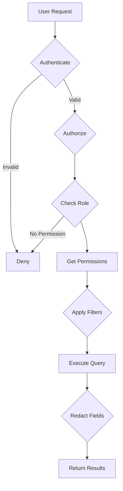

# How to Configure Log Access Control

Author: [nawazdhandala](https://www.github.com/nawazdhandala)

Tags: Log Access Control, RBAC, Security, Compliance, Authorization, Multi-tenancy, Data Protection

Description: Learn how to configure log access control to protect sensitive data and meet compliance requirements. This guide covers role-based access control, field-level security, multi-tenant isolation, and audit logging for access.

---

> Logs contain sensitive information about your systems, users, and business. Without proper access control, anyone who can query logs can potentially see customer data, security events, and internal operations they should not have access to.

Access control for logs is not just about security. It is about compliance, privacy, and operational separation. Different teams need access to different logs, and some logs should be restricted to specific roles.

---

## Access Control Requirements

Different stakeholders need different access levels:

| Role | Access Level | Typical Use Case |
|------|-------------|------------------|
| Developers | Own services, debug logs | Debugging their applications |
| SRE/DevOps | All infrastructure logs | Incident response |
| Security | Security and audit logs | Threat investigation |
| Compliance | Audit logs, access logs | Compliance verification |
| Support | Customer-related logs | Customer issue resolution |
| Executives | Aggregated metrics only | Business dashboards |



---

## Role-Based Access Control Implementation

Build a comprehensive RBAC system for logs:

```typescript
// access-control/rbac.ts
// Role-based access control for log queries

interface Role {
  name: string;
  description: string;
  permissions: Permission[];
}

interface Permission {
  // What actions are allowed
  actions: ('read' | 'search' | 'export' | 'delete')[];

  // Which log sources
  sources: string[];  // e.g., ['app.*', 'system.auth']

  // Time range restrictions
  maxTimeRange?: {
    value: number;
    unit: 'hours' | 'days' | 'weeks';
  };

  // Field-level access
  allowedFields?: string[];
  deniedFields?: string[];

  // Row-level filters (always applied)
  filters?: {
    field: string;
    operator: 'eq' | 'in' | 'contains';
    value: unknown;
  }[];
}

class LogAccessController {
  private roles: Map<string, Role> = new Map();
  private userRoles: Map<string, string[]> = new Map();

  // Define roles
  defineRole(role: Role): void {
    this.roles.set(role.name, role);
  }

  // Assign roles to users
  assignRole(userId: string, roleName: string): void {
    const roles = this.userRoles.get(userId) || [];
    if (!roles.includes(roleName)) {
      roles.push(roleName);
      this.userRoles.set(userId, roles);
    }
  }

  // Check if user can perform action on source
  canAccess(userId: string, action: string, source: string): boolean {
    const roles = this.userRoles.get(userId) || [];

    for (const roleName of roles) {
      const role = this.roles.get(roleName);
      if (!role) continue;

      for (const permission of role.permissions) {
        if (permission.actions.includes(action as any)) {
          if (this.matchesSource(source, permission.sources)) {
            return true;
          }
        }
      }
    }

    return false;
  }

  // Get effective permissions for a user
  getEffectivePermissions(userId: string): EffectivePermissions {
    const roles = this.userRoles.get(userId) || [];
    const permissions: Permission[] = [];

    for (const roleName of roles) {
      const role = this.roles.get(roleName);
      if (role) {
        permissions.push(...role.permissions);
      }
    }

    return this.mergePermissions(permissions);
  }

  // Apply access control to a query
  applyAccessControl(userId: string, query: LogQuery): LogQuery | null {
    const permissions = this.getEffectivePermissions(userId);

    // Check if user can access the requested sources
    for (const source of this.extractSources(query)) {
      if (!permissions.allowedSources.some(s => this.matchesSource(source, [s]))) {
        return null;  // Access denied
      }
    }

    // Clone query and apply restrictions
    const restrictedQuery = { ...query };

    // Apply time range restriction
    if (permissions.maxTimeRange) {
      const maxMs = this.timeRangeToMs(permissions.maxTimeRange);
      const requestedMs = query.timeRange.end.getTime() - query.timeRange.start.getTime();

      if (requestedMs > maxMs) {
        restrictedQuery.timeRange = {
          start: new Date(query.timeRange.end.getTime() - maxMs),
          end: query.timeRange.end
        };
      }
    }

    // Apply mandatory filters
    restrictedQuery.filters = [
      ...(query.filters || []),
      ...permissions.mandatoryFilters
    ];

    // Apply field restrictions
    restrictedQuery._fieldRestrictions = {
      allowed: permissions.allowedFields,
      denied: permissions.deniedFields
    };

    return restrictedQuery;
  }

  private matchesSource(source: string, patterns: string[]): boolean {
    for (const pattern of patterns) {
      if (pattern === '*') return true;

      const regex = new RegExp(
        '^' + pattern.replace(/\./g, '\\.').replace(/\*/g, '.*') + '$'
      );

      if (regex.test(source)) return true;
    }
    return false;
  }

  private mergePermissions(permissions: Permission[]): EffectivePermissions {
    const allowedSources = new Set<string>();
    const allowedFields = new Set<string>();
    const deniedFields = new Set<string>();
    const mandatoryFilters: Permission['filters'] = [];
    let maxTimeRange: Permission['maxTimeRange'] | undefined;

    for (const p of permissions) {
      p.sources.forEach(s => allowedSources.add(s));
      p.allowedFields?.forEach(f => allowedFields.add(f));
      p.deniedFields?.forEach(f => deniedFields.add(f));

      if (p.filters) {
        mandatoryFilters.push(...p.filters);
      }

      if (p.maxTimeRange) {
        const ms = this.timeRangeToMs(p.maxTimeRange);
        const currentMax = maxTimeRange ? this.timeRangeToMs(maxTimeRange) : 0;
        if (ms > currentMax) {
          maxTimeRange = p.maxTimeRange;
        }
      }
    }

    return {
      allowedSources: [...allowedSources],
      allowedFields: allowedFields.size > 0 ? [...allowedFields] : undefined,
      deniedFields: [...deniedFields],
      mandatoryFilters,
      maxTimeRange
    };
  }

  private timeRangeToMs(range: { value: number; unit: string }): number {
    const multipliers: Record<string, number> = {
      hours: 60 * 60 * 1000,
      days: 24 * 60 * 60 * 1000,
      weeks: 7 * 24 * 60 * 60 * 1000
    };
    return range.value * (multipliers[range.unit] || 0);
  }

  private extractSources(query: LogQuery): string[] {
    // Extract sources from query filters
    const sourceFilter = query.filters?.find(f => f.field === 'source' || f.field === 'service');
    if (sourceFilter) {
      return Array.isArray(sourceFilter.value) ? sourceFilter.value : [sourceFilter.value];
    }
    return ['*'];
  }
}
```

---

## Defining Standard Roles

Create roles for common use cases:

```typescript
// access-control/roles.ts
// Standard role definitions

const accessController = new LogAccessController();

// Developer role - access to their team's application logs
accessController.defineRole({
  name: 'developer',
  description: 'Application developers - access to their team logs',
  permissions: [
    {
      actions: ['read', 'search'],
      sources: ['app.*'],
      maxTimeRange: { value: 7, unit: 'days' },
      deniedFields: ['user.email', 'user.ip', 'payment.*'],
      filters: [
        { field: 'team', operator: 'eq', value: '${user.team}' }
      ]
    }
  ]
});

// SRE role - broad access for incident response
accessController.defineRole({
  name: 'sre',
  description: 'Site Reliability Engineers - broad access for operations',
  permissions: [
    {
      actions: ['read', 'search', 'export'],
      sources: ['app.*', 'system.*', 'infrastructure.*'],
      maxTimeRange: { value: 30, unit: 'days' },
      deniedFields: ['user.ssn', 'payment.card_number']
    }
  ]
});

// Security role - access to security-relevant logs
accessController.defineRole({
  name: 'security',
  description: 'Security team - access to security and audit logs',
  permissions: [
    {
      actions: ['read', 'search', 'export'],
      sources: ['security.*', 'audit.*', 'auth.*'],
      maxTimeRange: { value: 90, unit: 'days' }
    },
    {
      actions: ['read'],
      sources: ['app.*'],
      maxTimeRange: { value: 30, unit: 'days' },
      filters: [
        { field: 'level', operator: 'in', value: ['error', 'warn'] }
      ]
    }
  ]
});

// Compliance role - audit access
accessController.defineRole({
  name: 'compliance',
  description: 'Compliance team - audit log access',
  permissions: [
    {
      actions: ['read', 'search', 'export'],
      sources: ['audit.*'],
      maxTimeRange: { value: 365, unit: 'days' }
    }
  ]
});

// Support role - customer-related logs only
accessController.defineRole({
  name: 'support',
  description: 'Customer support - access to customer-related logs',
  permissions: [
    {
      actions: ['read', 'search'],
      sources: ['app.customer.*', 'app.orders.*'],
      maxTimeRange: { value: 30, unit: 'days' },
      deniedFields: ['user.password', 'payment.*', 'internal.*'],
      filters: [
        { field: 'customer_id', operator: 'eq', value: '${request.customer_id}' }
      ]
    }
  ]
});

// Read-only dashboard role
accessController.defineRole({
  name: 'dashboard_viewer',
  description: 'Dashboard viewers - aggregated metrics only',
  permissions: [
    {
      actions: ['read'],
      sources: ['metrics.*'],
      allowedFields: ['timestamp', 'metric_name', 'value', 'tags']
    }
  ]
});

// Admin role - full access
accessController.defineRole({
  name: 'admin',
  description: 'Administrators - full access',
  permissions: [
    {
      actions: ['read', 'search', 'export', 'delete'],
      sources: ['*']
    }
  ]
});
```

---

## Field-Level Security

Implement field masking and filtering:

```typescript
// access-control/field-security.ts
// Field-level security implementation

interface FieldSecurityConfig {
  // Fields to completely remove
  hiddenFields: string[];

  // Fields to mask (show partial value)
  maskedFields: {
    field: string;
    maskFn: (value: unknown) => unknown;
  }[];

  // Fields to encrypt (for authorized decryption)
  encryptedFields: string[];
}

class FieldSecurityProcessor {
  private config: FieldSecurityConfig;

  constructor(config: FieldSecurityConfig) {
    this.config = config;
  }

  process(log: LogEntry, userPermissions: EffectivePermissions): LogEntry {
    const processed = { ...log };

    // Remove hidden fields
    for (const field of this.config.hiddenFields) {
      this.deleteField(processed, field);
    }

    // Remove denied fields based on user permissions
    for (const field of userPermissions.deniedFields) {
      this.deleteField(processed, field);
    }

    // Apply field masking
    for (const { field, maskFn } of this.config.maskedFields) {
      const value = this.getField(processed, field);
      if (value !== undefined) {
        this.setField(processed, field, maskFn(value));
      }
    }

    // Filter to allowed fields if specified
    if (userPermissions.allowedFields) {
      return this.filterToAllowedFields(processed, userPermissions.allowedFields);
    }

    return processed;
  }

  private deleteField(obj: Record<string, unknown>, path: string): void {
    const parts = path.split('.');
    let current: any = obj;

    for (let i = 0; i < parts.length - 1; i++) {
      if (current[parts[i]] === undefined) return;
      current = current[parts[i]];
    }

    delete current[parts[parts.length - 1]];
  }

  private getField(obj: Record<string, unknown>, path: string): unknown {
    return path.split('.').reduce((o, k) => o?.[k], obj as any);
  }

  private setField(obj: Record<string, unknown>, path: string, value: unknown): void {
    const parts = path.split('.');
    let current: any = obj;

    for (let i = 0; i < parts.length - 1; i++) {
      if (current[parts[i]] === undefined) {
        current[parts[i]] = {};
      }
      current = current[parts[i]];
    }

    current[parts[parts.length - 1]] = value;
  }

  private filterToAllowedFields(obj: Record<string, unknown>, allowed: string[]): Record<string, unknown> {
    const result: Record<string, unknown> = {};

    for (const field of allowed) {
      const value = this.getField(obj, field);
      if (value !== undefined) {
        this.setField(result, field, value);
      }
    }

    return result;
  }
}

// Standard masking functions
const maskingFunctions = {
  // Mask email: john@example.com -> j***@example.com
  email: (value: unknown): string => {
    if (typeof value !== 'string') return '[REDACTED]';
    const [local, domain] = value.split('@');
    if (!domain) return '[REDACTED]';
    return `${local[0]}***@${domain}`;
  },

  // Mask credit card: 4111111111111111 -> ****1111
  creditCard: (value: unknown): string => {
    if (typeof value !== 'string') return '[REDACTED]';
    const digits = value.replace(/\D/g, '');
    return `****${digits.slice(-4)}`;
  },

  // Mask IP: 192.168.1.100 -> 192.168.*.*
  ip: (value: unknown): string => {
    if (typeof value !== 'string') return '[REDACTED]';
    const parts = value.split('.');
    if (parts.length !== 4) return '[REDACTED]';
    return `${parts[0]}.${parts[1]}.*.*`;
  },

  // Mask phone: 555-123-4567 -> ***-***-4567
  phone: (value: unknown): string => {
    if (typeof value !== 'string') return '[REDACTED]';
    const digits = value.replace(/\D/g, '');
    return `***-***-${digits.slice(-4)}`;
  },

  // Partial mask: show first and last characters
  partial: (value: unknown): string => {
    if (typeof value !== 'string') return '[REDACTED]';
    if (value.length <= 4) return '****';
    return `${value[0]}${'*'.repeat(value.length - 2)}${value[value.length - 1]}`;
  }
};

// Configuration example
const fieldSecurity = new FieldSecurityProcessor({
  hiddenFields: [
    'user.password',
    'user.ssn',
    'payment.cvv',
    'auth.token',
    'internal.secret'
  ],
  maskedFields: [
    { field: 'user.email', maskFn: maskingFunctions.email },
    { field: 'user.phone', maskFn: maskingFunctions.phone },
    { field: 'user.ip', maskFn: maskingFunctions.ip },
    { field: 'payment.card_number', maskFn: maskingFunctions.creditCard }
  ],
  encryptedFields: []
});
```

---

## Multi-Tenant Isolation

Isolate logs between tenants:

```typescript
// access-control/multi-tenant.ts
// Multi-tenant log isolation

interface TenantConfig {
  tenantId: string;
  allowedSources: string[];
  customFields?: Record<string, unknown>;
}

class MultiTenantAccessController {
  private tenants: Map<string, TenantConfig> = new Map();
  private userTenants: Map<string, string[]> = new Map();

  registerTenant(config: TenantConfig): void {
    this.tenants.set(config.tenantId, config);
  }

  assignUserToTenant(userId: string, tenantId: string): void {
    const tenants = this.userTenants.get(userId) || [];
    if (!tenants.includes(tenantId)) {
      tenants.push(tenantId);
      this.userTenants.set(userId, tenants);
    }
  }

  // Apply tenant isolation to query
  applyTenantIsolation(userId: string, query: LogQuery): LogQuery | null {
    const userTenantIds = this.userTenants.get(userId);

    if (!userTenantIds || userTenantIds.length === 0) {
      return null;  // No tenant access
    }

    // Clone and add tenant filter
    const isolatedQuery = { ...query };
    isolatedQuery.filters = [
      ...(query.filters || []),
      { field: 'tenant_id', operator: 'in', value: userTenantIds }
    ];

    return isolatedQuery;
  }

  // Validate log belongs to user's tenants
  canAccessLog(userId: string, log: LogEntry): boolean {
    const userTenantIds = this.userTenants.get(userId) || [];
    return userTenantIds.includes(log.tenant_id);
  }
}

// Middleware for Express
function tenantIsolationMiddleware(controller: MultiTenantAccessController) {
  return (req: Request, res: Response, next: NextFunction) => {
    const userId = req.user?.id;
    const requestedTenantId = req.headers['x-tenant-id'] as string;

    if (!userId) {
      return res.status(401).json({ error: 'Authentication required' });
    }

    const userTenants = controller.getUserTenants(userId);

    if (requestedTenantId && !userTenants.includes(requestedTenantId)) {
      return res.status(403).json({ error: 'Access to tenant denied' });
    }

    // Add tenant context to request
    req.tenantContext = {
      allowedTenants: userTenants,
      currentTenant: requestedTenantId || userTenants[0]
    };

    next();
  };
}
```

---

## Audit Logging for Access

Track all log access:

```typescript
// access-control/access-audit.ts
// Audit trail for log access

interface LogAccessEvent {
  timestamp: string;
  user: {
    id: string;
    email: string;
    roles: string[];
    tenant?: string;
  };
  action: 'search' | 'read' | 'export' | 'delete';
  query: {
    timeRange: { start: string; end: string };
    filters: unknown[];
    sources: string[];
  };
  result: {
    success: boolean;
    recordCount?: number;
    denied?: boolean;
    deniedReason?: string;
  };
  metadata: {
    ip: string;
    userAgent: string;
    requestId: string;
    duration_ms: number;
  };
}

class LogAccessAuditor {
  private storage: AuditStorage;

  constructor(storage: AuditStorage) {
    this.storage = storage;
  }

  async recordAccess(event: LogAccessEvent): Promise<void> {
    await this.storage.write({
      ...event,
      _type: 'log_access_audit'
    });
  }

  // Wrap query execution with auditing
  async auditedQuery<T>(
    user: User,
    query: LogQuery,
    executor: () => Promise<QueryResult<T>>
  ): Promise<QueryResult<T>> {
    const startTime = Date.now();
    const requestId = generateRequestId();

    let result: QueryResult<T>;
    let success = false;
    let recordCount = 0;

    try {
      result = await executor();
      success = true;
      recordCount = result.logs?.length || 0;
      return result;
    } catch (error) {
      throw error;
    } finally {
      await this.recordAccess({
        timestamp: new Date().toISOString(),
        user: {
          id: user.id,
          email: user.email,
          roles: user.roles,
          tenant: user.currentTenant
        },
        action: 'search',
        query: {
          timeRange: {
            start: query.timeRange.start.toISOString(),
            end: query.timeRange.end.toISOString()
          },
          filters: query.filters || [],
          sources: this.extractSources(query)
        },
        result: {
          success,
          recordCount
        },
        metadata: {
          ip: user.ip,
          userAgent: user.userAgent,
          requestId,
          duration_ms: Date.now() - startTime
        }
      });
    }
  }

  // Query access audit logs
  async getAccessHistory(filters: {
    userId?: string;
    timeRange?: { start: Date; end: Date };
    action?: string;
  }): Promise<LogAccessEvent[]> {
    return this.storage.query({
      _type: 'log_access_audit',
      ...filters
    });
  }
}
```

---

## Summary

Effective log access control requires multiple layers:

1. **Authentication**: Verify user identity
2. **Role-based authorization**: Define what each role can access
3. **Field-level security**: Mask or hide sensitive fields
4. **Tenant isolation**: Separate data between tenants
5. **Audit logging**: Track all access for compliance

Remember that access control is not just about prevention. It is about enabling the right people to do their jobs while protecting sensitive data. Design your access control to be both secure and usable.

---

*Need enterprise-grade access control for your logs? [OneUptime](https://oneuptime.com) provides built-in RBAC, field-level security, multi-tenant isolation, and complete audit trails for all log access, with no configuration required.*
