# How to Implement Log Aggregation Patterns

Author: [nawazdhandala](https://www.github.com/nawazdhandala)

Tags: Log Aggregation, Architecture, Distributed Systems, Kafka, Microservices, Data Pipeline, Log Management

Description: Learn how to implement log aggregation patterns for distributed systems. This guide covers aggregation architectures, buffering strategies, fanout patterns, and techniques for building reliable log pipelines at scale.

---

> Log aggregation patterns determine how logs flow from applications to storage and analysis systems. The right pattern depends on your scale, reliability requirements, and operational complexity tolerance.

As systems grow from a single server to hundreds of microservices, log aggregation evolves from "write to a file" to complex data pipelines. Understanding these patterns helps you choose the right approach for your scale.

---

## Common Aggregation Patterns

Different architectures suit different needs:

```mermaid
flowchart TD
    subgraph Direct Pattern
        A1[App] -->|HTTP/gRPC| B1[Central Store]
    end

    subgraph Agent Pattern
        A2[App] -->|stdout| B2[Agent]
        B2 -->|Forward| C2[Central Store]
    end

    subgraph Aggregator Pattern
        A3[App] --> B3[Local Agent]
        B3 --> C3[Aggregator]
        C3 --> D3[Central Store]
    end

    subgraph Message Queue Pattern
        A4[App] --> B4[Agent]
        B4 --> C4[Message Queue]
        C4 --> D4[Consumer]
        D4 --> E4[Central Store]
    end
```



---

## Pattern 1: Direct Shipping

Applications send logs directly to the central store:

```typescript
// patterns/direct-shipping.ts
// Direct log shipping to central store

interface DirectShipperConfig {
  endpoint: string;
  apiKey: string;
  batchSize: number;
  flushIntervalMs: number;
  maxRetries: number;
}

class DirectLogShipper {
  private config: DirectShipperConfig;
  private buffer: LogEntry[] = [];
  private flushTimer: NodeJS.Timer | null = null;

  constructor(config: DirectShipperConfig) {
    this.config = config;
    this.startFlushTimer();
  }

  // Add log to buffer
  log(entry: LogEntry): void {
    this.buffer.push(entry);

    // Flush if buffer is full
    if (this.buffer.length >= this.config.batchSize) {
      this.flush();
    }
  }

  private startFlushTimer(): void {
    this.flushTimer = setInterval(() => {
      if (this.buffer.length > 0) {
        this.flush();
      }
    }, this.config.flushIntervalMs);
  }

  private async flush(): Promise<void> {
    if (this.buffer.length === 0) return;

    const batch = this.buffer.splice(0, this.config.batchSize);
    let retries = 0;

    while (retries < this.config.maxRetries) {
      try {
        await this.sendBatch(batch);
        return;
      } catch (error) {
        retries++;
        if (retries >= this.config.maxRetries) {
          // Log to stderr as fallback
          console.error('Failed to ship logs after retries:', batch.length);
          // Optionally write to local file as backup
          await this.writeToFallback(batch);
        } else {
          // Exponential backoff
          await this.sleep(Math.pow(2, retries) * 100);
        }
      }
    }
  }

  private async sendBatch(batch: LogEntry[]): Promise<void> {
    const response = await fetch(this.config.endpoint, {
      method: 'POST',
      headers: {
        'Content-Type': 'application/json',
        'Authorization': `Bearer ${this.config.apiKey}`
      },
      body: JSON.stringify({ logs: batch })
    });

    if (!response.ok) {
      throw new Error(`HTTP ${response.status}: ${response.statusText}`);
    }
  }

  private async writeToFallback(batch: LogEntry[]): Promise<void> {
    const fallbackPath = '/var/log/app-fallback.log';
    const lines = batch.map(entry => JSON.stringify(entry)).join('\n') + '\n';
    await fs.promises.appendFile(fallbackPath, lines);
  }

  private sleep(ms: number): Promise<void> {
    return new Promise(resolve => setTimeout(resolve, ms));
  }

  async shutdown(): Promise<void> {
    if (this.flushTimer) {
      clearInterval(this.flushTimer);
    }
    await this.flush();
  }
}

// Usage
const shipper = new DirectLogShipper({
  endpoint: 'https://logs.example.com/v1/logs',
  apiKey: process.env.LOG_API_KEY,
  batchSize: 100,
  flushIntervalMs: 5000,
  maxRetries: 3
});

// Integrate with logging library
logger.on('log', (entry) => shipper.log(entry));
```

**Pros**: Simple, no additional infrastructure
**Cons**: Tight coupling, no buffering during outages, application impact on failures

---

## Pattern 2: Sidecar Agent

Deploy an agent alongside each application:

```yaml
# patterns/sidecar-deployment.yaml
# Kubernetes deployment with logging sidecar

apiVersion: apps/v1
kind: Deployment
metadata:
  name: my-app
spec:
  replicas: 3
  template:
    spec:
      containers:
        # Main application container
        - name: app
          image: my-app:latest
          volumeMounts:
            # Shared volume for logs
            - name: logs
              mountPath: /var/log/app

        # Logging sidecar
        - name: log-shipper
          image: fluent/fluent-bit:latest
          volumeMounts:
            - name: logs
              mountPath: /var/log/app
              readOnly: true
            - name: fluent-bit-config
              mountPath: /fluent-bit/etc/
          resources:
            limits:
              memory: 64Mi
              cpu: 100m

      volumes:
        - name: logs
          emptyDir: {}
        - name: fluent-bit-config
          configMap:
            name: fluent-bit-config
```

FluentBit sidecar configuration:

```ini
# fluent-bit-config.conf
[SERVICE]
    Flush         5
    Daemon        Off
    Log_Level     info

[INPUT]
    Name          tail
    Path          /var/log/app/*.log
    Parser        json
    Tag           app.*
    Refresh_Interval 5
    Mem_Buf_Limit 5MB

[OUTPUT]
    Name          forward
    Match         *
    Host          fluentd-aggregator.logging.svc
    Port          24224
    Retry_Limit   5
```

**Pros**: Application isolation, consistent collection, crash resilience
**Cons**: Resource overhead per pod, configuration management

---

## Pattern 3: Node-Level Aggregator

Deploy agents at the node level with a central aggregator:

```typescript
// patterns/aggregator.ts
// Central log aggregator implementation

interface AggregatorConfig {
  inputPort: number;
  outputBufferSize: number;
  outputs: OutputConfig[];
  filterRules: FilterRule[];
  enrichmentRules: EnrichmentRule[];
}

class LogAggregator {
  private config: AggregatorConfig;
  private inputBuffer: LogEntry[] = [];
  private outputBuffers: Map<string, LogEntry[]> = new Map();
  private metrics: AggregatorMetrics;

  constructor(config: AggregatorConfig) {
    this.config = config;
    this.metrics = new AggregatorMetrics();

    // Initialize output buffers
    for (const output of config.outputs) {
      this.outputBuffers.set(output.name, []);
    }
  }

  // Receive logs from agents
  async receive(logs: LogEntry[]): Promise<void> {
    this.metrics.recordReceived(logs.length);

    for (const log of logs) {
      // Apply filters
      if (this.shouldFilter(log)) {
        this.metrics.recordFiltered();
        continue;
      }

      // Apply enrichment
      const enrichedLog = this.enrich(log);

      // Route to appropriate outputs
      this.route(enrichedLog);
    }
  }

  private shouldFilter(log: LogEntry): boolean {
    for (const rule of this.config.filterRules) {
      if (rule.matches(log)) {
        if (rule.action === 'drop') {
          return true;
        }
      }
    }
    return false;
  }

  private enrich(log: LogEntry): LogEntry {
    const enriched = { ...log };

    for (const rule of this.config.enrichmentRules) {
      if (rule.matches(log)) {
        Object.assign(enriched, rule.enrichment);
      }
    }

    // Add aggregator metadata
    enriched._aggregator = {
      receivedAt: new Date().toISOString(),
      aggregatorId: this.config.aggregatorId
    };

    return enriched;
  }

  private route(log: LogEntry): void {
    for (const output of this.config.outputs) {
      if (this.matchesOutput(log, output)) {
        const buffer = this.outputBuffers.get(output.name)!;
        buffer.push(log);

        // Flush if buffer is full
        if (buffer.length >= this.config.outputBufferSize) {
          this.flushOutput(output.name);
        }
      }
    }
  }

  private matchesOutput(log: LogEntry, output: OutputConfig): boolean {
    if (!output.filter) return true;

    // Check tag match
    if (output.filter.tags) {
      if (!output.filter.tags.some(tag => log.tag?.startsWith(tag))) {
        return false;
      }
    }

    // Check level match
    if (output.filter.minLevel) {
      const levels = ['debug', 'info', 'warn', 'error', 'fatal'];
      if (levels.indexOf(log.level) < levels.indexOf(output.filter.minLevel)) {
        return false;
      }
    }

    return true;
  }

  private async flushOutput(outputName: string): Promise<void> {
    const buffer = this.outputBuffers.get(outputName)!;
    if (buffer.length === 0) return;

    const logs = buffer.splice(0);
    const output = this.config.outputs.find(o => o.name === outputName)!;

    try {
      await output.sender.send(logs);
      this.metrics.recordSent(outputName, logs.length);
    } catch (error) {
      this.metrics.recordError(outputName);
      // Re-add to buffer for retry
      buffer.unshift(...logs);
    }
  }
}

// Example configuration
const aggregator = new LogAggregator({
  inputPort: 24224,
  outputBufferSize: 1000,
  outputs: [
    {
      name: 'elasticsearch',
      sender: new ElasticsearchSender({ host: 'es.example.com' }),
      filter: { minLevel: 'info' }
    },
    {
      name: 's3-archive',
      sender: new S3Sender({ bucket: 'logs-archive' }),
      filter: { tags: ['audit.*'] }
    },
    {
      name: 'kafka',
      sender: new KafkaSender({ brokers: ['kafka:9092'] }),
      filter: null  // All logs
    }
  ],
  filterRules: [
    {
      matches: (log) => log.message?.includes('/health'),
      action: 'drop'
    }
  ],
  enrichmentRules: [
    {
      matches: (log) => log.tag?.startsWith('kube.'),
      enrichment: { source: 'kubernetes' }
    }
  ]
});
```

---

## Pattern 4: Message Queue Pipeline

Use a message queue for decoupling and reliability:

```typescript
// patterns/kafka-pipeline.ts
// Kafka-based log pipeline

import { Kafka, Producer, Consumer, EachMessagePayload } from 'kafkajs';

// Producer: Send logs to Kafka
class KafkaLogProducer {
  private producer: Producer;
  private topic: string;

  constructor(brokers: string[], topic: string) {
    const kafka = new Kafka({ brokers });
    this.producer = kafka.producer({
      // Ensure durability
      acks: 'all',
      // Batch for efficiency
      batch: {
        size: 16384,
        lingerMs: 5
      }
    });
    this.topic = topic;
  }

  async connect(): Promise<void> {
    await this.producer.connect();
  }

  async send(logs: LogEntry[]): Promise<void> {
    const messages = logs.map(log => ({
      // Partition by service for ordering
      key: log.service,
      value: JSON.stringify(log),
      headers: {
        'log-level': log.level,
        'timestamp': log.timestamp
      }
    }));

    await this.producer.send({
      topic: this.topic,
      messages
    });
  }
}

// Consumer: Process logs from Kafka
class KafkaLogConsumer {
  private consumer: Consumer;
  private processors: LogProcessor[];

  constructor(brokers: string[], groupId: string, processors: LogProcessor[]) {
    const kafka = new Kafka({ brokers });
    this.consumer = kafka.consumer({
      groupId,
      // Process from where we left off
      sessionTimeout: 30000,
      heartbeatInterval: 3000
    });
    this.processors = processors;
  }

  async connect(): Promise<void> {
    await this.consumer.connect();
  }

  async subscribe(topics: string[]): Promise<void> {
    for (const topic of topics) {
      await this.consumer.subscribe({ topic, fromBeginning: false });
    }
  }

  async run(): Promise<void> {
    await this.consumer.run({
      // Process messages in batches for efficiency
      eachBatch: async ({ batch, resolveOffset, heartbeat }) => {
        const logs: LogEntry[] = [];

        for (const message of batch.messages) {
          try {
            const log = JSON.parse(message.value!.toString());
            logs.push(log);
          } catch (error) {
            console.error('Failed to parse log message:', error);
          }
        }

        // Process batch through all processors
        for (const processor of this.processors) {
          await processor.process(logs);
        }

        // Commit offsets
        resolveOffset(batch.messages[batch.messages.length - 1].offset);
        await heartbeat();
      }
    });
  }
}

// Processor: Write to Elasticsearch
class ElasticsearchProcessor implements LogProcessor {
  private client: ElasticsearchClient;

  async process(logs: LogEntry[]): Promise<void> {
    const operations = logs.flatMap(log => [
      { index: { _index: `logs-${log.timestamp.slice(0, 10)}` } },
      log
    ]);

    await this.client.bulk({ operations });
  }
}

// Processor: Write to S3 for archival
class S3ArchiveProcessor implements LogProcessor {
  private s3: S3Client;
  private bucket: string;
  private buffer: LogEntry[] = [];
  private bufferSize: number = 10000;

  async process(logs: LogEntry[]): Promise<void> {
    this.buffer.push(...logs);

    if (this.buffer.length >= this.bufferSize) {
      await this.flush();
    }
  }

  private async flush(): Promise<void> {
    const logs = this.buffer.splice(0);
    const timestamp = new Date().toISOString();
    const key = `logs/${timestamp.slice(0, 10)}/${timestamp}.json.gz`;

    const compressed = await gzip(JSON.stringify(logs));

    await this.s3.putObject({
      Bucket: this.bucket,
      Key: key,
      Body: compressed,
      ContentEncoding: 'gzip',
      ContentType: 'application/json'
    });
  }
}
```

**Pros**: Decoupled, highly reliable, replayable, multiple consumers
**Cons**: Additional infrastructure, latency, operational complexity

---

## Pattern 5: Hybrid Architecture

Combine patterns for different log types:

```typescript
// patterns/hybrid.ts
// Hybrid log aggregation architecture

class HybridLogRouter {
  private directShipper: DirectLogShipper;
  private kafkaProducer: KafkaLogProducer;
  private localBuffer: LocalBuffer;

  constructor(config: HybridConfig) {
    this.directShipper = new DirectLogShipper(config.direct);
    this.kafkaProducer = new KafkaLogProducer(config.kafka.brokers, config.kafka.topic);
    this.localBuffer = new LocalBuffer(config.localBuffer.path);
  }

  async route(log: LogEntry): Promise<void> {
    // Critical logs: Direct shipping for lowest latency
    if (this.isCritical(log)) {
      await this.directShipper.log(log);
      return;
    }

    // High-volume logs: Kafka for reliability and throughput
    if (this.isHighVolume(log)) {
      try {
        await this.kafkaProducer.send([log]);
      } catch (error) {
        // Fall back to local buffer
        await this.localBuffer.write(log);
      }
      return;
    }

    // Default: Local buffer with periodic shipping
    await this.localBuffer.write(log);
  }

  private isCritical(log: LogEntry): boolean {
    return log.level === 'fatal' ||
           log.level === 'error' ||
           log.tags?.includes('security') ||
           log.tags?.includes('audit');
  }

  private isHighVolume(log: LogEntry): boolean {
    return log.tags?.includes('access') ||
           log.tags?.includes('trace') ||
           log.level === 'debug';
  }
}
```

---

## Buffering and Backpressure

Handle destination unavailability gracefully:

```typescript
// patterns/buffer.ts
// Disk-backed buffer with backpressure

class DiskBackedBuffer {
  private memoryBuffer: LogEntry[] = [];
  private memoryLimit: number;
  private diskPath: string;
  private diskWriter: fs.WriteStream | null = null;
  private diskSize: number = 0;
  private diskLimit: number;

  constructor(config: BufferConfig) {
    this.memoryLimit = config.memoryLimit;
    this.diskPath = config.diskPath;
    this.diskLimit = config.diskLimit;
  }

  async write(log: LogEntry): Promise<boolean> {
    // Try memory buffer first
    if (this.memoryBuffer.length < this.memoryLimit) {
      this.memoryBuffer.push(log);
      return true;
    }

    // Spill to disk
    if (this.diskSize < this.diskLimit) {
      await this.writeToDisk(log);
      return true;
    }

    // Buffer full - apply backpressure
    return false;
  }

  async read(count: number): Promise<LogEntry[]> {
    const logs: LogEntry[] = [];

    // Read from memory first
    while (logs.length < count && this.memoryBuffer.length > 0) {
      logs.push(this.memoryBuffer.shift()!);
    }

    // Then from disk
    if (logs.length < count && this.diskSize > 0) {
      const diskLogs = await this.readFromDisk(count - logs.length);
      logs.push(...diskLogs);
    }

    return logs;
  }

  private async writeToDisk(log: LogEntry): Promise<void> {
    if (!this.diskWriter) {
      this.diskWriter = fs.createWriteStream(this.diskPath, { flags: 'a' });
    }

    const line = JSON.stringify(log) + '\n';
    this.diskWriter.write(line);
    this.diskSize += line.length;
  }

  getStats(): BufferStats {
    return {
      memoryUsed: this.memoryBuffer.length,
      memoryLimit: this.memoryLimit,
      diskUsed: this.diskSize,
      diskLimit: this.diskLimit,
      backpressureActive: this.memoryBuffer.length >= this.memoryLimit && this.diskSize >= this.diskLimit
    };
  }
}
```

---

## Summary

Choosing the right log aggregation pattern depends on your requirements:

| Pattern | Best For | Complexity | Reliability |
|---------|----------|------------|-------------|
| Direct | Small scale, simple apps | Low | Low |
| Sidecar | Kubernetes, microservices | Medium | Medium |
| Node Aggregator | Multi-tenant, shared infrastructure | Medium | High |
| Message Queue | High scale, multiple consumers | High | Very High |
| Hybrid | Mixed requirements | High | High |

Start simple and evolve as your needs grow. A sidecar pattern handles most Kubernetes workloads well, while message queues become necessary at very high scale or when you need log replay capabilities.

---

*Need a managed log aggregation solution? [OneUptime](https://oneuptime.com) provides built-in log aggregation with automatic scaling, correlation with traces and metrics, and no infrastructure to manage.*
