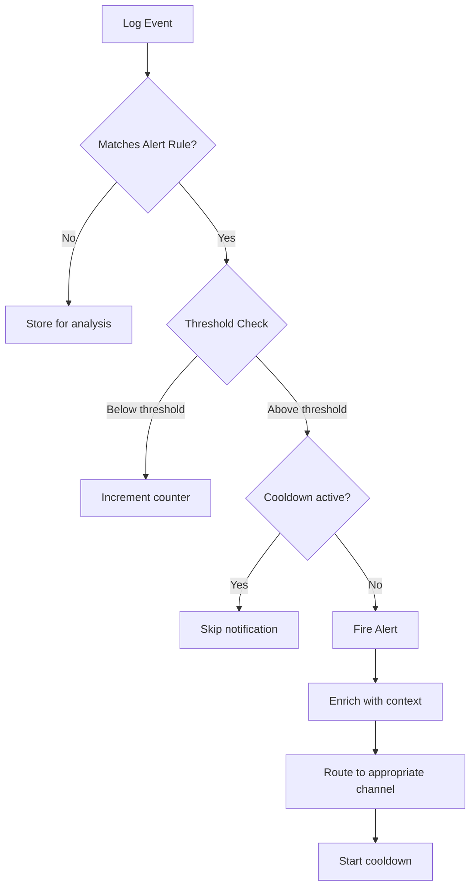

# How to Implement Log-Based Alerting

Author: [nawazdhandala](https://www.github.com/nawazdhandala)

Tags: Log Alerting, Monitoring, Observability, Incident Response, Alert Fatigue, Log Management, DevOps

Description: Learn how to implement effective log-based alerting that catches real problems without causing alert fatigue. This guide covers alert design, threshold configuration, anomaly detection, and best practices for actionable alerts.

---

> Log-based alerting turns your logs into a real-time monitoring system. When configured properly, it catches problems before users notice them. When configured poorly, it drowns your team in noise and gets ignored.

The difference between useful alerting and alert fatigue often comes down to how you design your alert conditions. A good alert tells you something is wrong, what is wrong, and ideally how to fix it.

---

## Principles of Effective Log Alerting

Before diving into implementation, understand what makes alerts useful:

**Actionable**: Every alert should require a specific action. If there is nothing to do, it should not be an alert.

**Relevant**: Alert on symptoms that affect users, not every internal error that gets handled gracefully.

**Timely**: Detect problems quickly enough to respond before major impact, but not so fast that you alert on transient blips.

**Contextual**: Include enough information to start investigation immediately without digging through dashboards.



---

## Implementing Log-Based Alerts

Build a flexible alerting system that processes logs in real-time:

```typescript
// alerting/alert-manager.ts
// Log-based alerting system

interface AlertRule {
  id: string;
  name: string;
  description: string;
  severity: 'critical' | 'high' | 'medium' | 'low';

  // Matching conditions
  conditions: {
    logLevel?: string[];
    messagePattern?: RegExp;
    attributes?: Record<string, string | RegExp>;
    service?: string[];
  };

  // Threshold configuration
  threshold: {
    count: number;          // Number of matches required
    windowSeconds: number;  // Time window for counting
    groupBy?: string[];     // Group by these attributes
  };

  // Notification settings
  notification: {
    channels: string[];     // Where to send alerts
    cooldownMinutes: number; // Minimum time between alerts
    escalateAfter?: number; // Minutes before escalating
  };

  // Status
  enabled: boolean;
}

interface AlertState {
  ruleId: string;
  groupKey: string;
  count: number;
  firstSeen: Date;
  lastSeen: Date;
  lastAlerted?: Date;
  samples: LogEntry[];
}

class AlertManager {
  private rules: Map<string, AlertRule> = new Map();
  private state: Map<string, AlertState> = new Map();
  private notifier: AlertNotifier;

  constructor(notifier: AlertNotifier) {
    this.notifier = notifier;

    // Clean up stale state periodically
    setInterval(() => this.cleanupState(), 60000);
  }

  addRule(rule: AlertRule): void {
    this.rules.set(rule.id, rule);
  }

  processLog(log: LogEntry): void {
    for (const [ruleId, rule] of this.rules) {
      if (!rule.enabled) continue;

      if (this.matchesRule(log, rule)) {
        this.handleMatch(log, rule);
      }
    }
  }

  private matchesRule(log: LogEntry, rule: AlertRule): boolean {
    const { conditions } = rule;

    // Check log level
    if (conditions.logLevel && !conditions.logLevel.includes(log.level)) {
      return false;
    }

    // Check message pattern
    if (conditions.messagePattern && !conditions.messagePattern.test(log.message)) {
      return false;
    }

    // Check service
    if (conditions.service && !conditions.service.includes(log.service)) {
      return false;
    }

    // Check attributes
    if (conditions.attributes) {
      for (const [key, matcher] of Object.entries(conditions.attributes)) {
        const value = log.attributes?.[key];
        if (typeof matcher === 'string') {
          if (value !== matcher) return false;
        } else if (matcher instanceof RegExp) {
          if (!matcher.test(String(value))) return false;
        }
      }
    }

    return true;
  }

  private handleMatch(log: LogEntry, rule: AlertRule): void {
    const groupKey = this.buildGroupKey(log, rule);
    const stateKey = `${rule.id}:${groupKey}`;

    let state = this.state.get(stateKey);
    const now = new Date();

    if (!state) {
      state = {
        ruleId: rule.id,
        groupKey,
        count: 0,
        firstSeen: now,
        lastSeen: now,
        samples: []
      };
      this.state.set(stateKey, state);
    }

    // Check if window has expired
    const windowStart = new Date(now.getTime() - rule.threshold.windowSeconds * 1000);
    if (state.firstSeen < windowStart) {
      // Reset state for new window
      state.count = 0;
      state.firstSeen = now;
      state.samples = [];
    }

    // Update state
    state.count++;
    state.lastSeen = now;

    // Keep sample logs for context (max 5)
    if (state.samples.length < 5) {
      state.samples.push(log);
    }

    // Check threshold
    if (state.count >= rule.threshold.count) {
      this.maybeFireAlert(state, rule);
    }
  }

  private buildGroupKey(log: LogEntry, rule: AlertRule): string {
    if (!rule.threshold.groupBy || rule.threshold.groupBy.length === 0) {
      return 'global';
    }

    const parts = rule.threshold.groupBy.map(key => {
      return `${key}=${log.attributes?.[key] || log[key] || 'unknown'}`;
    });

    return parts.join(',');
  }

  private maybeFireAlert(state: AlertState, rule: AlertRule): void {
    const now = new Date();

    // Check cooldown
    if (state.lastAlerted) {
      const cooldownEnd = new Date(state.lastAlerted.getTime() + rule.notification.cooldownMinutes * 60 * 1000);
      if (now < cooldownEnd) {
        return; // Still in cooldown
      }
    }

    // Fire alert
    state.lastAlerted = now;

    const alert: Alert = {
      ruleId: rule.id,
      ruleName: rule.name,
      severity: rule.severity,
      groupKey: state.groupKey,
      message: `${rule.name}: ${state.count} occurrences in ${rule.threshold.windowSeconds}s`,
      description: rule.description,
      count: state.count,
      firstSeen: state.firstSeen,
      lastSeen: state.lastSeen,
      samples: state.samples,
      metadata: {
        threshold: rule.threshold.count,
        window: rule.threshold.windowSeconds
      }
    };

    this.notifier.send(alert, rule.notification.channels);
  }

  private cleanupState(): void {
    const now = Date.now();

    for (const [key, state] of this.state) {
      const rule = this.rules.get(state.ruleId);
      if (!rule) {
        this.state.delete(key);
        continue;
      }

      // Remove state older than 2x the window
      const maxAge = rule.threshold.windowSeconds * 2 * 1000;
      if (now - state.lastSeen.getTime() > maxAge) {
        this.state.delete(key);
      }
    }
  }
}
```

---

## Configuring Alert Rules

Define rules for common scenarios:

```typescript
// alerting/rules.ts
// Common alert rule configurations

const alertRules: AlertRule[] = [
  // Critical: Application crashes
  {
    id: 'app-crash',
    name: 'Application Crash Detected',
    description: 'Application is crashing repeatedly',
    severity: 'critical',
    conditions: {
      logLevel: ['fatal', 'error'],
      messagePattern: /uncaught exception|segfault|out of memory|panic/i
    },
    threshold: {
      count: 1,           // Alert on first occurrence
      windowSeconds: 60
    },
    notification: {
      channels: ['pagerduty', 'slack-critical'],
      cooldownMinutes: 5
    },
    enabled: true
  },

  // High: Error rate spike
  {
    id: 'error-rate-spike',
    name: 'Error Rate Spike',
    description: 'Error rate has increased significantly',
    severity: 'high',
    conditions: {
      logLevel: ['error']
    },
    threshold: {
      count: 100,
      windowSeconds: 60,
      groupBy: ['service']
    },
    notification: {
      channels: ['slack-alerts', 'email-oncall'],
      cooldownMinutes: 15
    },
    enabled: true
  },

  // Medium: Authentication failures
  {
    id: 'auth-failures',
    name: 'High Authentication Failure Rate',
    description: 'Many authentication failures from same source',
    severity: 'medium',
    conditions: {
      messagePattern: /authentication failed|invalid password|unauthorized/i,
      attributes: {
        event_type: 'auth_failure'
      }
    },
    threshold: {
      count: 10,
      windowSeconds: 300,
      groupBy: ['client_ip']
    },
    notification: {
      channels: ['slack-security', 'email-security'],
      cooldownMinutes: 30
    },
    enabled: true
  },

  // Medium: Slow database queries
  {
    id: 'slow-queries',
    name: 'Slow Database Queries',
    description: 'Database queries are taking too long',
    severity: 'medium',
    conditions: {
      attributes: {
        db_duration_ms: /[5-9]\d{3}|[1-9]\d{4,}/  // > 5000ms
      }
    },
    threshold: {
      count: 5,
      windowSeconds: 300,
      groupBy: ['service', 'db_table']
    },
    notification: {
      channels: ['slack-dba'],
      cooldownMinutes: 60
    },
    enabled: true
  },

  // Low: Deprecation warnings
  {
    id: 'deprecation-warnings',
    name: 'Deprecation Warnings',
    description: 'Code is using deprecated features',
    severity: 'low',
    conditions: {
      logLevel: ['warn'],
      messagePattern: /deprecated|will be removed|obsolete/i
    },
    threshold: {
      count: 50,
      windowSeconds: 3600,
      groupBy: ['service']
    },
    notification: {
      channels: ['email-engineering'],
      cooldownMinutes: 1440  // Once per day
    },
    enabled: true
  }
];
```

---

## Anomaly Detection

Detect unusual patterns without hardcoded thresholds:

```typescript
// alerting/anomaly-detection.ts
// Statistical anomaly detection for log volumes

interface TimeSeriesPoint {
  timestamp: Date;
  value: number;
}

class AnomalyDetector {
  private history: Map<string, TimeSeriesPoint[]> = new Map();
  private windowSize: number;  // Number of historical points to consider

  constructor(windowSize: number = 168) {  // Default: 1 week of hourly data
    this.windowSize = windowSize;
  }

  recordValue(key: string, value: number, timestamp: Date = new Date()): void {
    if (!this.history.has(key)) {
      this.history.set(key, []);
    }

    const points = this.history.get(key)!;
    points.push({ timestamp, value });

    // Keep only recent history
    while (points.length > this.windowSize) {
      points.shift();
    }
  }

  isAnomaly(key: string, currentValue: number): { isAnomaly: boolean; zscore: number; expected: number } {
    const points = this.history.get(key);

    if (!points || points.length < 24) {
      // Not enough data for detection
      return { isAnomaly: false, zscore: 0, expected: currentValue };
    }

    const values = points.map(p => p.value);
    const mean = values.reduce((a, b) => a + b, 0) / values.length;
    const stdDev = Math.sqrt(
      values.reduce((sum, val) => sum + Math.pow(val - mean, 2), 0) / values.length
    );

    // Avoid division by zero
    const zscore = stdDev > 0 ? (currentValue - mean) / stdDev : 0;

    // Consider anomaly if more than 3 standard deviations from mean
    const isAnomaly = Math.abs(zscore) > 3;

    return { isAnomaly, zscore, expected: mean };
  }

  // Detect sudden changes (derivative-based)
  isSuddenChange(key: string, currentValue: number): { isChange: boolean; changeRate: number } {
    const points = this.history.get(key);

    if (!points || points.length < 2) {
      return { isChange: false, changeRate: 0 };
    }

    const previousValue = points[points.length - 1].value;
    const changeRate = previousValue > 0
      ? (currentValue - previousValue) / previousValue
      : 0;

    // Alert if change is more than 50%
    const isChange = Math.abs(changeRate) > 0.5;

    return { isChange, changeRate };
  }
}

// Usage in alerting pipeline
class AnomalyAlertManager {
  private detector: AnomalyDetector;
  private counters: Map<string, number> = new Map();
  private notifier: AlertNotifier;

  constructor(notifier: AlertNotifier) {
    this.detector = new AnomalyDetector();
    this.notifier = notifier;

    // Aggregate and check every minute
    setInterval(() => this.checkAnomalies(), 60000);
  }

  recordEvent(eventType: string): void {
    const count = this.counters.get(eventType) || 0;
    this.counters.set(eventType, count + 1);
  }

  private checkAnomalies(): void {
    for (const [eventType, count] of this.counters) {
      // Record this minute's count
      this.detector.recordValue(eventType, count);

      // Check for anomalies
      const anomaly = this.detector.isAnomaly(eventType, count);
      const change = this.detector.isSuddenChange(eventType, count);

      if (anomaly.isAnomaly) {
        this.notifier.send({
          ruleName: 'Anomaly Detection',
          severity: anomaly.zscore > 4 ? 'high' : 'medium',
          message: `Anomalous ${eventType} rate detected`,
          metadata: {
            current: count,
            expected: anomaly.expected,
            zscore: anomaly.zscore.toFixed(2)
          }
        }, ['slack-alerts']);
      }

      if (change.isChange) {
        this.notifier.send({
          ruleName: 'Sudden Change Detection',
          severity: 'medium',
          message: `Sudden change in ${eventType} rate`,
          metadata: {
            changeRate: `${(change.changeRate * 100).toFixed(1)}%`
          }
        }, ['slack-alerts']);
      }
    }

    // Reset counters
    this.counters.clear();
  }
}
```

---

## Alert Notification

Route alerts to appropriate channels:

```typescript
// alerting/notifier.ts
// Multi-channel alert notification

interface Alert {
  ruleId?: string;
  ruleName: string;
  severity: string;
  message: string;
  description?: string;
  groupKey?: string;
  count?: number;
  firstSeen?: Date;
  lastSeen?: Date;
  samples?: LogEntry[];
  metadata?: Record<string, unknown>;
}

interface NotificationChannel {
  name: string;
  send(alert: Alert): Promise<void>;
}

class SlackChannel implements NotificationChannel {
  name: string;
  private webhookUrl: string;

  constructor(name: string, webhookUrl: string) {
    this.name = name;
    this.webhookUrl = webhookUrl;
  }

  async send(alert: Alert): Promise<void> {
    const color = this.severityColor(alert.severity);

    const payload = {
      attachments: [{
        color,
        title: `${alert.severity.toUpperCase()}: ${alert.ruleName}`,
        text: alert.message,
        fields: [
          { title: 'Severity', value: alert.severity, short: true },
          { title: 'Count', value: String(alert.count || 1), short: true },
          ...(alert.groupKey ? [{ title: 'Group', value: alert.groupKey, short: true }] : []),
          ...(alert.metadata ? Object.entries(alert.metadata).map(([k, v]) => ({
            title: k, value: String(v), short: true
          })) : [])
        ],
        footer: `Alert Rule: ${alert.ruleId || 'N/A'}`,
        ts: Math.floor(Date.now() / 1000)
      }]
    };

    await fetch(this.webhookUrl, {
      method: 'POST',
      headers: { 'Content-Type': 'application/json' },
      body: JSON.stringify(payload)
    });
  }

  private severityColor(severity: string): string {
    const colors: Record<string, string> = {
      critical: '#FF0000',
      high: '#FF6600',
      medium: '#FFCC00',
      low: '#36A64F'
    };
    return colors[severity] || '#808080';
  }
}

class PagerDutyChannel implements NotificationChannel {
  name = 'pagerduty';
  private routingKey: string;

  constructor(routingKey: string) {
    this.routingKey = routingKey;
  }

  async send(alert: Alert): Promise<void> {
    const severity = this.mapSeverity(alert.severity);

    const payload = {
      routing_key: this.routingKey,
      event_action: 'trigger',
      dedup_key: `${alert.ruleId}-${alert.groupKey}`,
      payload: {
        summary: `${alert.ruleName}: ${alert.message}`,
        severity,
        source: alert.groupKey || 'log-alerting',
        custom_details: {
          description: alert.description,
          count: alert.count,
          first_seen: alert.firstSeen?.toISOString(),
          last_seen: alert.lastSeen?.toISOString(),
          ...alert.metadata
        }
      }
    };

    await fetch('https://events.pagerduty.com/v2/enqueue', {
      method: 'POST',
      headers: { 'Content-Type': 'application/json' },
      body: JSON.stringify(payload)
    });
  }

  private mapSeverity(severity: string): string {
    const mapping: Record<string, string> = {
      critical: 'critical',
      high: 'error',
      medium: 'warning',
      low: 'info'
    };
    return mapping[severity] || 'info';
  }
}

class AlertNotifier {
  private channels: Map<string, NotificationChannel> = new Map();

  registerChannel(channel: NotificationChannel): void {
    this.channels.set(channel.name, channel);
  }

  async send(alert: Alert, channelNames: string[]): Promise<void> {
    const promises = channelNames.map(async (name) => {
      const channel = this.channels.get(name);
      if (channel) {
        try {
          await channel.send(alert);
        } catch (error) {
          console.error(`Failed to send alert to ${name}:`, error);
        }
      }
    });

    await Promise.all(promises);
  }
}
```

---

## Reducing Alert Fatigue

Implement strategies to prevent alert overload:

```typescript
// alerting/fatigue-prevention.ts
// Strategies to reduce alert fatigue

class AlertAggregator {
  private pendingAlerts: Map<string, Alert[]> = new Map();
  private aggregationWindow: number;

  constructor(aggregationWindowMs: number = 300000) {  // 5 minutes
    this.aggregationWindow = aggregationWindowMs;

    // Send aggregated alerts periodically
    setInterval(() => this.flushAlerts(), this.aggregationWindow);
  }

  addAlert(alert: Alert): void {
    const key = `${alert.ruleId}-${alert.severity}`;

    if (!this.pendingAlerts.has(key)) {
      this.pendingAlerts.set(key, []);
    }

    this.pendingAlerts.get(key)!.push(alert);
  }

  private flushAlerts(): void {
    for (const [key, alerts] of this.pendingAlerts) {
      if (alerts.length === 0) continue;

      if (alerts.length === 1) {
        // Send individual alert
        this.sendAlert(alerts[0]);
      } else {
        // Send aggregated alert
        const aggregated: Alert = {
          ...alerts[0],
          message: `${alerts[0].ruleName}: ${alerts.length} occurrences`,
          count: alerts.length,
          metadata: {
            ...alerts[0].metadata,
            aggregated_count: alerts.length,
            unique_groups: new Set(alerts.map(a => a.groupKey)).size
          }
        };
        this.sendAlert(aggregated);
      }
    }

    this.pendingAlerts.clear();
  }

  private sendAlert(alert: Alert): void {
    // Implementation depends on your notification system
  }
}

// Time-based suppression
class AlertSuppressor {
  private suppressedUntil: Map<string, Date> = new Map();

  suppress(ruleId: string, durationMinutes: number): void {
    const until = new Date(Date.now() + durationMinutes * 60 * 1000);
    this.suppressedUntil.set(ruleId, until);
  }

  isSuppressed(ruleId: string): boolean {
    const until = this.suppressedUntil.get(ruleId);
    if (!until) return false;

    if (new Date() > until) {
      this.suppressedUntil.delete(ruleId);
      return false;
    }

    return true;
  }
}
```

---

## Summary

Effective log-based alerting requires careful design:

1. **Alert on symptoms, not causes**: Users care about service availability, not internal errors
2. **Set appropriate thresholds**: Start conservative and tune based on experience
3. **Use anomaly detection**: Let statistics find problems you did not anticipate
4. **Aggregate related alerts**: One notification for a pattern, not hundreds
5. **Include context**: Make alerts actionable with relevant details
6. **Review and tune regularly**: Alert rules need maintenance as systems evolve

The goal is signal, not noise. Every alert that does not result in action is a step toward ignoring all alerts.

---

*Want intelligent alerting without building it yourself? [OneUptime](https://oneuptime.com) provides log-based alerting with anomaly detection, smart aggregation, and integrations with your existing notification tools, so you can catch problems without drowning in noise.*
