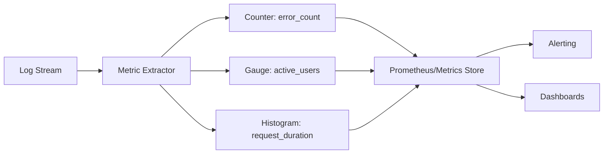

# How to Implement Log-Based Metrics

Author: [nawazdhandala](https://www.github.com/nawazdhandala)

Tags: Log Metrics, Metrics Extraction, Observability, Prometheus, Monitoring, Analytics, Counters

Description: Learn how to extract metrics from logs for monitoring and alerting. This guide covers counter extraction, histogram generation, log-derived SLIs, and integrating log metrics with your monitoring stack.

---

> Logs contain valuable metric data that often goes untapped. Every error message is a counter increment, every request duration is a histogram data point. Log-based metrics let you create monitoring from data you are already collecting.

Instead of instrumenting your code twice, once for logs and once for metrics, you can derive metrics from structured logs. This reduces code complexity and ensures consistency between what you log and what you measure.

---

## Understanding Log-Based Metrics

Log-based metrics transform log events into time series data:



Common metric types from logs:
- **Counters**: Count occurrences (errors, requests, events)
- **Gauges**: Current values (queue size, active connections)
- **Histograms**: Distribution of values (latency, size)

---

## Extracting Counters from Logs

Count specific log events:

```typescript
// metrics/counter-extractor.ts
// Extract counter metrics from logs

interface CounterRule {
  name: string;
  description: string;
  match: (log: LogEntry) => boolean;
  labels: (log: LogEntry) => Record<string, string>;
}

class LogCounterExtractor {
  private rules: CounterRule[] = [];
  private counters: Map<string, Map<string, number>> = new Map();

  addRule(rule: CounterRule): void {
    this.rules.push(rule);
    this.counters.set(rule.name, new Map());
  }

  process(log: LogEntry): void {
    for (const rule of this.rules) {
      if (rule.match(log)) {
        const labels = rule.labels(log);
        const labelKey = this.labelsToKey(labels);

        const counter = this.counters.get(rule.name)!;
        counter.set(labelKey, (counter.get(labelKey) || 0) + 1);
      }
    }
  }

  getMetrics(): PrometheusMetric[] {
    const metrics: PrometheusMetric[] = [];

    for (const [name, counter] of this.counters) {
      const rule = this.rules.find(r => r.name === name)!;

      for (const [labelKey, value] of counter) {
        const labels = this.keyToLabels(labelKey);

        metrics.push({
          name,
          type: 'counter',
          help: rule.description,
          labels,
          value
        });
      }
    }

    return metrics;
  }

  // Export in Prometheus format
  toPrometheusFormat(): string {
    const lines: string[] = [];

    for (const [name, counter] of this.counters) {
      const rule = this.rules.find(r => r.name === name)!;

      lines.push(`# HELP ${name} ${rule.description}`);
      lines.push(`# TYPE ${name} counter`);

      for (const [labelKey, value] of counter) {
        const labels = this.keyToLabels(labelKey);
        const labelStr = Object.entries(labels)
          .map(([k, v]) => `${k}="${v}"`)
          .join(',');

        lines.push(`${name}{${labelStr}} ${value}`);
      }
    }

    return lines.join('\n');
  }

  private labelsToKey(labels: Record<string, string>): string {
    return Object.entries(labels)
      .sort(([a], [b]) => a.localeCompare(b))
      .map(([k, v]) => `${k}=${v}`)
      .join(',');
  }

  private keyToLabels(key: string): Record<string, string> {
    return Object.fromEntries(
      key.split(',').map(pair => pair.split('='))
    );
  }
}

// Define counter rules
const extractor = new LogCounterExtractor();

// Count HTTP requests by status
extractor.addRule({
  name: 'http_requests_total',
  description: 'Total HTTP requests',
  match: (log) => log.http?.status !== undefined,
  labels: (log) => ({
    method: log.http.method || 'unknown',
    status: String(log.http.status),
    service: log.service || 'unknown'
  })
});

// Count errors by type
extractor.addRule({
  name: 'application_errors_total',
  description: 'Total application errors',
  match: (log) => log.level === 'error',
  labels: (log) => ({
    error_type: log.error?.type || 'unknown',
    service: log.service || 'unknown'
  })
});

// Count business events
extractor.addRule({
  name: 'business_events_total',
  description: 'Total business events',
  match: (log) => log.event_type !== undefined,
  labels: (log) => ({
    event_type: log.event_type,
    entity_type: log.entity_type || 'unknown'
  })
});

// Count authentication events
extractor.addRule({
  name: 'auth_events_total',
  description: 'Authentication events',
  match: (log) => log.message?.includes('login') || log.message?.includes('logout'),
  labels: (log) => ({
    event: log.message.includes('login') ? 'login' : 'logout',
    success: String(log.result?.status === 'success')
  })
});
```

---

## Extracting Histograms from Logs

Capture distributions of numeric values:

```typescript
// metrics/histogram-extractor.ts
// Extract histogram metrics from logs

interface HistogramRule {
  name: string;
  description: string;
  match: (log: LogEntry) => boolean;
  value: (log: LogEntry) => number | undefined;
  labels: (log: LogEntry) => Record<string, string>;
  buckets: number[];
}

class LogHistogramExtractor {
  private rules: HistogramRule[] = [];
  private histograms: Map<string, Map<string, HistogramData>> = new Map();

  addRule(rule: HistogramRule): void {
    this.rules.push(rule);
    this.histograms.set(rule.name, new Map());
  }

  process(log: LogEntry): void {
    for (const rule of this.rules) {
      if (rule.match(log)) {
        const value = rule.value(log);
        if (value === undefined) continue;

        const labels = rule.labels(log);
        const labelKey = this.labelsToKey(labels);

        const histogram = this.histograms.get(rule.name)!;
        let data = histogram.get(labelKey);

        if (!data) {
          data = {
            buckets: new Map(rule.buckets.map(b => [b, 0])),
            sum: 0,
            count: 0
          };
          histogram.set(labelKey, data);
        }

        // Update bucket counts
        for (const bucket of rule.buckets) {
          if (value <= bucket) {
            data.buckets.set(bucket, data.buckets.get(bucket)! + 1);
          }
        }

        data.sum += value;
        data.count++;
      }
    }
  }

  toPrometheusFormat(): string {
    const lines: string[] = [];

    for (const [name, histogram] of this.histograms) {
      const rule = this.rules.find(r => r.name === name)!;

      lines.push(`# HELP ${name} ${rule.description}`);
      lines.push(`# TYPE ${name} histogram`);

      for (const [labelKey, data] of histogram) {
        const labels = this.keyToLabels(labelKey);
        const labelStr = Object.entries(labels)
          .map(([k, v]) => `${k}="${v}"`)
          .join(',');

        // Bucket values
        for (const [bucket, count] of data.buckets) {
          lines.push(`${name}_bucket{${labelStr},le="${bucket}"} ${count}`);
        }
        lines.push(`${name}_bucket{${labelStr},le="+Inf"} ${data.count}`);

        // Sum and count
        lines.push(`${name}_sum{${labelStr}} ${data.sum}`);
        lines.push(`${name}_count{${labelStr}} ${data.count}`);
      }
    }

    return lines.join('\n');
  }

  private labelsToKey(labels: Record<string, string>): string {
    return Object.entries(labels)
      .sort(([a], [b]) => a.localeCompare(b))
      .map(([k, v]) => `${k}=${v}`)
      .join(',');
  }

  private keyToLabels(key: string): Record<string, string> {
    return Object.fromEntries(
      key.split(',').map(pair => pair.split('='))
    );
  }
}

// Define histogram rules
const histogramExtractor = new LogHistogramExtractor();

// HTTP request duration
histogramExtractor.addRule({
  name: 'http_request_duration_seconds',
  description: 'HTTP request duration in seconds',
  match: (log) => log.http?.duration_ms !== undefined,
  value: (log) => log.http.duration_ms / 1000,
  labels: (log) => ({
    method: log.http.method || 'unknown',
    path: log.http.path || 'unknown',
    service: log.service || 'unknown'
  }),
  buckets: [0.005, 0.01, 0.025, 0.05, 0.1, 0.25, 0.5, 1, 2.5, 5, 10]
});

// Database query duration
histogramExtractor.addRule({
  name: 'db_query_duration_seconds',
  description: 'Database query duration in seconds',
  match: (log) => log.db?.duration_ms !== undefined,
  value: (log) => log.db.duration_ms / 1000,
  labels: (log) => ({
    operation: log.db.operation || 'unknown',
    table: log.db.table || 'unknown'
  }),
  buckets: [0.001, 0.005, 0.01, 0.025, 0.05, 0.1, 0.25, 0.5, 1]
});

// Response size
histogramExtractor.addRule({
  name: 'http_response_size_bytes',
  description: 'HTTP response size in bytes',
  match: (log) => log.http?.response_size !== undefined,
  value: (log) => log.http.response_size,
  labels: (log) => ({
    method: log.http.method || 'unknown',
    service: log.service || 'unknown'
  }),
  buckets: [100, 1000, 10000, 100000, 1000000, 10000000]
});
```

---

## Building SLIs from Logs

Calculate service level indicators:

```typescript
// metrics/sli-calculator.ts
// Calculate SLIs from log data

interface SLIConfig {
  name: string;
  type: 'availability' | 'latency' | 'error_rate' | 'throughput';
  goodEventFilter: (log: LogEntry) => boolean;
  totalEventFilter: (log: LogEntry) => boolean;
  latencyThreshold?: number;
  windowMinutes: number;
}

class LogBasedSLICalculator {
  private configs: SLIConfig[] = [];
  private windows: Map<string, { good: number; total: number; timestamps: number[] }> = new Map();

  addSLI(config: SLIConfig): void {
    this.configs.push(config);
    this.windows.set(config.name, { good: 0, total: 0, timestamps: [] });
  }

  process(log: LogEntry): void {
    const timestamp = new Date(log.timestamp).getTime();

    for (const config of this.configs) {
      if (config.totalEventFilter(log)) {
        const window = this.windows.get(config.name)!;

        window.total++;
        window.timestamps.push(timestamp);

        if (config.goodEventFilter(log)) {
          window.good++;
        }

        // Clean old entries
        this.cleanWindow(config);
      }
    }
  }

  private cleanWindow(config: SLIConfig): void {
    const window = this.windows.get(config.name)!;
    const cutoff = Date.now() - config.windowMinutes * 60 * 1000;

    // Remove old timestamps
    while (window.timestamps.length > 0 && window.timestamps[0] < cutoff) {
      window.timestamps.shift();
      window.total--;
      // Note: This is simplified - in practice you would track good/bad separately
    }
  }

  getSLIValues(): SLIValue[] {
    return this.configs.map(config => {
      const window = this.windows.get(config.name)!;
      const value = window.total > 0 ? (window.good / window.total) * 100 : 100;

      return {
        name: config.name,
        type: config.type,
        value,
        good: window.good,
        total: window.total,
        window: config.windowMinutes
      };
    });
  }

  toPrometheusFormat(): string {
    const lines: string[] = [];

    for (const sli of this.getSLIValues()) {
      lines.push(`# HELP sli_${sli.name} Service level indicator: ${sli.name}`);
      lines.push(`# TYPE sli_${sli.name} gauge`);
      lines.push(`sli_${sli.name}{type="${sli.type}"} ${sli.value}`);

      lines.push(`sli_${sli.name}_good_total{type="${sli.type}"} ${sli.good}`);
      lines.push(`sli_${sli.name}_total{type="${sli.type}"} ${sli.total}`);
    }

    return lines.join('\n');
  }
}

// Define SLIs
const sliCalculator = new LogBasedSLICalculator();

// Availability SLI: Percentage of successful requests
sliCalculator.addSLI({
  name: 'api_availability',
  type: 'availability',
  goodEventFilter: (log) => log.http?.status < 500,
  totalEventFilter: (log) => log.http?.status !== undefined,
  windowMinutes: 60
});

// Latency SLI: Percentage of requests under threshold
sliCalculator.addSLI({
  name: 'api_latency_p95',
  type: 'latency',
  goodEventFilter: (log) => log.http?.duration_ms < 500,
  totalEventFilter: (log) => log.http?.duration_ms !== undefined,
  latencyThreshold: 500,
  windowMinutes: 60
});

// Error rate SLI: Percentage of non-error responses
sliCalculator.addSLI({
  name: 'error_rate',
  type: 'error_rate',
  goodEventFilter: (log) => log.level !== 'error' && log.level !== 'fatal',
  totalEventFilter: (log) => true,
  windowMinutes: 60
});
```

---

## Integration with Prometheus

Expose log-based metrics to Prometheus:

```typescript
// metrics/prometheus-exporter.ts
// Prometheus exporter for log-based metrics

import express from 'express';

class LogMetricsExporter {
  private counterExtractor: LogCounterExtractor;
  private histogramExtractor: LogHistogramExtractor;
  private sliCalculator: LogBasedSLICalculator;
  private app: express.Application;

  constructor(
    counterExtractor: LogCounterExtractor,
    histogramExtractor: LogHistogramExtractor,
    sliCalculator: LogBasedSLICalculator
  ) {
    this.counterExtractor = counterExtractor;
    this.histogramExtractor = histogramExtractor;
    this.sliCalculator = sliCalculator;

    this.app = express();
    this.setupEndpoints();
  }

  private setupEndpoints(): void {
    // Prometheus metrics endpoint
    this.app.get('/metrics', (req, res) => {
      const metrics = [
        this.counterExtractor.toPrometheusFormat(),
        this.histogramExtractor.toPrometheusFormat(),
        this.sliCalculator.toPrometheusFormat()
      ].join('\n\n');

      res.set('Content-Type', 'text/plain');
      res.send(metrics);
    });

    // Health check
    this.app.get('/health', (req, res) => {
      res.json({ status: 'ok' });
    });
  }

  processLog(log: LogEntry): void {
    this.counterExtractor.process(log);
    this.histogramExtractor.process(log);
    this.sliCalculator.process(log);
  }

  start(port: number): void {
    this.app.listen(port, () => {
      console.log(`Log metrics exporter listening on port ${port}`);
    });
  }
}

// Prometheus scrape configuration
const prometheusConfig = `
scrape_configs:
  - job_name: 'log-metrics'
    static_configs:
      - targets: ['log-metrics-exporter:9090']
    scrape_interval: 15s
    metrics_path: /metrics
`;

// Example usage
const exporter = new LogMetricsExporter(
  counterExtractor,
  histogramExtractor,
  sliCalculator
);

// Process logs from your log pipeline
logStream.on('log', (log: LogEntry) => {
  exporter.processLog(log);
});

exporter.start(9090);
```

---

## Alerting on Log-Based Metrics

Create alerts using extracted metrics:

```yaml
# prometheus-alerts.yaml
# Alerts based on log-derived metrics

groups:
  - name: log-based-alerts
    rules:
      # High error rate
      - alert: HighErrorRate
        expr: |
          (
            sum(rate(application_errors_total[5m])) by (service)
            /
            sum(rate(http_requests_total[5m])) by (service)
          ) > 0.05
        for: 5m
        labels:
          severity: critical
        annotations:
          summary: "High error rate in {{ $labels.service }}"
          description: "Error rate is {{ $value | humanizePercentage }} in the last 5 minutes"

      # Slow response times
      - alert: HighLatency
        expr: |
          histogram_quantile(0.95,
            sum(rate(http_request_duration_seconds_bucket[5m])) by (le, service)
          ) > 1
        for: 5m
        labels:
          severity: warning
        annotations:
          summary: "High latency in {{ $labels.service }}"
          description: "95th percentile latency is {{ $value }}s"

      # SLI breach
      - alert: SLIBreach
        expr: sli_api_availability < 99.9
        for: 5m
        labels:
          severity: critical
        annotations:
          summary: "Availability SLI breach"
          description: "Availability is {{ $value }}%, below 99.9% target"

      # Unusual error pattern
      - alert: NewErrorType
        expr: |
          sum(increase(application_errors_total[1h])) by (error_type)
          unless
          sum(application_errors_total offset 1d) by (error_type)
        for: 15m
        labels:
          severity: warning
        annotations:
          summary: "New error type detected: {{ $labels.error_type }}"
```

---

## Summary

Log-based metrics provide valuable monitoring without additional instrumentation:

1. **Extract counters**: Count events by type, status, service
2. **Build histograms**: Capture latency and size distributions
3. **Calculate SLIs**: Derive service level indicators from logs
4. **Integrate with Prometheus**: Expose metrics for scraping
5. **Set up alerts**: Create actionable alerts from log metrics

The key advantage is consistency: your metrics come from the same source as your debugging data. When an alert fires, the corresponding logs are already there for investigation.

---

*Want log-based metrics without building the infrastructure? [OneUptime](https://oneuptime.com) automatically extracts metrics from your logs, providing dashboards and alerts alongside your log data with no additional configuration.*
