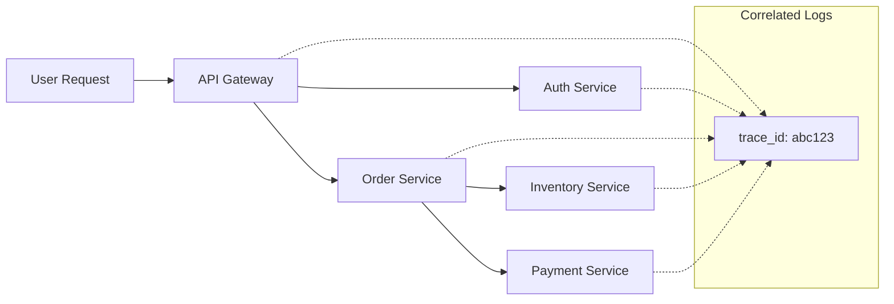

# How to Implement Log Correlation in OpenTelemetry

Author: [nawazdhandala](https://www.github.com/nawazdhandala)

Tags: OpenTelemetry, Logging, Trace Correlation, Observability, Distributed Systems, Debugging

Description: Learn how to implement log correlation in OpenTelemetry to connect logs with traces and spans. This guide covers trace context injection, structured logging patterns, and practical examples for Node.js and Python.

---

Log correlation is one of the most powerful features in OpenTelemetry. When something goes wrong in a distributed system, you need to quickly trace a request across multiple services and connect it to the relevant log entries. Without proper correlation, you end up grep-ing through millions of log lines hoping to find the needle in the haystack.

This guide walks through implementing log correlation so that every log entry carries the trace context, making debugging significantly faster.

## Why Log Correlation Matters

In a microservices architecture, a single user request might touch five or ten different services. When an error occurs, you need to answer questions like:

- Which services did this request pass through?
- What was the state of the application at each step?
- What happened right before the error?

Without correlation, logs from different services are disconnected islands of information. With correlation, you can pull the thread and see the complete picture.



## The Basics: Trace Context

Every trace in OpenTelemetry has two key identifiers:

- **trace_id**: A unique identifier for the entire distributed trace
- **span_id**: A unique identifier for a specific operation within the trace

When you inject these into your logs, you create the link between your logging system and your tracing system.

## Node.js Implementation

Let us start with a practical Node.js example using Pino logger.

### Setting Up the Logger

```javascript
// logger.js
const pino = require('pino');
const { context, trace } = require('@opentelemetry/api');

// Create base logger with structured output
const baseLogger = pino({
  level: process.env.LOG_LEVEL || 'info',
  formatters: {
    level(label) {
      return { level: label };
    }
  },
  timestamp: () => `,"timestamp":"${new Date().toISOString()}"`
});

// Wrapper function that injects trace context into every log
function createContextualLogger() {
  return {
    info: (message, extra = {}) => logWithTrace('info', message, extra),
    warn: (message, extra = {}) => logWithTrace('warn', message, extra),
    error: (message, extra = {}) => logWithTrace('error', message, extra),
    debug: (message, extra = {}) => logWithTrace('debug', message, extra)
  };
}

function logWithTrace(level, message, extra) {
  // Get the current active span from OpenTelemetry context
  const activeSpan = trace.getSpan(context.active());
  const spanContext = activeSpan?.spanContext();

  // Build the log object with trace correlation
  const logData = {
    ...extra,
    trace_id: spanContext?.traceId || 'no-trace',
    span_id: spanContext?.spanId || 'no-span',
    service_name: process.env.OTEL_SERVICE_NAME || 'unknown'
  };

  baseLogger[level](logData, message);
}

module.exports = { logger: createContextualLogger() };
```

### Using the Logger in Your Application

```javascript
// app.js
const express = require('express');
const { logger } = require('./logger');

const app = express();

app.get('/api/orders/:orderId', async (req, res) => {
  const { orderId } = req.params;

  // This log will automatically include trace_id and span_id
  logger.info('Fetching order details', { orderId });

  try {
    const order = await fetchOrder(orderId);
    logger.info('Order retrieved successfully', {
      orderId,
      itemCount: order.items.length
    });
    res.json(order);
  } catch (err) {
    // Error logs also get trace context for correlation
    logger.error('Failed to fetch order', {
      orderId,
      error: err.message
    });
    res.status(500).json({ error: 'Internal server error' });
  }
});
```

### Sample Log Output

With this setup, your logs will look like this:

```json
{
  "level": "info",
  "timestamp": "2026-01-25T10:30:45.123Z",
  "trace_id": "4bf92f3577b34da6a3ce929d0e0e4736",
  "span_id": "00f067aa0ba902b7",
  "service_name": "order-service",
  "orderId": "ord-12345",
  "msg": "Fetching order details"
}
```

## Python Implementation

Here is how to achieve the same thing in Python using the standard logging module.

### Setting Up the Logger

```python
# logger.py
import logging
import json
from datetime import datetime
from opentelemetry import trace

class TraceContextFilter(logging.Filter):
    """
    Logging filter that adds trace context to every log record.
    This allows logs to be correlated with traces in your observability backend.
    """

    def filter(self, record):
        # Get the current span from the active context
        span = trace.get_current_span()
        span_context = span.get_span_context() if span else None

        # Add trace context fields to the log record
        if span_context and span_context.is_valid:
            record.trace_id = format(span_context.trace_id, '032x')
            record.span_id = format(span_context.span_id, '016x')
        else:
            record.trace_id = 'no-trace'
            record.span_id = 'no-span'

        return True

class JSONFormatter(logging.Formatter):
    """
    Formats log records as JSON for structured logging.
    This makes it easier to parse and search logs in your logging backend.
    """

    def format(self, record):
        log_data = {
            'timestamp': datetime.utcnow().isoformat() + 'Z',
            'level': record.levelname.lower(),
            'message': record.getMessage(),
            'trace_id': getattr(record, 'trace_id', 'no-trace'),
            'span_id': getattr(record, 'span_id', 'no-span'),
            'service_name': 'order-service',
            'logger': record.name
        }

        # Include exception info if present
        if record.exc_info:
            log_data['exception'] = self.formatException(record.exc_info)

        return json.dumps(log_data)

def get_logger(name):
    """
    Creates a logger configured with trace context injection.
    """
    logger = logging.getLogger(name)
    logger.setLevel(logging.INFO)

    # Add the trace context filter
    logger.addFilter(TraceContextFilter())

    # Set up JSON handler for stdout
    handler = logging.StreamHandler()
    handler.setFormatter(JSONFormatter())
    logger.addHandler(handler)

    return logger
```

### Using the Logger with Flask

```python
# app.py
from flask import Flask, request
from logger import get_logger
from opentelemetry.instrumentation.flask import FlaskInstrumentor

app = Flask(__name__)
FlaskInstrumentor().instrument_app(app)

logger = get_logger(__name__)

@app.route('/api/users/<user_id>')
def get_user(user_id):
    # Log with automatic trace context
    logger.info(f'Fetching user profile for user_id={user_id}')

    try:
        user = fetch_user_from_db(user_id)
        logger.info(f'User profile retrieved, email={user.email}')
        return {'user': user.to_dict()}
    except UserNotFoundError:
        logger.warning(f'User not found, user_id={user_id}')
        return {'error': 'User not found'}, 404
    except Exception as e:
        logger.error(f'Failed to fetch user: {str(e)}', exc_info=True)
        return {'error': 'Internal server error'}, 500
```

## OpenTelemetry Collector Log Processing

Once your applications emit correlated logs, you can use the OpenTelemetry Collector to process and export them.

```yaml
# otel-collector-config.yaml
receivers:
  otlp:
    protocols:
      grpc:
        endpoint: 0.0.0.0:4317
      http:
        endpoint: 0.0.0.0:4318

processors:
  # Batch logs for efficient export
  batch:
    send_batch_size: 1000
    timeout: 10s

  # Add resource attributes to all logs
  resource:
    attributes:
      - key: deployment.environment
        value: production
        action: upsert

exporters:
  otlphttp:
    endpoint: "https://oneuptime.com/otlp"
    headers:
      "x-oneuptime-token": "${ONEUPTIME_TOKEN}"

service:
  pipelines:
    logs:
      receivers: [otlp]
      processors: [batch, resource]
      exporters: [otlphttp]
```

## Querying Correlated Logs

Once your logs include trace IDs, you can query them effectively:

```sql
-- Find all logs for a specific trace
SELECT timestamp, service_name, level, message
FROM logs
WHERE trace_id = '4bf92f3577b34da6a3ce929d0e0e4736'
ORDER BY timestamp ASC;

-- Find errors and their related traces
SELECT DISTINCT trace_id, service_name, message
FROM logs
WHERE level = 'error'
  AND timestamp > NOW() - INTERVAL '1 hour';
```

## Best Practices

1. **Always include trace context**: Make it automatic, not optional. Use middleware or logging filters.

2. **Use structured logging**: JSON logs are much easier to parse and query than plain text.

3. **Include service name**: This helps identify which service generated the log.

4. **Log at appropriate levels**: Do not log everything at INFO. Use DEBUG for detailed debugging, INFO for normal operations, WARN for concerning situations, and ERROR for failures.

5. **Add business context**: Include relevant identifiers like order IDs, user IDs, and request IDs alongside trace context.

## Common Pitfalls

**Async context loss**: In Node.js, be careful with callbacks that might lose the async context. Use async hooks or ensure your instrumentation handles this.

**Missing trace in background jobs**: When processing background jobs, make sure to extract and restore the trace context from the job payload.

**Log flooding**: Correlated logs are powerful, but do not log excessively. Sampling strategies should apply to both traces and their correlated logs.

## Summary

Log correlation transforms your logs from isolated messages into a connected debugging tool. By injecting trace_id and span_id into every log entry, you create a direct link between your logging and tracing systems. This makes it possible to start from an error alert, find the trace, and see every log message that was emitted during that request - across all your services.

The implementation is straightforward: wrap your logger with a function that pulls trace context from OpenTelemetry and injects it into every log record. Once set up, it works automatically and your debugging sessions become significantly more productive.
